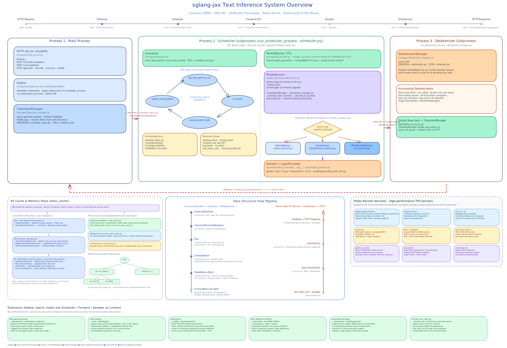
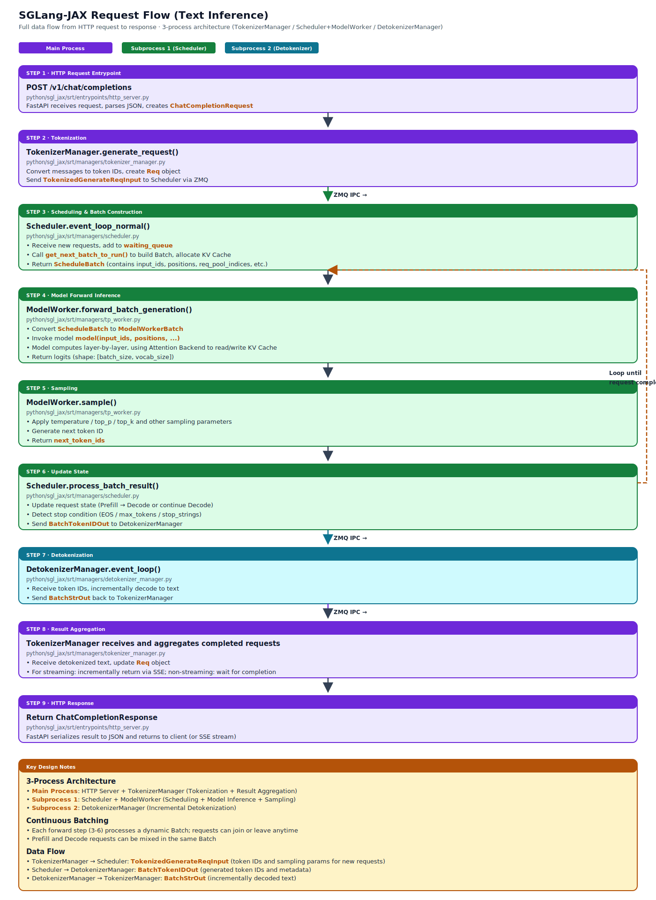

# System Overview



## 1.1 System Positioning and Design Goals

sglang-jax (SGL-JAX) is the JAX port of the SGLang Inference framework — a high-performance inference engine built on JAX/Pallas. The system covers two relatively independent inference pipelines:

- **Text Inference** — Uses a three-process architecture (TokenizerManager / Scheduler+TPWorker / DetokenizerManager), coordinated via ZMQ IPC, executing the autoregressive Prefill-Decode loop. Handles pure-text scenarios such as LLM chat, continuation, and tool use.
- **Multimodal** (image / video / audio) — Uses an independent `GlobalScheduler` plus a multi-stage Stage Pipeline, where each stage owns its own Scheduler, Model Executor, and Device Mesh. Handles text-to-image / video (Wan 2.x), vision-language understanding (Qwen2.5-VL), omni-modal (Qwen3-Omni-MoE), audio (MiMo Audio), and similar scenarios.

Each Multimodal stage internally reuses the core concepts of the text engine (Scheduler, Batch construction, KV Cache, Model Executor). **This document presents the architecture overview along the text inference pipeline**, and the detailed designs of each subsystem are covered in Doc 02–11. We recommend first using these docs to understand the text inference architecture, then reading [12-multimodal](12-multimodal.md) to learn how Multimodal extends on top of it (the detailed Stage Pipeline design and cross-stage data flow are in that document).

### Core Design and Features

| Feature | Description | Detailed Doc |
|------|------|----------|
| Continuous Batching | Requests dynamically join and leave the batch, maximizing hardware utilization | [03-scheduler](03-scheduler.md) |
| Pallas Custom Kernels | High-performance TPU/GPU kernels written in Pallas, breaking through the performance ceiling of standard JAX kernels | [08-pallas-kernels](08-pallas-kernels.md) |
| JIT Pre-compilation and Shape Bucketing | Inputs are padded to predefined bucket sizes to avoid repeated compilation; common buckets are pre-compiled at startup | [04-model-executor](04-model-executor.md) |
| Single-Scheduler SPMD Architecture | One Scheduler per VM; cross-device communication is automatically managed via JAX Device Mesh and `shard_map` | [04-model-executor](04-model-executor.md) |
| Data Parallel | Within the same Scheduler, requests are dispatched to multiple DP ranks; Batch, KV Cache, and Attention Metadata are partitioned by DP rank | [03-scheduler](03-scheduler.md) / [04-model-executor](04-model-executor.md) / [07-kv-cache](07-kv-cache.md) |
| Chunked Prefill | Long Prefills are split into multiple chunks interleaved with Decode steps, balancing throughput and latency | [03-scheduler](03-scheduler.md) |
| RadixCache Prefix Sharing | Radix-Tree-based KV Cache reuse — requests with the same prefix share already-computed KV Cache | [07-kv-cache](07-kv-cache.md) |
| Speculative Decoding | EAGLE3 / MTP draft models accelerate autoregressive generation | [09-speculative-decoding](09-speculative-decoding.md) |
| LoRA | Dynamic loading of multiple LoRA adapters with per-request switching and isolated cache | [10-lora](10-lora.md) |
| Quantization | INT8 / FP8 / INT4 quantization, supporting both static and dynamic quantization | [11-quantization](11-quantization.md) |
| MoE (Fused MoE / EPMoE, including the EPLB sub-feature) | Mixture-of-Experts sparse activation, providing `EPMoE` / `FusedEPMoE` implementations | [06-layers-and-attention](06-layers-and-attention.md) |
| Constrained Decoding | Forces output to conform to JSON Schema / Regex / EBNF constraints via vocabulary bitmask | [03-scheduler](03-scheduler.md) |
| Function Call | LLM tool calling with incremental streaming parsing | [03-scheduler](03-scheduler.md) |
| Multimodal | Image / video / audio generation and understanding, with an independent Stage Pipeline architecture | [12-multimodal](12-multimodal.md) |

### Supported Hardware

| Hardware | Status | Notes |
|------|------|------|
| **Google TPU** | Primary target platform | Supports v5/v6/v7 and other TPU generations; Pallas kernels are fully validated on TPU |
| **CPU** | Supported | Pure JAX kernels run directly on CPU; mainly used for debugging and small-scale testing |
| **GPU (CUDA)** | TODO | The end-to-end GPU pipeline has not been validated yet; some Pallas kernels are not yet available |

### Supported Models

For detailed model structures and how to extend them, see [05-models](05-models.md).

#### Text Models

| Model File | HuggingFace Architecture | Supported Models |
|----------|------------------|------------|
| `models/llama.py` | `LlamaForCausalLM` / `Phi3ForCausalLM` / `InternLM3ForCausalLM` | Llama family, Phi-3, InternLM3 |
| `models/qwen.py` | `QWenLMHeadModel` | Qwen 1 |
| `models/qwen2.py` | `Qwen2ForCausalLM` | Qwen 2 / 2.5 Dense |
| `models/qwen3.py` | `Qwen3ForCausalLM` | Qwen 3 Dense |
| `models/qwen2_moe.py` | `Qwen2MoeForCausalLM` | Qwen 2 MoE |
| `models/qwen3_moe.py` | `Qwen3MoeForCausalLM` | Qwen 3 MoE |
| `models/deepseek_v3.py` | `DeepseekV3ForCausalLM` / `DeepseekV2ForCausalLM` | DeepSeek V2 / V3 / R1 |
| `models/gemma2.py` | `Gemma2ForCausalLM` | Gemma 2 |
| `models/grok.py` | `Grok1ForCausalLM` | grok1 / grok2 |
| `models/bailing_moe.py` | `BailingMoEForCausalLM` / `BailingMoeForCausalLM` / `BailingMoeV2ForCausalLM` | Bailing MoE / V2 |
| `models/bailing_moe_linear.py` | `BailingMoeV2_5ForCausalLM` | Bailing MoE v2.5 / Ling-2.6-flash (GQA + Lightning Linear Attention) |
| `models/mimo.py` | `MiMoForCausalLM` | MiMo |
| `models/mimo_v2_flash.py` | `MiMoV2FlashForCausalLM` | mimo_v2_flash |
| `models/mimo_v2_pro.py` | `MiMoV2ForCausalLM` | mimo_v2.5_pro (Fused QKV, FP8 per-shard) |
| `models/mimo_v2_nextn.py` | `MiMoV2MTPForCausalLM` | MiMo V2.5-Pro NextN / MTP Draft |
| `models/mimo_mtp.py` | `MiMoMTPForCausalLM` | MiMo V1 MTP Draft |
| `models/kimi_linear.py` | `KimiLinearForCausalLM` | Kimi Linear (KDA + MLA hybrid) |
| `models/glm4_moe.py` | `Glm4MoeForCausalLM` | GLM-4 MoE |
| `models/glm5_moe.py` | `Glm5ForCausalLM` / `GlmMoeDsaForCausalLM` | GLM-5 / 5.1 MoE |
| `models/umt5.py` | `UMT5EncoderModel` | UMT5 Encoder |
| `models/llama_eagle3.py` | `LlamaForCausalLMEagle3` | EAGLE3 draft model |

#### Multimodal Models

An independent subsystem; see [12-multimodal](12-multimodal.md) for details.

| Model | Modality | Notes |
|------|------|------|
| Wan 2.1 / 2.2 | Text-to-image / video | Diffusion + VAE Pipeline |
| Qwen2.5-VL | Vision-language understanding | ViT + LLM |
| Qwen3-Omni-MoE | Omni-modal | Vision + audio + language |
| MiMo Audio | Audio | TTS / ASR |

---

## 1.2 System Architecture

### Three-Process Architecture

The system runs across three processes; each component's responsibilities are as follows:

| Component | Process | Responsibility |
|------|----------|------|
| **HTTP Server** | Main process | FastAPI application providing OpenAI-compatible API and Native API |
| **Engine** | Main process | Assembles components, exposes Python API, manages process/thread lifecycle |
| **TokenizerManager** | Main process | Tokenization, request state management, result aggregation |
| **Scheduler** | Subprocess 1 | Scheduling, batch construction, KV Cache allocation, forward inference dispatch |
| **TP Worker** | Subprocess 1 | Model forward inference, sampling |
| **DetokenizerManager** | Subprocess 2 | Incremental detokenization |

Splitting tokenization, scheduling/forward, and detokenization across three processes — and stringing them together with ZMQ IPC sockets into a unidirectional pipeline — keeps the Python GIL from becoming the bottleneck: HuggingFace tokenizer's pure-Python path, JAX forward's dispatch loop, and incremental detokenization's byte-sequence concatenation each run in their own interpreter without blocking one another. ZMQ is a user-space messaging library that offers socket-style APIs while hiding details like reconnection, buffering, and serialization. This system uses IPC (Unix domain socket) to transport `pickle`-serialized Python objects — lighter than `multiprocessing.Queue`'s fork-pickle path and one fewer kernel-stack round-trip than TCP.

Two ZMQ socket patterns are used between processes — `PUSH`/`PULL` and `PUB`/`SUB`. `PUSH`/`PULL` is a load-balanced one-way queue: the sender `PUSH`es without waiting for a response, and receivers `PULL` round-robin. The system follows the four-segment pipeline "TokenizerManager → Scheduler → DetokenizerManager → TokenizerManager", where each segment only cares about its downstream and avoids RPC round-trips. `PUB`/`SUB` is broadcast: a single publisher copies messages to all subscribers — used only in multi-node deployments, where Node 0's Scheduler fans requests out to mirror Schedulers on other nodes — see Section 3.13 on the SPMD deployment topology.

### Parallelism Strategy Overview

In the text inference pipeline, parallelism strategies are distributed across different layers:

| Strategy | Layer | Key State | Related Docs |
|------|----------|----------|----------|
| Tensor Parallel | Model weights, Linear, Attention head dimension | `tp_size`, `"tensor"` mesh axis | [04-model-executor](04-model-executor.md), [06-layers-and-attention](06-layers-and-attention.md) |
| Sequence Parallel | Row-parallel Linear outputs reduce-scattered along the token dimension | `enable_sequence_parallel` flag, `output_scatter_dimension`, `prepare_scattered_spec_if_needed` | [04-model-executor](04-model-executor.md), [06-layers-and-attention](06-layers-and-attention.md) |
| Data Parallel | Request batch, KV Cache partitioning, Attention Metadata | `dp_size`, `Req.dp_rank`, `ScheduleReqsInfo`, `"data"` mesh axis | [03-scheduler](03-scheduler.md), [07-kv-cache](07-kv-cache.md) |
| Expert Parallel | MoE expert weights and routing | `ep_size`, `EPMoE` / `FusedEPMoE`, reusing `(data, tensor)` mesh as the EP group | [06-layers-and-attention](06-layers-and-attention.md) |

Data Parallel does not change the three-process topology, nor does it introduce additional Scheduler processes. Inside the Scheduler subprocess, requests are dispatched to a DP rank; `ScheduleBatch` holds requests and batch arrays in per-DP containers. The execution side uses the `(data, tensor)` Device Mesh, and the KV Cache allocator and Prefix Cache isolate capacity and namespace by `dp_rank`.

Sequence Parallel reuses the existing `(data, tensor)` mesh and has no dedicated axis name. When `enable_sequence_parallel=True`, the outputs of row-parallel Linears (such as `o_proj`, `down_proj`) can be reduce-scattered along the `"tensor"` axis on the specified `output_scatter_dimension`, eliminating the full all-gather. Whether this kicks in is decided by `should_scatter()`, which checks the per-device shard size (`global_config.tpu_scatter_min_local_size`) and divisibility. Among the current models, grok-2 has been wired up.

---

## 1.3 Request Processing Flow



Taking a `/v1/chat/completions` request as an example:

| Stage | Component | Key Actions | Detailed Doc |
|------|------|----------|----------|
| ① Protocol conversion | HTTP Server | `ChatCompletionRequest` → `GenerateReqInput` | [02-entrypoints](02-entrypoints-and-tokenization.md) |
| ② Tokenization | TokenizerManager | Text → token ID sequence; create `ReqState` | [02-entrypoints](02-entrypoints-and-tokenization.md) |
| ③ Enqueue | Scheduler | Create `Req` object, push to `waiting_queue` | [03-scheduler](03-scheduler.md) |
| ④ Batch construction | Scheduler | Scheduling policy selects requests, builds `ScheduleBatch` | [03-scheduler](03-scheduler.md) |
| ⑤ Data conversion | Scheduler → TP Worker | Three-level batch conversion: `ScheduleBatch` → `ModelWorkerBatch` → `ForwardBatch` | [04-model-executor](04-model-executor.md) |
| ⑥ Model forward | TP Worker | JIT-compiled forward inference + Pallas kernels | [04-model-executor](04-model-executor.md) |
| ⑦ Sampling | TP Worker | greedy / top-k / top-p / temperature / min-p | [06-layers-and-attention](06-layers-and-attention.md) |
| ⑧ Output processing | Scheduler | Completion check, build `BatchTokenIDOut` | [03-scheduler](03-scheduler.md) |
| ⑨ Detokenization | DetokenizerManager | Incremental detokenization | [02-entrypoints](02-entrypoints-and-tokenization.md) |
| ⑩ Result aggregation | TokenizerManager | Update `ReqState`, return HTTP response | [02-entrypoints](02-entrypoints-and-tokenization.md) |

Steps ④–⑧ form the autoregressive loop: Prefill (or Chunked Prefill) is executed first, then each subsequent step decodes one token, until a stop condition is met. See [03-scheduler](03-scheduler.md) for details.

### Data Structure Transitions

As a request flows through components, its data structure evolves accordingly:

```text
GenerateReqInput → TokenizedGenerateReqInput → Req → ScheduleBatch → ModelWorkerBatch → ForwardBatch
                                                                                                                ↓
ReqState ← BatchStrOut ← BatchTokenIDOut ← next_token_ids ←── [Forward + Sampling]
```

Field definitions for each data structure are in [03-scheduler](03-scheduler.md) and [04-model-executor](04-model-executor.md).

---

## 1.4 Module Navigation

### Source Path Index

| Source Path | Responsibility | Detailed Doc |
|----------|------|----------|
| `entrypoints/` | HTTP Server, Engine, OpenAI-compatible protocol | [02-entrypoints-and-tokenization](02-entrypoints-and-tokenization.md) |
| `managers/tokenizer_manager.py` | Tokenization, request state management, result aggregation | [02-entrypoints-and-tokenization](02-entrypoints-and-tokenization.md) |
| `managers/detokenizer_manager.py` | Incremental detokenization | [02-entrypoints-and-tokenization](02-entrypoints-and-tokenization.md) |
| `managers/scheduler.py` | Scheduling loop, batch construction, output processing | [03-scheduler](03-scheduler.md) |
| `managers/schedule_batch.py` | `Req`, `ScheduleReqsInfo`, `ScheduleBatch`, `ModelWorkerBatch` | [03-scheduler](03-scheduler.md) |
| `managers/tp_worker.py` | Model forward inference, sampling | [04-model-executor](04-model-executor.md) |
| `model_executor/` | ModelRunner, ForwardBatch, JIT compilation | [04-model-executor](04-model-executor.md) |
| `model_loader/` | HuggingFace weight loading and conversion | [04-model-executor](04-model-executor.md) |
| `models/` | Flax NNX implementations of each model family | [05-models](05-models.md) |
| `layers/` | Linear, Embedding, RMSNorm, MoE, Attention Backend | [06-layers-and-attention](06-layers-and-attention.md) |
| `mem_cache/` | KV Cache memory pool, RadixCache | [07-kv-cache](07-kv-cache.md) |
| `kernels/` | Pallas custom kernels | [08-pallas-kernels](08-pallas-kernels.md) |
| `speculative/` | EAGLE speculative decoding | [09-speculative-decoding](09-speculative-decoding.md) |
| `lora/` | LoRA adapter management | [10-lora](10-lora.md) |
| `configs/`, `utils/quantization/` | Quantization config and utilities | [11-quantization](11-quantization.md) |
| `multimodal/` | Multimodal subsystem | [12-multimodal](12-multimodal.md) |
| `server_args.py`, `global_config.py` | Startup arguments, global constants | [13-configuration-reference](13-configuration-reference.md) |

### Reading Guide

| Goal | Recommended Path |
|------|----------|
| Understand the system as a whole | This doc → [02-entrypoints](02-entrypoints-and-tokenization.md) → [03-scheduler](03-scheduler.md) |
| Understand scheduling and batching | [03-scheduler](03-scheduler.md) → [07-kv-cache](07-kv-cache.md) |
| Understand model execution and JIT | [04-model-executor](04-model-executor.md) → [05-models](05-models.md) → [06-layers-and-attention](06-layers-and-attention.md) |
| Understand Pallas kernel implementation | [08-pallas-kernels](08-pallas-kernels.md) |
| Understand models | [05-models](05-models.md) → [06-layers-and-attention](06-layers-and-attention.md) |
| Use LoRA / quantization | [10-lora](10-lora.md) / [11-quantization](11-quantization.md) |
| Understand speculative decoding | [09-speculative-decoding](09-speculative-decoding.md) |
| Understand the multimodal subsystem | This doc + Doc 02–07 → [12-multimodal](12-multimodal.md) |
| Look up configuration parameters | [13-configuration-reference](13-configuration-reference.md) |
