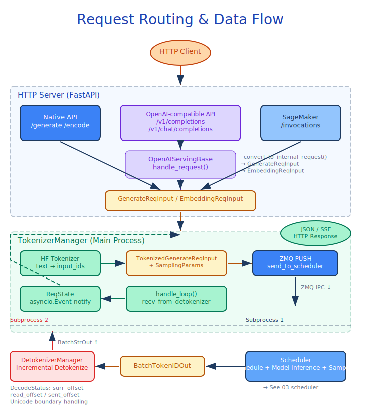
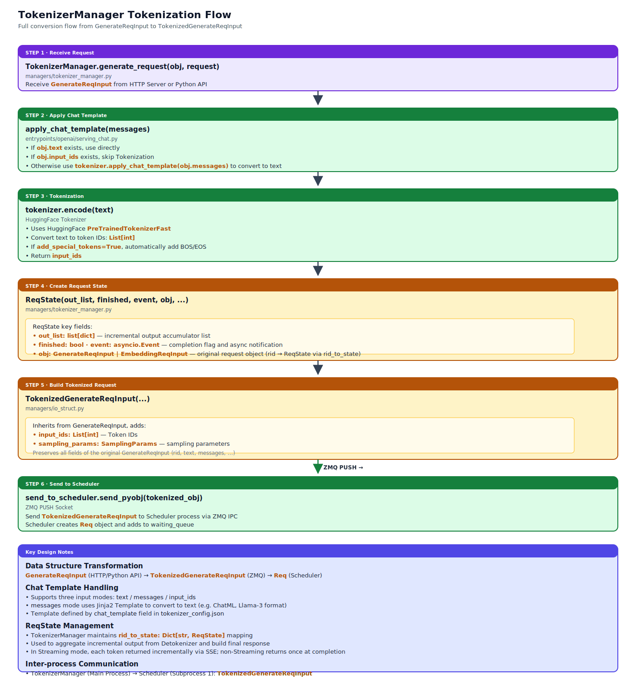

# Entrypoints, Tokenization, and Detokenization

## Module Overview

This module handles the "first mile" and "last mile" of a request: it receives user requests from HTTP endpoints or the Python API, performs OpenAI-compatible protocol conversion and HuggingFace tokenization, then sends a structured `TokenizedGenerateReqInput` to the Scheduler. After inference completes, it receives token ID outputs, performs incremental detokenization, and finally returns the result to the client as JSON or SSE streaming.

The core components involved are:

- **HTTP Server** (`entrypoints/http_server.py`) — FastAPI application providing the Native API and the OpenAI-compatible API
- **OpenAI compatibility layer** (`entrypoints/openai/`) — Pydantic protocol models and Template-Method-style request handlers
- **Engine** (`entrypoints/engine.py`) — Python API entrypoint, manages process/thread lifecycle
- **TokenizerManager** (`managers/tokenizer_manager.py`) — Tokenization, request state management, result aggregation
- **DetokenizerManager** (`managers/detokenizer_manager.py`) — Incremental detokenization
- **IPC data structures** (`managers/io_struct.py`) — Data carriers for inter-process communication



## Prerequisite Reading

- [01-architecture-overview](01-architecture-overview.md) — System overview and three-process architecture

---

## 2.1 HTTP Server

Source: `entrypoints/http_server.py`

### Application Structure

The HTTP Server is a standard FastAPI application, run via `uvicorn` with the `uvloop` event loop. Global state is managed by the `_GlobalState` dataclass, which holds three references: `tokenizer_manager`, `template_manager`, and `scheduler_info`.

Application startup configuration:

- CORS middleware (allows all origins). Allowing all origins is acceptable because the inference server is typically deployed in an internal network or protected environment, where access control is handled by an upstream gateway/load balancer; the server itself does not enforce origin restrictions, which simplifies deployment configuration.
- Custom `RequestValidationError` handler (returns 400 instead of FastAPI's default 422). 400 is used for consistency with OpenAI API behavior — OpenAI returns 400 Bad Request for parameter validation errors, while FastAPI defaults to 422 Unprocessable Entity. Adjusting this avoids client SDK compatibility issues.
- JSON request content-type validation dependency (`validate_json_request`)
- Optional API key authentication middleware

### Routing System

The HTTP Server provides three categories of API endpoints:

**Native API** — directly exposes system capabilities:

| Endpoint | Method | Description |
|------|------|------|
| `/generate` | POST | Text generation, supports SSE streaming output |
| `/encode` | POST | Embedding generation |
| `/classify` | POST | Reward model classification |
| `/health` | GET | Simple health check |
| `/health_generate` | GET | End-to-end health check (generates one token) |
| `/get_model_info` | GET | Model path and tokenizer info |
| `/get_server_info` | GET | ServerArgs + Scheduler info + internal state |
| `/flush_cache` | GET/POST | Flush all caches |
| `/start_profile` / `/stop_profile` | GET/POST | JAX profiling control |
| `/pause_generation` / `/continue_generation` | POST | Pause/resume generation |
| `/open_session` / `/close_session` | GET/POST | Session management |
| `/abort_request` | POST | Abort a request by rid |

**OpenAI-compatible API** — follows the OpenAI REST protocol:

| Endpoint | Method | Handler |
|------|------|--------|
| `/v1/completions` | POST | `OpenAIServingCompletion` |
| `/v1/chat/completions` | POST | `OpenAIServingChat` |
| `/v1/embeddings` | POST | `OpenAIServingEmbedding` |
| `/v1/score` | POST | `OpenAIServingScore` |
| `/v1/rerank` | POST | `OpenAIServingRerank` |
| `/v1/models` | GET | Returns `ModelList` |

**SageMaker endpoint** — AWS SageMaker compatible:

| Endpoint | Method | Description |
|------|------|------|
| `/ping` | GET | Health check |
| `/invocations` | POST | Delegated to the chat completions handler |

### SSE Streaming

The streaming response of the native `/generate` endpoint uses the standard SSE format. `generate_request()` asynchronously iterates over the outputs returned from TokenizerManager, encoding each chunk as `b"data: " + orjson.dumps(out) + b"\n\n"`, and finally sends the `b"data: [DONE]\n\n"` terminator. `StreamingResponse` carries a background abort task that automatically aborts the request when the client disconnects.

### Startup Flow

The `launch()` function is the HTTP server's startup entrypoint:

1. Calls `_launch_subprocesses_or_threads()` to create the Engine components (TokenizerManager, Scheduler, DetokenizerManager)
2. Sets up the `_GlobalState` global state
3. Initializes OpenAI-compatible handlers (Completion, Chat, Embedding, Score, Rerank)
4. Optionally adds the API key authentication middleware
5. Starts the warmup thread (`_wait_and_warmup`: polls `/get_model_info` until ready, then sends a warmup generation request). The purpose of warmup is to trigger JAX JIT compilation — the first forward requires Trace + XLA compilation, which can take tens of seconds. Completing compilation before the server starts accepting external traffic ensures the first real user request does not hit a cold-start latency.
6. Runs `uvicorn.run()` to start the HTTP service

---

## 2.2 OpenAI Compatibility Layer

Source: `entrypoints/openai/`

### Architecture

The OpenAI compatibility layer adopts the **Template Method pattern**, where the abstract base class `OpenAIServingBase` defines the request-handling skeleton, and the concrete implementations of each endpoint inherit from it and override specific steps.

```text
OpenAIServingBase (ABC)
  ├── OpenAIServingCompletion   — /v1/completions
  ├── OpenAIServingChat         — /v1/chat/completions
  ├── OpenAIServingEmbedding    — /v1/embeddings
  ├── OpenAIServingScore        — /v1/score
  └── OpenAIServingRerank       — /v1/rerank
```

### OpenAIServingBase

The `handle_request()` method defines a unified handling flow:

1. `_validate_request(request)` — Request validation (overridable; default is no validation)
2. `_convert_to_internal_request(request)` — **Abstract method**, converts the OpenAI protocol into the internal `GenerateReqInput` / `EmbeddingReqInput`
3. Dispatches to `_handle_streaming_request()` or `_handle_non_streaming_request()` based on `request.stream` — **abstract methods**
4. Catches exceptions and returns standardized errors via `create_error_response()`

### Protocol Models

`protocol.py` defines the full Pydantic request/response models, covering the OpenAI REST API specification and extending it with sglang-jax-specific parameters:

**Request models**:

| Class | Endpoint | Extension Parameters |
|----|------|----------|
| `CompletionRequest` | `/v1/completions` | `top_k`, `min_p`, `min_tokens`, `json_schema`, `regex`, `ebnf`, `repetition_penalty`, `stop_token_ids`, `lora_path`, `session_params` |
| `ChatCompletionRequest` | `/v1/chat/completions` | `tools`, `tool_choice`, `response_format` (supports `json_schema` / `json_object` / `structural_tag`), `continue_final_message`, `separate_reasoning`, `stream_reasoning` |
| `EmbeddingRequest` | `/v1/embeddings` | Supports multimodal input (`MultimodalEmbeddingInput`) |
| `ScoringRequest` | `/v1/score` | `label_token_ids`, `apply_softmax`, `item_first` |
| `V1RerankReqInput` | `/v1/rerank` | Follows the Cohere Rerank style |

**Response models**: `CompletionResponse` / `ChatCompletionResponse` and their streaming variants (`*StreamResponse`), including standard structures such as `UsageInfo` (with `cached_tokens` reporting), `LogProbs`, and `ToolCall`.

### Protocol Conversion in Detail



**Completion** (`serving_completions.py`):

`_convert_to_internal_request()` converts a `CompletionRequest` into a `GenerateReqInput`. It supports both text and token-ID input formats. `_build_sampling_params()` maps OpenAI parameters to the internal sampling parameter dictionary.

**Chat** (`serving_chat.py`):

The most complex handler. `_convert_to_internal_request()` includes the following steps:

1. `_process_messages()` — Processes the message list, returning a `MessageProcessingResult`
2. Template application: prefers `_apply_jinja_template()` (HuggingFace tokenizer's Jinja template), falling back to `_apply_conversation_template()` (legacy template)
3. Multimodal content processing: parses image/video/audio content parts in messages
4. `continue_final_message`: keeps the assistant prefix for continuation
5. Tool call constraint: builds regex/ebnf/structural_tag constraints based on `tools` and `tool_choice`
6. Response format handling: `json_schema`, `json_object`, `structural_tag` format constraints

In the streaming output, the Chat handler also handles:

- **Reasoning separation**: separates inference reasoning from the final answer via `ReasoningParser`
- **Tool call streaming parsing**: incrementally parses function calls via `FunctionCallParser`

**Embedding** (`serving_embedding.py`):

Supports strings, lists of strings, lists of token IDs, and multimodal input. Validates that input is non-empty, strings are not all whitespace, and token IDs are non-negative.

**Score** (`serving_score.py`):

Calls `tokenizer_manager.score_request()` directly instead of the standard `generate_request()` path.

**Rerank** (`serving_rerank.py`):

Constructs query-document pairs as `EmbeddingReqInput`, computes relevance scores via the embedding model, and returns results sorted by score in descending order.

### Helper Utilities

- **`UsageProcessor`** (`usage_processor.py`) — Stateless utility class that computes `UsageInfo` (prompt/completion/total tokens). Handles prompt-token deduplication across `n` choices and cached-token reporting.
- **`utils.py`** — `to_openai_style_logprobs()` converts the internal logprob format (`(logprob, token_id, token_text)` tuples) into the OpenAI-format `LogProbs` object.

---

## 2.3 Engine Python API

Source: `entrypoints/engine.py`, `entrypoints/EngineBase.py`

### EngineBase Abstract Base Class

`EngineBase(ABC)` defines the unified interface of the engine, declaring five abstract methods:

| Method | Description |
|------|------|
| `generate()` | Text generation (synchronous) |
| `flush_cache()` | Flush the cache |
| `release_memory_occupation()` | Temporarily release GPU memory |
| `resume_memory_occupation()` | Resume GPU memory |
| `shutdown()` | Clean up resources |

### Engine

`Engine(EngineBase)` is the primary programmatic entrypoint, usable both embedded in user code and internally by the HTTP server.

> ⚠️ **Status note**: Some extension interfaces on `Engine` (such as `pause_generation` / `continue_generation`, `release_memory_occupation` / `resume_memory_occupation`, and the `enable_engine_loop_run_forever_daemon` daemon-thread mode) currently have **no CI coverage**, and their behavior may drift across versions. The code still lives in `entrypoints/engine.py`, but please validate before using in production. The core generation paths (`generate` / `async_generate`) are covered by end-to-end tests and can be used with confidence.

**Initialization flow**:

1. Construct `ServerArgs` (accepts `**kwargs` overrides)
2. Register an `atexit` shutdown hook
3. Allocate IPC ports via `PortArgs.init_new()`
4. Call `_launch_subprocesses_or_threads()` to start each component
5. Optionally create a daemon thread that runs an independent event loop (`enable_engine_loop_run_forever_daemon`)

**Process/thread startup**:

`_launch_subprocesses_or_threads()` dispatches based on the `server_args.enable_single_process` flag:

| Mode | Scheduler | DetokenizerManager | TokenizerManager |
|------|-----------|--------------------|------------------|
| Multi-process (default) | `mp.Process` | `mp.Process` | In main process |
| Single-process | Background thread | Daemon thread | In main process |

In both modes, components communicate via ZMQ IPC sockets. The advantage of single-process mode is that the Scheduler instance can be accessed directly by the main thread (useful for debugging or testing).

> **Design motivation**: The single-process mode was introduced primarily **to support the Tunix training framework** — Tunix expects to run the inference engine in a single process (sharing the same Python interpreter and JAX runtime), which makes it easy in training-inference hybrid workflows (such as RLHF / online distillation) to directly access Scheduler internal state, reuse the same Device Mesh, and avoid cross-process serialization overhead. The mode also makes local debugging more convenient.

**Sync/async APIs**:

```python
engine = Engine(model_path="Qwen/Qwen2.5-7B")

# Synchronous (internally bridged via loop.run_until_complete)
result = engine.generate(prompt="Hello", sampling_params={"max_new_tokens": 50})

# Asynchronous
async for chunk in engine.async_generate(prompt="Hello", sampling_params={"max_new_tokens": 50}, stream=True):
    print(chunk)
```

`generate()` builds a `GenerateReqInput` and delegates to `tokenizer_manager.generate_request()` for processing. In streaming mode, the async generator is wrapped as a sync generator.

**Extension APIs**:

| Method | Description |
|------|------|
| `encode(prompt)` | Embedding generation, using `EmbeddingReqInput` |
| `score(query, items, label_token_ids)` | Token probability scoring |
| `rerank(prompt)` | Cross-encoder reranking |
| `pause_generation()` / `continue_generation()` | Pause/resume generation (supports abort / retract / in_place modes) |
| `flush_cache()` | Flush KV Cache |
| `get_default_sampling_params()` | Load default sampling params from HuggingFace generation config |

Engine supports the context manager protocol (`with Engine(...) as e:`) and shuts down automatically on exit.

**Environment configuration** (`_set_envs_and_config`):

System-level configuration performed before startup: setting file-descriptor `ulimit`, registering `SIGCHLD` / `SIGQUIT` signal handlers, and configuring the multiprocessing start method.

---

## 2.4 TokenizerManager

Source: `managers/tokenizer_manager.py`

TokenizerManager runs in the main process and is the core coordinator of request handling. It is responsible for tokenization, request lifecycle management, and result aggregation.

### Initialization

TokenizerManager holds the following key members:

- `tokenizer` — HuggingFace tokenizer instance
- `send_to_scheduler` — ZMQ PUSH socket, sends to the Scheduler
- `recv_from_detokenizer` — ZMQ PULL socket, receives results from DetokenizerManager
- `rid_to_state: dict[str, ReqState]` — Mapping from request ID to state object
- `lora_registry: LoRARegistry` — LoRA adapter registry management
- `_result_dispatcher: TypeBasedDispatcher` — Routes messages to corresponding handlers by type

In addition, six `_Communicator` instances are created for RPC-style request-response communication (such as `flush_cache`, `profile`, `release_memory_occupation`, etc.).

### Request Processing Flow

`generate_request()` is the core method, handling both single and batch generation requests:

```text
generate_request(obj, request)
  │
  ├── 1. Wait for pause condition to clear
  ├── 2. auto_create_handle_loop() — Start the background receive loop
  ├── 3. obj.normalize_batch_and_arguments() — Validate and normalize input
  ├── 4. Get LoRA ID (if needed)
  │
  ├── [Single request] ───────────────────────────────
  │   ├── _tokenize_one_request() — Tokenization
  │   ├── _send_one_request() — Send to Scheduler
  │   └── _wait_one_response() — Wait and return result
  │
  └── [Batch request] ─────────────────────────────────
      └── _handle_batch_request() — Process all sub-requests in parallel
```

### Tokenization

`_tokenize_one_request()` performs the following steps:

1. If the input is text (`input_ids` is None), call `self.tokenizer(input_text)` to tokenize
2. Validate that the token count does not exceed the context length via `_validate_one_request()`
3. Build `TokenizedGenerateReqInput` via `_create_tokenized_object()`, simultaneously creating and validating the `SamplingParams` object

Batch tokenization is handled by `_batch_tokenize_and_process()`, which calls `self.tokenizer(texts)` once for all texts (controlled by `server_args.enable_tokenizer_batch_encode`).

### Request State Management (ReqState)

The `ReqState` dataclass tracks the full lifecycle state of each request, including output accumulation (`out_list`, `text`, `output_ids`), completion flag (`finished`), async notification (`asyncio.Event`), streaming offset, and timestamps (used for latency metrics). See the `ReqState` definition in `managers/tokenizer_manager.py`.

### Request Sending and Result Waiting

**Sending** (`_send_one_request`):

1. Send the `TokenizedGenerateReqInput` to the Scheduler via `send_to_scheduler.send_pyobj()`
2. Create a `ReqState`, carrying a reference to the caller's event loop
3. Register it in the `rid_to_state` map

**Waiting** (`_wait_one_response`):

- Wait on `state.event`; the timeout is controlled by the `SGLANG_WAIT_TIMEOUT` environment variable (default 4 seconds). The 4-second timeout is not because we expect a response within 4 seconds — it's a check every 4 seconds to see whether the client has disconnected. 4 seconds was chosen as a balance between "detecting disconnection promptly to release resources" and "avoiding overly frequent polling that consumes CPU".
- After timeout, check whether the client has disconnected; if so, send an abort
- In streaming mode, yield output chunks one by one; in non-streaming mode, return once and finish

### Background Receive Loop

`handle_loop()` runs continuously in the background, receiving messages from DetokenizerManager:

1. `recv_from_detokenizer.recv_pyobj()` receives messages
2. `_result_dispatcher` routes by type (`BatchStrOut`, `BatchTokenIDOut`, `BatchEmbeddingOut`, etc.)
3. `_handle_batch_output()` processes inference output:
   - Looks up the corresponding `ReqState`
   - Builds `meta_info` (`id`, `finish_reason`, `prompt_tokens`, `completion_tokens`, `cached_tokens`)
   - Processes logprob data (`convert_logprob_style()`)
   - Accumulates text / token IDs / embeddings into the `ReqState`
   - On completion, records latency, releases the LoRA, and removes the `rid_to_state` entry
   - Notifies waiters via `_notify_state_event()`

### Cross-Thread Event Notification

When `handle_loop` and the caller run on different event loops (Engine daemon-thread mode), `_notify_state_event()` uses `loop.call_soon_threadsafe(state.event.set)` for thread-safe notification.

### RPC Communication Pattern

`_Communicator[T]` is a request/response pairing layer built on top of the ZMQ `PUSH` socket, upgrading the fire-and-forget one-way RPC into an `await`-able synchronous wait. It is necessary because the `PUSH`/`PULL` pipeline has no native concept of a response, yet control-plane operations such as `flush_cache` / `release_memory_occupation` / `get_internal_state` must wait for an acknowledgment from the Scheduler before proceeding. It uses an `asyncio.Event` to suspend the sending coroutine; when `handle_loop` receives a response of the corresponding type, it calls `handle_recv` to wake the coroutine — implementing RPC semantics on the same socket pair without introducing a new channel.

Because ZMQ sockets cannot tell which RPC each response belongs to, `_Communicator` enforces serialization — the `__call__` entry first checks whether there is an outstanding request; if so, the ready event is queued in `_ready_queue` to wait, and the next RPC is woken only after the previous one completes. The `fan_out` parameter controls how many responses to wait for before considering the call complete; in sglang-jax, all instances are constructed with `fan_out=1`, matching the single-Scheduler / single-controller model.

The generic `_Communicator[T]` class provides RPC semantics:

- `__call__(obj)` — Send a request, wait for `fan_out` responses
- `handle_recv(recv_obj)` — Match response types in the receive loop

### Score Request

`score_request()` provides token probability scoring: it combines query and items into a prompt, issues a batch generation request with `return_logprob=True, max_new_tokens=1`, extracts the logprob of label tokens, and optionally applies softmax normalization.

---

## 2.5 DetokenizerManager

Source: `managers/detokenizer_manager.py`

DetokenizerManager runs in a separate process (or thread), responsible for incrementally converting token IDs output by the Scheduler into readable text.

### Core Components

- `recv_from_scheduler` — ZMQ PULL socket, receives `BatchTokenIDOut`
- `send_to_tokenizer` — ZMQ PUSH socket, sends `BatchStrOut` to TokenizerManager
- `tokenizer` — HuggingFace tokenizer instance
- `decode_status: LimitedCapacityDict` — Mapping from request ID to `DecodeStatus`, with an upper bound of 65536 (the `SGLANG_DETOKENIZER_MAX_STATES` environment variable)

### Incremental Detokenization Algorithm

Incremental detokenization means that for each new batch of tokens received, we append-decode and yield only the newly added portion — a hard requirement for streaming UX, otherwise users would see a long blank between the first and final tokens. The difficulty lies in BPE/SentencePiece's lack of one-to-one mapping between characters and tokens: a single UTF-8 Chinese character is usually split into 2–3 tokens, and decoding a middle token alone yields the `�` replacement character. The algorithm uses two pointers per request — `surr_offset` (the start position of the previous successful decode) and `read_offset` (the current safe-output position) — re-decoding a tail window and diffing against the previous result; when `�` is detected, output is deferred until subsequent tokens complete the multi-byte character. `DecodeStatus` tracks each request's decode state:

| Field | Description |
|------|------|
| `decoded_text` | The decoded full text |
| `decode_ids` | All received token IDs |
| `surr_offset` | Surrogate offset (handles incomplete Unicode) |
| `read_offset` | Read offset |
| `sent_offset` | Offset of already-sent text (used for incremental output) |

`handle_batch_token_id_out()` implements the core logic of incremental detokenization:

1. **State update**: For each request, initialize or update `DecodeStatus`, appending new token IDs to `decode_ids`
2. **ID slicing**: Compute `read_ids` (from `surr_offset` to the end) and `surr_ids` (from `surr_offset` to `read_offset`)
3. **Batch decode**: Flatten the nested list of token IDs and call `tokenizer.batch_decode()` once to decode all `surr_ids` and `read_ids`
4. **Incremental text computation**: `new_text = read_text[len(surr_text):]`
5. **Unicode boundary handling**: If the new text ends with the replacement character `�`, find a safe boundary via `find_printable_text()` to avoid emitting an incomplete multi-byte character
6. **Post-processing**:
   - `trim_matched_stop()` — Trim any matched stop string/token
   - `process_special_tokens_spaces()` — Filter special tokens
7. **Build output**: Generate `BatchStrOut`, including the incremental output string and pass-through metadata such as logprobs

### LimitedCapacityDict

A capacity-limited dict inheriting from `OrderedDict`. When the entry count reaches the limit, the oldest entry is evicted in FIFO order. This prevents unbounded growth of decode state during long-running services.

### Startup Modes

- `run_detokenizer_process()` — Subprocess entrypoint, sets the process title and notifies the parent process on exception
- `run_detokenizer_thread()` — Thread entrypoint, with the same error-handling pattern

---

## 2.6 IPC Data Structures

Source: `managers/io_struct.py`

All inter-process communication data structures are defined in this file, using Python `@dataclass`.

### Base Classes

| Class | Description |
|----|------|
| `BaseReq` | Common request base class, providing `rid` (request ID) and `http_worker_ipc` fields, plus the `regenerate_rid()` method |
| `RpcReqInput` | RPC request base class, providing the `request_id` field |
| `RpcReqOutput` | RPC response base class, providing `request_id`, `success`, and `error_msg` fields |

### Request Lifecycle Data Structures

Data flows through the system along the following path:

```text
GenerateReqInput (HTTP → TokenizerManager)
    │
    ▼
TokenizedGenerateReqInput (TokenizerManager → Scheduler)
    │
    ▼
[Scheduler scheduling and inference]
    │
    ▼
BatchTokenIDOut (Scheduler → DetokenizerManager)
    │
    ▼
BatchStrOut (DetokenizerManager → TokenizerManager)
    │
    ▼
ReqState updates → HTTP response
```

### GenerateReqInput

The internal representation of an HTTP request, carrying input (text / token ID / embedding — the three are mutually exclusive), multimodal data, sampling parameters, and streaming/batch/logprob/LoRA configuration — i.e. all generation request information. `normalize_batch_and_arguments()` validates and normalizes input before processing; `__getitem__(i)` supports extracting a single item from a batch request.

### TokenizedGenerateReqInput

The post-tokenization request, with key fields `rid`, `input_ids`, `sampling_params` (a validated `SamplingParams` object), and the `stream` flag.

### BatchTokenIDOut / BatchStrOut

Scheduler → DetokenizerManager transports `BatchTokenIDOut` (containing `rids`, `decode_ids`, token counts, logprob data, etc.); after incremental detokenization, DetokenizerManager sends `BatchStrOut` (replacing the decode fields with `output_strs: list[str]`) to TokenizerManager.

### EmbeddingReqInput / BatchEmbeddingOut

The embedding request/response pair, used by the `/encode` and `/v1/embeddings` endpoints.

### Control-Command Data Structures

The system defines a rich set of control-command pairs (all following the Request/Output pairing pattern), covering pause/resume generation, cache flush, memory release/restore, session management, abort, profiling, log configuration, and internal-state read/write. See `managers/io_struct.py` for details.

---

## Key Interface Reference

| Interface | Location | Description |
|------|------|------|
| `launch()` | `entrypoints/http_server.py` | HTTP Server startup entrypoint |
| `generate_request()` | `entrypoints/http_server.py` | Native `/generate` endpoint handler |
| `EngineBase` (ABC) | `entrypoints/EngineBase.py` | Unified engine interface (`generate`, `flush_cache`, `shutdown`) |
| `Engine.__init__()` | `entrypoints/engine.py` | Engine initialization, starts the three processes/threads |
| `Engine.generate()` / `async_generate()` | `entrypoints/engine.py` | Synchronous/asynchronous generation interface |
| `Engine.encode()` / `score()` / `rerank()` | `entrypoints/engine.py` | Embedding / scoring / reranking interface |
| `OpenAIServingBase.handle_request()` | `entrypoints/openai/serving_base.py` | Unified entry of OpenAI-compatible API (Template Method) |
| `OpenAIServingChat._process_messages()` | `entrypoints/openai/serving_chat.py` | Chat message processing and template application |
| `TokenizerManager.generate_request()` | `managers/tokenizer_manager.py` | Core request processing: tokenize → send → wait |
| `TokenizerManager._tokenize_one_request()` | `managers/tokenizer_manager.py` | Tokenize a single request |
| `TokenizerManager.handle_loop()` | `managers/tokenizer_manager.py` | Background receive loop, processes detokenization results |
| `TokenizerManager.score_request()` | `managers/tokenizer_manager.py` | Token probability scoring |
| `DetokenizerManager` | `managers/detokenizer_manager.py` | Incremental detokenization process |
| `DetokenizerManager.handle_batch_token_id_out()` | `managers/detokenizer_manager.py` | Core incremental detokenization algorithm |
| `GenerateReqInput` | `managers/io_struct.py` | Internal representation of an HTTP request |
| `TokenizedGenerateReqInput` | `managers/io_struct.py` | Post-tokenization request (TokenizerManager → Scheduler) |
| `BatchTokenIDOut` | `managers/io_struct.py` | Batch token-ID output (Scheduler → DetokenizerManager) |
| `BatchStrOut` | `managers/io_struct.py` | Batch text output (DetokenizerManager → TokenizerManager) |
| `ReqState` | `managers/tokenizer_manager.py` | Request lifecycle state tracking |
| `DecodeStatus` | `managers/detokenizer_manager.py` | Incremental decode state tracking |
| `_Communicator[T]` | `managers/tokenizer_manager.py` | RPC-style communication utility class |
| `UsageProcessor` | `entrypoints/openai/usage_processor.py` | Token usage computation |
