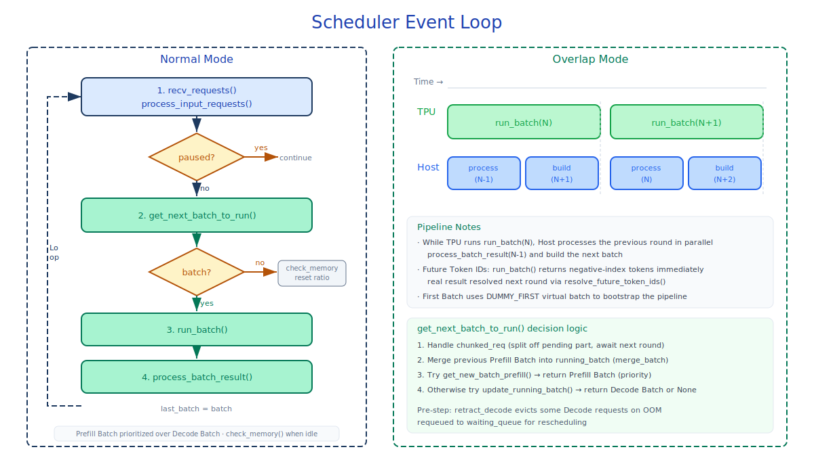
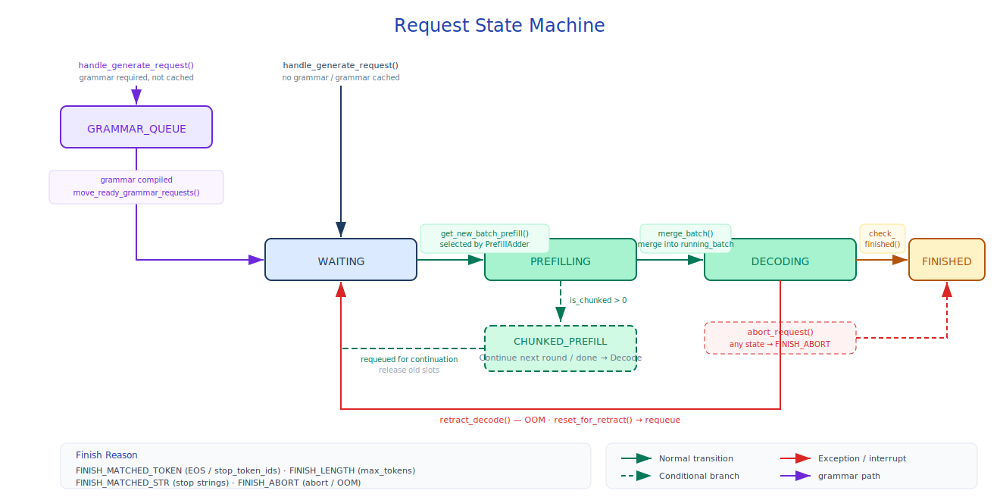
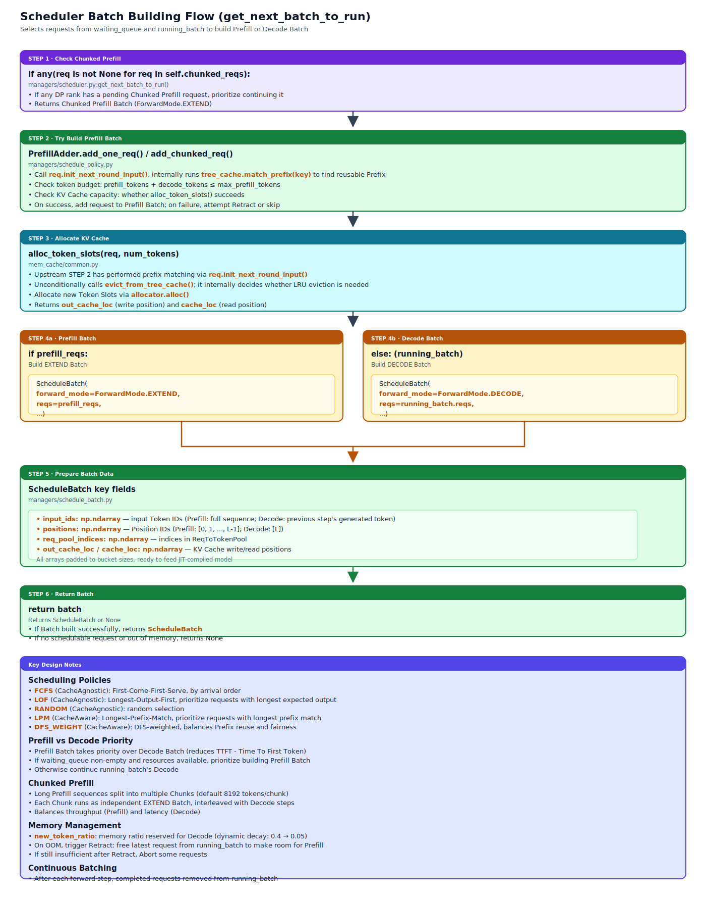

# Scheduler

## Module Overview

The Scheduler is the core scheduling engine of sglang-jax, running in an independent subprocess and managing the entire runtime lifecycle of a request from enqueue to completion. Its core responsibilities include:

- **Request management** — Receive `TokenizedGenerateReqInput`, create `Req` objects, and maintain the waiting/running queues
- **Batch construction** — Select requests according to a scheduling policy and build Prefill and Decode batches
- **Data Parallel scheduling** — Within the same Scheduler, assign DP ranks to requests and organize batches, KV Cache, and execution metadata by rank
- **Memory management** — Allocate and free KV Cache; handle retract and abort on OOM
- **Forward dispatch** — Call the TP Worker to execute model forward inference, process outputs, and detect completion
- **Continuous Batching** — Support requests dynamically joining and leaving batches during inference
- **Constrained Decoding** — Compile grammar constraints (JSON Schema / Regex / EBNF) and apply bitmasks
- **Overlap Pipeline** — Pipeline CPU scheduling with device computation

Core files involved:

- `managers/scheduler.py` — Scheduler main class and event loop
- `managers/schedule_policy.py` — Scheduling policies (FCFS / LOF / RANDOM / LPM / DFS_WEIGHT) and `PrefillAdder` token budgeting
- `managers/schedule_batch.py` — `Req`, `ScheduleReqsInfo`, `ScheduleBatch`, `ModelWorkerBatch` data structures
- `managers/scheduler_output_processor_mixin.py` — Output processing and streaming
- `managers/communication.py` — Communication backend abstraction
- `managers/tp_worker_overlap_thread.py` — Forward thread for Overlap mode
- `constrained/` — Grammar backend and bitmask operations
- `function_call/` — Function call / tool call parsing



## Prerequisite Reading

- [01-architecture-overview](01-architecture-overview.md) — System overview and three-process architecture
- [02-entrypoints-and-tokenization](02-entrypoints-and-tokenization.md) — Entrypoints, tokenization, and detokenization

---

## 3.1 Scheduler Overview

Source: `managers/scheduler.py`

### Class Structure

The `Scheduler` class inherits from three mixins:

| Mixin | Responsibility |
|-------|------|
| `SchedulerOutputProcessorMixin` | Output token processing, streaming output construction |
| `SchedulerProfilerMixin` | JAX profiler integration |
| `SchedulerMetricsMixin` | Throughput statistics and logging |

### Initialization Flow

`Scheduler.__init__()` performs the following initialization sequence:

1. **JIT cache configuration** — If `JAX_COMPILATION_CACHE_DIR` is set, enable JAX persistent compilation cache
2. **Server args parsing** — Extract `tp_size`, `dp_size`, `dp_schedule_policy`, `schedule_policy`, `stream_interval`, `max_seq_len`, `page_size`, `enable_overlap`, etc.
3. **ZMQ communication** — Create sockets to TokenizerManager (`recv_from_tokenizer` PULL), DetokenizerManager (`send_to_detokenizer` PUSH), TokenizerManager backchannel (`send_to_tokenizer` PUSH), and RPC (`recv_from_rpc` DEALER); for multi-node deployments, additionally create PUB/SUB
4. **Tokenizer initialization** — Load `ModelConfig` and the HuggingFace Tokenizer
5. **Grammar Backend** — Create the constrained-decoding backend via `create_grammar_backend()`, maintain `grammar_queue` for asynchronous compilation
6. **Device Mesh** — Create a `(data, tensor)` JAX Device Mesh, where the `data` axis maps to `dp_size` and the `tensor` axis maps to `tp_size // dp_size`.
7. **TP Worker** — Instantiate `ModelWorkerClient` (Overlap mode) or `ModelWorker` (Normal mode)
8. **Draft Worker** — If EAGLE speculative decoding is enabled, create `EAGLEWorker`
9. **Memory info** — Fetch `max_total_num_tokens`, `max_prefill_tokens`, `max_running_requests`, etc., from the worker
10. **Memory pool and cache** — Initialize `ReqToTokenPool`, `TokenToKVPoolAllocator`, and `RadixCache` / `SWARadixCache` / `ChunkCache`
11. **Runtime state** — Initialize `waiting_queue`, `running_batch` (an empty `ScheduleBatch`), forward counters, and Chunked Prefill state
12. **New token ratio** — A dynamic ratio that controls memory reservation, decaying from `init_new_token_ratio` to `min_new_token_ratio`
13. **Watchdog thread** — A daemon thread that terminates the process if `forward_ct` makes no progress within `watchdog_timeout`
14. **Request dispatcher** — `TypeBasedDispatcher` routes different message types to corresponding handlers

### Key Runtime State

| State | Type | Description |
|------|------|------|
| `waiting_queue` | `list[Req]` | Queue of requests waiting to be scheduled |
| `running_batch` | `ScheduleBatch` | The current running batch in the decode phase |
| `cur_batch` | `ScheduleBatch \| None` | The batch currently being executed |
| `last_batch` | `ScheduleBatch \| None` | The batch executed in the previous round |
| `forward_ct` | `int` | Total forward count (basis for the watchdog) |
| `forward_ct_decode` | `int` | Decode forward count |
| `new_token_ratio` | `float` | Memory reservation ratio (decays dynamically) |
| `grammar_queue` | `list[Req]` | Asynchronous grammar compilation queue |
| `aborted_reqs` | `dict[str, Req]` | Aborted requests (Request ID → Req mapping) |
| `dp_size` | `int` | Number of Data Parallel ranks |
| `dp_schedule_policy` | `str` | Policy for assigning new requests to DP ranks |

---

## 3.2 Event Loop

### Normal Mode (`event_loop_normal`)

Normal mode is the standard synchronous execution loop; each iteration performs the following steps:

```text
┌─ Event loop iteration ──────────────────────────────┐
│                                                      │
│  1. recv_requests()       — Receive new requests     │
│  2. process_input()       — Dispatch to handlers     │
│  3. Check pause state                                 │
│  4. get_next_batch_to_run() — Pick next batch         │
│  5a. [Has batch] run_batch() + process_batch_result() │
│  5b. [No batch] check_memory() + reset token ratio    │
│  6. Update last_batch                                 │
│                                                      │
└──────────────────────────────────────────────────────┘
```

**Step 4 priority**: Prefill batches take priority over Decode batches. `get_next_batch_to_run()` first tries to build a Prefill batch from `waiting_queue`, and only runs a Decode batch when no Prefill batch is available. This ensures new requests start prefill as soon as possible, reducing Time-to-First-Token (TTFT). This is standard practice in LLM serving: Prefill is the dominant source of user-perceived latency (the user is waiting for the first token), while requests in Decode are already producing tokens (the user is already seeing output), so an extra round of waiting in Decode has little effect on user experience.

**Idle handling** (Step 5b): When no batch needs to run, the Scheduler performs a memory leak check (`check_memory()`: verifies the invariant `available + evictable + protected == total`) and a Tree Cache consistency check, and resets `new_token_ratio` to its initial value.

### Overlap Mode (`event_loop_overlap`)

Overlap mode pipelines CPU scheduling with device computation by executing model forward inference in a background thread via `ModelWorkerClient`:

```text
Timeline:
  ┌─ Batch N forward (device) ────────────────┐
  │                                          │
  ├─ Process Batch N-1 result (CPU) ──┤       │
  │                                   │       │
  ├─ Build Batch N+1 (CPU) ────────────┤      │
  │                                          │
  ┌─ Batch N+1 forward (device) ────────┤
```

Detailed flow:

1. Receive and process requests (same as Normal)
2. `get_next_batch_to_run()` and set `batch.launch_done = threading.Event()`
3. `run_batch()` returns immediately with **future token IDs** (negative indices); meanwhile, the device computes in the background
4. **First-batch special handling**: if there is no `last_batch`, create a `DUMMY_FIRST` virtual batch to bootstrap the pipeline
5. Pop the previous round's result from `result_queue`, process the output of Batch N-1 while Batch N is already executing on the device

**Future token IDs mechanism**:

In Overlap mode, `forward_batch_generation()` returns immediately, without waiting for device computation to finish. The returned `next_token_ids` are negative indices (`-1, -2, -3, ...`) pointing to positions in `future_token_ids_map`. The actual results are written into the map after the forward thread completes; the next iteration's `resolve_future_token_ids()` replaces the negative indices with real token IDs.

```python
# JIT-compiled device-side resolver
@jax.jit
def resolve_future_token_ids(input_ids, future_token_ids_map):
    return jnp.where(
        input_ids < 0,
        future_token_ids_map[jnp.clip(-input_ids, a_min=0)],
        input_ids,
    )
```

This design lets token resolution happen on the device, avoiding host-device data transfers.

---

## 3.3 Request State Machine



### State Definitions

The `Req` class (`managers/schedule_batch.py`) is the complete runtime-state object of a request, spanning the entire lifecycle from enqueue to completion. Requests go through the following state transitions:

```text
Waiting ──(picked by PrefillAdder)──→ Prefilling ──(prefill done)──→ Decoding ──(stop met)──→ Finished
   ↑                                                                  │
   └─────────────────────────(OOM Retract)────────────────────────────┘
```

**Waiting** — The request sits in `waiting_queue` waiting to be scheduled. `init_next_round_input()` computes prefix matching (`tree_cache.match_prefix()`) to determine `prefix_indices` and `extend_input_len`.

**Prefilling** — The request is selected into a Prefill batch by `PrefillAdder`. `prepare_for_extend()` allocates KV Cache, and the model forward inference processes the input token sequence.

**Decoding** — After prefill completes, the request is merged into `running_batch`. Each decode round generates one token, appended to `output_ids`.

**Finished** — Once any completion condition is met, the request is marked as finished and removed from the batch.

**OOM Retract** — When memory is insufficient during the decode phase, the Scheduler uses `retract_decode()` to push low-priority requests back to `waiting_queue`, freeing their KV Cache. The retracted request resets its prefix/cache state via `reset_for_retract()` and re-enters scheduling.

### Completion Detection (`Req.check_finished()`)

Called after every generated token, in the following order:

1. **Deferred abort** — If `to_finish` is set (external abort), apply immediately
2. **`max_new_tokens` limit** — `len(output_ids) >= max_new_tokens` → `FINISH_LENGTH`
3. **Grammar termination** — Grammar object's `is_terminated()` → `FINISH_MATCHED_TOKEN`
4. **EOS / Stop Token** — Current token matches `eos_token_id` or `stop_token_ids` → `FINISH_MATCHED_TOKEN`
5. **Vocabulary boundary** — Detect NaN / invalid tokens (out-of-vocab)
6. **Stop strings** — Output text matches `stop_strs` → `FINISH_MATCHED_STR`

### Finish Reason Types

| Type | Class | Description |
|------|-----|------|
| `"stop"` | `FINISH_MATCHED_TOKEN` | EOS or stop-token match |
| `"stop"` | `FINISH_MATCHED_STR` | Stop-string match |
| `"stop"` | `FINISHED_MATCHED_REGEX` | Regex match |
| `"length"` | `FINISH_LENGTH` | `max_new_tokens` reached |
| `"abort"` | `FINISH_ABORT` | Request aborted, carrying `status_code` and `err_type` |

---

## 3.4 Scheduling Policies

Source: `managers/schedule_policy.py`

### Policy Types

Scheduling policies fall into two categories:

**Cache-Aware policies** (leverage RadixCache prefix info):

| Policy | Description |
|------|------|
| `LPM` (Longest Prefix Match) | Sort by descending prefix-match length, prioritizing requests whose KV Cache already exists |
| `DFS_WEIGHT` | Sort by DFS weight on the Radix Tree; requests under the same prefix subtree are scheduled together |

**Cache-Agnostic policies**:

| Policy | Description |
|------|------|
| `FCFS` (First Come First Serve) | Default policy; schedules in arrival order |
| `LOF` (Longest Output First) | Sort by descending `max_new_tokens` (internal policy, not exposed via the `--schedule-policy` CLI flag) |
| `RANDOM` | Random ordering |

**Policy selection logic** (`SchedulePolicy.calc_priority()`):

- FCFS skips priority computation (naturally ordered)
- LPM automatically falls back to FCFS when `waiting_queue` exceeds 128 requests (because LPM needs to perform a Radix Tree prefix match for each waiting request, with time complexity O(queue length × sequence length); when the queue is too long, scheduling latency itself becomes the bottleneck and instead reduces throughput)
- If Tree Cache is disabled, FCFS is forced

### In-Batch Prefix Caching

When a request's main cache prefix match falls below `IN_BATCH_PREFIX_CACHING_CHECK_THRESHOLD` (default 32 tokens), the policy checks whether other requests in `waiting_queue` share the same prefix. If the shared length exceeds `IN_BATCH_PREFIX_CACHING_DEPRIORITIZE_THRESHOLD` (default 32 tokens), the priority of the current request is lowered to let prefix-sharing requests run first, improving cache-hit rate for subsequent requests.

### DFS Weight Sorting

The `DFS_WEIGHT` policy traverses the Radix Tree, computing the number of waiting requests in each node's subtree as a weight. DFS visits child nodes in descending weight order, so prefix subtrees with more pending requests are scheduled first.

### Data Parallel Request Assignment

Data Parallel does not change the number of Scheduler processes. After receiving a new request, the Scheduler assigns `Req.dp_rank`, after which all batch construction, KV Cache allocation, and Attention Metadata are partitioned by DP rank. Two DP assignment policies are currently supported:

| `dp_schedule_policy` | Description |
|---|---|
| `min_running_queue` | Picks the DP rank with the fewest currently running requests |
| `round_robin` | Rotates new requests across ranks |

`waiting_queue` is still a Scheduler-level queue, but each `Req` already carries a target `dp_rank`. When constructing batches, `ScheduleBatch.reqs_info` keeps a `ScheduleReqsInfo` per rank, containing that rank's `reqs`, `chunked_req`, `input_ids`, `req_pool_indices`, `seq_lens`, and `out_cache_loc`; `per_dp_bs_size` records each rank's padded batch size, used by the execution side to construct DP-uniform inputs.

---

## 3.5 Batch Construction



### PrefillAdder — Token Budget Management

`PrefillAdder` (`schedule_policy.py`) controls Prefill batch construction and manages a multi-dimensional token budget:

| Budget Dimension | Meaning |
|----------|------|
| `rem_total_tokens` | Total available KV Cache tokens (`available + evictable - reserved-for-running_batch`) |
| `rem_input_tokens` | Remaining prefill input-token quota (from `max_prefill_tokens`) |
| `rem_chunk_tokens` | Chunk size limit in the Chunked Prefill scenario |
| `cur_rem_tokens` | Currently allocatable tokens (excluding evictable parts) |

**Key constants**: `CLIP_MAX_NEW_TOKENS_ESTIMATION = 4096` — clips the estimated `max_new_tokens` to prevent long-generation requests from being so over-conservative that they starve scheduling.

**Request admission logic** (`add_one_req()`):

1. Compute `total_tokens = extend_input_len + min(max_new_tokens, 4096)`
2. Check whether `total_tokens` exceeds `rem_total_tokens` and `rem_input_tokens`
3. Lock the Radix Tree node to prevent the prefix from being evicted during admission
4. If Chunked Prefill is needed, truncate `extend_input_len` to `rem_chunk_tokens` (aligned to `page_size`)
5. Update each budget dimension

**Budget state** (`budget_state()`):

- `NO_TOKEN` — Total or current tokens exhausted; stop admitting
- `OTHER` — Input/chunk budget exhausted; stop admitting
- `CONTINUE` — Continue admitting

### Prefill Batch Construction Flow (`get_new_batch_prefill()`)

1. Poll `grammar_queue` for completed grammar requests
2. Check admission preconditions (batch not full, `waiting_queue` non-empty)
3. `policy.calc_priority(waiting_queue)` — Sort by policy
4. Create a `PrefillAdder`, set the token budget
5. Iterate over the sorted `waiting_queue`:
   - `req.init_next_round_input(tree_cache)` — Compute prefix match
   - `adder.add_one_req(req)` — Try to admit
   - Stop if budget is exhausted
6. `ScheduleBatch.init_new()` → `prepare_for_extend()` — Allocate KV Cache per DP rank, build per-DP batch arrays

### Decode Batch Update (`update_running_batch()`)

1. `filter_batch()` — Remove finished requests
2. `check_decode_mem()` — Check decode-step memory
3. If insufficient → `retract_decode()` (see 3.7 Memory Management)
4. If sufficient → decay `new_token_ratio`
5. `prepare_for_decode()` — Set `forward_mode = DECODE`, update `input_ids` (the token from the previous step) and `seq_lens += 1` per DP rank, allocate new `out_cache_loc`

### `has_initial_state` Derivation

`ModelWorkerBatch.has_initial_state` (`np.ndarray[bool]`) tells the model whether the current slot already holds prior KV/recurrent state. This field is **not manually configured** — it is automatically derived in `get_model_worker_batch()` (in `schedule_batch.py`) based on `forward_mode` and `extend_prefix_lens`:

| Forward Mode | Derivation Rule |
|--------------|---------|
| `DECODE` / Other | `has_initial_state = True` (the slot already holds full history state) |
| `EXTEND` / `MIXED` | `has_initial_state[i] = (extend_prefix_lens[i] > 0)` (True only if a prefix hit exists) |

This is especially crucial for hybrid recurrent models (Mamba/GLA): when `has_initial_state=False`, the model must **reset** recurrent state; when `True`, it **continues accumulating**. Standard attention models also use this field to decide whether to apply the prefix cache.

---

## 3.6 Chunked Prefill

The Prefill phase needs to process all input tokens of a request at once (which can be thousands or even tens of thousands), tying up compute resources for a long time and blocking requests that are decoding — users see "stuttering" output. Chunked Prefill splits long inputs into multiple fixed-size chunks; each chunk is executed as an independent prefill step, with decode steps interleaved between chunks, balancing prefill throughput and decode latency.

When a request's input token count exceeds the `rem_chunk_tokens` limit, `PrefillAdder` truncates it into a chunk. Chunk size is aligned to `page_size`.

**Chunked request handling flow**:

1. `add_one_req()` sets `req.is_chunked = remaining_chunks`
2. The first prefill processes only the truncated tokens
3. In `process_batch_result_prefill()`, chunked requests skip token sampling and streaming output
4. In the next `get_next_batch_to_run()`, `chunked_req` is processed first: its `req_pool_idx` is released (since a larger cache slot needs to be re-allocated), and it is re-enqueued
5. Repeat until all chunks are processed (`is_chunked == 0`)

### Mixed Chunked Prefill

`mix_with_running()`: mix decode requests into a Prefill batch; each decode request contributes `extend_input_len = 1`. Forward mode stays `EXTEND`, letting prefill and decode share the same forward call to improve hardware utilization.

---

## 3.7 Memory Management

### New Token Ratio Mechanism

`new_token_ratio` is a dynamic ratio used by the Scheduler to **estimate future KV Cache memory demand**. When `PrefillAdder` decides whether to admit a new request, it must reserve KV Cache for future tokens generated by each request in `running_batch`:

```text
Reservation = min(max_new_tokens - len(output_ids), 4096) × new_token_ratio
```

**Initialization parameters**:

| Parameter | Computation | Description |
|------|----------|------|
| `init_new_token_ratio` | `default_init_new_token_ratio × schedule_conservativeness` | Initial value (conservative) |
| `min_new_token_ratio` | `init_new_token_ratio × default_min_new_token_ratio_factor` | Decay floor (aggressive) |
| `new_token_ratio_decay` | `(init - min) / decay_steps` | Per-step decay |

`new_token_ratio` is a sliding coefficient between two extremes: in steady-state operation it gradually decays from `init` (conservative) toward `min` (aggressive) to boost concurrency; once `check_decode_mem()` fails and triggers a retract, it jumps back to a conservative value close to 1.0; when idle, it resets to `init` so the next wave of requests starts from a safe baseline.

**Three-phase change logic**:

```text
init_new_token_ratio (conservative)
      │
      │  Each successful decode (no OOM)
      │  ratio -= decay_step
      ▼
min_new_token_ratio (aggressive)
      │
      ├── OOM triggers retract_decode()
      │   → Jumps to a new ratio based on actual usage:
      │     (already-generated tokens + retract_steps × batch_size) / max_new_tokens
      │     Usually close to 1.0, very conservative
      │
      └── Idle (no batch)
          → Reset to init_new_token_ratio
```

| Phase | Trigger | Behavior | Source |
|------|----------|------|------|
| **Normal decay** | Each decode round with sufficient memory | `ratio -= decay`, gradually lowering from `init` to `min` | `scheduler.py` `update_running_batch()` |
| **OOM jump** | `check_decode_mem()` fails | `retract_decode()` returns a new ratio based on actual usage | `schedule_batch.py` `retract_decode()` |
| **Idle reset** | No batch to run | `ratio = init_new_token_ratio` | `scheduler.py` `event_loop_normal()` |

### OOM Handling (Retract)

When `check_decode_mem()` detects insufficient memory, `retract_decode()` performs:

1. Sort batch requests in descending order by `(output_length, -input_length)`
2. Pop requests from the tail (those with the fewest outputs are retracted first). Retracting requests with the fewest outputs makes sense because: (a) fewer outputs means less computation has been done, so the "waste" of retraction is minimized — re-prefill cost is proportional to the decode steps already invested; (b) requests with fewer outputs free relatively less KV Cache, possibly requiring multiple retracts to make enough room, while requests with many outputs are close to completion and have a higher sunk cost
3. For each retracted request:
   - Free its KV Cache (`req_pool_idx`, `out_cache_loc`)
   - Call `req.reset_for_retract()` to clear prefix/cache state
   - Put it back into `waiting_queue` for re-scheduling
4. If even the last request still cannot fit in memory, abort it with `FINISH_ABORT`
5. Increase `new_token_ratio`

### Abort Handling

`abort_request()` supports two scenarios:

- **Requests in waiting/grammar queues**: removed directly from the queue
- **Requests in the running batch**: set `req.to_finish = FINISH_ABORT()`, which takes effect at the next `check_finished()`

### Memory Leak Detection

`check_memory()` validates an invariant when idle:

```text
available_tokens + evictable_tokens + protected_tokens == total_tokens
```

If the equation does not hold, a warning log is recorded to help diagnose memory leaks.

---

## 3.8 Output Processing

Source: `managers/scheduler_output_processor_mixin.py`

### Prefill Output Processing (`process_batch_result_prefill()`)

For each request in the batch:

1. Append `next_token_id` to `req.output_ids`
2. Call `check_finished()` to detect completion
3. **If finished**: call `cache_finished_req()` to write KV Cache into the Tree Cache
4. **If unfinished**: call `cache_unfinished_req()` to update the Radix Cache
5. Collect logprob info (if `return_logprob=True`)
6. Advance grammar state (`req.grammar.accept_token()`)
7. Chunked requests skip token sampling and streaming

### Decode Output Processing (`process_batch_result_decode()`)

Similar to Prefill, with the following differences:

- **Speculative decoding**: parses accepted tokens via `_resolve_spec_decode_token_ids()`
- **Overlap mode**: calls `tp_worker.resolve_last_batch_result()` to wait for the device computation, transferring results from the device back to the CPU
- **Batch-level memory release**: uses `free_group_begin()/end()` to coalesce multiple free operations

### Streaming Output (`stream_output_generation()`)

Builds `BatchTokenIDOut` and sends it to DetokenizerManager. Output timing is governed by:

| Request State | Output Timing |
|----------|----------|
| Finished | Output immediately (only once, controlled by the `finished_output` flag) |
| Streaming mode | Output every `stream_interval` tokens |
| Non-streaming mode | Force output every `DEFAULT_FORCE_STREAM_INTERVAL` (50) tokens |

The output content is collected via `req.init_incremental_detokenize()` (incremental decode IDs, logprobs, hidden states, etc.), wrapped as `BatchTokenIDOut`, and sent through ZMQ or the communication backend.

---

## 3.9 Constrained Decoding

Constrained decoding is a technique for forcing model output to follow a specific format during generation. LLMs' free generation can produce arbitrary text, but many application scenarios require output to strictly follow a structured format — for example, valid JSON, strings matching a specific regex, or code snippets conforming to an EBNF grammar. Constrained decoding applies a bitmask over the vocabulary at each sampling step, zeroing out (setting to `-inf`) tokens that do not match the current grammar state, ensuring the model can only choose grammatically valid tokens.

sglang-jax supports three constraint formats: JSON Schema (most common, for structured API output), Regex (pattern matching), and EBNF (general context-free grammar). At the lower level, the `llguidance` library uniformly compiles all three formats into a grammar state machine, which advances state and produces the allowed token set at each decode step.

### Grammar Backend Architecture

```text
BaseGrammarBackend (ABC)
  └── GuidanceBackend (llguidance)
        ├── dispatch_json(schema)     → LLMatcher.grammar_from_json_schema()
        ├── dispatch_regex(pattern)   → grammar_from("regex", ...)
        ├── dispatch_ebnf(grammar)    → grammar_from("ebnf", ...)
        └── dispatch_structural_tag() → StructTag → grammar
```

**Grammar object interface** (`BaseGrammarObject`):

| Method | Description |
|------|------|
| `accept_token(token)` | Advance grammar state |
| `allocate_vocab_mask(vocab_size, batch_size)` | Allocate bitmask array |
| `fill_vocab_mask(vocab_mask, idx)` | Fill the `idx`-th row's allowed tokens |
| `is_terminated()` | Whether the grammar has terminated |
| `copy()` | Copy the grammar object (for caching) |

### Asynchronous Grammar Compilation

Grammar compilation is performed asynchronously via a `ThreadPoolExecutor`:

1. When a request arrives, `handle_generate_request()` calls `grammar_backend.get_cached_or_future_value(key)` to query the cache
2. **Cache hit**: directly use the compiled grammar object
3. **Cache miss**: submit an async compilation task, return a `Future`, and put the request into `grammar_queue`
4. `move_ready_grammar_requests()` polls `grammar_queue` in the event loop, moving completed requests into `waiting_queue`
5. Requests not finished within `GRAMMAR_TIMEOUT` (default 300 seconds) are aborted

**Compilation failure handling**: an `INVALID_GRAMMAR_OBJ` sentinel marks compilation failure; subsequent requests using that grammar are aborted directly.

### Bitmask Operations

Grammar constraints are applied via a vocabulary bitmask:

| Function | Description |
|------|------|
| `allocate_token_bitmask(batch_size, vocab_size)` | Allocate a `[batch_size, vocab_size//32]` int32 array |
| `fill_token_bitmask(matcher, vocab_mask, idx)` | Fill the bitmask via `unsafe_compute_mask_ptr` writing through the pointer |
| `apply_token_bitmask(logits, vocab_mask)` | JIT-compiled function that sets positions where bit=0 in the bitmask to `-inf` |

The bitmask is updated in `set_next_batch_sampling_info_done()` via `batch.next_batch_sampling_info.update_grammar_vocab_mask()`.

---

## 3.10 Function Call / Tool Call

A function call (also known as a tool call) is the LLM's ability to invoke external tools: during text generation, the model emits a structured function-call instruction (containing the function name and arguments) in an agreed format; the upper-layer application parses it and executes the corresponding external operation (such as web search, database query, or code execution), then injects the result back into the conversation context to continue generation. This extends the LLM from a pure text generator to an intelligent agent capable of interacting with external systems.

The Function Call subsystem of sglang-jax is responsible for incrementally parsing tool-call structures emitted by the model during streaming generation. Incremental parsing rather than parsing once at the end is necessary because tool-call arguments can be long (such as complex JSON arguments); in streaming scenarios users need to see parsing progress in real time, and detecting tool calls early allows tool execution to be prepared in advance.

### Architecture

```text
FunctionCallParser
  └── BaseFormatDetector (ABC)
        ├── Qwen3CoderDetector (XML format, Qwen3-Coder series)
        ├── Qwen25Detector (`<tool_call>...</tool_call>` JSON format, Qwen 2.5 / Qwen 3 / Ling-2.6-1T)
        ├── MiMoDetector (MiMo / MiMo-VL series)
        ├── Glm4MoeDetector (GLM-4 MoE series)
        └── Glm47MoeDetector (GLM-4.7 MoE series)
```

`FunctionCallParser` (`function_call/function_call_parser.py`) is the unified entry point for tool-call parsing, selecting a concrete format detector based on the `tool_call_parser` parameter (`"qwen3_coder"` / `"qwen25"` / `"mimo"` / `"glm45"` / `"glm47"`) (note: `glm45` corresponds to `Glm4MoeDetector`, and `glm47` corresponds to `Glm47MoeDetector`). All detectors inherit from `BaseFormatDetector` and reuse its `parse_streaming_increment()` streaming state machine, differing only in `bot_token`, `eot_token`, and argument format.

### Core Data Types

| Type | Fields | Description |
|------|------|------|
| `ToolCallItem` | `tool_index`, `name`, `parameters` | Parsing result of a single tool call |
| `StreamingParseResult` | `normal_text`, `calls` | Streaming parsing result, containing normal text and tool-call list |
| `StructureInfo` | `begin`, `end`, `trigger` | Begin/end and trigger marker of a structured tag |

### Streaming Parsing

`BaseFormatDetector.parse_streaming_increment()` implements incremental streaming parsing:

1. Append the chunk to `_buffer`
2. Detect the `bot_token` (tool-call begin marker)
3. Use `_partial_json_loads()` for incremental JSON parsing
4. Distinguish two phases: streaming tool name (Case 1) and streaming arguments (Case 2)
5. Advance `current_tool_id` when a tool completes

### Qwen3Coder Format

`Qwen3CoderDetector` parses XML-style tool calls:

```xml
<tool_call>
<function=execute_bash>
<parameter=command>pwd && ls</parameter>
</function>
</tool_call>
```

It uses regex to extract function names and arguments, supporting incremental JSON construction. `build_ebnf()` generates EBNF grammar constraints via `EBNFComposer`.

### Constraint Generation

`FunctionCallParser.get_structure_constraint(tool_choice)` generates constraints based on `tool_choice`:

| `tool_choice` | Constraint Type |
|----------------|----------|
| `"auto"` + `strict=True` | `structural_tag` |
| `"required"` | `json_schema` |
| Specific tool name | `json_schema` (restricted to that tool) |

---

## 3.11 Metrics and Profiling

### Metrics (`SchedulerMetricsMixin`)

**Prefill stats** (`log_prefill_stats()`): number of new sequences, new/cached tokens, token usage rate, running/queued requests.

**Decode stats** (`log_decode_stats()`): running requests, token usage rate, generation throughput (tokens/s), queue length. In speculative decoding, also records accept length and accept ratio.

### Profiling (`SchedulerProfilerMixin`)

`_ProfileManager` manages stage-based profiling, using `_StageBasedTrigger` state machine to track Prefill/Decode phase transitions:

- `start_profile()` — Configure the output directory and start `jax.profiler.start_trace()`
- Supports delayed start (`start_step`) and step limit (`num_steps`)
- Configurable `host_tracer_level` and `python_tracer_level`
- `_profile_batch_predicate()` is invoked before every forward, driving phase transitions

---

## 3.12 Communication Backend

Source: `managers/communication.py`

`CommunicationBackend` is the request send/receive interface abstracted for the Scheduler — it defines two actions, "receive a batch of requests" and "send a serialized object", so that the Scheduler main loop only talks to this layer rather than calling any specific transport implementation directly. This ABC is necessary because the Scheduler does not run only in the default multi-process ZMQ mode: single-process mode (used for embedded scenarios such as the Tunix training framework), Stage Pipeline (Multimodal subsystem), and potential future pure in-memory channels all want to reuse the same scheduling logic without hard-coding ZMQ in the main loop — swapping the transport for `queue.Queue` or `asyncio.Queue` should be plug-and-play.

In the default multi-process mode, the Scheduler still directly holds ZMQ socket operations (bypassing the ABC) to preserve the zero-overhead default path; only when an external caller explicitly injects a `CommunicationBackend` via the constructor (such as Stage Pipeline injecting `QueueBackend`) does the main loop go through the abstraction layer — see the implementation comparison table below.

### Abstract Interface

`CommunicationBackend` (ABC) defines two abstract methods:

| Method | Description |
|------|------|
| `recv_requests()` | Receive a list of requests |
| `send_pyobj(result)` | Send a serialized object |

### Implementations

| Implementation | Scenario | Notes |
|------|------|------|
| ZMQ (used directly) | Default multi-process mode | Receives via the `recv_from_tokenizer` PULL socket; sends via `send_to_detokenizer`/`send_to_tokenizer` PUSH sockets |
| `QueueBackend` | In-process / Stage mode | Built on Python `queue.Queue`, non-blocking `get_nowait()` for receiving |

In the default mode the Scheduler uses ZMQ sockets directly (not through the ABC); `QueueBackend` is for scenarios where a `CommunicationBackend` is passed in via the constructor.

---

## 3.13 Multi-Node Support

Multi-node mode is the SPMD deployment topology in which the same logical Scheduler is replicated across machines — every node runs identical Scheduler code and holds identical model shards, but only Node 0 actually faces the client, taking on the entry responsibilities of receiving HTTP requests, tokenization, and returning results; the Schedulers on other nodes exist as mirrors, subscribing to the requests broadcast by Node 0 and locally executing the same scheduling decisions. This "single-entry, multi-execution" topology lets cross-node model parallel (typically TP × N nodes) directly benefit — during forward, all nodes naturally cooperate under `jax.lax.with_sharding_constraint`, while request inflow does not require every node to expose an HTTP port.

The broadcast mechanism is ZMQ's `PUB`/`SUB`: Node 0's Scheduler simultaneously holds a `PULL` toward TokenizerManager and a `PUB` toward other nodes; each request entering the main loop is `pickle`-serialized and is both processed locally and published to the PUB topic; other nodes hold only a `SUB`, deserializing the same request sequence from the subscription stream. `sync_node_init()` uses an extra pair of `REP`/`REQ` sockets during startup to align all subscribers as ready before unblocking, avoiding lost early requests. `recv_requests()` simultaneously receives from `recv_from_tokenizer` PULL and the PUB socket on Node 0, and only from the SUB socket on other nodes.

---

## Key Interface Reference

| Interface | Location | Description |
|------|------|------|
| `run_scheduler_process()` | `managers/scheduler.py` | Scheduler subprocess entrypoint |
| `Scheduler.__init__()` | `managers/scheduler.py` | Initialize the scheduling engine, create worker, memory pool, and cache |
| `Scheduler.event_loop_normal()` | `managers/scheduler.py` | Standard synchronous event loop |
| `Scheduler.event_loop_overlap()` | `managers/scheduler.py` | Pipelined event loop (CPU/device overlap) |
| `Scheduler.handle_generate_request()` | `managers/scheduler.py` | Receive `TokenizedGenerateReqInput`, create `Req`, and enqueue |
| `Scheduler.get_next_batch_to_run()` | `managers/scheduler.py` | Pick the next batch (Prefill takes priority over Decode) |
| `Scheduler.get_new_batch_prefill()` | `managers/scheduler.py` | Build a Prefill batch from `waiting_queue` |
| `Scheduler.update_running_batch()` | `managers/scheduler.py` | Update the Decode batch, handle OOM |
| `Scheduler.run_batch()` | `managers/scheduler.py` | Call the TP worker to execute forward inference |
| `Scheduler.abort_request()` | `managers/scheduler.py` | Abort a specific request |
| `Scheduler.flush_cache()` | `managers/scheduler.py` | Flush all caches and memory pools |
| `SchedulePolicy.calc_priority()` | `managers/schedule_policy.py` | Compute request priority by policy |
| `PrefillAdder.add_one_req()` | `managers/schedule_policy.py` | Token-budget check and request admission |
| `PrefillAdder.budget_state()` | `managers/schedule_policy.py` | Return the current budget state |
| `Req` | `managers/schedule_batch.py` | Request runtime state object (spans the entire lifecycle) |
| `Req.check_finished()` | `managers/schedule_batch.py` | Completion check |
| `Req.init_next_round_input()` | `managers/schedule_batch.py` | Compute prefix match and `extend_input_len` |
| `Req.reset_for_retract()` | `managers/schedule_batch.py` | Reset request state after OOM retract |
| `BaseFinishReason` | `managers/schedule_batch.py` | Finish-reason base class (`FINISH_LENGTH` / `FINISH_ABORT` / `FINISH_MATCHED_TOKEN` / `FINISH_MATCHED_STR` / `FINISHED_MATCHED_REGEX`) |
| `ScheduleBatch` | `managers/schedule_batch.py` | Batch runtime-state container |
| `ScheduleBatch.prepare_for_extend()` | `managers/schedule_batch.py` | Prefill batch preparation: allocate KV Cache, build batch arrays |
| `ScheduleBatch.prepare_for_decode()` | `managers/schedule_batch.py` | Decode batch preparation: update `input_ids`, `seq_lens`, allocate cache |
| `ScheduleBatch.get_model_worker_batch()` | `managers/schedule_batch.py` | `ScheduleBatch → ModelWorkerBatch` conversion (with padding) |
| `ScheduleBatch.retract_decode()` | `managers/schedule_batch.py` | Retract requests on OOM, freeing KV Cache |
| `ScheduleBatch.mix_with_running()` | `managers/schedule_batch.py` | Mixed Chunked Prefill: mix decode requests into a Prefill batch |
| `ModelWorkerBatch` | `managers/schedule_batch.py` | Cross-boundary data structure between Scheduler and ModelWorker |
| `ModelWorkerClient.forward_batch_generation()` | `managers/tp_worker_overlap_thread.py` | Overlap-mode forward, returns future token IDs |
| `ModelWorkerClient.resolve_last_batch_result()` | `managers/tp_worker_overlap_thread.py` | Wait for device computation to finish, fetch real result |
| `BaseGrammarBackend.get_cached_or_future_value()` | `constrained/base_grammar_backend.py` | Grammar cache lookup or asynchronous compilation |
| `BaseGrammarObject` | `constrained/base_grammar_backend.py` | Per-request grammar state (`accept_token`, `fill_vocab_mask`, `is_terminated`) |
| `apply_token_bitmask()` | `constrained/bitmask_ops.py` | JIT-compiled vocabulary bitmask application |
| `FunctionCallParser.parse_stream_chunk()` | `function_call/function_call_parser.py` | Streaming tool-call incremental parsing |
| `CommunicationBackend` (ABC) | `managers/communication.py` | Communication backend abstraction |
| `stream_output_generation()` | `managers/scheduler_output_processor_mixin.py` | Build `BatchTokenIDOut` streaming output |

---
