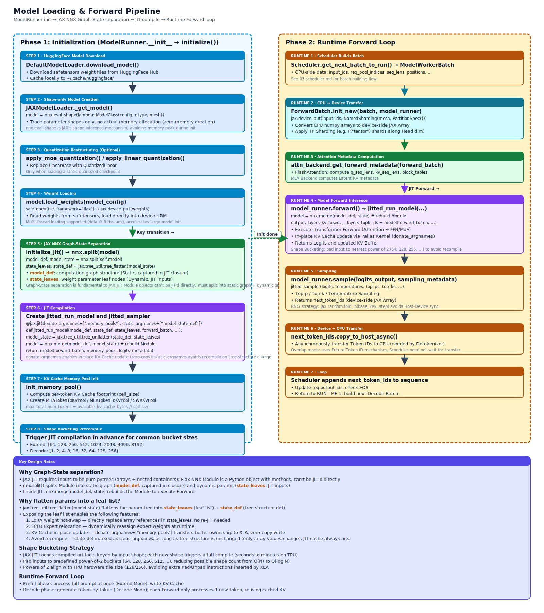

# Model Executor

## Module Overview

The model executor is responsible for converting the batch built by the Scheduler into actual model forward inference. It contains the full pipeline of model loading, JIT compilation, shape bucketing, forward inference execution, and sampling. Core components include `ModelRunner` (model initialization and JIT forward management), `ModelWorker` (TP worker, bridging Scheduler and ModelRunner), `ForwardBatch` (device-side JAX pytree), and the model loaders (HuggingFace weight download and conversion).



Core files involved:

- `model_executor/model_runner.py` — `ModelRunner`, model initialization, JIT compilation, KV Cache pool allocation
- `model_executor/compilation_manager.py` — `CompilationManager`, an independent compilation manager that manages the compilation and caching of `prefill`/`decode`/`extend` functions
- `model_executor/forward_batch_info.py` — `ForwardBatch` JAX pytree, `ForwardMode` enum, `CaptureHiddenMode`
- `srt/memory_profiler.py` — Memory profiling and debugging
- `managers/tp_worker.py` — `ModelWorker`, TP worker, `ModelWorkerBatch → ForwardBatch` conversion
- `managers/tp_worker_overlap_thread.py` — `ModelWorkerClient`, asynchronous forward in Overlap mode
- `model_loader/loader.py` — `JAXModelLoader`, HuggingFace weight loading
- `model_loader/arch.py` — Mapping from HuggingFace architectures to model classes

## Prerequisite Reading

- [01-architecture-overview](01-architecture-overview.md) — System overview and three-level batch conversion
- [03-scheduler](03-scheduler.md) — Scheduler and `ModelWorkerBatch` construction

---

## 4.1 ModelRunner Overview

`ModelRunner` (`model_executor/model_runner.py`) inherits from `BaseModelRunner` (an empty base class) and is the core engine of model inference.

**Key constructor parameters**:

| Parameter | Description |
|------|------|
| `model_config` | Model configuration |
| `mem_fraction_static` | Static memory fraction (used to compute KV Cache available space) |
| `tp_size` | Tensor Parallel degree |
| `dp_size` | Data Parallel degree |
| `mesh` | JAX Device Mesh |
| `is_draft_worker` | Whether this is a speculative-decoding draft worker |

**Key attributes set in `__init__()`**:

- `use_mla_backend` — True when `model_config.attention_arch == AttentionArch.MLA`
- `attention_tp_size` — The actual Tensor Parallel width on the attention side, equal to `tp_size // dp_size`
- `spec_algorithm` — Speculative decoding algorithm type
- `forward_pass_id` — Monotonically increasing forward call counter
- `model_loader` — Loader instance obtained via `get_model_loader()`

The constructor calls `self.initialize()` at the end to launch the full initialization flow.

---

## 4.2 Initialization Flow

`initialize()` is the core initialization method of `ModelRunner`, executing the following steps in order:

```text
initialize()
  ├── 1. Set JAX matmul precision (GPU scenario)
  ├── 2. Create Sampler instance
  ├── 3. get_available_device_memory() — Probe device available memory
  ├── 4. init_attention_backend() — Create the attention backend
  ├── 5. load_model() — Model weight loading and instantiation
  ├── 6. Detect Hybrid SWA models
  ├── 7. Initialize LoRA (if enabled)
  ├── 8. initialize_jit() — NNX Graph-State split and JIT compilation
  ├── 9. init_memory_pool() — KV Cache memory pool allocation
  └── 10. init_routed_experts_capturer() — EPLB Expert routing capture
```

### 4.2.1 Device Memory Probing

`get_available_device_memory()` queries each device type for available memory:

| Device | Memory Query Method |
|------|------------|
| TPU | `dev.memory_stats()["bytes_limit"] - dev.memory_stats()["bytes_in_use"]` |
| Pathways (Proxy) | `jax.live_arrays()` usage vs. hard-coded HBM ceiling (v5p=95GB, v5e=16GB, v6e/v4=32GB, v7=96GB) |
| GPU/CUDA | `dev.memory_stats()` |
| CPU | `psutil.virtual_memory().available` |

In multi-device scenarios, `jax.lax.pmin` is used to take the global minimum available memory.

### 4.2.2 Attention Backend Initialization

`init_attention_backend()` selects a backend based on configuration:

| Backend | Selection Condition |
|---------|---------|
| `NativeAttention` | CPU or explicitly specified `"native"` |
| `MLAAttentionBackend` | Backend is `"fa"` and the model is MLA architecture |
| `FlashAttention` | Backend is `"fa"` or `"fa_mha"`, the default high-performance TPU backend |

`fa_mha` is the non-absorbed MLA mode (Non-absorbed MLA), where Latent KV is decompressed into full Q/K/V and then standard MHA FlashAttention is used.

---

## 4.3 Model Loading


### 4.3.1 Loader Hierarchy

```text
BaseModelLoader (ABC)
  ├── DefaultModelLoader — HuggingFace model download
  │     └── JAXModelLoader — Weight loading and NNX Module instantiation (production)
  └── JAXDummyModelLoader — Creates only the model structure without loading real weights (debugging/profiling)
```

**Factory function** `get_model_loader(load_config, mesh)` selects a loader based on `LoadFormat`.

### 4.3.2 JAXModelLoader Loading Pipeline

`JAXModelLoader._get_model()` runs the core loading flow:

**Step 1 — Shape-only model creation**:

```python
model = nnx.eval_shape(
    lambda: model_class(config, dtype=model_config.dtype, mesh=self.mesh)
)
```

`nnx.eval_shape()` only traces parameter shapes without allocating real memory, achieving zero-memory model-structure creation.

**Step 2 — Quantization structure adjustment** (only for static-quantization checkpoints):

For the shape-only model, call `apply_moe_quantization()` and `apply_linear_quantization()` to replace `LinearBase` with `QuantizedLinear`, so the model structure matches the quantized weights.

**Step 3 — Weight loading**:

Call `model.load_weights(model_config)`; each model class implements its own weight-loading logic. Underneath, `safe_open(file, framework="flax")` is used to read safetensors files, with multi-threaded loading (default 8 threads).

### 4.3.3 Architecture Discovery

`get_model_architecture()` in `model_loader/arch.py` reads the architecture name from HuggingFace `config.json`'s `architectures` field, then looks up the corresponding model class via `ModelRegistry`. If no native implementation is found, it falls back to `TransformersForCausalLM` (HuggingFace Transformers backend).

---

## 4.4 JIT Compilation Strategy

### 4.4.1 NNX Graph-State Split

`initialize_jit()` uses Flax NNX's functional Split/Merge pattern to split the model into two parts:

```python
model_def, model_state = nnx.split(self.model)
self.model_state_leaves, model_state_def = jax.tree_util.tree_flatten(model_state)
```

| Component | Type | Role |
|------|------|------|
| `model_def` | `GraphDef` | Computation-graph structure, captured in the JIT closure (static) |
| `model_state_leaves` | `list[jax.Array]` | Weight parameter leaf nodes, served as dynamic inputs to the JIT function |
| `model_state_def` | `PyTreeDef` | Parameter-tree definition, marked as `static_argnames` |

**Why is Graph-State split needed?** This is a fundamental constraint of JAX: `jax.jit` requires inputs to be pure pytrees (arrays and their nested containers). A Flax NNX `Module` is a Python object with methods and mutable state, and cannot be passed to JIT directly. `nnx.split()` decomposes the module into a static computation-graph definition (`model_def`, captured in the JIT closure) and dynamic parameter leaves (`model_state_leaves`, the array inputs to JIT), thus crossing the JIT boundary. Inside the JIT function, `nnx.merge(model_def, state)` rebuilds the module to perform the forward.

The additional `jax.tree_util.tree_flatten(model_state)` step is not the minimum NNX requirement, but a deliberate architectural choice — flattening parameters into the leaf list `self.model_state_leaves` exposes them externally. This enables the following features:

1. **LoRA weight hot-swap** — Directly replacing the corresponding array references in `model_state_leaves` switches LoRA adapters without re-JIT compilation
2. **EPLB Expert relocation** — Expert Parallel Load Balancing dynamically reassigns expert weights at runtime, implemented by modifying leaf nodes
3. **In-place KV Cache updates** — Via `donate_argnames=["memory_pools"]`, ownership of the entire `MemoryPools` wrapper is transferred to XLA, so its aggregated full / SWA / recurrent KV buffers all enjoy zero-copy in-place writes. Note that only the KV Cache is donated; model weights remain unchanged.
4. **Avoiding recompilation** — `model_state_def` (the tree-structure definition) is marked as `static_argnames`; as long as the parameter tree structure is unchanged (only the array values change), the JIT cache always hits

### 4.4.2 The Three JIT Functions

| JIT Function | Use | Key Parameters |
|---------|------|---------|
| `jitted_run_model` | Model forward inference | `donate_argnames=["memory_pools"]`, `static_argnames=["model_state_def"]` |
| `jitted_sampler` | Sampling | `static_argnames=["sampler_state_def", "use_sort_for_toppk_minp"]` |
| `jitted_compute_logprobs` | Logprob computation | `static_argnames=["mesh"]` |

`jitted_run_model` internal flow: unflatten `model_state_leaves` into a state tree → rebuild the model via `nnx.merge(model_def, state)` → call `model(forward_batch, memory_pools, logits_metadata)`. The model fetches sub-pools by name from `memory_pools` (such as `token_to_kv_pool`, `swa_kv_pool`, recurrent pool, etc.); the returned updated arrays are passed back to ModelRunner as a `{"token_to_kv_pool": layers_kv_fused, ...}` dict, and `self.memory_pools.replace_all(pool_updates)` writes them back.

### 4.4.3 RNG Strategy

The Sampler derives RNGs inside JIT via `jax.random.fold_in(base_rng_key, step)`. `base_rng_key` is captured as a constant in the JIT closure; `step` is a pure Python counter `_sampler_step` that increments on each `sample()` call. This avoids the host-device synchronization overhead that `jax.random.split` would impose.

---

## 4.5 Shape Bucketing and Pre-compilation

### 4.5.1 Padding Buckets

Pad inputs to predefined bucket sizes to avoid JAX JIT recompiling for each different shape:

**Why is shape bucketing needed?** `jax.jit` keys its compilation cache by input shape. Each new shape triggers a full XLA compilation (typically seconds to minutes on TPU). Inference request input lengths are almost never repeated, so without padding, compilation cache hit rate approaches zero.

**Why powers of 2?** Powers of 2 compress the possible shape count from O(N) to O(log N). Compared with arithmetic sequences (e.g., 64, 128, 192, ...), powers of 2 give larger steps in the long-sequence range, with at most ~50% wasted compute in the worst case (near a bucket's upper bound), yet very few compilation variants (15 buckets cover 64 to 1M). In addition, the TPU's hardware tile size (typically 128 or 256) is itself a power of 2; padding to an aligned value avoids XLA inserting extra Pad/Unpad instructions.

**Why is the smallest bucket 64 instead of smaller?** Requests below 64 tokens are rare in production (even a sentence has at least a dozen tokens), and TPU VMEM tile operations typically work in units of 128 elements; inputs below 64 yield very low hardware utilization.

```python
PADDING_BUCKETS = [1 << i for i in range(6, 21)]
# = [64, 128, 256, 512, 1024, 2048, 4096, 8192, 16384, 32768, 65536,
#    131072, 262144, 524288, 1048576]
```

### 4.5.2 Pre-compilation

At startup, JIT compilation is triggered ahead of time for common bucket sizes to reduce first-request latency. The pre-compilation flow is independently managed by `CompilationManager` (`model_executor/compilation_manager.py`), which is responsible for managing the compilation triggers and caching of JIT functions like `prefill`/`decode`/`extend`:

| Pre-compilation Target | Default Padding Values |
|-----------|----------------|
| Extend (token dimension) | `[64, 128, 256, 512, 1024, 2048, 4096, 8192]` |
| Decode (batch dimension) | `[1, 2, 4, 8, 16, 32, 64, 128, 256]` |

Pre-compilation uses `generate_model_worker_batch()` to generate synthetic data, including a valid region (real input) and an invalid region (padding), simulating the structure of a real batch. Valid `out_cache_loc` starts from 1 (0 is the dummy slot); invalid is `-1`.

`CompilationManager.precompile_all()` is the main entry point of pre-compilation; it iterates the bucket list and calls `jitted_run_model` once for each (mode, padding_size) combination, triggering XLA compilation and populating the cache. `register_variant_if_new()` registers compilation variants dynamically at runtime as new shapes appear, avoiding redundant compilation.

> The compilation cache is maintained only in process memory (JAX/XLA limitations prevent cross-process persistence); restarting the service requires re-running pre-compilation.

---

## 4.6 ForwardBatch

`ForwardBatch` (`model_executor/forward_batch_info.py`) is the data carrier for device-side forward inference.

### 4.6.1 Three-Level Batch Conversion

```text
ScheduleBatch → ModelWorkerBatch → ForwardBatch
  (Scheduler,      (TP Worker,        (ModelRunner,
   per-DP CPU       CPU→device         device-side
   schedule data)   transition)        JAX arrays)
```

`ScheduleBatch` on the Scheduler side keeps `reqs_info: list[ScheduleReqsInfo]` holding requests and batch arrays per DP rank. `ModelWorkerBatch` arranges these per-DP containers into execution-side input. `ForwardBatch` then places the arrays on the `(data, tensor)` mesh: the `data` axis carries DP ranks, and the `tensor` axis carries the tensor-parallel shards within each DP rank.

### 4.6.2 ForwardMode Enum

| Value | Description | `is_extend()` | `is_decode()` |
|----|------|:---:|:---:|
| `EXTEND` | New-sequence prefill / continuation after prefix-cache hit | ✓ | |
| `DECODE` | Token-by-token generation | | ✓ |
| `MIXED` | Contains both extend and decode (Chunked Prefill) | ✓ | |
| `IDLE` | Idle worker | | |
| `TARGET_VERIFY` | Speculative decoding target verification | ✓ | |
| `DRAFT_EXTEND` | Speculative decoding draft extension | ✓ | |
| `DUMMY_FIRST` | Dummy batch used to bootstrap the Overlap Scheduler pipeline | | |

### 4.6.3 ForwardBatch Fields

Registered as a JAX pytree via `@register_pytree_node_class`, distinguishing dynamic fields (children, JIT-traced) from static fields (aux data, not traced). Dynamic fields include device-side arrays such as `input_ids`, `req_pool_indices`, `seq_lens`, `positions`, `cache_loc`, `out_cache_loc`, `extend_prefix_lens`/`extend_seq_lens`, `spec_info`, `expert_location_metadata`, `input_embedding`, `mrope_positions`, etc. Static fields include scalars/enums such as `forward_mode`, `batch_size`, `spec_algorithm`, `capture_hidden_mode`.

### 4.6.4 init_new()

`ForwardBatch.init_new(batch, model_runner)` converts a CPU-side `ModelWorkerBatch` into a device-side `ForwardBatch`:

1. For core arrays, call `device_array()` (i.e., `jax.device_put`) with `NamedSharding(mesh, PartitionSpec())` sharding; arrays with a batch dimension keep the DP dimension to match the `data` axis
2. Process multimodal fields (`input_embedding`, `mrope_positions`), casting to `jnp.bfloat16`
3. Fetch `expert_location_metadata` from the global singleton
4. For encoder-only models (such as UMT5), automatically generate `attention_mask`

---

## 4.7 TP Worker

### 4.7.1 ModelWorker (Normal Mode)

`ModelWorker` (`managers/tp_worker.py`) is the Tensor Parallel model worker, bridging the Scheduler and the ModelRunner.

**Key constructor behavior**:

1. Create `ModelConfig` and `ModelRunner`, passing in `dp_size` and the `(data, tensor)` mesh
2. Synchronize random seeds across TP workers via `broadcast_one_to_all`
3. Compute `max_running_requests`: `min(server_limit, pool_limit, attn_backend_limit)`
4. Set the pre-compilation padding list via `CompilationManager`
5. Start the background `sync_expert_ids_d2h_thread` thread

**`forward_batch_generation()` main flow**:

```text
1. Prepare LoRA batch (if needed)
2. ForwardBatch.init_new() — CPU → device data movement
3. attn_backend.get_forward_metadata() — Compute attention metadata
4. SamplingMetadata.from_model_worker_batch() — Build sampling metadata
5. model_runner.forward() — Model forward inference
   → returns (logits_output, cache_miss_count, layers_topk_ids)
6. model_runner.sample() — Sampling
7. Post-processing (logprobs D2H transfer, etc.)
→ returns (logits_output, next_token_ids_device, cache_miss_count)
```

### 4.7.2 ModelWorkerClient (Overlap Mode)

`ModelWorkerClient` (`managers/tp_worker_overlap_thread.py`) wraps `ModelWorker` with asynchronous execution, achieving pipeline overlap between scheduling and forward via a background thread.

**Future Token ID mechanism**:

A future token ID is a "cross-thread promise" in Overlap mode: the forward thread promises to later write the real token to `future_token_ids_map[i]`; the Scheduler thread receives the negative index `-i` and immediately continues building the next batch, without blocking on the device. Negative numbers are used because legal token IDs are always non-negative — a single `input_ids < 0` check in JIT, plus `jnp.where`, suffices to redirect the placeholders to real values, with no host-device synchronization in the entire resolution path.

In implementation, the Scheduler and forward threads cooperate as follows:

1. `forward_batch_generation()` does not wait for the model result and immediately returns **negative placeholder token IDs**: `np.arange(-(ct+1), -(ct+1+bs), -1)`
2. Work items are passed to the forward thread via `input_queue`
3. After the forward thread finishes, `set_future_token_ids()` writes the real token IDs into `future_token_ids_map` (a device-side `jnp.zeros` array)
4. Before the next forward, `resolve_future_token_ids()` replaces the negative indices in `input_ids` with real token IDs
5. The Scheduler obtains the actual result from `output_queue` via `resolve_last_batch_result()`

```text
Scheduler thread                  Forward thread
     │                                  │
     │── forward_batch_generation() ──→ │
     │    returns future_token_ids [-1,-2] │
     │                                  │── model.forward()
     │── Build next batch ─────────────→ │── sample()
     │    (uses future_token_ids)         │── set_future_token_ids()
     │                                  │── output_queue.put()
     │── resolve_last_batch_result() ──→ │
     │    fetch previous round's real result │
```

---

## 4.8 Forward Execution Flow

`ModelRunner.forward()` → `_forward_raw()` → `_forward()`:

1. Set up the mesh context (compatible with jax 0.6.3 `use_mesh` and 0.7.1+ `set_mesh`). The Data Parallel scenario uses the `(data, tensor)` mesh; attention's TP width is `attention_tp_size = tp_size // dp_size`. When `--enable-sequence-parallel` is enabled, row-parallel Linears (such as `o_proj`, `down_proj`) reduce-scatter along the `"tensor"` axis on the specified `output_scatter_dimension`. `should_scatter()` in `srt/utils/parallel_utils.py` checks the per-device shard size (`global_config.tpu_scatter_min_local_size`) and divisibility before deciding whether it actually takes effect.
2. Call `jitted_run_model(forward_batch, logits_metadata)` to run the JIT-compiled forward
3. Internally: `nnx.merge(model_def, state)` rebuilds the model → `model(forward_batch, memory_pools, logits_metadata)`
4. Returns `(output, layers_kv_fused, _, layers_topk_ids)`
5. `memory_pools.replace_all(pool_updates)` — Write the updated buffers of each sub-pool back

The standard tuple structure returned by the model forward:

| Position | Content | Description |
|------|------|------|
| `[0]` | `LogitsProcessorOutput` | Logits and sampling-related output |
| `[1]` | `layers_kv_fused` | Updated KV Cache buffers per layer |
| `[2]` | `callback_flag` | `True` for MoE models |
| `[3]` | `layers_topk_ids` | MoE expert routing IDs (`None` for dense models) |

---

## 4.9 Memory Profiling and KV Cache Allocation

`cell_size` is the byte size that a single token occupies across all layers and KV heads — the basic unit for converting "available HBM" into "number of tokens that can be held". `max_total_num_tokens = available_kv_cache_bytes // cell_size` directly determines the capacity of `ReqToTokenPool` and `TokenToKVPoolAllocator`, as well as the total budget of `PrefillAdder`. The exact formula depends on the model architecture: standard MHA/GQA uses `num_kv_heads × align128(head_dim) × 2 × num_layers × dtype_size` (`×2` accounts for K/V; `align128` matches TPU MXU/VMEM tile boundaries); Absorbed MLA (DeepSeek V3) only caches the latent representation, so there is no `×2`, and the latent segments are aligned to 128 independently and the pool is fully replicated.

### 4.9.1 Memory Pool Initialization

`init_memory_pool()` creates the corresponding pool and allocator based on the model type:

| Model Type | KV Pool | Allocator |
|---------|---------|-----------|
| Standard MHA/GQA | `MHATokenToKVPool` | `TokenToKVPoolAllocator` (page_size=1) or `PagedTokenToKVPoolAllocator` |
| Absorbed MLA | `MLATokenToKVPool` | Same as above |
| Hybrid SWA | `SWAKVPool` (dual pool) | `SWATokenToKVPoolAllocator` (dual allocator) |

Hybrid SWA models allocate Full-Attention and SWA pool sizes proportionally via `set_num_token_hybrid()`:

```text
swa_tokens × swa_layers + full_tokens × full_layers = total_tokens
full_tokens × swa_full_tokens_ratio = swa_tokens
```

### 4.9.2 Memory Debugging Tools

`memory_profiler.py` provides diagnostic-level memory profiling (not for KV Cache capacity computation):

- Enabled via the `ENABLE_MEMORY_PROFILING=1` environment variable
- Records tensor memory usage of each layer
- Saves `.prof` snapshots (via `jax.profiler.save_device_memory_profile()`)
- Generates text and JSON reports

---

## Key Interface Reference

| Interface | Location | Description |
|------|------|------|
| `ModelRunner.__init__()` | `model_executor/model_runner.py` | Model initialization, triggers `initialize()` |
| `ModelRunner.initialize_jit()` | `model_executor/model_runner.py` | NNX Split/Merge and JIT compilation |
| `ModelRunner.forward()` | `model_executor/model_runner.py` | Forward inference entry |
| `ModelRunner.sample()` | `model_executor/model_runner.py` | Sampling entry |
| `ModelRunner.init_memory_pool()` | `model_executor/model_runner.py` | Create KV Cache pool and allocator |
| `ModelRunner.profile_max_num_token()` | `model_executor/model_runner.py` | Compute the max number of tokens KV Cache can hold |
| `CompilationManager` | `model_executor/compilation_manager.py` | Independent compilation manager (manages prefill/decode/extend compilation and cache) |
| `CompilationManager.precompile_all()` | `model_executor/compilation_manager.py` | Pre-compilation entry (iterates bucket list to trigger JIT compilation) |
| `CompilationManager.register_variant_if_new()` | `model_executor/compilation_manager.py` | Dynamically register compilation variants by shape at runtime |
| `ModelWorkerBatch` | `managers/schedule_batch.py` | Scheduler-to-worker batch transition structure (with per-DP arrays) |
| `ForwardBatch` | `model_executor/forward_batch_info.py` | Device-side forward data (registered as a JAX pytree) |
| `ForwardBatch.init_new()` | `model_executor/forward_batch_info.py` | `ModelWorkerBatch → ForwardBatch` (CPU → device) |
| `ForwardMode` | `model_executor/forward_batch_info.py` | Forward mode enum |
| `CaptureHiddenMode` | `model_executor/forward_batch_info.py` | Hidden states capture mode enum |
| `ModelWorker` | `managers/tp_worker.py` | TP model worker (bridges Scheduler and ModelRunner) |
| `ModelWorker.forward_batch_generation()` | `managers/tp_worker.py` | Synchronous forward + sampling execution |
| `ModelWorkerClient` | `managers/tp_worker_overlap_thread.py` | Overlap-mode worker (forward in a background thread) |
| `ModelWorkerClient.forward_batch_generation()` | `managers/tp_worker_overlap_thread.py` | Asynchronous forward, returns future token IDs |
| `ModelWorkerClient.resolve_last_batch_result()` | `managers/tp_worker_overlap_thread.py` | Fetch the previous round's actual forward result |
| `JAXModelLoader._get_model()` | `model_loader/loader.py` | Shape-only creation + weight loading pipeline |
| `get_model_architecture()` | `model_loader/arch.py` | Mapping from HuggingFace architecture name to model class |
