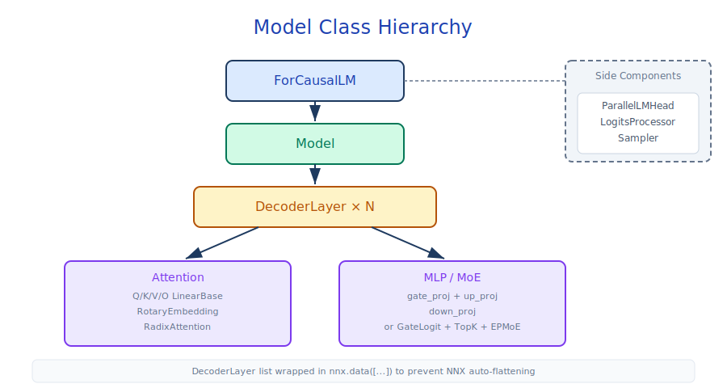

# Model Implementations

## Module Overview

This module covers the Flax NNX implementations of all model families in sglang-jax. Through the `ModelRegistry` auto-discovery mechanism, the system automatically selects the corresponding model class based on the `architectures` field of the HuggingFace config. All models follow a unified nested structure: `ForCausalLM → Model → DecoderLayer → Attention + MLP`, supporting both Dense and MoE architectures.



Core files involved:

- `models/registry.py` — `ModelRegistry` auto-discovery and registration
- `models/*.py` — Implementations of each model family (see the "All registered models" table in §5.1.3 for details)
- `configs/model_config.py` — `ModelConfig` configuration
- `utils/weight_utils.py` — `WeightMapping` mapping rules and `WeightLoader` weight loading utilities

## Prerequisite Reading

- [04-model-executor](04-model-executor.md) — Model loading and JIT compilation
- [06-layers-and-attention](06-layers-and-attention.md) — Foundational compute layers used by models

---

## 5.1 Model Registry

`ModelRegistry` (`models/registry.py`) maps HuggingFace `architectures` names to model implementation classes via Python module auto-discovery.

### 5.1.1 Auto-Discovery Flow

`import_model_classes()` (an `@lru_cache` singleton) performs a two-stage discovery:

1. Use `pkgutil.iter_modules()` to scan all Python modules under the `sgl_jax.srt.models` package
2. For each module, attempt `importlib.import_module()` and check whether an `EntryClass` attribute is defined

`EntryClass` may be:

- **A single class** — e.g., `EntryClass = Qwen3MoeForCausalLM`, registered under `cls.__name__` as the architecture key
- **A list of classes** — e.g., `EntryClass = [LlamaForCausalLM, Phi3ForCausalLM, InternLM3ForCausalLM]`, with each class registered independently

### 5.1.2 Architecture Resolution

`_ModelRegistry.resolve_model_cls(architectures)` accepts the `architectures` list from HuggingFace `config.json` and returns the first matching model class. If no native implementation exists, it automatically appends `"TransformersForCausalLM"` as a fallback.

### 5.1.3 All Registered Models

| Module File | EntryClass | Architecture Name |
|-------------|------------|-------------------|
| `llama.py` | `[LlamaForCausalLM, Phi3ForCausalLM, InternLM3ForCausalLM]` | Llama / Phi3 / InternLM3 |
| `qwen.py` | `QWenLMHeadModel` | Qwen 1.x |
| `qwen2.py` | `Qwen2ForCausalLM` | Qwen 2.x |
| `qwen3.py` | `Qwen3ForCausalLM` | Qwen 3.x |
| `qwen2_moe.py` | `Qwen2MoeForCausalLM` | Qwen2 MoE |
| `qwen3_moe.py` | `Qwen3MoeForCausalLM` | Qwen3 MoE |
| `gemma2.py` | `Gemma2ForCausalLM` | Google Gemma 2 |
| `deepseek_v3.py` | `[DeepseekV3ForCausalLM, DeepseekV2ForCausalLM]` | DeepSeek V3/V2 |
| `grok.py` | `Grok1ForCausalLM` | xAI Grok |
| `glm4_moe.py` | `Glm4MoeForCausalLM` | GLM-4 MoE |
| `glm5_moe.py` | `[Glm5ForCausalLM, GlmMoeDsaForCausalLM]` | GLM-5 / 5.1 MoE (DSA Indexer path) |
| `mimo.py` | `MiMoForCausalLM` | MiMo base model |
| `mimo_mtp.py` | `MiMoMTPForCausalLM` | MiMo V1 Multi-Token Prediction Draft |
| `mimo_v2_nextn.py` | `MiMoV2MTPForCausalLM` | MiMo V2.5-Pro NextN/MTP Draft (single layer) |
| `mimo_v2_flash.py` | `[MiMoV2FlashForCausalLM]` | MiMo V2 Flash |
| `mimo_v2_pro.py` | `MiMoV2ForCausalLM` | MiMo V2 Pro |
| `bailing_moe.py` | `[BailingMoEForCausalLM, BailingMoeForCausalLM, BailingMoeV2ForCausalLM]` | Bailing MoE |
| `bailing_moe_linear.py` | `BailingMoeV2_5ForCausalLM` | Bailing MoE V2.5 / Ling-2.6-flash (GQA + Linear Attention hybrid) |
| `kimi_linear.py` | `KimiLinearForCausalLM` | Kimi Linear (KDA + MLA hybrid recurrent) |
| `llama_eagle3.py` | `[LlamaForCausalLMEagle3]` | EAGLE3 Draft model |
| `umt5.py` | `[UMT5EncoderModel, UMT5DecoderModel, UMT5Model, UMT5ForConditionalGeneration]` | UMT5 encoder-decoder (Encoder entry commonly used for multimodal text encoding) |

---

## 5.2 Common Structure of Model Classes

All models follow the same NNX Module nesting hierarchy:

```text
ForCausalLM (top level, nnx.Module)
  ├── Model (Transformer body)
  │   ├── Embed (embed_tokens)
  │   └── DecoderLayer × N (wrapped in nnx.data([...]))
  │       ├── input_layernorm (RMSNorm)
  │       ├── Attention (Q/K/V/O LinearBase + RotaryEmbedding + RadixAttention)
  │       ├── post_attention_layernorm (RMSNorm)
  │       └── MLP (gate_proj + up_proj + down_proj) or MoE (GateLogit + TopK + EPMoE)
  ├── ParallelLMHead or Embed (tie_word_embeddings)
  ├── LogitsProcessor
  └── Sampler (held externally)
```

**Key conventions**:

- The DecoderLayer list is wrapped with `nnx.data([...])` to prevent NNX from auto-flattening it. By default, NNX recursively decomposes list/dict attributes inside Modules into independent submodules, causing each DecoderLayer to be registered as a separate parameter path. `nnx.data()` marks the list as opaque data, preserving the logical "list of layers" structure so that `for layer in self.layers` Python loops unroll correctly under JIT
- Every model class must implement the `load_weights(model_config)` method
- The forward method takes `(forward_batch, memory_pools, logits_metadata)` parameters; the model retrieves the required KV sub-pools by name from `memory_pools` (standard models use `memory_pools.token_to_kv_pool`; SWA / hybrid recurrent models retrieve `swa_kv_pool` / recurrent pool as needed)
- Forward returns a `(output, layers_kv_fused, callback_flag, layers_topk_ids)` tuple

### 5.2.1 General Forward Pass Flow

Using Llama as a representative example:

1. `LlamaModel.__call__` — Embedding → N × DecoderLayer → Final Norm
2. Each `LlamaDecoderLayer` — Pre-Norm → Self-Attention (with RoPE + RadixAttention) → Residual Add → Post-Norm → MLP → Residual Add
3. `LlamaForCausalLM.__call__` — Project hidden states to vocabulary space via `LogitsProcessor`

---

## 5.3 Weight Loading Pattern

Source: `srt/utils/weight_utils.py` (contains `WeightMapping` and `WeightLoader`)

safetensors is HuggingFace's weight serialization format (mmap + zero-copy on-demand tensor reads); virtually all open-source models are released in this format. However, the naming and layout inside still follow PyTorch conventions: a flat `state_dict` keyed by string paths, Linear weights stored as `[out, in]`, and TP shard axes following their own conventions. NNX uses nested pytrees + structured paths to express parameters, and matrices are laid out as `[in, out]`. Importing HF weights therefore requires three layers of translation — naming, layout, and sharding — handled by `WeightMapping` + `WeightLoader`.

`WeightMapping` is a set of declarative mapping rules that describe how to convert HuggingFace weights into the format required by NNX models: path renaming (e.g., `*.weight` → `*.scale`), shape transformations (e.g., Linear weight transposition), and sharding annotations (specifying TP shard axes). Each model class defines its own `WeightMapping` in its `load_weights()` method.

`WeightLoader` (`utils/weight_utils.py`) is the engine that performs the actual loading: it iterates over all weight tensors in safetensors files, performs path matching, transposition, dtype conversion, and TP sharding according to `WeightMapping` rules, and finally writes the processed weights to the corresponding parameter slots of the NNX model. For MoE models, `WeightLoader` also automatically stacks scattered per-expert weights into aggregated tensors.

### 5.3.1 WeightMapping Conventions

| HuggingFace Naming | NNX Naming | Transformation |
|--------------------|------------|----------------|
| `*.weight` (Linear) | `*.weight` | `transpose=True` (HF `[out, in]` → NNX `[in, out]`). HuggingFace follows PyTorch's `nn.Linear` convention, storing weights as `[out, in]` and transposing during compute. sglang-jax adopts the `[in, out]` layout so that `lax.dot_general(x, w)` requires no transpose, aligning with JAX's column-major compute convention |
| `*.weight` (Norm) | `*.scale` | Loaded directly |
| `*.weight` (Embedding) | `*.embedding` | Loaded directly |
| `self_attn.q_proj.weight` | Same path | `transpose=True`, `sharding=(None, "tensor")` |
| `self_attn.o_proj.weight` | Same path | `transpose=True`, `sharding=("tensor", None)` |
| `mlp.gate_proj.weight` | Same path | `transpose=True`, `sharding=(None, "tensor")` |
| `mlp.down_proj.weight` | Same path | `transpose=True`, `sharding=("tensor", None)` |

### 5.3.2 MoE Weight Loading

MoE models use `create_moe_weights_mapping()` to generate mappings:

- HuggingFace stores per-expert independent weights: `mlp.experts.0.gate_proj.weight`, `mlp.experts.1.gate_proj.weight`, ...
- sglang-jax aggregates them into a single tensor: `[num_experts, k, n]`
- The `__MOE_EXPERTS__` prefix marks aggregated loading mode; `WeightLoader` automatically stacks each expert's weights
- Supports EPLB `physical_to_logical_map` remapping

### 5.3.3 Special Handling

- **Head Padding** — Q/K/V projections of GQA models support `head_dim_padding=True` and `kv_head_padding=True` for head alignment under TP
- **FP8 Scale** — `weight_scale_inv` sidecar files for static-quantization checkpoints are mapped automatically
- **Post-load Hook** — e.g., DeepSeek V3's `post_load_weights()` splits `kv_b_proj` into absorbed projection matrices after loading

---

## 5.4 Dense Models In Detail

### 5.4.1 Llama Family

`models/llama.py` is the representative Dense model and serves as the base class for several other models:

- `Phi3ForCausalLM` and `InternLM3ForCausalLM` are empty subclasses (inheriting all Llama implementations)
- Supports EAGLE3 speculative decoding auxiliary hidden states capture (`capture_aux_hidden_states`)
- `set_eagle3_layers_to_capture()` defaults to capturing layers 2, num_layers//2, and num_layers-3

### 5.4.2 Qwen Family

- **Qwen3** (`qwen3.py`) — Standard Dense Transformer
- **Qwen2** (`qwen2.py`) — Underlying implementation for the MiMo base model (`MiMoForCausalLM` inherits from `Qwen2ForCausalLM`)
- **Qwen 1.x** (`qwen.py`) — Early Qwen architecture

### 5.4.3 Gemma 2

`models/gemma2.py` — Uses `GemmaRMSNorm` (`x * (1 + weight)` instead of `x * weight`) and supports logit soft-capping.

---

## 5.5 MoE Models In Detail

### 5.5.1 DeepSeek V3 — MLA + MoE

`models/deepseek_v3.py` is the most architecturally complex model, combining Multi-Latent Attention (MLA) and Mixture-of-Experts (MoE).

**Multi-Latent Attention (MLA)**:

DeepSeek V3 uses MLA in place of standard MHA, compressing the KV cache via low-rank latents (see [06-layers-and-attention](06-layers-and-attention.md#69-mla-attention-backend) for the concept). `DeepseekV3Attention` implements both Absorbed (`_forward_mqa()`, default) and Non-absorbed (`_forward_mha()`, fallback) compute paths.

**Absorbed MLA dataflow** (DeepSeek V3's specific projection structure):

```text
Q path:  hidden → q_a_proj → q_a_layernorm → q_b_proj → split(q_nope, q_rope)
KV path: hidden → kv_a_proj → split(compressed, k_rope_raw)
                     compressed → kv_a_layernorm

Post-load: kv_b_proj.weight → split → w_uk [R,n_h,D_k] + w_uv [R,n_h,D_v]

Forward: q_nope is projected to latent space via einsum("thd,rhd->thr", q_nope, w_uk)
         → MQA Attention (1 shared KV head, head_dim = kv_lora_rank + qk_rope_head_dim)
         → output is decompressed via einsum("thr,rhd->thd", o_latent, w_uv)
```

**MoE integration**:

- `first_k_dense_replace` and `moe_layer_freq` control whether each layer uses Dense MLP or MoE
- 256 experts, using `EPMoE` or `FusedEPMoE` (selected by `moe_backend` config)
- Supports shared experts (`DeepseekV3MLP`), with their output added to the routed expert results
- Uses the "noaux_tc" TopK routing method with `e_score_correction_bias`

**`patch_model_config()` Classmethod**:

DeepSeek V3 self-configures inside `ModelConfig._apply_model_specific_config()`:

```python
mc.attention_arch = AttentionArch.MLA
mc.head_dim = qk_nope_head_dim + qk_rope_head_dim
```

### 5.5.2 Qwen3 MoE

Differences between `models/qwen3_moe.py` and DeepSeek V3:

| Feature | DeepSeek V3 | Qwen3 MoE |
|---------|-------------|-----------|
| Attention | MLA (Absorbed/Non-absorbed) | Standard MHA + QK-Norm |
| QK-Norm | None | Per-head RMSNorm (`q_norm`, `k_norm`) |
| Shared Expert | Yes | No |
| Router Bias | `e_score_correction_bias` | None |
| Mixed Dense Layers | Controlled by `moe_layer_freq` | `mlp_only_layers` config list |

### 5.5.3 Other MoE Models

- **Grok** (`grok.py`) — xAI Grok, MoE architecture
- **Bailing MoE** (`bailing_moe.py`) — Bailing MoE, including v2 variants. `bailing_moe_linear.py` implements the v2.5 / Ling-2.6-flash GQA + Linear Attention hybrid architecture, registered independently as `BailingMoeV2_5ForCausalLM`

---

## 5.6 Special Models

### 5.6.1 EAGLE3 Draft Model

Source: `srt/models/llama_eagle3.py`, `srt/speculative/eagle_worker.py`

Speculative decoding is an acceleration technique that enlarges "decode one token per step" into "generate multiple candidate tokens per step": a lightweight draft model rapidly predicts the next k tokens, and the target model performs one forward pass to verify all k candidates simultaneously. Matched prefixes are accepted directly; mismatches fall back to the target model's own next token. Target output quality is unchanged, but throughput scales roughly ×k with hit rate. The EAGLE family is a representative approach: the draft model is not a separately trained small model but instead consumes hidden states from certain target layers as input — making it lighter and better aligned with the target. EAGLE3 is its third generation, requiring the target to capture auxiliary hidden states at designated layers and feed them to the draft (see `set_eagle3_layers_to_capture` in §5.4.1).

`hot_token_ids` (i.e., `d2t`, draft-to-target) is the index mapping from the draft vocabulary to the target vocabulary. To reduce LM Head and word-embedding overhead, draft models often cover only a "hot subset" of the target vocabulary (e.g., 32K vs 128K). They internally compute over a compact small vocabulary ID space, and the sampled IDs must be translated back to target vocabulary IDs via `d2t` before being passed to the target model for verification. `hot_token_ids` is defined in `models/llama_eagle3.py` as an `nnx.Param`, initialized to identity mapping, and loaded from the checkpoint's `d2t` field with the actual mapping table.

`models/llama_eagle3.py` is the lightweight Draft model for EAGLE3 speculative decoding.

**Architecture features**:

- Only 1 DecoderLayer (`num_hidden_layers` is forced to 1)
- `fc` (Fusion Layer): `LinearBase(hidden_size_in × 3, hidden_size)`, fusing 3 auxiliary hidden states from the target model
- Modified DecoderLayer: Q/K/V projection input is `2 × hidden_size` (concatenation of embedding + hidden states), with an additional `hidden_norm`
- `hot_token_ids` (`d2t`) parameter: mapping from draft vocabulary to target vocabulary

**Forward**: Embed → fetch `spec_info.hidden_states` → `fc` projection → single-layer Decoder (concat embed + hidden as input) → Norm → Logits

### 5.6.2 MiMo MTP

Multi-Token Prediction (MTP) is a technique to accelerate autoregressive generation: standard decode emits only 1 token per step, while MTP trains the model to predict multiple future tokens simultaneously. At inference time, the MTP model serves as the draft model for speculative decoding — it predicts multiple candidate tokens at once, which the target model verifies, compressing multi-step decode into fewer forward calls. Unlike EAGLE, which uses an independently structured draft model, MTP draft heads directly reuse most of the target model's parameters (Embedding, LM Head) and only add a lightweight fusion layer.

`models/mimo_mtp.py` is the MTP Draft model implementation for MiMo V1; `models/mimo_v2_nextn.py` is the single-layer Draft model for V2.5-Pro NextN/MTP, which loads the specified layer from `model_mtp.safetensors` via `config.mtp_layer_idx`. NextN models that need to load multiple instances layer-by-layer depend on the upstream-planned `MultiLayerDraftWorker`; on current main only `EagleDraftWorker` has landed, and multi-layer loading is not yet integrated.

**Architecture features**:

- A single `Qwen2DecoderLayer` as the compute core
- Dual-input fusion: `token_layernorm(embed)` ⊕ `hidden_layernorm(hidden)` → `input_proj` (`2×hidden → hidden`)
- `load_lm_head_from_target = True` — always loads the LM Head from the target model

---

## 5.7 Model Configuration

`ModelConfig` (`configs/model_config.py`) wraps the complete model configuration.

### 5.7.1 Key Enums

| Enum | Values | Description |
|------|--------|-------------|
| `AttentionArch` | `MLA=1`, `MHA=2` | Attention architecture type |
| `ModelImpl` | `AUTO`, `SGLANG`, `TRANSFORMERS` | Model backend selection |
| `MoEBackend` | `EPMOE`, `FUSED`, `AUTO` | MoE compute strategy. AUTO: choose FUSED on single device, EPMOE on multi-device |

### 5.7.2 Core Fields

| Field | Description |
|-------|-------------|
| `model_path` | HuggingFace model ID or local path |
| `hf_config` / `hf_text_config` | HuggingFace config |
| `attention_arch` | Attention architecture; default MHA, DeepSeek self-configures to MLA |
| `head_dim` / `v_head_dim` | Head dimension (overridden by MLA models) |
| `context_len` | Context length |
| `quantization_config` | Quantization config |
| `sliding_window` | Sliding Window Attention window size |

### 5.7.3 TP Support

- `configure_for_tensor_parallel(tp_size)` — Adjusts the KV head count for GQA models
- `needs_kv_head_replication(tp_size)` — Returns whether KV head replication is needed when `tp_size > total_num_kv_heads`
- `get_kv_padding_strategy()` — `"replicate"` for GQA, `"zero"` for MHA

### 5.7.4 Draft Model Architecture Rewriting

Source: `srt/configs/model_config.py`

The implementation needs of the same HuggingFace architecture often differ between "as Target" and "as Draft" roles — Draft typically removes the LM Head (provided by Target), changes input dimensions (receives Target's hidden states and concatenates with embedding), and forces the layer count to 1. Stuffing both into the same class explodes the branching, so sglang-jax writes separate variant classes, and `ModelConfig` rewrites `hf_config.architectures[0]` when `is_draft_model=True`, allowing `ModelRegistry.resolve_model_cls()` to automatically resolve to the Draft variant. The specific mappings are listed below:

| Original Architecture | Rewritten As |
|-----------------------|--------------|
| `DeepseekV3ForCausalLM` | `DeepseekV3ForCausalLMNextN` |
| `LlamaForCausalLM` | `LlamaForCausalLMEagle3` |
| `MiMoForCausalLM` | `MiMoMTPForCausalLM` (V1) |
| `MiMoV2ForCausalLM` | `MiMoV2MTPForCausalLM` (V2.5-Pro NextN) |

---

## Key Interface Reference

| Interface | Location | Description |
|-----------|----------|-------------|
| `import_model_classes()` | `models/registry.py` | Scan and import all model classes into the registry (`@lru_cache` singleton) |
| `ModelRegistry.get_supported_archs()` | `models/registry.py` | Return all registered architecture names |
| `ModelRegistry.resolve_model_cls()` | `models/registry.py` | Resolve architecture name to model class |
| `get_model_architecture()` | `model_loader/arch.py` | HuggingFace architecture to model class mapping |
| `ModelConfig` | `configs/model_config.py` | Model config wrapper |
| `ModelConfig._apply_model_specific_config()` | `configs/model_config.py` | Model self-config hook (`patch_model_config`) |
| `AttentionArch` | `configs/model_config.py` | Attention architecture enum (`MLA` / `MHA`) |
| `ModelImpl` | `configs/model_config.py` | Model backend enum (`AUTO` / `SGLANG` / `TRANSFORMERS`) |
| `MoEBackend` | `configs/model_config.py` | MoE compute strategy enum (`EPMOE` / `FUSED` / `AUTO`) |
| `model.load_weights()` | Each model file | Weight loading (implemented per model class) |
| `WeightMapping` | `utils/weight_utils.py` | HF → NNX weight mapping rules (paths, transpose, sharding) |
| `WeightLoader` | `utils/weight_utils.py` | Weight loading and sharding engine |
| `create_moe_weights_mapping()` | `layers/moe.py` | MoE weight mapping generation |
