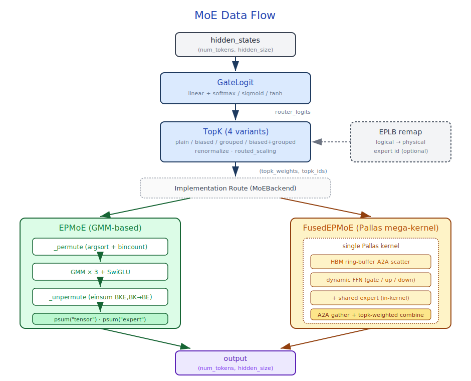

# Core Compute Layers and Attention Mechanisms

## Module Overview

This module covers all foundational compute layers and attention backends used during model forward inference, divided into three parts:

- **Foundational compute layers** — Tensor Parallel Linear, Embedding, LayerNorm, Activation, MoE
- **Attention backends** — Dispatching and implementations of FlashAttention / Native / MLA / Linear Attention
- **Output layers** — Logits processing and sampling

Core files involved:

- `layers/linear.py` — `LinearBase`, `QuantizedLinear`
- `layers/embeddings.py` — `Embed`, `ParallelLMHead`, `RotaryEmbedding` family
- `layers/layernorm.py` — `RMSNorm`, `GemmaRMSNorm`
- `layers/activation.py` — `GeluAndMul`
- `layers/moe.py`, `layers/fused_moe.py`, `layers/gate.py` — MoE layers
- `layers/radix_attention.py` — `RadixAttention` unified entrypoint
- `layers/attention/` — Attention backend implementations
- `layers/logits_processor.py` — `LogitsProcessor`
- `layers/sampler.py`, `sampling/` — Sampling strategies
- `eplb/` — Expert Parallel Load Balancing

## Prerequisite Reading

- [04-model-executor](04-model-executor.md) — ForwardBatch and the Forward flow
- [05-models](05-models.md) — How models compose these compute layers
- [08-pallas-kernels](08-pallas-kernels.md) — Underlying Pallas kernel implementations

---

## Part I — Foundational Compute Layers

### 6.1 Tensor Parallel Linear

Source: `layers/linear.py`

Unlike sglang-python, sglang-jax has **no** separate `ColumnParallelLinear` / `RowParallelLinear` classes. All linear layers uniformly use `LinearBase`, with TP sharding controlled via the `kernel_axes` parameter.

**`LinearBase(nnx.Module)`**:

| Parameter | Description |
|-----------|-------------|
| `input_size` / `output_size` | Input/output dimensions |
| `kernel_axes` | TP shard axes, e.g., `(None, "tensor")` or `("tensor", None)` |
| `use_bias` | Whether to use bias |
| `params_dtype` | Parameter dtype, default `jnp.bfloat16` |

- Weight shape: `(input_size, output_size)`, sharding `P(*kernel_axes)`
- `__call__(x)` uses `lax.dot_general` (instead of `jnp.dot`) because `lax.dot_general` supports explicit `out_sharding` specification, ensuring TP-sharded outputs are automatically placed on the correct device shards and avoiding redundant data resharding
- Returns a `(output, bias | None)` tuple

**TP sharding conventions**:

The core idea of Tensor Parallel is to split a large matrix multiplication `Y = X·W` across multiple devices for parallel computation, then merge the results. There are two ways to split, corresponding to two parallelism modes:

- **Column Parallel**: Split W along the **output dimension** (each device holds some columns of W). Each device multiplies the full X by its W slice to produce a portion of Y's columns. Local results require no communication. Suitable for Q/K/V/Gate/Up projections — their outputs are processed independently per head or channel by subsequent layers.
- **Row Parallel**: Split W along the **input dimension** (each device holds some rows of W). Each device multiplies the corresponding slice of X by its W slice to produce a partial sum, then performs AllReduce to obtain the full Y. Suitable for O/Down projections — they need to merge intermediate results scattered across devices back into the full hidden dimension.

| Layer Type | `kernel_axes` | Description |
|------------|--------------|-------------|
| Column Parallel (Q/K/V/Gate/Up) | `(None, "tensor")` | Output dimension sharded along TP axis |
| Row Parallel (O/Down) | `("tensor", None)` | Input dimension sharded along TP axis |

**Sequence Parallel option**: Both `LinearBase` and `QuantizedLinear` accept `output_scatter_dimension: int | None`. When `--enable-sequence-parallel` is enabled and a row-parallel layer explicitly passes this parameter, the output is reduce-scattered along the `"tensor"` axis on the specified dimension (replacing the default allreduce + full replicate), shrinking the inputs to subsequent per-token computations like Norm down to 1/`tp_size`. Whether the actual scatter happens is decided by `srt/utils/parallel_utils.py::should_scatter()` under `global_config.tpu_scatter_min_local_size` and divisibility constraints, falling back to the original spec when not satisfied. Currently integrated in `models/grok.py`.

**`QuantizedLinear(nnx.Module)`**:

Stores pre-quantized weight `weight_q` (shape `[output_size, input_size]`, transposed storage) and `weight_scale`.

- `from_linear()` — Class method, converts `LinearBase` into `QuantizedLinear`, supports static checkpoints and dynamic quantization
- Block-wise quantization: `weight_block_size=(block_n, block_k)`, scale is pre-expanded at initialization into kernel-ready format `[in_blocks, 1, n_out]`
- `__call__` — Calls the `xla_quantized_matmul_local` kernel via `shard_map`. In Row Parallel mode, the kernel performs the reduce internally

---

### 6.2 Embedding and Positional Encoding

Source: `layers/embeddings.py`

Transformer self-attention is order-agnostic with respect to tokens, so positional signals must be injected separately. RoPE no longer follows the old "add positional embeddings" route but instead applies position-dependent rotations directly to Q/K: it slices head_dim into 2D subspaces and rotates each pair of dimensions by `m·θ_i` based on position `m`, making the inner product `Q_m·K_n` depend only on relative offset `m-n`, with better extrapolation. `is_neox_style` distinguishes two layouts (Neox slices head_dim into "first half / second half" blocks for rotation; GPT-J pairs even/odd indices for rotation), mathematically equivalent but with different memory layouts — checkpoints and implementations must match, otherwise rotations would act on the wrong dimension pairs.

`apply_rotary_emb(x, cos, sin, is_neox_style)` is the core RoPE application function, choosing between split / stride dimension pairing strategies based on `is_neox_style`.

**`Embed(nnx.Module)`**:

- Embedding parameter shape `(num_embeddings, features)`, default sharding `P(None, "tensor")`
- `__call__` uses `embedding.at[inputs].get(out_sharding=...)` for sharded gather
- `attend(query)` — Computes `dot(query, embedding.T)`, used for weight tying

**`ParallelLMHead(Embed)`**:

- Default `kernel_axes=("tensor", None)` — vocabulary sharded along TP axis
- `tie_weights(embed_tokens)` — Shares parameters with the input embedding
- `__call__` is disabled (weights are used directly inside the Sampler)

**Rotary Position Embedding family**:

| Class | Use Case | Features |
|-------|----------|----------|
| `RotaryEmbedding` | Standard RoPE | Precomputed `inv_freq`, supports partial rotary |
| `Llama3RotaryEmbedding` | Llama 3 | Frequency-dependent scaling (Low/High Freq Wavelength Blending) |
| `YarnRotaryEmbedding` | DeepSeek V2/V3 | YaRN linear interpolation + `_rope_mscale` magnitude scaling |
| `MRotaryEmbedding` | Qwen2.5-VL | 3D Multi-dimensional RoPE (Time/Height/Width); `positions` is `[3, num_tokens]` |

`get_rope()` — Factory function with `_ROPE_DICT` cache, dispatching to the appropriate implementation based on `rope_scaling["rope_type"]`.

---

### 6.3 LayerNorm

Source: `layers/layernorm.py`

Traditional LayerNorm performs "subtract mean, divide by stddev, then affine" on the last dimension — `y = ((x - mean) / sqrt(var + ε)) * weight + bias`, requiring two statistics (mean, var) and two learnable parameters (scale + bias). RMSNorm simplifies this to scaling by root mean square only — `y = (x / sqrt(mean(x²) + ε)) * weight`, removing the mean subtraction and bias, halving parameters and saving one reduction pass. Its empirical rationale: in transformers, the key role of normalization in stabilizing activations comes mainly from "dividing by scale"; the effect of "subtracting the mean" is negligible. After dropping it, training stability barely changes while throughput improves noticeably. Llama, Qwen, DeepSeek, and other recent mainstream models all adopt RMSNorm in place of LayerNorm.

**`RMSNorm(nnx.Module)`**:

- Scale parameter shape `(num_features,)`, sharding `P(None,)` (fully replicated)
- Computation: `var = mean(x²)` → `x * rsqrt(var + ε) * scale`
- Promoted to float32 for compute, then restored to the original dtype. This is because BFloat16's effective precision is only ~3 decimal digits; `mean(x²)` and `rsqrt()` accumulate numerical errors at low precision, leading to training instability or inference drift
- Supports distributed mean (`lax.pmean`)

**`GemmaRMSNorm(nnx.Module)`**:

- Weight initialized to zero; normalization formula is `x * (1 + weight)` (rather than `x * weight`)
- Supports fused residual addition: an optional `residual` input is added before normalization

**Helper functions**:

- `rmsnorm_forward()` — Standalone functional RMSNorm, optional residual
- `dual_rmsnorm_forward()` — Dual RMSNorm sharing the residual path (used by specific model architectures)

---

### 6.4 Activation Functions

Source: `layers/activation.py`

**`GeluAndMul(nnx.Module)`**:

- `__call__(gate, up)` — Applies GELU activation (with optional tanh approximation) to `gate`, multiplied by `up`
- Returns a `(result, None)` tuple

Activation functions in MoE layers (SiLU/GELU) are applied inline within `EPMoE._gmm_compute()`: `jax.nn.silu(layer_w0)` or `jax.nn.gelu(layer_w0)`.

---

### 6.5 MoE Layers

Mixture-of-Experts (MoE) replaces a single FFN layer with N independent expert networks (typically 8-256) plus a router. Each token, after passing through the router, only activates the top-k experts (typically 2-8) for computation. This makes the total parameter count ≈ N × FFN, while the actual FLOPs per token ≈ k × FFN — letting model capacity scale linearly with N without significantly increasing compute. DeepSeek V3 pushes this to the extreme with 256 routed experts + top-8 + 1 shared expert.

Regardless of implementation, every MoE forward pass goes through four stages: **Routing → Dispatch → Expert FFN → Combine**.



The whole pipeline has three segments: the **routing layer** is globally shared, the expert compute layer has **two interchangeable implementations: EPMoE / FusedEPMoE**, and **EPLB** is a cross-cutting mechanism between routing and expert layers. Role-to-module mapping:

Source: `layers/gate.py`, `layers/moe.py`, `layers/fused_moe.py`, `kernels/gmm/`, `kernels/fused_moe/`, `eplb/`

#### 6.5.1 Routing Layer: Gate and TopK

The routing layer's job is to compute, from `hidden_states`, "which experts each token should go to" and "the weight for each expert". These two tasks are split into two steps — `GateLogit` produces only raw scores, and `TopK` handles selection + weighting — so they can evolve independently (e.g., DeepSeek noaux_tc affects TopK rather than Gate).

##### GateLogit

`GateLogit(nnx.Module)` (`layers/gate.py`):

- `kernel` shape `(input_size, num_experts)`, dtype `jnp.float32`, fully replicated (`P(None, None)`). `num_experts` is typically small (tens to hundreds); shard communication cost far exceeds replication cost.
- Optional `bias` (only enabled when `enable_expert_bias=True`, DeepSeek V3's `e_score_correction_bias`), used for auxiliary-loss-free load balancing — its special semantics are explained below.
- `score_func`: `"softmax"` / `"sigmoid"` / `"tanh"` / `None`.
- Computes `dot(hidden_states, kernel)` with `Precision.HIGHEST`.

##### Four TopK Variants

`TopK(nnx.Module)` (`layers/gate.py`) expands into four paths along two dimensions: "grouped or not × biased or not", progressively covering the routing strategies of Mixtral / DeepSeek V2 / DeepSeek V3:

| Variant | Selection Basis | Weight Source | Typical Users |
|---------|-----------------|---------------|---------------|
| Naive top-k | `logits` | `logits` | Mixtral |
| Biased top-k | `logits + bias` | `logits` (**bias removed**) | DeepSeek noaux_tc |
| Grouped top-k | First group score max → select `topk_group` groups, then top-k within group | `logits` | DeepSeek V2 |
| Biased + grouped | Group score = `sum(top-2 of biased)`, unselected groups set to `-inf` | `logits` (**bias removed**) | DeepSeek V3 |

Two key design points:

- **Bias semantics**: bias is a trainable penalty term used for load balancing, biasing cold experts to be selected more often; but it does not reflect the true token-expert affinity, so it **only participates in selection, not in weighting** — `take_along_axis(router_logits, ids)` explicitly fetches weights from the bias-free logits.
- **Engineering value of grouping**: under EP, if a group of experts corresponds to one EP rank (or a few), grouped routing **shrinks the cross-rank A2A scope to `topk_group` ranks**, reducing communication cost dramatically — this is key to DeepSeek V3 maintaining high throughput at large-scale EP.

##### Output Contract

Regardless of which path is taken, the routing layer's output is unified:

- `topk_weights : (num_tokens, top_k)` — already renormalized and scaled
- `topk_ids     : (num_tokens, top_k)` — physical expert ids

These two tensors are the **sole interface** between the routing and expert layers, which is what enables the EPMoE / FusedEPMoE pluggability.

#### 6.5.2 Expert Compute Layer: EPMoE and FusedEPMoE

After the routing layer produces `(topk_weights, topk_ids)`, the remaining work is to dispatch each token to its chosen experts, perform FFN (gate × up + SwiGLU + down), and combine weighted by topk_weights. This stage faces two engineering challenges: (1) the number of tokens each expert receives is dynamically skewed and cannot be expressed by a batched matmul directly; (2) when the expert count exceeds single-device capacity, dispatch must cross devices (A2A), which is the communication bottleneck in EP scenarios. EPMoE and FusedEPMoE solve these problems at different abstraction levels.

##### 6.5.2.1 EPMoE — GMM-based Expert Parallel

`EPMoE(nnx.Module)` (`layers/moe.py`) adopts the **replicate input + local compute + collective reduce** approach, converging cross-device communication into psum and avoiding explicit token A2A.

**Mesh reshape**. The model's `(data, tensor)` mesh is logically reorganized into `(expert, tensor)` at construction:

```python
self.tp_size = world_size // self.ep_size
self.experts_per_device = self.num_experts // self.ep_size
self.moe_mesh = jax.sharding.Mesh(devices.reshape(self.ep_size, self.tp_size), ...)
```

The physical device topology is unchanged; the same group of cards is just viewed under a different axis name. When `ep_size = 1`, it degenerates into pure TP; when `ep_size = world_size`, into pure EP. Inputs/outputs of the MoE layer are resharded back to the original mesh before/after forward.

**Weight layout**:

| Parameter | Shape | Sharding |
|-----------|-------|----------|
| `wi_0` (Gate) | `(num_experts, hidden, intermediate)` | `P("expert", None, "tensor")` |
| `wi_1` (Up) | Same as above | Same |
| `wo` (Down) | `(num_experts, intermediate, hidden)` | `P("expert", "tensor", None)` |

**Core kernel: MegaBlocks GMM**. EPMoE folds "small matmuls with different token counts per expert" into a single Grouped Matrix Multiply (`kernels/gmm/`, ported from `vllm-project/tpu-inference`):

```text
lhs:         (m, k)              # m rows already sorted by expert
rhs:         (E, k, n)
group_sizes: (E,)                # how many rows each expert occupies, ∑ = m
out[start_i:end_i] = lhs[start_i:end_i] @ rhs[i]
```

The GMM algorithm originates from the MegaBlocks paper (Gale et al. 2022) and uses **CSR-style metadata** scheduling (similar to sparse matrix row pointers) on Pallas/TPU, with a **store mask** to handle the boundary case where "two experts share the same tile". It directly digests the irregularity of token→expert distribution — **no token loss, no zero-padding, single kernel launch**; using batched matmul would require padding to the maximum token count (wasting FLOPs) or fixed capacity with token loss (losing accuracy).

**Forward pipeline** (inside `shard_map`):

```text
_permute    → argsort + bincount, reorder tokens by expert
_dispatch   → group_offset = rank * experts_per_device (scalar)
_gmm_compute → GMM(gate) → SwiGLU → GMM(up) → GMM(down)
_unpermute  → einsum("BKE,BK→BE") weighted merge of top-k
psum("tensor") → psum("expert")  # TP + EP double reduce
```

Cross-device communication is just the last two psums — this is the "soft A2A": every card sees all tokens but only computes non-zero outputs for its own expert segment; rows that don't hit are zeroed via GMM's `zero_initialize=True`, then merged with psum.

##### 6.5.2.2 FusedEPMoE — Pallas Fused Mega-Kernel

`FusedEPMoE(nnx.Module)` (`layers/fused_moe.py`) takes the opposite path: **trade flexibility for ultimate performance** — fusing dispatch, expert FFN, shared expert FFN, combine, and cross-card A2A **all into a single Pallas kernel** (`fused_ep_moe` in `kernels/fused_moe/v1/kernel.py`, also ported from `vllm-project/tpu-inference`).

**Key differences from EPMoE**:

| Dimension | EPMoE | FusedEPMoE |
|-----------|-------|------------|
| Core kernel | MegaBlocks GMM × 3 | Single Pallas mega-kernel |
| Weight naming | `wi_0` / `wi_1` / `wo` | `w1` / `w3` / `w2` (matching HuggingFace) |
| Weight sharding | `P("expert", None, "tensor")` | `P(("data","tensor"), None, None)` |
| Shared Expert | Separate MLP at model layer | Built-in `w1_shared` / `w2_shared` / `w3_shared` in kernel |
| Communication mechanism | Replicate input + psum | HBM ring buffer A2A |
| Irregularity solution | GMM's CSR scheduling | Dynamic FFN dispatch |

**HBM ring-buffer A2A**. FusedEPMoE doesn't use `jax.lax.ragged_all_to_all` (extra HBM allocation + sync barriers) but instead hand-rolls an HBM ring buffer: it reserves about 3% of HBM (`_A2A_HBM_FRACTION = 0.03`) divided into three sections — scatter buffer / accumulator buffer / gather slots. When the budget is sufficient, **each local expert is allocated an independent HBM slot** (`expert_buffer_count = min(local_E, budget // slot_bytes)`), eliminating even reuse barriers.

Each `bt`-sized token tile is one ring step: scatter → wait remote → local expert FFN → scatter back → gather + topk-weighted reduce. Stages are connected via send/recv semaphores, **naturally overlapping communication and computation**.

**Pure-JAX allreduce metadata path**. FusedEPMoE on decode tiles defaults to a path that "computes allreduce metadata in JAX → passes it as HBM input to the Pallas kernel", avoiding boundary derivation inside the kernel; prefix-start computation is also optimized to no longer materialize a starting point per device. `--disable-jax-allreduce-metadata` falls back to the original Pallas DMA-based allgather (only for performance-baseline comparison / debugging).

**Dynamic FFN dispatch**. After scatter completes, each local expert receives a cluster of dedicated tokens, but `n_tokens_for_this_expert` is unknown at compile time. The kernel decides loop counts dynamically by `bts` (token sub-tile); the last partial tile is masked off — **no loss, no padding either**. The upper bound of `bts` is `bt × ep_size`, corresponding to the worst case where "all ranks send their top-k tokens to the same expert on the current card". Ablation flags like `disable_dynamic_ffn1/2` can disable this dynamism, useful for diagnosing padding loss.

##### 6.5.2.3 Selection and Comparison of the Two Paths

**Essential trade-off of the two paths**: generality vs. ultimate performance.

- EPMoE is "composition of standard operators" — generic, composable (quantization, different routings are easy to plug in), debuggable. The cost is repeated HBM reads/writes between stages and amplified bandwidth from input replication.
- FusedEPMoE is "a single mega-kernel" — minimized HBM traffic, good comm-compute overlap. The cost is huge Pallas implementation complexity, high cost of integrating new features, and sensitivity to compiler/scheduler.

**Default selection** (`MoEBackend` enum, `configs/model_config.py`):

```python
if moe_backend == AUTO:
    moe_backend = EPMOE if ep_size > 1 else FUSED
```

Intuition: **with EP, use EPMoE (cleaner two-axis decoupling); without EP, use FusedEPMoE (saturate the TPU in single-card scenarios)**. Can be explicitly overridden via `--moe-backend`, typically motivated by performance baseline comparison or debugging.

#### 6.5.3 EPLB — Expert Load Balancing

Even when the routing algorithm itself is well designed (e.g., with noaux_tc bias), hot experts still objectively exist; if hot experts happen to all land on the same EP rank, that card becomes a straggler that slows down the entire step. EPLB (Expert Parallel Load Balancing) mitigates this **load skew** with two strategies:

- **Expert replication**: replicate high-load experts across multiple cards to share pressure;
- **Expert reallocation**: adjust the physical layout to balance total compute per card.

EPLB maintains a **logical ID → physical ID** mapping table; the routing layer still uses logical IDs (no awareness of physical layout changes), and at compute time the mapping locates the physical expert via the `topk_ids_logical_to_physical(topk_ids, dispatch_info, layer_id)` hook invoked at the end of the `TopK` module.

**`ExpertLocationMetadata`** (`eplb/expert_location.py`, registered as a JAX pytree):

| Field | Shape | Description |
|-------|-------|-------------|
| `logical_to_rank_dispatch_physical_map` | `[layers, num_logical]` | Primary physical expert ID |
| `logical_to_all_physical_map` | `[layers, num_logical, max_replicas]` | All physical replicas, padded with `-1` |
| `physical_to_logical_map` | `[layers, num_physical]` | Reverse mapping |

**Initialization methods**:

| Method | Description |
|--------|-------------|
| `init_trivial` | Identity mapping (physical i = logical i % num_logical) |
| `init_by_mapping` | Loads explicit mapping from `.npy` / `.json` |
| `init_by_eplb` | Runs the `rebalance_experts` algorithm based on `logical_count` statistics |

**EPLB algorithm** (`eplb/eplb_algorithms/deepseek.py`, sourced from deepseek-ai/EPLB) achieves load balancing via a three-step hierarchical algorithm (Pack Groups → Replicate Experts → Pack to GPUs).

**Dispatch modes**:

- **Static** — Looks up `logical_to_rank_dispatch_physical_map` directly, fixed at compile time;
- **Dynamic** — At runtime, selects a replica from `logical_to_all_physical_map` based on current load (`jax.random.randint`).

---

## Part II — Attention Backend

### 6.6 Attention Backend Architecture

Source: `layers/radix_attention.py`, `layers/attention/base_attn_backend.py`

The model layer only cares about "computing attention at a certain layer" — given Q/K/V, get the output — but underlying implementations vary widely: FlashAttention on TPU goes through Pallas Ragged Paged kernel, CPU needs a pure-JAX reference implementation, DeepSeek's MLA does asymmetric attention in latent space, and Bailing's Linear Attention uses chunked scan. Scattering all these if-elses into each model class is ugly and unmaintainable. The Backend abstraction is exactly this layer of decoupling: `RadixAttention` is the unified call entry on the model side, and behind it is a specific `AttentionBackend` subclass responsible for "how to compute". This way, swapping implementations only requires swapping the backend, not modifying model code.

The split between `get_forward_metadata(batch)` and `__call__` is another key design — within a single forward, all attention layers share the same batch metadata (page table, cumulative seq lens, sliding window mask, etc.); these are tied to the current batch but not to any layer, so recomputing per layer is wasteful. The backend frontloads metadata computation to "ready once before forward", then reuses it in each layer's `__call__` — typically the metadata is attached as PyTree fields on `forward_batch`, shared directly across N attention layers, saving N-1 redundant computations.

Under data parallel, attention metadata is organized with DP rank as the leading dimension, with typical shapes like `(dp_size, per_dp_bs_size)` or page/sequence metadata carrying an equivalent DP dimension. The execution side partitions this metadata along the mesh's `data` axis via `attention_data_partition_axis="data"`, so each DP rank only consumes its own request, KV page, and length information.

**`RadixAttention(nnx.Module)`** (`layers/radix_attention.py`):

The unified attention entrypoint, itself a dispatcher. It holds layer config (`num_heads`, `head_dim`, `scaling`, `num_kv_heads`, `sliding_window_size`, `logit_cap`); `__call__` directly delegates to `forward_batch.attn_backend(q, k, v, self, ...)`.

```text
RadixAttention.__call__(q, k, v, forward_batch, token_to_kv_pool, ...)
  → forward_batch.attn_backend(q, k, v, layer=self, ...)
      ├── FlashAttention   — Pallas Ragged Paged Attention Kernel
      ├── NativeAttention  — JAX standard attention
      ├── MLAAttentionBackend — Absorbed MLA Pallas Kernel
      ├── LinearRecurrentAttnBackend — Linear Recurrent abstract base (KDA / GDN / Lightning)
      └── HybridLinearAttnBackend — Full Attention + Linear Recurrent combination wrapper (e.g., Kimi Linear: KDA + MLA)
```

**`AttentionBackend(nnx.Module)`** (`layers/attention/base_attn_backend.py`) — Abstract base class:

- `get_forward_metadata(batch)` — Computed once before each forward, reused across layers
- `__call__(q, k, v, layer, forward_batch, ...)` — Performs the attention computation

Backend selection is implemented by `get_attention_impl()` in `layers/attention/utils.py`: TPU → `FlashAttention`, others → `NativeAttention`. Hybrid models (such as Kimi Linear and Bailing MoE V2.5) are further wrapped by `model_runner.attn_backend_wrapper` so the full attention backend is enclosed in `HybridLinearAttnBackend`, with a specific `LinearRecurrentAttnBackend` subclass (KDA / GDN / Lightning) bound according to the model's config. There are two model-side dispatchers: Kimi Linear goes through `RadixLinearAttention` (`layers/radix_linear_attention.py`), and Bailing MoE V2.5 goes through `RadixLightningAttention` (`layers/radix_lightning_attention.py`); both ultimately delegate to `HybridLinearAttnBackend`.

**Quick reference: model to attention backend mapping**:

| Model Family | Full Attention | Linear Recurrent | Combination |
|---|---|---|---|
| Llama / Qwen2 / Qwen3 / Gemma2 / Grok / GLM-4 MoE | `FlashAttention` (TPU) / `NativeAttention` (CPU) | — | Single backend |
| DeepSeek V2/V3, GLM-5 / 5.1 | `MLAAttentionBackend` (absorbed) | — | Single backend |
| Bailing MoE V2.5 / Ling-2.6-flash | `FlashAttention` | `LightningAttnBackend` | `HybridLinearAttnBackend` |
| Kimi Linear | `MLAAttentionBackend` | `KDAAttnBackend` | `HybridLinearAttnBackend` |
| Qwen3.5 (GDN backend ready, model not yet registered) | — | `GDNAttnBackend` | Pending integration |

---

### 6.7 Native Attention Backend

Source: `layers/attention/native_backend.py`

**`NativeAttention(AttentionBackend)`** — CPU/non-TPU fallback backend, also the most intuitive reference implementation for understanding attention computation:

- `get_forward_metadata` returns `None` (no precomputation)
- After updating the KV cache, splits the 5D fused buffer into independent K/V 3D tensors
- Handles GQA (Repeat K/V Heads), Head Dim Padding (e.g., 192→256)
- xAI Temperature Scaling: scales attention logits by `1/log2(temp_len)`. This is a long-context attention decay mechanism proposed by xAI: as sequence length grows, attention logit variance grows, making softmax overly concentrated. Scaling logits by the reciprocal of `log2(sequence_length)` keeps the attention distribution appropriately diffuse on long sequences
- Custom softmax supporting Attention Sink (a phantom token in the denominator). Attention Sink is a technique to handle attention collapse on the first token after KV cache eviction: LLMs tend to assign disproportionately high attention weight to the first token in a sequence (regardless of content); evicting the first token causes anomalous attention distribution. Attention Sink injects a virtual token (Phantom) into the softmax denominator to absorb this "garbage" attention weight, keeping the distribution stable after first-token eviction
- Mask: Extend uses Block-diagonal + Causal + SWA, Decode uses Per-sequence + SWA

---

### 6.8 FlashAttention Backend

Standard attention computation `Softmax(Q·K^T) · V` requires materializing the full `N×N` attention matrix in HBM (where N is sequence length), with O(N²) memory complexity. FlashAttention's core idea is **block-wise computation** (tiling): split Q, K, V into small blocks and complete the full Q·K^T → Softmax → P·V flow in on-chip cache (TPU's VMEM / GPU's SRAM), incrementally correcting the softmax denominator across blocks via the Online Softmax algorithm, avoiding materializing the full attention matrix. This reduces memory complexity to O(N), and computation overlaps with data movement in pipeline, significantly improving hardware utilization.

Source: `layers/attention/flashattention_backend.py`

**`FlashAttentionMetadata`** (PyTree dataclass):

| Field | Description |
|-------|-------------|
| `cu_q_lens` | Cumulative query lengths |
| `cu_kv_lens` | Page-aligned cumulative KV lengths |
| `page_indices` | Page indices (stride by `page_size`, partitioned by DP rank) |
| `distribution` | `[decode_end, prefill_end, mixed_end]` for v2/v3 kernels |
| `custom_mask` | Custom attention mask |
| `swa_page_indices` | SWA page indices (hybrid models) |

**`FlashAttention(AttentionBackend)`**:

`__call__` invokes the `ragged_paged_attention_v3` Pallas kernel via `jax.shard_map`:

- Q is sharded along `kv_partition_axis`; the DP dimension is partitioned along the `data` axis
- KV Cache 5D buffer is sharded along the head axis
- Supports logit capping, sliding window, xAI temperature scaling
- Returns `(attn_output, updated_kv_cache_fused)`

`get_max_running_requests` is constrained by the scalar prefetch budget:

```text
max_running_requests = 1M / 2 / num_pages_per_req / 4
```

Scalar Prefetch is a TPU Pallas mechanism that preloads scalar data into SMEM (Scalar Memory), with a capacity limit of approximately 1MB. Each request needs to store its page indices (i32, 4 bytes) in SMEM, and the attention kernel needs to prefetch all requests' page indices at once before computation. Therefore `max_running_requests` is constrained not only by memory but also by SMEM capacity: page indices for too many requests cannot all fit into the scalar prefetch budget.

---

### 6.9 MLA Attention Backend

Source: `layers/attention/mla_backend.py`

#### MLA Core Idea

In standard Multi-Head Attention (MHA), each head independently caches the full K and V vectors. With many heads and long sequences, the KV cache becomes a memory bottleneck. The core idea of Multi-Latent Attention (MLA, proposed by DeepSeek V2/V3) is to **replace full KV caching with low-rank compression**: project K/V into a latent space far smaller than the original dimension (`kv_lora_rank`, typically 512), caching only this latent vector plus the positional encoding (RoPE) part. During attention computation, learned projection matrices restore K/V from the latent.

This brings two key advantages:

1. **KV Cache compression**: MHA caches `num_kv_heads × head_dim × 2` (K+V); MLA caches only `kv_lora_rank + qk_rope_head_dim` (latent + RoPE), achieving compression ratios of 10× or more
2. **All heads share the same KV latent**: MLA's KV projection is not per-head but a global compression. Each attention head recovers its own different K/V view from the shared latent via its own decompression matrix

#### Two Compute Modes

| Mode | Compute Path | KV Cache Size | Use Case |
|------|--------------|---------------|----------|
| **Absorbed MLA** | Project Q to latent space; do attention in latent space | `kv_lora_rank + qk_rope_head_dim` | Default, production |
| **Non-absorbed MLA** | Decompress latent into full Q/K/V; use standard MHA attention | `num_kv_heads × head_dim × 2` (~70× larger) | Fallback (`fa_mha` backend) |

**Why two modes?** Absorbed mode "absorbs" the decompression matrix into the Q projection (`q_nope = hidden × W_Q × W_UK^T`), enabling attention to compute directly in latent space and avoiding the memory overhead of KV decompression. But absorbed mode requires a dedicated MLA Pallas kernel (see [08-pallas-kernels](08-pallas-kernels.md#86-mla-kernel)), with high implementation requirements. Non-absorbed mode is the fallback: decompress latent into full K/V first, reuse the standard FlashAttention path, trading memory for compatibility.

##### Absorbed MLA Backend

**`MLAAttentionBackend(AttentionBackend)`** — The dedicated absorbed MLA backend, **with Pallas kernel as the only implementation path** (no FlashAttention fallback, since FlashAttention does not support the asymmetric K/V dimensions of latent-space attention):

- Inputs: absorbed latent Q (`q_nope` already multiplied by `W_UK^T`), latent `c_kv` (used as both K and V), `q_rope`/`k_rope`
- Squeezes the singleton KV head axis — because MLA's KV latent is shared across all heads, there is logically only 1 KV head
- Uses the `mla_ragged_paged_attention` Pallas kernel to compute attention in latent space
- Shard specs: Q sharded along `"tensor"` (head axis), KV latent fully replicated (no head axis to shard)
- Returns `(o_latent [T, n_h, kv_lora_rank], updated_cache)` — the caller decompresses the latent output back to hidden space via `W_UV → W_O` projection
- `decode_batch_size` parameter: kernel-internal microbatch. Per-sequence compute on MLA decode is small (only 1 shared KV head); packing multiple sequences as a microbatch fully utilizes the MXU (TPU's matrix multiply unit)

##### Non-absorbed MLA (Different Backend Path)

Non-absorbed MLA **does not use `MLAAttentionBackend`** — it is implemented by the `_forward_mha()` method on MLA model classes (`DeepseekV3Attention._forward_mha`, `Glm5MoEAttention._forward_mha`): the latent is decompressed into full Q/K/V at the model layer, then dispatched through standard `RadixAttention` (the `FlashAttention` backend). This path is selected via `--attention-backend fa_mha` (gated by the `backend == "fa_mha" and self.use_mla_backend` branch in `model_runner.py`). In other words, absorbed MLA takes `MLAAttentionBackend → Pallas kernel`, while non-absorbed MLA takes `_forward_mha → RadixAttention → FlashAttention backend`; these are two completely independent backend paths. The KV cache is approximately ~70× larger than absorbed mode (full storage of all heads' K/V). V must be padded to `qk_head_dim` to fit the 5D buffer layout of the fused MHA KV pool.

---

### 6.10 Linear Recurrent / Hybrid Attention Backend

Standard attention has O(N²) compute complexity (where N is sequence length), since each token must compute attention weights against all historical tokens. Linear Attention reduces complexity to O(N) by reformulating attention as a recurrence (maintaining a fixed-size state matrix `h`, updated each step as `h = decay · h + k · v^T`, with output `o = q · h`). The cost is that the state matrix is lossy compression — it cannot precisely retain all history, so it underperforms standard attention on tasks requiring precise long-range dependencies. Some models (e.g., Bailing MoE v2.5, Kimi Linear) adopt hybrid architectures: using Linear Recurrent in some layers to reduce compute, and standard attention in the rest to maintain quality.

Source: `layers/attention/linear/` (KDA / GDN / Lightning backends + ShortConvolution), `layers/attention/fla/` (`GroupRMSNorm` and `GatedRMSNorm` shared submodules), `kernels/simple_gla/` (chunk / recurrent kernels called by Lightning backend), `layers/attention/hybrid_linear_attn_backend.py` (`LinearRecurrentAttnBackend` base class and `HybridLinearAttnBackend` wrapper), `layers/radix_linear_attention.py` and `layers/radix_lightning_attention.py` (model-side dispatcher entrypoints).

#### `LinearRecurrentAttnBackend` (Abstract Base Class)

`layers/attention/hybrid_linear_attn_backend.py` defines the `LinearRecurrentAttnBackend` abstract base; `layers/attention/linear/__init__.py` only does re-exports. Its metadata is carried by derived classes of `AttentionBackendMetadata` (`base_attn_backend.py`), uniformly expressing `cu_seqlens`, recurrent state indices, and chunk-aligned layouts. Implemented subclasses:

| Subclass | Source | Applicable Models |
|----------|--------|-------------------|
| `KDAAttnBackend` | `linear/kda_backend.py` | Kimi Delta Attention (linear branch of Kimi Linear) |
| `GDNAttnBackend` | `linear/gdn_backend.py` | Gated DeltaNet (Qwen3.5 GDN backend ready, no corresponding model registered yet) |
| `LightningAttnBackend` | `linear/lightning_backend.py` | Bailing MoE V2.5 / Ling-2.6-flash (kernel reuses `kernels/simple_gla/`) |

Subclasses share the chunkwise scan strategy: variable-length batches are stored in a tight-packed layout (no padding, saving HBM); the kernel chunks by a fixed `_CHUNK_SIZE`; `get_forward_metadata` budgets `cu_seqlens` and `scatter_idx`; at runtime `scatter_to_packed` expands into a chunk-aligned buffer, and after the kernel completes `gather_from_packed` retrieves the result.

#### `HybridLinearAttnBackend`

The wrapper in `hybrid_linear_attn_backend.py` combines a full attention backend (`FlashAttention` / `MLAAttentionBackend`) with a `LinearRecurrentAttnBackend`, and `attn_backend_wrapper` selects the actual linear sub-backend based on model config (e.g., Kimi Linear picks `KDAAttnBackend` + `MLAAttentionBackend`; Bailing MoE V2.5 picks `LightningAttnBackend` + `FlashAttention`). `HybridLinearAttnBackendMetadata` keeps a copy of metadata for each side, allowing hybrid models to dispatch to the correct path per layer.

#### `ShortConvolution`

A lightweight depthwise causal conv1d in `linear/short_convolution.py`, used together with the KDA backend for conv state maintenance (KDA's "delta + conv" structure).

#### `GatedRMSNorm`

A gated RMSNorm in `fla/gated_rmsnorm.py`: multiplies the standard RMSNorm output by a learnable gate `silu(g)`, used for stabilization and gating of state outputs in Linear Recurrent backends.

#### `GroupRMSNorm`

`fla/group_rmsnorm.py` splits the last dimension into `num_groups` groups and applies RMSNorm independently to each, used by multiple linear recurrent backends.

---

## Part III — Output Layer

### 6.11 Logits Processing

Source: `layers/logits_processor.py`

**`LogitsProcessorOutput`** (PyTree dataclass):

| Section | Field | Description |
|---------|-------|-------------|
| Part 1 (LogitsProcessor) | `next_token_logits`, `hidden_states` | Forward output |
| Part 2 (Sampler) | `next_token_logprobs`, `next_token_top_logprobs_val/idx` | Sampling output |
| Part 3 (Prefill-only) | `input_token_logprobs`, `input_top_logprobs_val/idx` | Input logprobs |

**`LogitsMetadata`** (PyTree dataclass):

Extracts logprob configuration from `ModelWorkerBatch`. Includes `forward_mode`, `capture_hidden_mode`, temperature/top-p normalization parameters, `extend_seq_lens`, `accept_lens` (speculative decoding), etc. In DP scenarios, these fields are aligned by DP rank like batch arrays, and logprob indices are valid only within the corresponding rank's sequence range.

**`LogitsProcessor(nnx.Module)`**:

| Parameter | Description |
|-----------|-------------|
| `vocab_size` | Vocabulary size |
| `soft_cap` | Optional logit soft-capping (e.g., Gemma2: `soft_cap * tanh(logits / soft_cap)`) |

`__call__` branches by `ForwardMode`:

- Decode/Verify — Use all hidden states
- Extend without logprob — Select only the last token's hidden states (`jnp.cumsum(extend_seq_lens) - 1`)
- Extend with logprob — Compute 3 sets of indices: `pruned_states`, `sample_indices`, `input_logprob_indices`

Logits computation: `dot(hidden_states, embedding.T)`, truncated to `vocab_size`.

---

### 6.12 Sampling

Source: `layers/sampler.py`, `sampling/`, `layers/binary_search.py`

#### 6.12.1 Sampler

**`Sampler(nnx.Module)`** (`layers/sampler.py`):

`__call__` flow:

1. Apply linear penalties (Frequency / Presence / Min New Tokens) — controlled by `lax.cond`
2. Apply grammar-constrained vocab mask (`apply_token_bitmask`)
3. Branch: `lax.cond(is_all_greedy, _greedy_sampling, _regular_sampling, ...)`
4. Greedy — `jnp.argmax(logits, -1)` + `log_softmax`
5. Regular — Temperature divide → Softmax → `top_k_top_p_min_p_sampling_from_probs_jax`

#### 6.12.2 TopK/TopP Sampling

Source: `layers/sampler.py`, `layers/binary_search.py`

LLMs output a probability distribution over the entire vocabulary at each step; direct multinomial sampling would be polluted by low-probability long-tail noise, so inference typically truncates before sampling. Top-K keeps the K most probable tokens; Top-P (nucleus) keeps the smallest set whose cumulative probability reaches P, more adaptive than K; Min-P uses "max probability times p" as a threshold, retaining fewer tokens when the distribution is sharper — these three are usually combined. Implementation-wise, sglang-jax provides two paths: Sort-based, which directly sorts the entire vocabulary in descending order, with straightforward logic but requiring full sorting at vocab_size scale; Mask-based, treating float32 probabilities as 32-bit integer bit patterns and using binary search (`int32_bsearch`) to test thresholds bit by bit — only 31 parallel reduce loops are needed, friendlier for 128K vocabularies on TPU.

**Deterministic sampling**: `multinomial_with_seed` uses Gumbel noise, with RNG derived from a seed hash (prime hashing: `seed * 805306457 ^ col * 479001599`).

#### 6.12.3 Sampling Metadata

**`SamplingMetadata`** (PyTree dataclass, used inside JIT):

- `temperatures`, `top_ps`, `top_ks`, `min_ps`, `sampling_seeds` — Batch-level sampling parameter arrays
- `is_all_greedy` — All-greedy fast path
- `do_penalties` — Whether to apply penalties
- `linear_penalty` — Merged linear penalty array
- `vocab_mask` — Grammar vocabulary bitmask

**`SamplingBatchInfo`** (CPU-side batch sampling state):

- `from_schedule_batch()` — Constructs from `ScheduleBatch`, initializes `BatchedPenalizerOrchestrator`
- `update_penalties()` — Calls the orchestrator to generate `linear_penalty`
- `update_grammar_vocab_mask()` — Updates the bitmask from the grammar object

#### 6.12.4 Penalty Mechanism

Source: `sampling/penaltylib/orchestrator.py`

The penalty mechanism is a category of "soft constraints" applied to logits before sampling — issues like "looping on the same word forever" or "EOS as soon as the model opens its mouth" cannot be controlled by Top-K/Top-P alone; dedicated deductions are needed to pull probabilities in the desired direction. `BatchedPenalizerOrchestrator` manages three kinds of penalizers: Frequency deducts linearly by occurrence count (cures literal repetition), Presence deducts once when seen (encourages new words), and Min New Tokens sets stop tokens to `-inf` until `min_new_tokens` is reached (prevents premature truncation). `apply()` merges them into the `linear_penalty` array in fixed order Presence → Frequency → Min New Tokens, which the `Sampler` adds to logits in one go; inside JIT, `lax.cond(do_penalties, ...)` controls the switch, avoiding compilation overhead for requests that don't need penalties.

| Penalizer | Formula |
|-----------|---------|
| `BatchedFrequencyPenalizer` | `token_frequencies × (-frequency_penalty)` |
| `BatchedPresencePenalizer` | `token_presence × (-presence_penalty)` |
| `BatchedMinNewTokensPenalizer` | Apply `-inf` to stop tokens before `min_new_tokens` |

**`SamplingParams`** (`sampling/sampling_params.py`):

Per-request sampling parameter definition. Temperature < `1e-6` automatically sets `top_k=1` (greedy). Supports constrained decoding: `json_schema`, `regex`, `ebnf`, `structural_tag` (mutually exclusive).

---

## Key Interface Reference

| Interface | Location | Description |
|-----------|----------|-------------|
| `LinearBase` | `layers/linear.py` | Unified TP linear layer (sharding controlled via `kernel_axes`) |
| `QuantizedLinear` | `layers/linear.py` | Quantized linear layer |
| `Embed` / `ParallelLMHead` | `layers/embeddings.py` | Embedding and LM Head |
| `RotaryEmbedding` / `get_rope()` | `layers/embeddings.py` | RoPE family (standard / Llama3 / YaRN / MRoPE) |
| `RMSNorm` | `layers/layernorm.py` | Root Mean Square Normalization |
| `GeluAndMul` | `layers/activation.py` | GELU activation + element-wise multiply (used by MLP) |
| `RadixAttention` | `layers/radix_attention.py` | Unified attention entrypoint (dispatcher) |
| `AttentionBackend` (ABC) | `layers/attention/base_attn_backend.py` | Attention backend abstraction |
| `FlashAttention` | `layers/attention/flashattention_backend.py` | Pallas Ragged Paged Attention |
| `NativeAttention` | `layers/attention/native_backend.py` | JAX standard attention (CPU fallback) |
| `MLAAttentionBackend` | `layers/attention/mla_backend.py` | Absorbed MLA Pallas kernel |
| `LinearRecurrentAttnBackend` (ABC) | `layers/attention/hybrid_linear_attn_backend.py` | Linear Recurrent attention abstract base |
| `KDAAttnBackend` | `layers/attention/linear/kda_backend.py` | Kimi Delta Attention |
| `GDNAttnBackend` | `layers/attention/linear/gdn_backend.py` | Gated DeltaNet (Qwen3.5) |
| `LightningAttnBackend` | `layers/attention/linear/lightning_backend.py` | Lightning Linear Attention (Bailing MoE V2.5 / Ling-2.6-flash) |
| `HybridLinearAttnBackend` | `layers/attention/hybrid_linear_attn_backend.py` | Full Attention + Linear Recurrent combination wrapper |
| `ShortConvolution` | `layers/attention/linear/short_convolution.py` | KDA-companion depthwise causal conv1d |
| `GateLogit` / `TopK` | `layers/gate.py` | MoE router and Top-K selection |
| `EPMoE` | `layers/moe.py` | GMM-based Expert Parallel MoE |
| `FusedEPMoE` | `layers/fused_moe.py` | Pallas Fused MoE |
| `ExpertLocationMetadata` | `eplb/expert_location.py` | EPLB expert layout info (JAX pytree) |
| `rebalance_experts()` | `eplb/eplb_algorithms/deepseek.py` | EPLB load balancing algorithm entrypoint |
| `LogitsProcessor` | `layers/logits_processor.py` | Hidden states → logits projection |
| `LogitsProcessorOutput` | `layers/logits_processor.py` | Logits/logprobs/hidden states output (PyTree) |
| `LogitsMetadata` | `layers/logits_processor.py` | Forward mode and logprob config (PyTree, aligned by DP rank) |
| `Sampler` | `layers/sampler.py` | Sampling execution |
| `SamplingMetadata` | `sampling/sampling_batch_info.py` | In-JIT sampling parameters (PyTree) |
| `SamplingBatchInfo` | `sampling/sampling_batch_info.py` | CPU-side batch sampling state |
| `SamplingParams` | `sampling/sampling_params.py` | Per-request sampling parameters |
