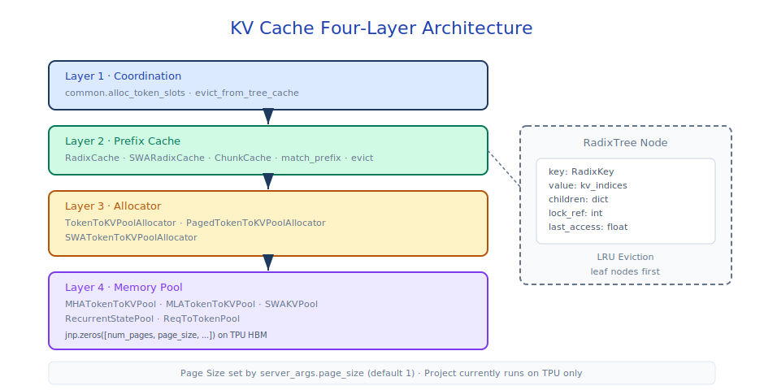
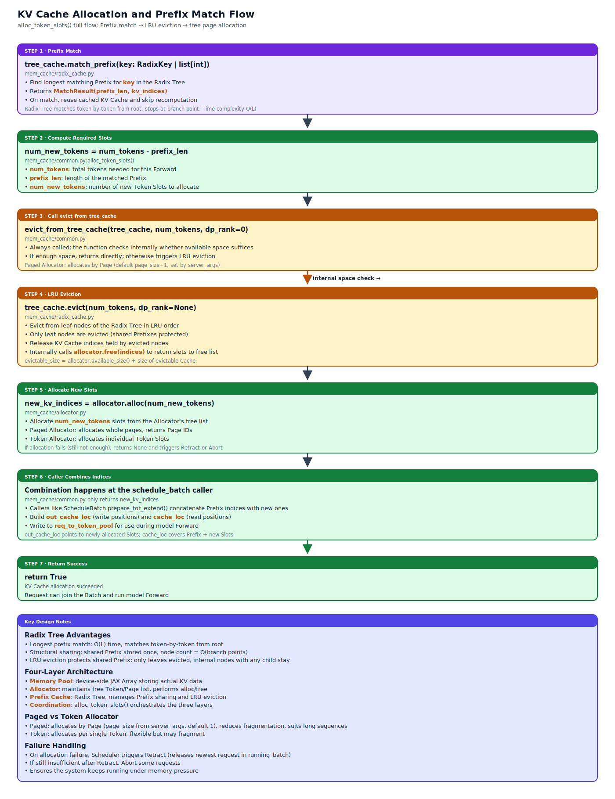

# KV Cache and Memory Management

## Module Overview

The KV Cache subsystem is the core of memory management in sglang-jax, with a four-layer architecture: **Base Interface** (abstract cache interface) → **Memory Pool** (device-side JAX arrays) → **Allocator** (free-page management) → **Prefix Cache** (RadixCache prefix sharing and eviction). The four layers cooperate to enable efficient KV cache allocation, reuse, and reclamation, supporting features like paged allocation, prefix sharing, and Sliding Window Attention. Under data parallel, allocator capacity, evictable statistics, and prefix cache namespaces are all isolated by `dp_rank`.

> **Page size configuration**: `page_size` controls how many tokens each KV page holds. The default differs between attention paths — **MHA/GQA recommends `page_size=16`, while MLA requires `page_size > 1`**. The MLA v2 Pallas kernel infers the effective page_size from `cache_kv.shape[1] * kv_packing`, and `page_size=1` would conflict with allocator / metadata semantics; `MLAAttentionBackend.__init__` directly asserts and rejects it. This value is configured via the server arg `--page-size`, with the constraint `chunked_prefill_size % page_size == 0`. See [13-configuration-reference](13-configuration-reference.md) for full parameter documentation.



Core files involved:

- `mem_cache/base_prefix_cache.py` — `BasePrefixCache` abstract base class, `MatchResult`
- `mem_cache/memory_pool.py` — `ReqToTokenPool`, `HybridReqToTokenPool`, `MHATokenToKVPool`, `MLATokenToKVPool`, `SWAKVPool`
- `mem_cache/recurrent_state_pool.py` — `RecurrentStatePool`, state management for linear recurrent layers
- `mem_cache/allocator.py` — Token-level / Page-level / SWA Allocator
- `mem_cache/radix_cache.py` — `RadixCache`, Radix Tree prefix sharing
- `mem_cache/swa_radix_cache.py` — `SWARadixCache`, Sliding Window Attention variant
- `mem_cache/chunk_cache.py` — `ChunkCache`, empty implementation without prefix sharing
- `mem_cache/common.py` — Coordination functions for allocator and cache

## Prerequisite Reading

- [03-scheduler](03-scheduler.md) — How the Scheduler allocates and releases KV cache
- [04-model-executor](04-model-executor.md) — Memory Pool initialization and cell-size calculation

---

## 7.1 Four-Layer Architecture Overview

```text
┌─────────────────────────────────────────────────┐
│  Coordination (common.py)                       │  ← evict-allocate orchestration
├─────────────────────────────────────────────────┤
│  Prefix Cache (RadixCache / SWARadixCache)      │  ← prefix sharing, LRU eviction
├─────────────────────────────────────────────────┤
│  Allocator (Token / Paged / SWA)                │  ← free page/token tracking
├─────────────────────────────────────────────────┤
│  Memory Pool (MHA / MLA / SWA / HybridLinear KV)│  ← device-side JAX arrays
│  + RecurrentStatePool (Mamba/GLA/KDA/GDN)       │  ← linear recurrent layer state
└─────────────────────────────────────────────────┘
```



**Typical request flow**:

1. `match_prefix()` — Look up reusable KV cache entries in the radix tree
2. `alloc_token_slots()` — Check capacity in the request's `dp_rank` capacity pool, perform LRU eviction if insufficient, then allocate new slots via the allocator
3. `set_kv_buffer()` — Model forward writes KV data via Pallas kernels
4. `cache_finished_req()` — After request completion, write KV cache indices into the radix tree for reuse by subsequent requests

### Why Choose Radix Tree as the Prefix Cache?

The prefix cache for LLM inference has three core needs: longest prefix match (match_prefix), incremental insert (insert), and least-recently-used eviction (evict). Radix trees are superior to hash maps in all three respects:

1. **Prefix sharing is structural** — If 100 requests share the same 2000-token system prompt, a radix tree stores this prefix as a single edge corresponding to one set of KV cache indices. A hash map either has independent entries for each full sequence (no sharing) or needs an index entry for every possible prefix length (space explosion).

2. **Longest-prefix match is O(L)** — A radix tree matches token by token from the root downward, stopping at the first divergence and naturally returning the longest match. A hash map would need to start from the longest possible prefix and shorten the query each time, taking O(L) hash computations in the worst case.

3. **Eviction naturally protects shared prefixes** — A radix tree only evicts leaf nodes. Internal nodes corresponding to shared prefixes are never evicted as long as any subsequent request still uses them. A hash map needs additional reference counting or dependency graphs to achieve equivalent protection.

Compared to a standard trie (one node per token), the radix tree compresses unbranching token sequences into a single edge, reducing the node count from O(total tokens) to O(branch points). When many requests share long prefixes, the compression ratio is substantial. The `_split_node()` method splits the compressed edge on demand at the first divergence between two sequences, implementing lazy construction.

---

## 7.2 Memory Pool

The memory pool layer manages on-device memory through three independent class hierarchies plus an aggregator:

```text
ReqToTokenPool                          KVCache (ABC)                       RecurrentStatePool       MemoryPools
  └── HybridReqToTokenPool                ├── MHATokenToKVPool              (standalone)              (aggregator)
                                          ├── MLATokenToKVPool
                                          ├── SWAKVPool          ←── composes 2 MHATokenToKVPool
                                          └── HybridLinearKVPool ←── composes 1 MHA/MLATokenToKVPool
```

`SWAKVPool` and `HybridLinearKVPool` are composition wrappers over inner MHA/MLA pools, not new storage layouts. `MemoryPools` bundles the active pools into one pytree and is passed across the JIT boundary via `donate_argnames=["memory_pools"]`.

`ModelRunner._init_pools()` produces one of two configurations depending on the model:

| Configuration | ReqToTokenPool | KVCache pool | RecurrentStatePool | Allocator |
|---|---|---|---|---|
| **Standard** (Llama / Qwen / DeepSeek absorbed-MLA; Gemma2 SWA) | `ReqToTokenPool` | `MHA` / `MLA` / `SWAKVPool` | — | `PagedTokenToKVPoolAllocator` (default), `TokenToKVPoolAllocator` (page_size=1), `SWATokenToKVPoolAllocator` (SWA) |
| **Hybrid** (Kimi-Linear — attention + linear recurrent) | `HybridReqToTokenPool` | `HybridLinearKVPool` (full-attn layers only) | `RecurrentStatePool` | `PagedTokenToKVPoolAllocator` |

### 7.2.1 `MemoryPools`

`MemoryPools` (`mem_cache/memory_pool.py`) aggregates the various KV / recurrent sub-pools that a single model may use into one pytree container, constructed with keyword arguments (e.g., `token_to_kv_pool`, `swa_kv_pool`, recurrent pool, etc.). It routes attribute names to the corresponding sub-pool via `__getattr__`, raising `AttributeError: MemoryPools has no pool '<name>'` if not found. `ModelRunner` now always holds a `MemoryPools` (non-hybrid models simply wrap it via `_build_non_hybrid_memory_pools`), and passes the entire `MemoryPools` to JIT as a `donate_argnames=["memory_pools"]` parameter. The model `__call__` retrieves the actual pool via `memory_pools.token_to_kv_pool` etc., and returns a `{"token_to_kv_pool": layers_kv_fused, ...}` dict that `self.memory_pools.replace_all(pool_updates)` writes back. Absorbed-MLA models like GLM-5 / DeepSeek V3 must extract the sub-pool from `MemoryPools` to correctly invoke the KV buffer interface.

### 7.2.2 ReqToTokenPool

The request-to-token mapping pool, registered as `@register_pytree_node_class`. Used directly by standard models (`MHA` / `MLA` / `SWAKVPool` KV side); hybrid models swap it for `HybridReqToTokenPool` (the subclass; see §7.2.3), built by `_build_hybrid_pools()`.

Maintained on the host (CPU numpy) rather than the device (JAX Array), because the Scheduler frequently reads/writes token indices on CPU for scheduling decisions (such as prefix matching, KV cache allocation, retract release); these are irregular random-access operations that would incur significant host-device sync overhead if placed device-side.

| Field | Type | Description |
|-------|------|-------------|
| `req_to_token` | `np.ndarray` `(size, max_context_len)` | Host-side mapping table |
| `free_slots` | `list[int]` | List of available slot indices |

| Method | Description |
|--------|-------------|
| `write(indices, values)` | Write token indices (supports tuples and direct indexing) |
| `read(req_idx, length)` | Read token indices for a specified request |
| `alloc(reqs)` | Pop slots from the front of `free_slots`, supports chunked-prefill reuse |
| `free(req)` | Return the slot and clear `req.req_pool_idx` |

### 7.2.3 HybridReqToTokenPool

`HybridReqToTokenPool` inherits from `ReqToTokenPool` and coordinates recurrent state slot allocation for **hybrid models** (attention + linear-recurrent layers). The parent class manages the req→token mapping table; the subclass additionally holds a `recurrent_state_pool` reference and per-DP `recurrent_free_slots` queues. The KV cache itself is managed on a parallel path by `HybridLinearKVPool` wrapping a single inner `MHA`/`MLATokenToKVPool` (see §7.2.4.5).

Hybrid linear-recurrent models (e.g., Kimi-Linear with KDA + MLA) contain both:

- **Full-attention layers** — KV cache managed by `HybridLinearKVPool` (§7.2.4.5), which routes global `layer_id` to the inner pool's physical slot
- **Linear-recurrent layers (KDA / Lightning)** — recurrent state managed by `RecurrentStatePool` (§7.2.5); these layers never touch the KV pool

The lifecycles of req-pool slots and recurrent slots must be synchronized: `alloc(reqs)` first calls `super().alloc(reqs)` to obtain a req-pool slot, then takes a recurrent slot from `recurrent_free_slots[dp_rank]` and writes it to `req.recurrent_pool_idx`; `free(req)` reverses the process. KV slots are allocated independently along another path by the allocator (single `PagedTokenToKVPoolAllocator`), but indirectly tied to the same request via the ReqToTokenPool's req→token mapping, achieving "the same `req_pool_idx` consistent across KV / recurrent".

**Core design**:

| Field | Type | Description |
|-------|------|-------------|
| `recurrent_state_pool` | `RecurrentStatePool` | Reference to the recurrent state pool |
| `dp_size` | `int` | Number of DP ranks |
| `slots_per_rank` | `int` | `recurrent_state_pool.size // dp_size` |
| `recurrent_free_slots` | `list[list[int]]` | Per-DP queue of free recurrent slots |
| `req_index_to_recurrent_index_mapping` | `np.ndarray` | Fast lookup of `req_pool_idx → recurrent_pool_idx` |

| Method | Description |
|--------|-------------|
| `alloc(reqs)` | First `super().alloc(reqs)` to get the req-pool slot; then for each new request, take a recurrent slot from `recurrent_free_slots[dp_rank]` and write it to `req.recurrent_pool_idx` |
| `free(req)` | First return the recurrent slot to the corresponding DP rank queue and clear the mapping; then `super().free(req)` returns the req-pool slot |
| `recurrent_available_size(dp_rank)` | Number of available recurrent slots for the specified DP rank |
| `get_linear_recurrent_indices(req_pool_indices)` | Given an array of req-pool indices, return the corresponding recurrent slot index array |

**Key design decisions**:

1. **Unified slot index** — `req.req_pool_idx` maps to `recurrent_pool_idx` via `req_index_to_recurrent_index_mapping`, simplifying cross-view queries between KV and recurrent.
2. **Per-DP free queues** — `recurrent_free_slots` are partitioned by DP rank, consistent with the allocator's capacity partitioning, preventing requests of different DP ranks from encroaching on each other's recurrent slots.
3. **Separation of concerns** — KV slots are independently maintained in the allocator / KVCache pool; `HybridReqToTokenPool` does not hold KV buffers, only handles slot allocation for recurrent state.

**Why coordinate recurrent at the ReqToTokenPool layer instead of the allocator layer?**

- The allocator only manages free pages / tokens and has no awareness of request-level semantics
- ReqToTokenPool is the bridge between requests and memory; it's the most natural place to attach recurrent slots
- The Scheduler only needs to interact with HybridReqToTokenPool / Allocator; no awareness of recurrent pool details

### 7.2.4 KVCache

The KV cache layer stores Key-Value caches for attention layers. All concrete pools inherit from the `KVCache` abstract base class — four direct subclasses (`MHA`, `MLA`, `SWAKVPool`, `HybridLinearKVPool`); the last two are *composition wrappers* over the first two.

#### 7.2.4.1 Abstract Base

`KVCache` (`@register_pytree_node_class`) defines a unified interface for the KV cache buffer pool:

- `get_fused_kv_buffer(layer_id)` — Get the fused KV buffer for a specified layer
- `get_kv_buffer(layer_id)` — Split the fused buffer into separate `(k, v)` views (MLA uses this to expose `(c_kv, k_pe)`)
- `set_kv_buffer(layer_id, loc, cache_k, cache_v, is_decode)` — Write KV data
- `replace_buffer(kv_buffer)` — Replace the internal reference with the updated buffer returned by forward (required by JAX's functional paradigm)

#### 7.2.4.2 MHATokenToKVPool

The KV cache is organized by fixed-size pages rather than by token, in order to **eliminate inter-request memory fragmentation** — token-level allocation leaves many "unusable but unfreeable" holes due to varying request lengths, while pages are coarse-grained contiguous blocks that naturally produce no fragmentation when allocated/released. Pages are also the access granularity for attention kernels: Pallas / PagedAttention fetches one page of KV at a time, amortizing DMA launch overhead on TPU / GPU. The 5D layout described here is built on top of paged KV caches with K/V interleaving and sub-word packing layered on, sharing the same lineage as the PagedAttention idea proposed by vLLM.

**5D fused buffer layout**:

```text
Shape: (num_pages, page_size, num_kv_heads * 2 // packing, packing, head_dim)
```

| Dimension | Description |
|-----------|-------------|
| `num_pages` | `(size + page_size × dp_size) // page_size`, with 1 dummy padding page reserved per DP rank |
| `page_size` | Page size |
| K/V interleaved | `[K0, V0, K1, V1, ...]` interleaved along the head dimension |
| `packing` | `32 // dtype_bits` (bfloat16=2, float32=1), sub-word packing |
| `head_dim` | Feature dimension of a single KV head |

**K/V interleaved layout**: Interleaved rather than separate storage (all K first, then all V) is for **spatial locality** — the attention kernel needs to read K and V from the same head simultaneously; the interleaved layout keeps them adjacent in memory, reducing DMA transfers.

**Sub-word packing**: Under low-precision dtypes (e.g., BFloat16, 16-bit), TPU's VMEM uses 32-bit words as the minimum addressable unit; two BFloat16 values can be packed into one word, reducing DMA transfer volume and VMEM occupancy.

**Sharding**: `P("data", None, "tensor", None, None)` — Dimension 0 is partitioned along the DP axis (`data`), aligning with the data-parallel split of attention; dimension 2 is TP-sharded along the `tensor` axis (sliced by KV head).

**KV merge** (`merge_kv(k, v)`): Interleaves independent K/V tensors into the 5D fused format.

**KV write path** (`set_kv_buffer`):

```text
merge_kv(k, v) → _set_fused_kv_buffer → update_fused_kv_cache_vectorized
  → Pallas TPU Kernel (kv_cache_update_kernel)
    → DMA Async Copy: new_kv_hbm → VMEM Scratch → kv_cache_hbm
    → input_output_aliases enables in-place HBM update
```

#### 7.2.4.3 MLATokenToKVPool

**4D buffer layout**:

```text
Shape: (total_num_pages,
        align_to(page_size, kv_packing) // kv_packing,
        kv_packing,
        align128(kv_dim))
```

**Key design**: `kv_dim = align128(kv_lora_rank) + align128(qk_rope_head_dim)`, with the two segments **independently aligned** (not `align128(lora + rope)`). E.g., `lora=192, rope=64` → `256 + 128 = 384`, not `align(256, 128) = 256`.

| Feature | MHA Pool | MLA Pool |
|---------|----------|----------|
| Buffer dimensions | 5D | 4D |
| Sharding strategy | `P(..., "tensor", ...)` | `P("data", None, None, None)` — DP-partitioned on axis 0, no head shard |
| KV write | `set_kv_buffer` + Pallas kernel | Not supported (MLA v2 kernel writes in place via `input_output_aliases`) |
| Data read | `get_fused_kv_buffer` | `get_kv_buffer` splits into `(c_kv, k_pe)` views |

#### 7.2.4.4 SWAKVPool

Used by models that mix full-attention and sliding-window layers (e.g., Gemma2). Wraps two independent inner `MHATokenToKVPool` instances: `full_kv_pool` (Full-Attention layers) and `swa_kv_pool` (SWA layers). Despite the "SWA mix" naming, both layer types still do attention — this is a standard configuration, not the hybrid one in §7.2.4.5.

**Core fields**:

| Field | Description |
|-------|-------------|
| `layers_mapping` | `dict[int, (pool_local_id, is_swa)]` — Global layer ID → pool-local ID |
| `full_to_swa_index_mapping` | `np.array` — Mapping from Full Pool token indices to SWA Pool indices. Injected and maintained by `SWATokenToKVPoolAllocator` |

The SWA layer's `set_kv_buffer` maps full-attention indices to SWA indices via `_remap_swa_loc()` and then delegates to `swa_kv_pool`.

The current SWA uses a Full + SWA dual-pool structure, with `SWATokenToKVPoolAllocator` coordinating allocation across the two allocators to ensure that failure on either pool can roll back the other. See 7.3.4.

#### 7.2.4.5 HybridLinearKVPool

Used by **hybrid models** that mix attention with linear-recurrent layers (e.g., Kimi-Linear: MLA + KDA). Wraps **one** inner `MHA`/`MLATokenToKVPool` sized only to the full-attention layers; linear-recurrent layers don't allocate KV slots — their state lives in `RecurrentStatePool` (§7.2.5), and req-pool slot coordination uses `HybridReqToTokenPool` (§7.2.3). The three classes together form the complete hybrid configuration.

**Core fields**:

| Field | Description |
|-------|-------------|
| `full_kv_pool` | Inner KV pool, `layer_num = len(full_attention_layer_ids)` |
| `full_attention_layer_ids` | Global layer IDs that store KV |
| `full_attention_layer_id_mapping` | `dict[global_id, physical_id]` for layer-ID translation |

The model still iterates over a contiguous global `layer_id` range; every accessor calls `_to_physical(layer_id)` to translate to the inner pool's compacted index. Passing a non-full-attention layer ID raises `ValueError` — those layers must write to `RecurrentStatePool` instead.

`replace_buffer(kv_buffer)` expects a **compacted** list of length `full_layer_nums` (not full-length like `SWAKVPool`), since KDA layers don't produce KV writebacks at all.

### 7.2.5 RecurrentStatePool

Source: `mem_cache/recurrent_state_pool.py`

**Design purpose**:

Linear recurrent layers (Mamba, GLA, KDA, GDN) capture historical information using a recurrent state instead of a KV cache. Unlike attention's KV cache, the recurrent state is a fixed-size hidden state (does not grow with sequence length) and requires an independent memory pool. `RecurrentStatePool` provides for these layers:

1. **Temporal State Buffer** — Stores recurrent state (shape `[slots, num_heads, head_dim, head_dim]`)
2. **Convolution State Buffer** — Stores the sliding-window state of the convolution layer (shape `[slots, proj_size, conv_kernel_size-1]`)
3. **Independent dtype configuration** — `temporal_dtype` and `conv_dtype` can be configured independently to balance precision and memory

**Core fields**:

| Field | Type | Description |
|-------|------|-------------|
| `linear_recurrent_layer_ids` | `list[int]` | List of layer IDs that need recurrent state |
| `layers_mapping` | `dict[int, int]` | Global layer ID → pool-local index |
| `size` | `int` | Number of effective slots |
| `temporal_dtype` | `jnp.dtype` | Recurrent state precision (default `float32`, configurable via `SGLANG_JAX_RECURRENT_STATE_DTYPE`) |
| `conv_dtype` | `jnp.dtype` | Convolution state precision (default `bfloat16`, configurable via `SGLANG_JAX_CONV_STATE_DTYPE`) |
| `recurrent_buffers` | `list[jax.Array]` | Per-layer recurrent state buffer (shape `[slots, num_heads, head_dim, head_dim]`) |
| `conv_buffers` | `list[list[jax.Array]]` | Per-layer convolution state buffer (shape `[slots, proj_size, conv_kernel_size-1]`) |

**Dtype configuration**:

The precision requirements differ for recurrent state and convolution state:

- **Temporal State** — Recurrent state accumulates errors over long sequences; defaults to `float32` for numerical stability
- **Conv State** — The convolution window is short (typically 3-7); using `bfloat16` saves memory with controllable precision loss

Can be overridden via environment variables:

```bash
export SGLANG_JAX_RECURRENT_STATE_DTYPE=bfloat16  # Lower recurrent state precision
export SGLANG_JAX_CONV_STATE_DTYPE=float32        # Higher conv state precision
```

**Core methods**:

| Method | Description |
|--------|-------------|
| `get_linear_recurrent_layer_cache(layer_id)` | Get the recurrent state and conv state buffers for a specified layer |
| `replace_buffer(buffers)` | Batch-replace all layers' buffers with `(new_recurrent, new_conv)` tuple (post-forward update) |

**Cooperation with KVCache**:

In hybrid-architecture models, `RecurrentStatePool` and `KVCache` are coordinated via `HybridReqToTokenPool`:

1. **Unified slot index** — The same request uses the same `req_pool_idx` in both the KV cache and recurrent state pool
2. **Synchronized lifecycle** — `HybridReqToTokenPool.alloc()` and `free()` allocate/release the recurrent slot together with the req-pool slot
3. **Independent capacity management** — KV allocator and recurrent pool have independent capacities; `HybridReqToTokenPool.recurrent_available_size(dp_rank)` returns available recurrent slots, while the KV side is queried separately via the allocator's `available_size(dp_rank)`

**Why not reuse KVCache?**

Linear recurrent layer state differs fundamentally from attention's KV cache:

1. **Different shape** — Recurrent state has fixed size (does not grow with sequence length); KV cache is variable-length
2. **Different update pattern** — Recurrent state is updated in place (overwrite); KV cache is append-write
3. **Different dtype needs** — Recurrent state needs higher precision (`float32`); KV cache typically uses `bfloat16`

An independent `RecurrentStatePool` provides a cleaner abstraction and more flexible configuration space.

---

## 7.3 Allocator

Source: `mem_cache/allocator.py`

### 7.3.1 BaseTokenToKVPoolAllocator (Abstract Base Class)

Under data parallel, a single allocator maintains free capacity partitioned by DP rank. `available_size(dp_rank)`, allocation, release, and eviction statistics are all executed within the namespace of the specified rank, preventing requests of different DP ranks from occupying or evicting each other's KV cache.

In addition to the core `alloc` / `free` API pair, the abstract base class exposes two groups of interfaces, "state snapshots" and "compound release", corresponding to two usage patterns the allocator must support on the scheduling path. Rollback mode is used in the "optimistic allocate + fail rollback" scenario: paths like SWA dual allocator and `alloc_paged_token_slots_decode` first call `backup_state()` to take a snapshot before allocation, and any sub-allocation failure triggers `restore_state()` to roll back, preventing half-successful states from polluting subsequent scheduling. Batch-free mode is used when the Scheduler processes a batch of completed requests — releasing each request's KV one by one would trigger multiple `np.concatenate` / sort calls, so after entering `free_group_begin`, all `free` calls only append to `free_group`, which is merged in one commit at `free_group_end`.

**Shared capabilities**:

| Method | Description |
|--------|-------------|
| `available_size(dp_rank)` | Available capacity for the specified DP rank: `(len(free_pages) + len(release_pages)) × page_size` |
| `backup_state()` / `restore_state()` | Snapshot / restore allocator state (used for rollback) |
| `free_group_begin()` / `free_group_end()` | Batch-free mode: accumulate multiple frees and merge once |
| `merge_and_sort_free()` | Merge `free_pages` and `release_pages` into a sorted array |

### 7.3.2 TokenToKVPoolAllocator — Token-Level Allocator

Maintains `free_slots: np.ndarray` (initially `np.arange(1, size+1)`; slot 0 is reserved as a dummy padding target — when a forward batch needs to be padded to bucket size, the padding region's `out_cache_loc` points to slot 0, so the kernel's KV writes land in a harmless "trash bin" without corrupting real data).

- `alloc(need_size)` — Slice from the front of `free_slots`
- `free(free_index)` — Concatenate back into `free_slots`

### 7.3.3 PagedTokenToKVPoolAllocator — Page-Level Allocator

Maintains `free_pages` (initially `np.arange(1, num_pages+1)`, page 0 reserved) and `release_pages` (delayed merging).

**`alloc(need_size)`** — Asserts `need_size % page_size == 0`, allocates whole pages, and generates contiguous token indices: `page_indices[:, None] * page_size + np.arange(page_size)`

**`alloc_extend()` — Three-phase allocation**:

```text
Phase 1: Fill remaining space in the current page
         capacity = page_size - (prefix_len % page_size)
         Use contiguous positions starting at last_loc + 1

Phase 2: Allocate full new pages
         remaining // page_size full pages

Phase 3: Allocate a partial page (tail)
         When remaining % page_size > 0, allocate 1 page but only use the first remaining slots
```

**`alloc_decode()`** — Allocate 1 token per sequence: determine if a new page is needed (`num_pages_after > num_pages_before`); if so, use the first slot of the new page; otherwise `last_loc + 1`.

**`free(free_index)`** — Convert indices to pages (`// page_size`), `np.unique` to deduplicate, `np.setdiff1d` to exclude pages already in `release_pages`/`free_pages`, append to `release_pages` (delayed merge, not immediately sorted). Delayed merge is a performance optimization: when many requests complete, batch-releasing many pages would each cost O(N log N) to sort `free_pages` immediately; accumulating into `release_pages` and then doing `merge_and_sort_free()` once reduces sort count from O(num requests) to O(1).

### 7.3.4 SWATokenToKVPoolAllocator — Dual Allocator

Coordinates `full_attn_allocator` and `swa_attn_allocator`, maintaining `full_to_swa_index_mapping` (also injected into `SWAKVPool`).

**Core coordination pattern**: every allocation allocates from both pools simultaneously; failure on either rolls back the other.

| Method | Description |
|--------|-------------|
| `alloc(need_size)` | Dual-pool allocation, update mapping, return Full indices |
| `alloc_extend(...)` | Allocate Full first, translate `last_loc` for SWA; if SWA fails, rollback Full |
| `alloc_decode(...)` | Same dual-allocate + rollback pattern |
| `free(free_index)` | Release both pools (look up SWA index via mapping) |
| `available_size()` | `min(full_available, swa_available)` |

---

## 7.4 RadixCache Prefix Sharing

Source: `mem_cache/radix_cache.py`

### 7.4.1 Core Data Structures

**`RadixKey`** — Composite key:

- `token_ids: list[int]` — Token sequence
- `extra_key: str | None` — Optional namespace (e.g., LoRA adapter ID), enables namespace isolation
- `dp_rank: int | None` — Data parallel rank, prevents the same prefix on different DP ranks from sharing each other's KV cache

**`TreeNode`** — Trie node:

| Field | Type | Description |
|-------|------|-------------|
| `children` | `defaultdict(TreeNode)` | Child node mapping |
| `parent` | `TreeNode` | Parent node pointer |
| `key` | `RadixKey` | Token subsequence stored on this edge |
| `value` | `np.ndarray \| None` | KV cache indices (same length as key). `None` indicates evicted |
| `lock_ref` | `int` | Reference count |
| `last_access_time` | `float` | `time.monotonic()`, used for LRU sorting |
| `host_value` | Any | Host-side indices (for HiCache) |

### 7.4.2 Core Operations

**`match_prefix(key) → MatchResult`**:

Match the longest prefix along the trie. The `_match_prefix_helper` algorithm:

1. Starting from `root_node`, update `last_access_time`
2. Compute `child_key = get_child_key_fn(key)` (first token if page_size=1, first `page_size` tokens if paged)
3. While the key is non-empty and a child exists:
   - Compute `prefix_len = key_match_fn(child.key, key)`
   - If `prefix_len < len(child.key)` → **split node** (split at the mismatch), record the new node's value, break
   - Otherwise record the child's value, advance to the child, trim the matched portion
4. Return the accumulated token sequence and the last matched node

**`_split_node(key, child, split_len)`**:

Create an intermediate node: `new_node.key = child.key[:split_len]`, `new_node.value = child.value[:split_len].copy()`. Truncate child to `child.key[split_len:]`. The new node inherits `lock_ref`.

**`insert(key, value) → total_prefix_length`**:

Walk the trie to the end and create a new leaf. Returns the existing prefix length.

**`cache_finished_req(req)`**:

1. Read all KV indices from `req_to_token_pool`
2. Align in paged mode and release any unaligned tail
3. Insert into the radix tree → return `new_prefix_len`
4. Free the overlapping indices between `old_prefix_len` and `new_prefix_len`
5. Free the req slot, decrement lock ref

**LRU eviction `evict(num_tokens)`**:

1. `_collect_leaves()` — DFS to collect all leaves
2. `heapq.heapify(leaves)` — Sort by `last_access_time`
3. Pop leaves until enough tokens are evicted (skip root and locked nodes)
4. Free the node's value (KV indices) and remove from the tree
5. If the parent becomes a leaf, push it as a new candidate

### 7.4.3 Lock Mechanism

`evict()` releases nodes from LRU leaves when capacity is insufficient, but **prefix paths in use by active requests must not be released** — otherwise subsequent KV index accesses from those requests would read positions reassigned to other requests. The lock mechanism maintains a reference count `lock_ref` per `TreeNode`; as long as `lock_ref > 0`, `evict()` skips the node. Reference counting (rather than a boolean) is used because multiple concurrent requests may share the same prefix segment; the lock propagates up the parent chain because evicting any ancestor on the prefix path would invalidate downstream descendants.

When `PrefillAdder` admits a request, it calls `inc_lock_ref` on the matched `last_node` so that the occupied KV is not evicted within the admission window; once entering the running batch, locked nodes roll forward as the prefix advances each round; on request completion, `cache_finished_req` / `cache_unfinished_req` calls `dec_lock_ref` to unlock. The locked tokens are moved from `evictable_size_` to `protected_size_` as a capacity-accounting dimension and do not participate in eviction selection.

`inc_lock_ref(node)` / `dec_lock_ref(node)` propagate along the parent chain:

- **Lock (0→1 transition)**: move `len(node.value)` from `evictable_size_` to `protected_size_`
- **Unlock (1→0 transition)**: move in reverse
- The root's `lock_ref` is permanently 1

---

## 7.5 SWARadixCache — Sliding Window Attention Variant

Source: `mem_cache/swa_radix_cache.py`

### 7.5.1 SWA TreeNode Extensions

Sliding Window Attention (SWA) lets most layers attend only to the most recent W tokens, allowing "out-of-window KV" to be returned to the allocator early in generation — a common memory optimization for long-context models. But the RadixCache still needs to retain the Full-Attention KV for these tokens (used by a few full-connect layers) and the node structure itself (for prefix reuse), so wholesale deletion is not an option. The tombstone is the marker for this "half-released" state — the node's SWA-layer KV has been released, but the Full-Attention KV and the node remain in the trie and can still participate in prefix matching. `full_lock_ref` and `swa_lock_ref` separately protect the lifecycles of these two KV classes; the invariant `full_lock_ref >= swa_lock_ref` reflects the physical constraint that "SWA KV is a subset of Full KV".

| Extra Field | Description |
|-------------|-------------|
| `swa_tombstone` | SWA-layer KV released but Full-Attention KV retained |
| `full_lock_ref` | Full-Attention lock reference count |
| `swa_lock_ref` | SWA lock reference count (invariant: `full_lock_ref >= swa_lock_ref`) |
| `prev` / `next` | Full LRU doubly-linked-list pointers |
| `swa_prev` / `swa_next` | SWA LRU doubly-linked-list pointers |
| `swa_uuid` | SWA lock boundary identifier |

### 7.5.2 LRUList

Under SWA, eviction targets must be selected separately along Full and SWA dimensions, and each eviction needs to retrieve the oldest node in LRU order. The 7.4 RadixCache approach of `_collect_leaves + heapify` rebuilds an O(N log N) heap per eviction, which becomes costly with many nodes; SWARadixCache instead explicitly maintains "the sequence of nodes sorted by access time" via a doubly-linked list, making access, insertion, deletion, and move-to-front all O(1). The two linked lists (Full and SWA) share node objects but each holds its own `prev/next` pointers, paired with `cache: dict[int, TreeNode]` for O(1) membership queries, avoiding traversal-based lookups.

### 7.5.3 SWA Prefix Matching

`_match_prefix_helper` tracks `match_len_since_tombstone`:

- Initially `float("inf")` (no tombstone from root to current path)
- When encountering a `swa_tombstone` node and `match_len_since_tombstone >= sliding_window_size` → record as a valid prefix boundary, reset the counter
- Ensures the matched prefix either has no tombstone on its path, or has enough tokens between the match point and the nearest tombstone to cover the sliding window

### 7.5.4 Two-Phase Eviction

Two-phase eviction corresponds to the reality that "Full KV and SWA KV capacities are tight separately" — a single upper-layer call to `evict(full_num_tokens, swa_num_tokens)` must drive down water levels on both dimensions independently. Phase 1 prioritizes evicting leaf nodes from the Full LRU because full release (Full + SWA + node structure) yields the highest reclamation. If only the SWA side is tight, phase 2 separately evicts SWA indices — at this point evicted internal nodes cannot be wholesale deleted (deletion would break the trie); they only release SWA indices and are marked as tombstones, while the node and Full KV remain to continue serving prefix matching. Tombstones serve as "delayed reclamation" between phases: when a subsequent phase 1 evicts all children of a tombstone, `_iteratively_delete_tombstone_leaf` then completely removes the tombstone parent.

**`evict(full_num_tokens, swa_num_tokens=0)`**:

**Phase 1 — Full eviction**:

- Get LRU leaf from `full_lru_list`
- Release Full and SWA KV indices
- Remove from both LRU lists
- `_iteratively_delete_tombstone_leaf()` — If the parent is a child-less tombstone, recursively delete (release its Full KV)

**Phase 2 — SWA-only eviction**:

- Get LRU node from `swa_lru_list` (**not required** to be a leaf)
- **Internal nodes**: only release SWA tokens (`free_swa()`), mark as tombstone (`_tombstone_internal_node`), remove from `swa_lru_list` (retain in `full_lru_list`)
- **Leaf nodes**: release Full + SWA tokens, delete and recursively clean up tombstone parents

### 7.5.5 SWA Lock Mechanism

The SWA lock is an extension of the 7.4.3 lock mechanism in the SWA setting — a node simultaneously holds two kinds of resources, Full KV and SWA KV, requiring separate protection, corresponding to the two reference counts `full_lock_ref` and `swa_lock_ref`. Full lock propagates up the parent chain all the way to the root (consistent with standard RadixCache); SWA lock only propagates up to ancestors "within `sliding_window_size` cumulative tokens of the current node" — tokens beyond that are out of window and would never be read by SWA layers, so no protection is needed. This boundary node is dynamic (depends on the cumulative token lengths of nodes along the lock path) and cannot be located directly by node identity, so `inc_lock_ref` generates a `swa_uuid` at the boundary node and returns it to the caller; on unlock, the UUID is used to find the boundary at lock time, avoiding accidentally modifying the SWA reference count of higher-level nodes.

**`inc_lock_ref(node) → swa_uuid_for_lock`**:

Walk along the parent chain:

1. Always increment `full_lock_ref`
2. Increment `swa_lock_ref` until `swa_lock_size >= sliding_window_size`
3. Allocate `swa_uuid` at the boundary node and return it to the caller

**`dec_lock_ref(node, swa_uuid_for_lock)`**:

1. Always decrement `full_lock_ref`
2. Decrement `swa_lock_ref` until encountering a node with `swa_uuid == swa_uuid_for_lock`

---

## 7.6 Variant Caches

### ChunkCache

`ChunkCache` (`chunk_cache.py`) — A minimal `BasePrefixCache` implementation for the **chunked prefill + RadixCache disabled** scenario: keeps the interface contract so the Scheduler doesn't need special-casing, but skips all prefix-tree/reuse/eviction logic.

**Trigger condition** (the `tree_cache` selection branch in `Scheduler.__init__` in `scheduler.py`):

```python
elif server_args.chunked_prefill_size is not None and server_args.disable_radix_cache:
    self.tree_cache = ChunkCache(...)
```

That is, both `--chunked-prefill-size` is set and `--disable-radix-cache=True`.

**Why is it needed instead of just disabling the cache?** When a long sequence is split by chunked prefill into multiple chunks processed in sequence, the Scheduler still needs to convey "where the previous chunk wrote" between chunks — `cache_unfinished_req()` writes the KV indices corresponding to currently filled tokens into `req.prefix_indices` as the splice anchor for the next forward. This bookkeeping is the minimum requirement for chunked prefill to work, but chunks of the same sequence are naturally contiguous and there is no cross-request reuse, so all radix-tree overhead is skipped.

**Method behaviors**:

| Method | Behavior | Description |
|--------|----------|-------------|
| `match_prefix()` | Return empty `MatchResult` | No prefix lookup performed |
| `cache_unfinished_req(req)` | Copy `req_to_token[req_pool_idx, :len(fill_ids)]` to `req.prefix_indices` | **Critical path for chunked prefill splicing** |
| `cache_finished_req(req)` | Get committed length via `pop_committed_kv_cache()`, call `allocator.free()` to release KV slots | No tree write |
| `evict()` / `inc_lock_ref()` / `dec_lock_ref()` | No-op (lock ref returns 0) | No prefix tree, no reference-counting needs |
| `reset()` / `pretty_print()` | No-op / empty string | — |

**Scheduler-side differentiation**: When computing `tree_cache_size`, explicitly checks `isinstance(self.tree_cache, ChunkCache)` and reports size 0 for ChunkCache, avoiding miscounting capacity already released by the allocator as cache capacity.

---

## 7.7 Coordination Layer

Source: `mem_cache/common.py`

The coordination layer combines the "evict" and "allocate" actions originally scattered across RadixCache and Allocator, exposing a thin layer with "one-shot safe allocation" semantics. The Scheduler and ScheduleBatch should not handle "try to allocate, evict if not enough, retry" boundary conditions — easy to get wrong — themselves. `alloc_token_slots` packages "first `evict_from_tree_cache` to make room, then `allocator.alloc`, print diagnostic info and raise on failure" into one call; `alloc_paged_token_slots_extend` / `alloc_paged_token_slots_decode` are the analogous packaging in paged mode. This layer holds no state and only handles orchestration, so it lives in `common.py` for shared use by upper layers of the four-layer architecture.

**`alloc_token_slots(tree_cache, num_tokens)`**:

1. Call `evict_from_tree_cache()` to ensure space
2. Call `allocator.alloc(num_tokens)`
3. On failure, print diagnostics (`available_and_evictable_str()`) and raise `RuntimeError`

**`evict_from_tree_cache(tree_cache, num_tokens)`**:

- **Hybrid Allocator** (SWA): Check Full and SWA available space separately, evict `max(0, needed - available)` tokens
- **Standard Allocator**: Evict `num_tokens - available_size` tokens

---

## 7.8 Cooperation with Scheduler

| Phase | Operation | Components Involved |
|-------|-----------|---------------------|
| Prefill | `prepare_for_extend()` → `alloc_token_slots()` / `alloc_paged_token_slots_extend()` | Allocator + Cache |
| Decode | `prepare_for_decode()` → allocate 1 cache slot per token | Allocator |
| OOM Retract | `retract_decode()` → release KV cache of retracted requests | Allocator |
| Request completion | `cache_finished_req()` → write into RadixCache | Cache |
| Out of memory | `evict_from_tree_cache()` → LRU eviction | Cache + Allocator |

---

## Key Interface Reference

| Interface | Location | Description |
|-----------|----------|-------------|
| `BasePrefixCache` | `mem_cache/base_prefix_cache.py` | Prefix cache abstract base class |
| `MatchResult` | `mem_cache/base_prefix_cache.py` | Prefix match result |
| `ReqToTokenPool` | `mem_cache/memory_pool.py` | Request-to-token mapping pool |
| `HybridReqToTokenPool` | `mem_cache/memory_pool.py` | Hybrid-architecture coordinator (KV cache + recurrent state) |
| `KVCache` | `mem_cache/memory_pool.py` | KV cache buffer pool abstract base class |
| `MHATokenToKVPool` | `mem_cache/memory_pool.py` | MHA KV cache pool (5D fused buffer) |
| `MLATokenToKVPool` | `mem_cache/memory_pool.py` | MLA KV cache pool (4D latent buffer) |
| `SWAKVPool` | `mem_cache/memory_pool.py` | Hybrid SWA dual pool (wraps full + swa MHA pools; Gemma2-style) |
| `HybridLinearKVPool` | `mem_cache/memory_pool.py` | Hybrid linear-recurrent KV wrapper (wraps 1 inner MHA/MLA pool, sized to full-attention layers only; global → physical `layer_id` translation; Kimi-Linear-style) |
| `RecurrentStatePool` | `mem_cache/recurrent_state_pool.py` | State management for linear recurrent layers (Mamba/GLA/KDA/GDN) |
| `MemoryPools` | `mem_cache/memory_pool.py` | Wrapper that aggregates multiple KV / recurrent sub-pools, the unified container received by model `__call__` |
| `merge_kv()` | `mem_cache/memory_pool.py` | K/V tensor → 5D fused format |
| `BaseTokenToKVPoolAllocator` | `mem_cache/allocator.py` | Allocator abstract base class (`alloc`/`free`/`backup_state` protocol) |
| `TokenToKVPoolAllocator` | `mem_cache/allocator.py` | Token-level allocator (page_size=1) |
| `PagedTokenToKVPoolAllocator` | `mem_cache/allocator.py` | Page-level allocator (three-phase extend) |
| `SWATokenToKVPoolAllocator` | `mem_cache/allocator.py` | SWA dual allocator (dual-allocate + rollback) |
| `RadixCache` | `mem_cache/radix_cache.py` | Radix tree prefix cache |
| `TreeNode` | `mem_cache/radix_cache.py` | Trie node |
| `RadixKey` | `mem_cache/radix_cache.py` | Composite key (token_ids + extra_key + dp_rank) |
| `SWARadixCache` | `mem_cache/swa_radix_cache.py` | SWA prefix cache (dual LRU + tombstone) |
| `LRUList` | `mem_cache/swa_radix_cache.py` | SWA doubly-linked-list LRU (O(1) operations) |
| `ChunkCache` | `mem_cache/chunk_cache.py` | Minimal cache for chunked prefill + RadixCache-disabled (only maintains chunk-splice indices) |
| `alloc_token_slots()` | `mem_cache/common.py` | Coordinate eviction and allocation |
| `evict_from_tree_cache()` | `mem_cache/common.py` | Eviction strategy dispatch |
