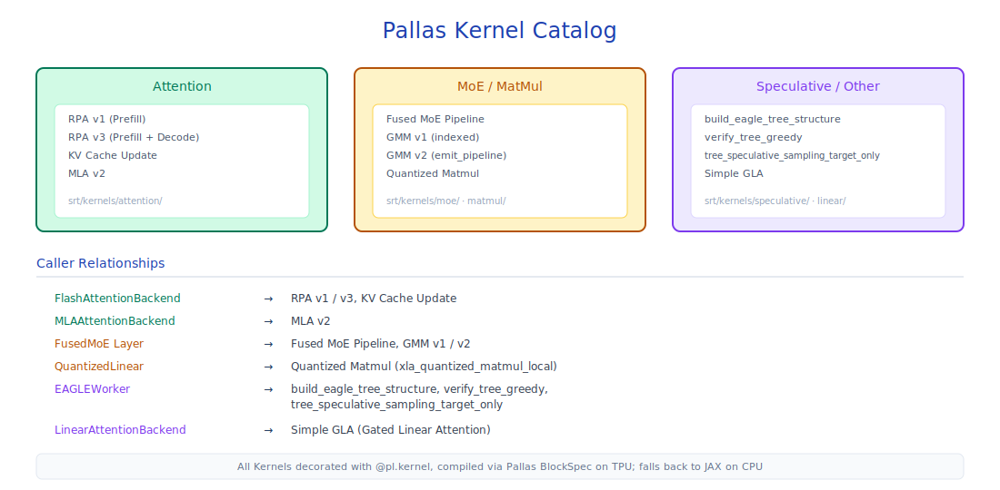

# Pallas Custom Kernels

## Module Overview

sglang-jax writes high-performance custom kernels for TPU/GPU using the JAX Pallas framework, breaking through the performance bottlenecks of standard JAX operators. Pallas provides a Triton-like low-level kernel programming model (BlockSpec / Grid / kernel functions), operates directly on VMEM/SMEM, and supports DMA prefetch and double buffering.



Core directories involved:

- `kernels/ragged_paged_attention/` — Ragged Paged Attention (v1 / v3)
- `kernels/paged_attention/` — GPU Paged Attention (Triton style)
- `kernels/update_kv_cache/` — In-place KV cache update
- `kernels/fused_moe/` — Fused MoE kernel
- `kernels/gmm/` — Grouped Matrix Multiply (MegaBlocks style)
- `kernels/mla/` — Multi-Latent Attention kernel (v1 reference / v2 optimized)
- `kernels/quantized_matmul/` — Quantized matrix multiplication (INT8 / FP8 / Block-wise)
- `kernels/speculative/` — Speculative decoding kernels (tree construction / sampling / verification)
- `kernels/simple_gla/` — Simple Gated Linear Attention
- `kernels/kda/` — Kimi Delta Attention (KDA) chunked-recurrence kernel
- `kernels/gdn/` — Gated DeltaNet (GDN) ragged-recurrence kernel (Qwen3.5)
- `kernels/utils/perf.py` — Performance profiling utilities

## Prerequisite Reading

- [06-layers-and-attention](06-layers-and-attention.md) — How attention backends invoke these kernels
- [07-kv-cache](07-kv-cache.md) — KV cache memory pool layout

---

## 8.1 Pallas Programming Model Brief

**Why use Pallas instead of pure JAX?** JAX's standard operators (such as `jnp.einsum`, `jax.nn.softmax`) are automatically optimized by the XLA compiler, but XLA compiles each operator independently into HLO instructions and cannot fuse across operators — for example, attention's Q·K^T, Softmax, and P·V are compiled into three independent kernels, with each step writing back to HBM and then reading again. Pallas allows developers to write the entire attention computation as a single kernel, keeping intermediate results in VMEM (TPU's on-chip SRAM, around 64MB), significantly reducing HBM bandwidth consumption. In addition, Pallas provides explicit DMA control and double buffering, enabling overlap of data movement and MXU computation, an effect difficult to achieve through XLA's automatic optimization.

Pallas is JAX's low-level kernel programming framework, with core concepts:

- **Grid** — The kernel's parallel execution grid, defining parallelism and iteration dimensions
- **BlockSpec** — Defines the memory block accessed by each grid cell
- **Kernel function** — Compute logic operating on VMEM/SMEM
- **DMA** — Explicit data movement (TPU), supporting prefetch and double buffering
- **Scalar Prefetch** — Scalar data prefetch into SMEM, avoiding HBM access overhead
- **input_output_aliases** — Inputs and outputs share an HBM buffer to enable in-place updates
- **MXU** (Matrix Multiply Unit) — TPU's core matrix multiplication hardware unit, executing 128×128 matrix multiplications

All TPU kernels in sglang-jax use the `pltpu` (`jax.experimental.pallas.tpu`) extension; GPU kernels use the `plgpu` (`jax.experimental.pallas.triton`) extension.

---

## 8.2 Ragged Paged Attention

Source: `kernels/ragged_paged_attention/`

RPA has two versions: **v1 is the original implementation**, handling the three cases DECODE/PREFILL/MIXED in a single `pallas_call`; **v3 is the production version**, splitting the three cases into separate kernel calls and supporting per-case block size tuning, with significantly better performance than v1. New developers are advised to read v1 first to understand the core algorithm, then read v3 for production optimizations.

### 8.2.1 v1 (`ragged_paged_attention.py`)

**Public interface**:

```python
def ragged_paged_attention(
    queries,        # [padded_num_tokens, num_q_heads, head_dim]
    keys, values,   # [padded_num_tokens, num_kv_heads, head_dim]
    kv_cache_fused, # [total_num_pages, page_size, num_kv_heads*2, head_dim]
    kv_lens,        # i32[padded_batch_size]
    page_indices, cu_q_lens, cu_kv_lens, distribution, custom_mask,
    *, causal, sm_scale, sliding_window, soft_cap, mask_value,
    q_scale, k_scale, v_scale, xai_temperature_len, ...
) → (output, updated_kv_cache_fused)
```

**Grid**: `(distribution[2],)` — one program per sequence. A single `pallas_call` handles the three sequence types DECODE / PREFILL / MIXED via `pl.when` branches.

**Scalar Prefetch**: 9 arrays prefetched to SMEM (`kv_lens`, `page_indices`, `cu_q_lens`, `cu_kv_lens`, `cu_seq_mask_lens`, `distribution`, `sem_ids`, `bo_ids`, `bkv_update_ids`).

#### Two-Step Pipeline

```text
step1_qk_softmax(KV head i)  ←──→  step2_pv(KV head i-1)
      Q·Kᵀ → Scale/Mask/SoftCap       P·V → Accumulate
      → Online Softmax (m/l)            → exp(m_diff) * o_prev + pv
```

The kernel iterates over KV heads, with `step1` and `step2` executed alternately (producer-consumer overlap). This design exploits the pipelined nature of the TPU MXU: `step1` (QK matmul + softmax) and `step2` (PV matmul + accumulation) use different MXU pipeline stages, and alternating execution allows one step's compute to overlap with the other's data movement, hiding MXU latency and improving hardware utilization.

#### Double Buffering

BKV, BQ, BO each use ping-pong VMEM buffers; DMA prefetch of the next block overlaps with current block compute.

#### Fused KV Cache Update

In the first BQ iteration (`bq_idx == 0`), after waiting for the BKV DMA, `_update_kv_cache()` writes new KV tokens back to the KV cache. Fusing the cache update into the attention kernel avoids extra kernel launches.

**input_output_aliases**: `{9: 0, 11: 1}` — `q` input aliases to output, `kv_cache_fused` aliases to `updated_kv_cache`, enabling in-place updates.

**Sliding Window**: Computes `bkv_idx_start = max(kv_len - q_len - sliding_window, 0) // bkv_sz`, skipping out-of-window KV blocks. The causal mask includes the `q_span - sliding_window >= k_span` condition.

**VMEM upper bound**: Default `DEFAULT_VMEM_LIMIT_BYTES = 100MB`.

> TPU v5's physical VMEM is 64MB per core, but the Pallas runtime uses virtualization and spilling, so the logical upper bound can be slightly higher than physical capacity. Setting it to 100MB is an empirical balance between scratch buffers being too large (causing frequent spills and degraded performance) and being too small (constraining block size and reducing compute efficiency).

### 8.2.2 v3 (`ragged_paged_attention_v3.py`)

**Key differences from v1**:

v3 splits v1's single `pallas_call` into three independent calls for DECODE / PREFILL / MIXED. The core reason is **block size tuning**: DECODE (single-token query, long KV) and PREFILL (multi-token query, short KV) have vastly different optimal block configurations. In v1, the three cases share the same block sizes and can only take a compromise; after splitting in v3, each case can independently choose the optimal `(bq_sz, bkv_sz, bq_csz, bkv_csz)` tuple, and the Pallas compiler can also generate more efficient code for each kernel. The cost is three kernel launch overheads, but on TPU launch latency is far less than compute time, so the gains far outweigh the cost.

| Feature | v1 | v3 |
|---------|----|----|
| Number of kernel calls | 1 `pallas_call` | 3 independent `pallas_call`s |
| Sequence dispatch | `pl.when` branching | `RpaCase` enum dispatch |
| Block size | Globally unified | Per-case independently tuned |
| Attention loop | Single-layer BKV loop | Nested two-layer loop (`bkv_sz` outer + `bkv_csz` inner) |
| l/m/acc management | Accumulated across BQ blocks | Re-initialized per BQ block |
| Attention Sink | Not supported | Supported (`attention_sink_ref` input) |

**`RpaCase` enum**: `DECODE = 0`, `PREFILL = 1`, `MIXED = 2`. Each case has a `symbol` attribute (`"d"`/`"p"`/`"m"`) and a `get_range(distribution)` method returning the sequence index range.

**Three kernel calls**: `run_rpa_kernel()` calls once each for DECODE, PREFILL, and MIXED. Each call uses `grid=(1,)` plus an internal `@pl.loop(start_seq_idx, end_seq_idx)` to iterate over sequences.

**Per-case block sizes**: A 4-tuple `(bq_sz, bkv_sz, bq_csz, bkv_csz)` per case:

| Parameter | Description |
|-----------|-------------|
| `bq_sz` | Query prefetch block size |
| `bkv_sz` | KV prefetch block size (outer loop) |
| `bq_csz` | Query compute block size |
| `bkv_csz` | KV compute block size (inner loop) |

**Per-TPU-version tuning** (`get_default_block_sizes()`):

| TPU Version | DECODE | PREFILL/MIXED |
|-------------|--------|---------------|
| v5/v6 | `bq=1, bkv=min(min_bkv_to_peak, max_kv)` | `bq=min(32, max_q//2), bkv=min(1024, max_kv)` |
| v7 | Same, larger `bkv` | `bkv=min(2048, max_kv//2), bq_csz` max 1024 |

VMEM budget auto-shrinks: iteratively halves `bkv_sz` then halves `bq_sz` until `get_vmem_estimate_bytes()` falls within 30% of `vmem_limit_bytes`. The target of 30% rather than near 100% is because the Pallas compiler introduces additional intermediate buffers in the kernel (e.g., softmax temporaries, DMA staging buffers) whose overhead is hard to estimate precisely. Reserving 70% headroom ensures the compiler has enough space, avoiding compile failures or runtime VMEM OOM.

**Bank conflict avoidance**: `has_bank_conflicts(stride, distance=24, num_banks=32)` checks whether the BKV stride causes VMEM bank conflicts. If conflicts exist, `bkv_stride` is incremented by 1.

**Attention sink support**: An additional `attention_sink_ref` input (per-head sink logits). When sink is present, `m_ref` is initialized to sink logits and `l_ref` to 1.0, simulating a virtual token.

**xAI temperature scaling**: Computes `xai_temperature_scale = 1/log2(temperature_len)` and applies `log2(position) * scale` scaling to tokens with `position > threshold`.

### 8.2.3 Tuned Block Sizes

`tuned_block_sizes.py` — A pre-tuned block configuration table, keyed by `(device_name, q_dtype, kv_dtype, q_heads, kv_heads, head_dim, page_size, max_num_tokens)`, returning `(num_kv_pages_per_block, num_queries_per_block)`. Covers TPU v5, v6e, v7, supporting bf16/bf16 configurations.

---

## 8.3 KV Cache Update

Source: `kernels/update_kv_cache/update_kv_cache.py`

The `new_kv` produced after each attention step is a ragged array packed contiguously by token, but the paged KV cache divides storage into fixed-size pages, and adjacent tokens of the same request may land on non-contiguous page slots — directly using a generic `scatter` to write back would degrade HBM access into random point writes with terrible bandwidth utilization. The dedicated Pallas kernel explicitly encodes the "segment-write" pattern into inputs: `get_slot_mapping` packages each segment write into a `(kv_cache_start, new_kv_start, slice_len)` triple, the `slices` array enters SMEM via scalar prefetch, and the kernel iterates over slices block by block within the grid.

Execution proceeds in two phases: first using `pltpu.make_async_copy` to pull each segment of `new_kv` from HBM into VMEM scratch, then after a unified wait, initiating the VMEM→HBM writeback. All DMAs are launched asynchronously in parallel — this both aggregates discrete small segments into segment-contiguous moves and lets the latency between the two phases be hidden by the DMA engine. Combined with `input_output_aliases` aliasing the `kv_cache` input directly to the output, the entire update happens in place without producing new HBM copies.

**Public interface**:

```python
def kv_cache_update(
    new_kv: jax.Array,                # [total_num_token, num_kv_heads, head_dim]
    slices: jax.Array,                 # [3, padded_num_slices]
    kv_cache: jax.Array,               # [max_num_tokens, num_kv_heads, head_dim]
    num_kv_update_slices: jax.Array,   # [1]
    *, page_size=1, num_slices_per_block=8, kv_partition_axis="tensor"
)
```

**Slice encoding**: The `slices` array (scalar prefetch) encodes `[kv_cache_start, new_kv_start, slice_len]` triples. The `get_slot_mapping()` helper stacks them into a `[3, padded_num_slices]` i32 array.

**Grid**: `grid = (cdiv(num_kv_update_slices, num_slices_per_block),)` — each block handles `num_slices_per_block` slices.

**VMEM budget**: `VMEM_SIZE = 64MB` (physical VMEM capacity, distinguished from RPA kernel's 100MB logical limit — KV cache update does not use spilling, so physical capacity is the limit). Scratch shape is `(num_slices_per_block, page_size, num_combined_kv_heads, head_dim)`. `get_num_slices_per_block()` computes the maximum slice count fitting in VMEM.

**shard_map integration**: Wrapped via `jax.shard_map`; `in_specs` shards the KV head dimension along `kv_partition_axis`.

---

## 8.4 Fused MoE

Source: `kernels/fused_moe/v1/kernel.py`

### 8.4.1 FusedMoEBlockConfig

Frozen dataclass (registered as a JAX pytree):

| Field | Description |
|-------|-------------|
| `bt` | Outer token tile size (routing/communication/output tiling) |
| `btc` | Compute tile size (active expert tokens) |
| `bf` | `intermediate_size` block size |
| `bfc` | `intermediate_size` compute size |
| `bd1` / `bd1c` | `hidden_size` block/compute size (w1/w3 gate/up) |
| `bd2` / `bd2c` | `hidden_size` block/compute size (w2 down) |
| `bse` | Shared expert `intermediate_size` block size |
| `bts` | Token staging tile inside `expert_ffn` |

### 8.4.2 Kernel Architecture

`_fused_ep_moe_kernel` fuses the entire MoE pipeline into a single Pallas call, comprising 6 stages: Routing → All-to-All Scatter → Expert FFN (Gate-Up + Activation + Down, supporting blockwise quantization) → All-to-All Gather → Shared Expert (optional) → Output Accumulation. Uses around 30 VMEM/SMEM scratch buffers for token staging, weight double-buffering, A2A communication, and semaphore synchronization.

### 8.4.3 Tuned Block Configs

`TUNED_BLOCK_CONFIGS` is indexed by `device_name` → `(dtype, weight_dtype, num_tokens, num_experts, top_k, hidden_size, intermediate_size, ep_size, use_shared_expert, use_grouped_topk)`. Covers TPU v7 and v6e, supporting bf16 and float8_e4m3fn weight configurations.

### 8.4.4 Pure-JAX Allreduce Metadata Path

On decode tiles, the default path is "compute allreduce metadata in JAX → pass as HBM input to the kernel", replacing the path of inferring boundaries via Pallas DMA inside the kernel; prefix-start computation is also optimized to no longer materialize a starting point per device. `--disable-jax-allreduce-metadata` falls back to the original Pallas DMA-based allgather, used only for performance-baseline comparison / debugging.

Default fallback: `FusedMoEBlockConfig(bt=32, bf=512, bd1=1024, bd2=1024, ...)`.

---

## 8.5 GMM (Grouped Matrix Multiply)

Source: `kernels/gmm/megablox_gmm_kernel/`

GMM is a "grouped matrix multiply" operator: the left operand `lhs` is sliced into `num_groups` segments by `group_sizes`, the i-th segment is multiplied by `rhs[i]`, and the results are concatenated along the M dimension. It exists for MoE — routing dispatches tokens to different experts, and the number of tokens each expert receives depends on the routing result, which is naturally a ragged dimension; ordinary batched matmul requires equal group sizes and can only pad to the maximum group then discard surplus results, with waste growing as expert count increases.

GMM concatenates all expert weights `rhs` into a single `[num_groups, k, n]` matrix and uses `group_sizes` to directly describe the true length of each segment — `make_group_metadata` derives `group_offsets`, `group_ids`, and `m_tile_ids` from this, letting each grid program look up "which expert and which M-tile am I responsible for" by `grid_id`. This "multiply by segment" indexed access completely eliminates padding while preserving Pallas's dense tile utilization of MXU.

### 8.5.1 v1 (`gmm.py`)

```python
def gmm(
    lhs: jnp.ndarray,         # [m, k]
    rhs: jnp.ndarray,         # [num_groups, k, n]
    group_sizes: jnp.ndarray, # [num_groups], i32
    *, rhs_scale=None, rhs_bias=None, tiling=None, ...
) → jnp.ndarray  # [m, n]
```

**Grid**: `(tiles_n, num_active_tiles, tiles_k)` — N dimension is parallel, M/K dimensions iterate freely.

**Group metadata**: `make_group_metadata()` computes `group_offsets`, `group_ids`, `m_tile_ids` from `group_sizes`. Each grid program dynamically resolves its group and M-tile via `group_ids[grid_id]` and `m_tile_ids[grid_id]` (Indexed-GMM pattern).

### 8.5.2 v2 (`gmm_v2.py`)

Key differences from v1:

| Feature | v1 | v2 |
|---------|----|----|
| DMA pipeline | Manual double buffer | `pltpu.emit_pipeline` automatic pipeline |
| RHS buffer | Double buffer | Triple buffer (`buffer_count=3`) |
| M-tile size | Fixed | `BoundedSlice` dynamic M-tile |
| LHS quantization | Requires external pre-quantization | Auto-quantizes (when RHS is already quantized) |
| Applicability | General | Per-channel quantization (`rhs_scale.shape[1] == 1`) |

### 8.5.3 Backend Dispatcher

The `gmm()` function in `megablox_gmm_backend.py`: dispatches to v2 when not in interpret mode and `is_supported_by_gmm_v2(rhs_scale)` is true (per-channel quantization); otherwise uses v1.

---

## 8.6 MLA Kernel

Source: `kernels/mla/`

### 8.6.1 v1 Reference Implementation (`v1/ref.py`)

Pure-JAX reference implementation of MLA Ragged Paged Attention, used for correctness verification.

### 8.6.2 v2 Optimized Implementation (`v2/kernel.py`)

**`MlaCase` enum**:

| Case | Description |
|------|-------------|
| `DECODE` | Single-sequence decode |
| `PREFILL` | Prefill |
| `MIXED` | Mixed extend+decode |
| `BATCHED_DECODE` | Batched decode (multiple sequences sharing the kernel) |

**Public interface**:

```python
def mla_ragged_paged_attention(
    ql_nope,   # [max_num_tokens, num_q_heads, lkv_dim]
    q_pe,      # [max_num_tokens, num_q_heads, r_dim]
    new_kv_c,  # [max_num_tokens, lkv_dim]
    new_k_pe,  # [max_num_tokens, r_dim]
    cache_kv,  # [total_num_pages, page_size_per_kv_packing, kv_packing, kv_dim]
    kv_lens, page_indices, cu_q_lens, cu_kv_lens, distribution,
    *, sm_scale, sliding_window, soft_cap, ...
) → (output, updated_cache_kv)
```

**lkv_dim / r_dim split**: KV cache is split into two parts:

- `lkv_dim` (also called `nope_dim` inside the kernel) — Latent KV dimension (compressed representation, used for K-nope and V)
- `r_dim` — RoPE dimension (positional encoding portion of K)

DMA loads from different slices of the same cache page: `cache_kv[..., :lkv_dim]` (latent) and `cache_kv[..., lkv_dim:]` (RoPE).

**Flash Attention steps**:

```text
q = concat(ql_nope, q_pe)    # Query = Latent + RoPE
k = concat(kv_c, k_pe)       # Key = Latent + RoPE
s = einsum("bnd,bmd→bnm", q, k)  # Attention scores
v = kv_c                     # Value = Latent only (lkv_dim)
```

**Sub-word packing**: With low-precision KV dtypes (e.g., FP8 `kv_packing=4`), multiple tokens are packed into a single 32-bit word. `_pack_new_kv()` handles shifting and masking when word boundaries are misaligned: `shift_bits = bits_per_element * (shift_amount % kv_packing)`.

**Batched Decode**: Decode mode for `batch_size > 1`, multiple sequences sharing one kernel invocation. Grid: `((end_seq_idx - start_seq_idx) // batch_size,)`. DMA, compute, and accumulate loops all iterate `for b in range(batch_size)`; per-batch semaphores `sems[4, batch_size, 2]`.

**Three kernel calls**: Executes BATCHED_DECODE, DECODE (remainder), and MIXED in sequence.

---

## 8.7 Quantized Matmul

Source: `kernels/quantized_matmul/`

The core of weight quantization is using INT8/FP8 instead of BF16 to store W, paired with a set of scales to restore integers back to floats; the scale granularity directly determines precision and kernel form. Per-channel quantization gives each output channel one scale (`w_scale.shape == [n_out]`, 1D); each column shares the same factor, suitable for layers where weights are relatively uniform along the K dimension — restoration only needs a column-wise multiply at the matmul output and can directly reuse XLA's `dot_general` with rescale, with nearly zero extra overhead.

Block-wise quantization slices weights into `(block_n, block_k)` tiles, with each tile having its own scale (`w_scale.shape == [n_in // block_size, 1, n_out]`, 3D), more robust against outlier channels — when a K segment has extreme values, only the containing tile is affected without dragging down the column's overall precision. The cost is that restoration must switch scales per tile inside the K accumulation loop and cannot use generic matmul, so it goes through a dedicated `blockwise_kernel.py` Pallas kernel; `xla_quantized_matmul_local` dispatches between the two paths based on `w_scale.ndim`.

### 8.7.1 xla_quantized_matmul_local

```python
def xla_quantized_matmul_local(
    x: jax.Array,          # [batch, n_input_features]
    w_q: jax.Array,        # [n_output_features, n_input_features]
    w_scale: jax.Array,    # Per-channel: [n_out] or Block: [in_blocks, 1, n_out]
    quantize_activation=True, reduce_axis=None,
    weight_block_size=None, activation_quant_dtype=None, ...
) → jax.Array
```

**Two compute paths**:

| Path | Trigger | Flow |
|------|---------|------|
| Per-Channel | `w_scale.ndim == 1` | Quantize x → `dot_general(x_q, w_q)` → Rescale `x_scale * w_scale` |
| Block-wise | `w_scale.ndim == 3` | Delegate to `get_blockwise_kernel()` Pallas kernel |

### 8.7.2 Block-wise Three-Tier Tuning Fallback

`get_safe_blockwise_tuned_value(n_batch, n_out, n_in, x_q_dtype, w_q_dtype, block_size_in)`:

| Tier | Strategy | Description |
|------|----------|-------------|
| Tier 1 | `TUNED_BLOCK_SIZES` dict | Pre-computed, indexed by TPU version, dtype, shape. `_iter_blockwise_tuned_candidates()` ranks lexicographically |
| Tier 2 | `get_tuned_block_sizes()` runtime API | Dynamic query |
| Tier 3 | Conservative default `TunedValue(128, 128, 128, 1)` | Fallback |

**Post-resolution adjustment**:

- `out_block_size` aligned to the nearest power-of-2 multiple of `compute_tile_n = 256 * n_lane_multiplier`
- `in_block_size` aligned to `block_size_in`

### 8.7.3 Shape Guard

`should_use_blockwise_kernel(out_dim, block_size_out)` — Uses the blockwise kernel only when `out_dim > block_size_out`, avoiding NaN issues in single-output-block scenarios.

---

## 8.8 Speculative Decoding Kernel

Source: `kernels/speculative/`

Conventional speculative decoding has the draft model produce a single linear candidate sequence per step for the target to verify, with throughput gain directly determined by hit prefix length; EAGLE's improvement is to keep top-k candidates at each draft step, expanding k steps of inference into a "candidate tree" verified by the target in one forward pass — any matching path counts as a hit, so the expected accept length is much higher than linear draft. The cost is having to flatten the tree into batchable input for the target: all nodes share one flat sequence, with the tree mask ensuring each node sees only its ancestor chain.

LCRS (Left-Child Right-Sibling) is exactly designed to encode this arbitrary-degree tree into a flat structure that Pallas kernels can access sequentially — `retrive_next_token` points to the first child, `retrive_next_sibling` points to the next sibling at the same level; two 1D arrays can express arbitrary branching. `build_eagle_tree_structure` traces back along `selected_index` via `parent_list` to build these two pointer arrays; `verify_tree_greedy` uses `fori_loop` to walk first_child and `while_loop` to retreat between siblings, with traversal by array index fitting Pallas's SMEM access model.

### 8.8.1 build_eagle_tree_structure

**Public API**:

```python
def build_eagle_tree_structure(
    parent_list, selected_index, verified_seq_len, seq_lens_sum,
    draft_token_num, topk, max_context_len, tree_mask_mode=0
) → (tree_mask, positions, retrive_index, retrive_next_token, retrive_next_sibling)
```

**Grid**: `(bs,)` — one program per batch element.

**Algorithm**: Build the EAGLE tree structure for each batch element:

1. Initialize tree mask, positions, retrieval indices
2. Token 0 (verified token): build child/sibling linked lists, tracing back via `selected_index` → `parents`
3. Token > 0 (draft token): walk along the parent chain back to root, compute depth to get position, set tree mask bits

**Outputs**: `tree_mask` (flat i32 bitmask), `positions` (sequence positions), `retrive_index/next_token/next_sibling` (LCRS linked-list pointers).

### 8.8.2 verify_tree_greedy

```python
def verify_tree_greedy(
    speculative_num_steps, num_draft_tokens,
    draft_tokens, retrive_index, retrive_next_token,
    retrive_next_sibling, next_token_logits
) → (accept_index, accept_token_num, predicts)
```

**Grid**: `(bs,)` with `("parallel",)` semantics.

**Algorithm**: DFS from the root: at each node, compare `draft_token_id == argmax(target_logits)`. On match, accept and enter the first child; on mismatch, try the next sibling. Uses `while_loop` (sibling traversal) and `fori_loop` (depth traversal).

### 8.8.3 tree_speculative_sampling_target_only

Random tree verification kernel. Uses threshold-based acceptance: `coin <= prob_acc / threshold_acc` or `target_prob_single >= threshold_single`.

After tree traversal, performs final sampling from the `max(q - p, 0)` residual distribution (rejection sampling residual). Uses SMEM scratch for single-probability queries and VMEM scratch for full-vocab vector operations.

### 8.8.4 Pure-JAX Reference Implementation

`kernel.py` provides pure-JAX reference implementations (`verify_tree_greedy`, `tree_speculative_sampling_target_only`, `top_k_renorm_prob`, `top_p_renorm_prob`) for correctness verification and non-TPU environments.

---

## 8.9 Simple GLA

Gated Linear Attention (GLA) is an improved variant of Linear Attention that introduces a learnable gating decay factor `g` into the recurrent update: `h = h · exp(g · gamma) + k · v^T`. The gating mechanism lets the model selectively forget old information — large `g` decays historical state quickly, small `g` retains more context. Compared to gateless Linear Attention, GLA significantly improves long-range dependency modeling while preserving O(N) complexity.

sglang-jax's Simple GLA implementation supports two compute modes: Fused Recurrent (token-by-token recurrence, suited for decode) and Chunk (block-parallel computation, suited for prefill); both are accelerated via Pallas kernels.

Source: `kernels/simple_gla/simple_gla.py`

### 8.9.1 SimpleGLAKernelMode

| Mode | Description |
|------|-------------|
| `CHUNK` | Pallas chunk mode |
| `FUSED_CHUNK` | Fused chunk mode |

### 8.9.2 Fused Recurrent Mode

`fused_recurrent_simple_gla(q, k, v, g, g_gamma, scale, initial_state, ...)`:

- **Dense path** (`cu_seqlens=None`): `jax.lax.scan` iterates along the time dimension. State update: `h = h * exp(decay) + k * vᵀ`. Output: `o = sum(h * q * scale)`
- **Varlen path** (`cu_seqlens` provided): `_scan_varlen()` handles packed sequences (`B=1`). Uses `searchsorted` to map tokens to sequences, resetting state at sequence boundaries

**Shape conventions**: `q/k: [B, T, H, K]`, `v: [B, T, H, V]`, `g: [B, T, H]`, `g_gamma: [H]`, `initial_state: [N, H, K, V]`.

### 8.9.3 Chunk Mode

Two Pallas kernels:

**`chunk_fwd_h_kernel_varlen`** — Computes hidden states chunk by chunk:

- Grid: `(H, cdiv(K, BK), cdiv(V, BV), T_sum // BT)` — `("parallel", "parallel", "parallel", "arbitrary")`
- Uses `_build_chunk_map` to map chunks to sequences
- Per chunk: state decay `exp(g_gamma * BT)`, gating `exp(g_last - gk_tile)`, accumulate `kᵀ @ v`
- VMEM scratch: `(BK, BV)` Float32 running state

**`_chunk_fwd_o_kernel`** — Computes output from hidden states:

- Grid: `(H * num_v_tiles, total_NT)` — `("parallel", "parallel")`
- Computes `o = q @ h + mask(q @ kᵀ) @ v`, applying `g` and `g_gamma` decay factors

**Varlen support**: All chunk kernels support variable-length sequences via `cu_seqlens_dev`. Reset state at sequence boundaries (`t0 == bos`); write final state at sequence end (`t0 + BT >= eos`).

---

## 8.10 KDA (Kimi Delta Attention)

Kimi Delta Attention is the linear recurrence branch of the Kimi Linear model. In addition to the standard Linear Attention `h = decay · h + k · v^T`, KDA additionally maintains a conv state (paired with `ShortConvolution`) as short-term memory, with a `delta` term modulating recurrence strength, thereby preserving precise representation of the most recent few tokens within chunked recurrence.

Source: `kernels/kda/kda.py` (chunked recurrence Pallas kernel), `kernels/kda/naive.py` (reference implementation, used as test oracle).

The kernel is paired with `KDAAttnBackend` from §6.10 of [06-layers-and-attention](06-layers-and-attention.md), and combined with `MLAAttentionBackend` by `HybridLinearAttnBackend` to serve Kimi Linear (KDA + MLA hybrid architecture).

---

## 8.11 GDN (Gated DeltaNet)

Gated DeltaNet is the linear-attention variant chosen by Qwen3.5: it chains depthwise causal conv1d with gated delta-rule recurrence, with the gating mechanism controlling each step's overwrite ratio of historical state.

Source: `kernels/gdn/gated_delta.py` (chunked ragged kernel), `kernels/gdn/__init__.py`.

The kernel is used together with the `GDNAttnBackend` in `layers/attention/linear/gdn_backend.py` and the `Qwen3_5GatedDeltaNet` module in `layers/attention/linear/qwen3_5_gated_delta_net.py`.

---

## 8.12 GPU Paged Attention

Source: `kernels/paged_attention/paged_attention.py`

FlashAttention chunks along the Q dimension during prefill — each SM takes a Q segment and the entire KV segment for online softmax in SRAM; with sufficient Q length, all SMs stay fed. But during decode, each sequence's Q length is only 1, and a single Q sequentially scanning the entire historical KV can only land on a few SMs, with GPU utilization collapsing. FlashDecoding's fix is to additionally split along the K dimension — divide each sequence's KV into `k_splits` partitions, with each partition being a single SM independently computing its segment's local `(o, m, l)`, restoring parallelism to `num_kv_heads * head_splits * k_splits`, then doing one outer online-softmax reduction to a global result.

**GPU-only** Paged Attention, using `plgpu.CompilerParams` (Triton-style backend), **not TPU Pallas**.

```python
def paged_attention(
    q,            # [batch_size, num_heads, head_dim]
    k_pages,      # [num_kv_heads, total_num_pages, page_size, head_dim]
    v_pages,      # [num_kv_heads, total_num_pages, page_size, head_dim]
    block_tables, # i32[batch_size, pages_per_sequence]
    lengths,      # i32[batch_size]
    *, block_h=16, pages_per_compute_block=8, k_splits=16, ...
) → jax.Array  # [batch_size, num_heads, head_dim]
```

**FlashDecoding implementation**:

- **Grid**: `(num_kv_heads, head_splits, k_splits)` — KV partitioned along `k_splits`
- Each partition handles `pages_per_partition = pages_per_sequence // k_splits` pages
- Each partition computes partial `(o, m_i, l_i)`

**Online softmax correction**:

```text
m_next = max(partial_max_logits, axis=k_splits)
correction = exp(partial_max_logits - m_next)
partial_out *= correction[..., None]
l_next = sum(partial_exp_sums * correction, axis=k_splits)
output = sum(partial_out, axis=k_splits) / (l_next[..., None] + eps)
```

**shard_map integration**: When a `mesh` is provided, shards Q heads and KV heads along `sharding_axis` via `jax.shard_map`.

---

## 8.13 Performance Tools

Source: `kernels/utils/perf.py`

`multiple_iteration_timeit_from_trace()` — Runs N iterations via `jax.profiler.trace`, extracting per-iteration kernel durations from the trace JSON. Supports kernel-name matching and MARKER-based extraction.

---

## Key Interface Reference

| Interface | Location | Description |
|-----------|----------|-------------|
| `ragged_paged_attention()` | `kernels/ragged_paged_attention/` | RPA v1 Pallas kernel |
| `ragged_paged_attention_v3()` | `kernels/ragged_paged_attention/` | RPA v3 (DECODE/PREFILL/MIXED separated) |
| `RpaCase` | `kernels/ragged_paged_attention/` | RPA v3 mode enum (`DECODE`/`PREFILL`/`MIXED`) |
| `kv_cache_update()` | `kernels/update_kv_cache/` | KV cache scatter-update (two-phase DMA) |
| `fused_ep_moe()` | `kernels/fused_moe/v1/` | Fused Expert Parallel MoE public interface |
| `FusedMoEBlockConfig` | `kernels/fused_moe/v1/` | MoE kernel block config (frozen dataclass) |
| `gmm()` / `gmm_v2()` | `kernels/gmm/` | Grouped Matrix Multiply (v1 manual / v2 auto pipeline) |
| `mla_ragged_paged_attention()` | `kernels/mla/v2/` | MLA v2 Pallas kernel (latent + RoPE split) |
| `MlaCase` | `kernels/mla/v2/` | MLA kernel case enum |
| `xla_quantized_matmul_local()` | `kernels/quantized_matmul/` | Quantized matrix multiplication (Per-channel / Block-wise) |
| `should_use_blockwise_kernel()` | `kernels/quantized_matmul/` | Block-wise kernel shape guard (avoid NaN) |
| `build_eagle_tree_structure()` | `kernels/speculative/` | EAGLE tree construction (LCRS linked list) |
| `verify_tree_greedy()` | `kernels/speculative/` | Greedy tree verification |
| `tree_speculative_sampling_target_only()` | `kernels/speculative/` | Random tree verification (rejection sampling) |
| `fused_recurrent_simple_gla()` | `kernels/simple_gla/` | GLA fused recurrent (Dense/Varlen) |
| KDA chunked recurrence | `kernels/kda/kda.py` | Kimi Delta Attention (used by Kimi Linear model) |
| GDN ragged recurrence | `kernels/gdn/gated_delta.py` | Gated DeltaNet (used by Qwen3.5) |
| `paged_attention()` | `kernels/paged_attention/` | GPU FlashDecoding |
| `multiple_iteration_timeit_from_trace()` | `kernels/utils/perf.py` | Kernel performance profiling |
