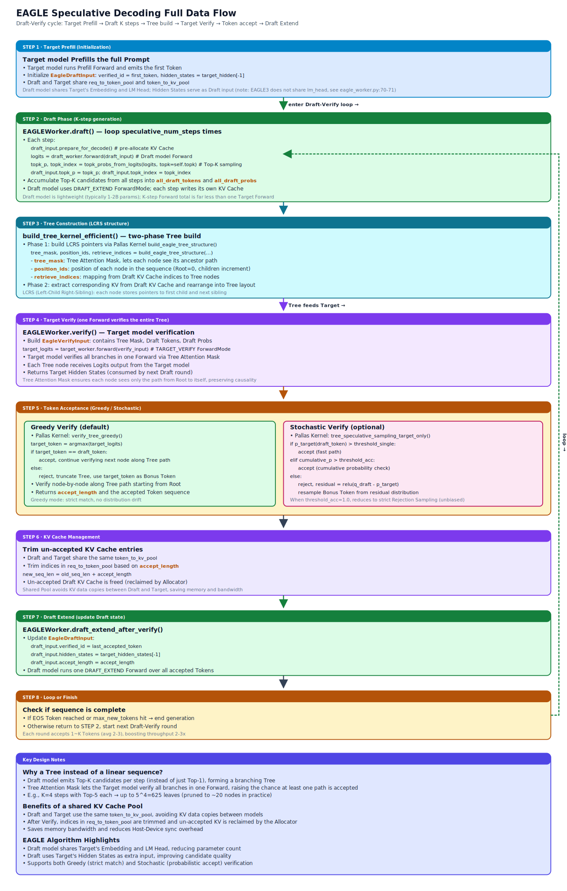

# Speculative Decoding

## Module Overview

sglang-jax implements the EAGLE Speculative Decoding algorithm to accelerate autoregressive generation via the Draft-Verify paradigm: a lightweight Draft model rapidly generates multiple candidate tokens, the Target model verifies all candidates in a single forward, and correct tokens are accepted, compressing many decode steps into fewer forward calls.



Core files involved:

- `speculative/base_worker.py` — `BaseSpecWorker` / `BaseDraftWorker` abstract bases (unified verify-orchestration and draft-loop interfaces)
- `speculative/eagle_worker.py` — `EAGLEWorker(BaseSpecWorker)`, manages the full Draft-Verify loop (verify + invokes the draft worker)
- `speculative/eagle_draft_worker.py` — `EagleDraftWorker(BaseDraftWorker)`, encapsulates multi-step generation of the draft model
- `speculative/spec_info.py` — `SpeculativeAlgorithm` enum, `SpecInput` Protocol, NaN detection utilities
- `speculative/eagle_util.py` — `EagleDraftInput`, `EagleVerifyInput`, `EagleVerifyOutput` data structures, tree construction, sampling, verification logic
- `kernels/speculative/` — Tree construction / sampling / verification Pallas kernels
- `models/llama_eagle3.py` — EAGLE3 draft model implementation
- `models/mimo_mtp.py` — MiMo V1 MTP draft model
- `models/mimo_v2_nextn.py` — `MiMoV2MTPForCausalLM`, single-layer NextN/MTP draft for MiMo V2.5-Pro (NextN multi-layer loading depends on the upstream-planned `MultiLayerDraftWorker`, not yet landed on main)

## Prerequisite Reading

- [03-scheduler](03-scheduler.md) — `DRAFT_EXTEND`, `TARGET_VERIFY` ForwardMode
- [04-model-executor](04-model-executor.md) — ModelWorker and forward execution
- [08-pallas-kernels](08-pallas-kernels.md) — Speculative kernel implementation details

---

## 9.1 Speculative Decoding Principles

**Core idea**: Standard autoregressive generation produces only 1 token per step, requiring a full Target model forward each step. Speculative Decoding leverages a lightweight Draft model to guess multiple subsequent tokens at once, then has the Target model verify all guesses in a single forward — correct tokens are accepted, incorrect ones truncate the sequence. Ideally, if the Draft model correctly guesses 4 tokens, one Target forward equals 4 standard decode steps, yielding a 4x throughput improvement.

**Draft-Verify paradigm**:

1. The Draft model rapidly generates `speculative_num_steps` steps of candidate tokens, building a candidate tree
2. The Target model verifies the entire tree in a single forward (via tree attention mask)
3. Starting from the root, accept matching tokens along tree paths
4. Truncate at the mismatch and use the Target model's token (bonus token)

**Why a tree instead of a linear sequence?** The Draft model can produce Top-K candidates per step (rather than only Top-1), and these candidates form a branching tree. The tree attention mask lets the Target model verify all branches simultaneously in one forward, greatly increasing the probability that at least one path is accepted.

**Characteristics of the EAGLE algorithm**:

- The Draft model shares the Target model's embedding and LM head
- The Draft uses the Target model's hidden states as additional input
- Supports tree-based candidate expansion (Top-K branches per step)
- Supports both Greedy and Stochastic verification modes

---

## 9.2 Configuration and Launch

### SpeculativeAlgorithm Enum

`SpeculativeAlgorithm` (`spec_info.py`):

| Value | Description | Convenience Predicate |
|-----|------|---------|
| `NONE` | Speculative decoding disabled | `is_none()` |
| `EAGLE` | EAGLE algorithm | `is_eagle()` |
| `EAGLE3` | EAGLE3 algorithm | `is_eagle()`, `is_eagle3()` |
| `STANDALONE` | Standalone draft model | `is_standalone()` |

`from_string(name)` — Static factory method mapping a string to an enum member. It currently only recognizes `EAGLE` / `EAGLE3` / `STANDALONE` and `None`; the CLI `--speculative-algorithm` also accepts `NEXTN`, but that value is not registered in the enum, and parsing will only work after the MTP DraftWorker is fully wired up (see the pending items in §9.5 class hierarchy).

### Related ServerArgs Parameters

| Parameter | Default | Description |
|------|--------|------|
| `speculative_algorithm` | `None` | Algorithm choice (`EAGLE` / `EAGLE3` / `STANDALONE`) |
| `speculative_draft_model_path` | `None` | Path to the draft model weights |
| `speculative_num_steps` | `4` | Number of generation steps for the draft model |
| `speculative_eagle_topk` | `5` | Top-K branch expansion per step |
| `speculative_num_draft_tokens` | `4` | Final number of candidate tokens |
| `speculative_accept_threshold_single` | `1.0` | Single-token acceptance probability threshold. The default 1.0 means a token is accepted via this shortcut only when the Target model assigns it 100% probability — effectively disabling this shortcut and relying entirely on cumulative-probability judgment |
| `speculative_accept_threshold_acc` | `1.0` | Cumulative acceptance probability threshold. The default 1.0 reduces stochastic verification to strict rejection sampling (mathematically equivalent to unbiased standard speculative sampling); lowering the threshold raises acceptance rate but introduces distribution bias |

---

## 9.3 Data Structures

The following three data structures are referenced frequently in later sections, so they are defined here for ease of reading. All spec input data structures implement the `SpecInput` Protocol (see §9.4).

### 9.3.1 EagleDraftInput

A `@register_pytree_node_class` dataclass — the input state of the Draft model.

**Class variable**: `ALLOC_LEN_PER_DECODE` — set to `max(speculative_num_steps * topk, speculative_num_draft_tokens)` in `EAGLEWorker.__init__`.

**Core fields**:

| Field | Shape | Description |
|------|-------|------|
| `topk_p` | `(bs, topk)` | Top-K probabilities from the previous draft round |
| `topk_index` | `(bs, topk)` | Top-K token indices from the previous draft round |
| `hidden_states` | `(bs, hidden_size)` | Hidden states from the Target/Draft model |
| `verified_id` | `(bs,)` | Token IDs accepted in the previous verify round |
| `accept_length` | `(bs,)` | Accept length per request from the previous round |
| `allocate_lens` | `(bs,)` | Currently allocated KV cache length |
| `new_seq_lens` | `(bs,)` | New sequence length after verify |

**Pytree registration**: 12 array sub-nodes go into Children, `capture_hidden_mode` goes into `aux_data`. `allocate_lens` and `new_seq_lens` are not included in the pytree (not propagated through JAX transforms).

**Key methods**:

| Method | Description |
|------|------|
| `prepare_for_extend_after_target_prefill()` | Shift `input_ids` left by one and append `verified_id` at the tail |
| `prepare_for_extend_after_verify()` | Set `DRAFT_EXTEND` mode and adjust `seq_lens` |
| `prepare_for_decode()` | Pre-allocate KV cache slots (`seq_lens + ALLOC_LEN_PER_DECODE - 1`) |
| `filter_batch(new_indices)` | Filter batch by indices |
| `merge_batch(spec_info)` | Merge along the batch dimension |
| `create_idle_input()` | Create an idle draft input |

### 9.3.2 EagleVerifyInput

A `@register_pytree_node_class` dataclass — the input for Target model verification.

**Core fields**:

| Field | Shape | Description |
|------|-------|------|
| `draft_token` | `(bs * draft_token_num,)` | All draft token IDs (flattened) |
| `custom_mask` | Flattened | Tree attention mask |
| `positions` | `(bs * draft_token_num,)` | Position ID for each draft token |
| `retrive_index` | `(bs, draft_token_num)` | Global index of token in the flat `target_predict` array |
| `retrive_next_token` | `(bs, draft_token_num)` | First-child pointer |
| `retrive_next_sibling` | `(bs, draft_token_num)` | Next-sibling pointer |

**Pytree**: 9 array Children, 4 aux_data fields (`spec_steps`, `topk`, `draft_token_num`, `capture_hidden_mode`).

**Key methods**:

| Method | Description |
|------|------|
| `prepare_for_verify()` | Set `TARGET_VERIFY` mode, inject draft tokens and tree mask |
| `sample()` | Verification entrypoint. Dispatches Greedy (all temp=0) or Stochastic (any temp>0) |

### 9.3.3 EagleVerifyOutput

Plain `@dataclass` (not a pytree):

| Field | Description |
|------|------|
| `draft_input` | `EagleDraftInput` for the next round |
| `logits_output` | Target logits (only accepted entries) |
| `verified_id` | Accepted token IDs (including bonus token) |
| `accept_length_per_req_cpu` | Accept length per request (CPU) |
| `accepted_indices` | Indices of accepted tokens within logits |

---

## 9.4 SpecInput Data Contract

`SpecInput` (`speculative/spec_info.py`) is a `runtime_checkable` Protocol that fixes the public interface for Draft / Verify inputs:

- Three token counts are strictly distinguished: **logical** (the request's semantic token count), **allocated** (the number of KV slots already allocated), and **verify** (tokens consumed by the current verify step); allocation/reclaim logic must be based on allocated, while length checks are based on logical
- Behavior methods: `is_draft_input()` / `is_verify_input()`, `get_spec_adjust_token_coefficient()`, `filter_batch()`, `merge_batch()`
- The data contract docstring anchors the **host / device boundary** and **DP-padded layout (Route 1)** semantics; device-side fields are typed as `jax.Array | None`, while host-side fields keep Python list / `np.ndarray`

Both `EagleDraftInput` and `EagleVerifyInput` implement this Protocol. `EagleVerifyInput` is single-round — its `filter_batch` / `merge_batch` raise directly. `SpecInput` exists so that subsequent draft algorithms (EAGLE / EAGLE3 / Standalone / MTP) can share the same Worker interface.

---

## 9.5 Spec Worker Class Hierarchy

The Spec Worker is split into two layers of abstraction, encapsulating verify-orchestration and the draft-loop respectively:

| Abstraction | File | Responsibility |
|------|------|------|
| `BaseSpecWorker` (ABC) | `speculative/base_worker.py` | Verify-side orchestration: `forward_batch_speculative_generation` main loop, Target model invocation, accept/reject logic, calls Draft Worker to pull drafts |
| `BaseDraftWorker` (ABC) | `speculative/base_worker.py` | Draft-side multi-step generation: `draft_forward`, maintains draft model KV, produces tree |
| `EAGLEWorker` | `speculative/eagle_worker.py` | EAGLE / EAGLE3 implementation of `BaseSpecWorker`, reusing existing verify and tree-construction logic |
| `EagleDraftWorker` | `speculative/eagle_draft_worker.py` | EAGLE draft implementation of `BaseDraftWorker`, encapsulating the multi-step draft loop |

After this split, `EAGLEWorker` itself only retains verify and orchestration; the multi-step loop and KV maintenance of the draft model itself moved to `EagleDraftWorker`. MTP-style draft models (e.g. `MiMoV2MTPForCausalLM`, see [05-models](05-models.md)) share the `BaseDraftWorker` interface, but NextN multi-layer loading needs the upstream-planned `MultiLayerDraftWorker` — only `EagleDraftWorker` has landed on main today.

---

## 9.6 EAGLEWorker

`EAGLEWorker` (`speculative/eagle_worker.py`) inherits from `BaseSpecWorker` and manages the full Draft-Verify loop.

### 9.6.1 Constructor

```python
def __init__(self, server_args, target_worker: ModelWorker)
```

Key initialization steps:

1. Store the `target_worker` reference and extract `topk`, `speculative_num_steps`, `speculative_num_draft_tokens`, `page_size`
2. **Shared memory pools**: `self.req_to_token_pool, self.token_to_kv_pool_allocator = target_worker.get_memory_pool()`. Draft and Target share the KV cache pool (see 9.10 KV cache management for details)
3. Construct `EagleDraftWorker(server_args, target_worker)` as `self._draft_worker`, exposed to upper layers via the abstract properties `target_worker` / `draft_worker` of `BaseSpecWorker`
4. Set `EagleDraftInput.ALLOC_LEN_PER_DECODE = max(speculative_num_steps * topk, speculative_num_draft_tokens)`
5. **Embedding/LM head sharing**:
   - EAGLE3: conditionally shares `lm_head` (only if `load_lm_head_from_target`); always shares the embedding
   - EAGLE: always shares the embedding and `lm_head`. If `hot_token_ids` is present, clones `lm_head` and slices out the hot-token subset
6. Calls `initialize_jit()` and obtains the precompiled padding list from the Target Worker

### 9.6.2 forward_batch_speculative_generation — Main Entrypoint

Two paths based on `forward_mode`:

**Path A — EXTEND (Prefill)**:

```text
1. Build SamplingMetadata
2. forward_target_extend()
   → Target model EXTEND forward (CaptureHiddenMode.FULL)
   → Returns (logits_output, next_token_ids, cache_miss_count)

3. forward_draft_extend()
   → Create EagleDraftInput (hidden_states + next_token_ids)
   → prepare_for_extend_after_target_prefill()
     → Shift input_ids left, append verified_id at tail
   → Draft model EXTEND forward (CaptureHiddenMode.LAST)
   → capture_for_decode() extracts top-k probs/indices

4. Returns GenerationBatchResult (allocate_lens = seq_lens)
```

**Path B — DECODE (Speculative Decode Loop)**:

```text
1. Save cur_allocate_lens
2. draft() → multi-step draft token generation + tree construction
3. verify() → Target model verification
4. draft_extend_after_verify() → update draft model state
5. Return GenerationBatchResult (accept_lens)
```

---

## 9.7 Draft Stage

### 9.7.1 padding_for_decode

Copies tensors to CPU, calls `prepare_for_draft_decode()`, builds page-aligned cache locations, applies `hot_token_ids` remapping, builds the tree mask for draft decode (when `topk > 1`), and pads all arrays to the precompiled batch size.

### 9.7.2 draft_forward — Multi-Step Draft Loop

```text
for i in range(speculative_num_steps):
    input_ids, hidden_states, scores, tree_info = select_top_k_tokens(...)
    score_list, token_list, parents_list = update_eagle_lists(...)
    if i == speculative_num_steps - 1: break
    forward_batch = update_forward_batch_info(...)
    logits_output = draft_model_runner.forward(...)
    topk_p, topk_index = topk_probs_from_logits(...)
```

**Step 0** (`select_top_k_tokens_step_0`):

- Take the initial `topk_p` and `topk_index`
- Flatten `topk_index` to obtain `input_ids`
- Repeat `hidden_states` by `topk`
- `topk_p` becomes the initial scores

**Step > 0** (`select_top_k_tokens_step_greater_0`):

- Compute all score combinations (`scores × topk_p`), flatten and select Top-K to obtain candidate token IDs, hidden states, and parent indices

### 9.7.3 Cumulative Lists

Source: `srt/speculative/eagle_util.py`

EAGLE's draft stage does not produce a linear sequence in one pass; instead, at each step it performs Top-K expansion on every current leaf, growing the candidate tree layer by layer — at each step every parent node is expanded into `topk` new candidate tokens. To reconstruct the full tree structure during verification, we must keep, for every step, the probability, token id, and the index pointing to the parent node from the prior step. `score_list` records the logprob of candidates per step, `token_list` records the candidate token ids, and `parents_list` records the parent indices; the three are appended step-by-step into pre-allocated fixed-shape arrays — this is what "cumulative" means here.

`update_eagle_lists` accumulates each step's results into pre-allocated arrays (`score_list`, `token_list`, `parents_list`) for later tree construction. `build_tree_kernel_efficient_preprocess` in stage 1 concatenates the three accumulated arrays along `dim=1`, then performs a top-`(num_verify_tokens - 1)` selection and sort to derive the final draft tokens — concatenation requires precisely the "step-aligned" layout produced by per-step accumulation along the same dimension.

---

## 9.8 Tree Construction

`build_tree_kernel_efficient()` proceeds in two stages:

### Stage 1 — Score-based candidate selection (JIT-compiled, pure JAX)

`build_tree_kernel_efficient_preprocess`:

1. Flatten all `score_list` into a `(bs, N)` tensor
2. Select Top `(num_verify_tokens - 1)` scores and their indices
3. Sort the selected indices (preserving tree ordering)
4. Gather the corresponding token IDs
5. Prepend `verified_id` (root token) to obtain `draft_tokens (bs * draft_token_num,)`

### Stage 2 — Tree structure materialization (Pallas TPU kernel)

Source: `srt/speculative/eagle_util.py`

Verification needs to perform a root-to-leaf DFS over the candidate tree, checking the Target model's prediction along each path — each node must be able to find its first child (descend along the path) and its next sibling (fall back to a sibling branch when the path fails). EAGLE's candidate tree has arbitrary degree: `topk` candidates hang under each parent, but after the score-based selection in stage 1, the actual number of children retained varies by path. With a traditional "list of children per node" representation, you'd need either variable-length arrays (which can't be jit-compiled) or a 2D matrix preset to the maximum number of children (which wastes memory on empty slots).

`retrive_index` is the global index of a node in the flattened predict array. Combined with `retrive_next_token` (first child) and `retrive_next_sibling` (next sibling) — two fixed-shape pointer arrays — the arbitrary-degree tree is compressed into an LCRS (Left-Child Right-Sibling) linked list. Any node only needs two pointers to fully describe its position in the tree, all arrays have shape `(bs, draft_token_num)`, and the JIT kernel can index directly without handling variable-length structures.

The `build_eagle_tree_structure` kernel, for each batch element and each token position:

- **Token 0 (root = verified token)**: Position = `seq_len`. Iterate over draft tokens and trace back via `selected_index` → `parents` to build the child/sibling linked list
- **Token > 0 (draft token)**: Walk up the parent chain to the root, counting depth to obtain Position = `depth + seq_len`. Set tree mask bits along the ancestor path

| Field | Description |
|------|------|
| `retrive_index[bid, i]` | Global index of node i in the flattened predict array |
| `retrive_next_token[bid, i]` | First-child index of node i (`-1` = leaf) |
| `retrive_next_sibling[bid, i]` | Next-sibling index of node i (`-1` = none) |

---

## 9.9 Verification Stage

### 9.9.1 verify Method

```text
1. spec_info.prepare_for_verify()
   → forward_mode = TARGET_VERIFY
   → input_ids = draft_token
   → Inject tree mask as custom attention mask

2. Target model forward (skip_sample=True, logits only)
   → CaptureHiddenMode.FULL

3. spec_info.sample()
   → Returns (predict, verified_id, accept_length, accept_index)

4. Slice logits_output and hidden_states down to accepted indices only
5. Build a new EagleDraftInput (verified_id, hidden_states, accept_length)
6. Return GenerationBatchResult (accept_lens)
```

### 9.9.2 Greedy Verification

When all requests have temperature = 0, `verify_tree_greedy()` is used (delegating to a Pallas kernel):

1. `target_predict = argmax(next_token_logits, axis=-1)` — greedy prediction by the Target model
2. Starting from the root, at each depth:
   - Follow `retrive_next_token` to enter the first child
   - Walk along `retrive_next_sibling` over all siblings, looking for `draft_token_id == target_token_id`
   - On match: accept, increment counter, move to the next depth
   - If no sibling matches (`cur_index == -1`): stop
3. At the last accepted position, take the Target's prediction as the bonus token

### 9.9.3 Stochastic Verification

When any request has temperature > 0, `tree_speculative_sampling_target_only()` is used:

1. Target logits go through temperature scaling and Top-K/Top-P renormalization
2. For each batch element, maintain cumulative probability `prob_acc` and uniform random `coin`
3. At each depth, walk children/siblings, deciding accept or reject based on the relationship between Target probabilities and thresholds
4. Final resampling (bonus token): sample from the normalized `relu(target_probs - draft_probs)` distribution

---

## 9.10 Draft Extend After Verify

`draft_extend_after_verify()` — updates draft model state after verification:

1. Create `EagleDraftInput` and call `prepare_for_extend_after_verify()`:
   - `forward_mode = DRAFT_EXTEND`
   - `seq_lens += speculative_num_draft_tokens - 1`
2. Draft model forward processes all `(speculative_num_steps + 1)` token positions
3. Select output at each request's actual accept length: `select_index = arange(bs) * (steps + 1) + accept_lens - 1`
4. Extract Top-K probs/indices and hidden states
5. Update `batch_output.next_draft_input` for the next iteration

---

## 9.11 Hidden States Data Flow

Source: `srt/model_executor/forward_batch_info.py`

The EAGLE Draft model is not an independent small model; it predicts the next hidden based on the Target model's penultimate-layer hidden state plus a token's embedding — meaning the input to the Draft forward must be hidden states produced by some stage of the Target model. Without them, the Draft cannot run at all. `CaptureHiddenMode` (defined in `forward_batch_info.py` as an `IntEnum`: `NULL` for no capture, `LAST` to output only the last token's hidden, `FULL` to output every token's hidden) controls which positions the forward outputs. During Prefill / Verify the Target uses `FULL` (the Draft later needs hiddens at every token position), while Draft Decode uses `LAST` (each step only needs the last position). The mode flows into the forward pipeline via `EagleDraftInput.capture_hidden_mode` and is consumed by `LogitsProcessor` to selectively concatenate and return hidden states.

```text
                    Target Model                    Draft Model
                    ~~~~~~~~~~~~                    ~~~~~~~~~~~
Prefill:     EXTEND (FULL capture)          → EXTEND (LAST capture)
                ↓ hidden_states                   ↓ topk_p, topk_index
Decode:                                      draft_forward (LAST capture)
                                               ↓ tree construction
Verify:    TARGET_VERIFY (FULL capture)
                ↓ hidden_states
            draft_extend_after_verify (FULL capture)
                ↓ select at accept_length position
                ↓ topk_p, topk_index → next iteration
```

| Stage | Model | CaptureHiddenMode | Reason |
|------|-------|-------------------|------|
| Prefill | Target | `FULL` | All hidden states are passed to the Draft |
| Draft Decode | Draft | `LAST` | Only the last hidden state is needed per step |
| Verify | Target | `FULL` | Hidden states at all token positions are needed |
| Draft Extend | Draft | `FULL` | Selection happens at the accept-length position |

---

## 9.12 KV Cache Management

**Shared KV cache pool**: The Draft Worker and Target Worker share `req_to_token_pool` and `token_to_kv_pool_allocator` (reused in `EAGLEWorker.__init__()` in `eagle_worker.py` via `target_worker.get_memory_pool()`). The reason for sharing rather than using independent pools is that EAGLE's Draft model shares the Target's embedding and LM head, and both operate on the KV cache of the same sequence. Independent pools would duplicate the same sequence's prefix KV data, wasting half the device memory. A shared pool lets Draft model KV writes and Target model verification reads access the same memory region, also eliminating cross-pool data synchronization overhead.

**Pre-allocation**: In `prepare_for_decode()`, KV cache slots are pre-allocated for the maximum possible speculative length: `new_allocate_lens = seq_lens + ALLOC_LEN_PER_DECODE - 1`.

**Page-aware allocation** (`page_size > 1`):

- `get_last_loc_large_page_size_large_top_k()` computes page-aligned lengths
- `alloc_paged_token_slots_extend()` allocates page-granular cache slots
- `assign_req_to_token_pool()` performs batched updates to the `req_to_token` mapping

**Post-verify cleanup**: When a request finishes, the actual token length is computed; reclaimable indices between `all_token_len` and `cur_allocate_len` are identified, with an assertion that the reclaim count is within `ALLOC_LEN_PER_DECODE`.

---

## 9.13 Scheduler Integration

### Initialization

```python
if self.spec_algorithm.is_eagle():
    from sgl_jax.srt.speculative.eagle_worker import EAGLEWorker
    self.draft_worker = EAGLEWorker(server_args, target_worker=self.tp_worker)
```

### run_batch Dispatch

- **Non-Speculative**: `batch.get_model_worker_batch()` → `tp_worker.forward_batch_generation()`
- **Speculative**: `batch.get_spec_model_worker_batch()` → `draft_worker.forward_batch_speculative_generation()`
- After completion: `batch.seq_lens += accept_lens` (decode) or `+= 1` (prefill); save `batch.spec_info = batch_output.next_draft_input`

### get_spec_model_worker_batch

Similar to `get_model_worker_batch()`, but:

- Uses `spec_info.positions` to compute positions (tree-structure positions)
- `TARGET_VERIFY` mode: cache location computed from `seq_lens + draft_token_num`
- `DECODE` mode: cache location computed from `seq_lens + ALLOC_LEN_PER_DECODE`

### Output Handling

`_resolve_spec_decode_token_ids()` extracts per-request accepted tokens from the flat `next_token_ids`:

```python
stride = self.draft_worker.speculative_num_draft_tokens
for i, req in enumerate(batch.reqs):
    predict_tokens.append(next_token_ids[i * stride : i * stride + accept_lens[i]])
    req.spec_verify_ct += 1
    req.spec_accepted_tokens += accept_lens[i]
```

---

## Key Interfaces At a Glance

| Interface | Location | Description |
|------|------|------|
| `SpeculativeAlgorithm` | `speculative/spec_info.py` | Algorithm enum (`EAGLE`/`EAGLE3`/`STANDALONE`) |
| `EAGLEWorker.__init__()` | `speculative/eagle_worker.py` | Construction: shared pools, embedding, LM head |
| `EAGLEWorker.forward_batch_speculative_generation()` | `speculative/eagle_worker.py` | Main entrypoint (Extend / Decode dispatch) |
| `EAGLEWorker.draft()` | `speculative/eagle_worker.py` | Multi-step draft + tree construction |
| `EAGLEWorker.verify()` | `speculative/eagle_worker.py` | Target verification + token acceptance |
| `EAGLEWorker.draft_extend_after_verify()` | `speculative/eagle_worker.py` | Post-verify draft state update |
| `EagleDraftInput` | `speculative/eagle_util.py` | Draft input (pytree-registered) |
| `EagleVerifyInput` | `speculative/eagle_util.py` | Verify input (tree mask + LCRS pointers) |
| `EagleVerifyInput.sample()` | `speculative/eagle_util.py` | Verification dispatch (Greedy / Stochastic) |
| `EagleVerifyOutput` | `speculative/eagle_util.py` | Verify output (accepted tokens, cache positions, etc.) |
| `build_tree_kernel_efficient()` | `speculative/eagle_util.py` | Two-stage tree construction |
| `topk_probs_from_logits()` | `speculative/eagle_util.py` | Efficient Top-K probability extraction (JIT) |
| `build_eagle_tree_structure()` | `kernels/speculative/` | Pallas tree-structure kernel |
| `verify_tree_greedy()` | `kernels/speculative/` | Pallas greedy verification kernel |
| `tree_speculative_sampling_target_only()` | `kernels/speculative/` | Pallas stochastic verification kernel |
