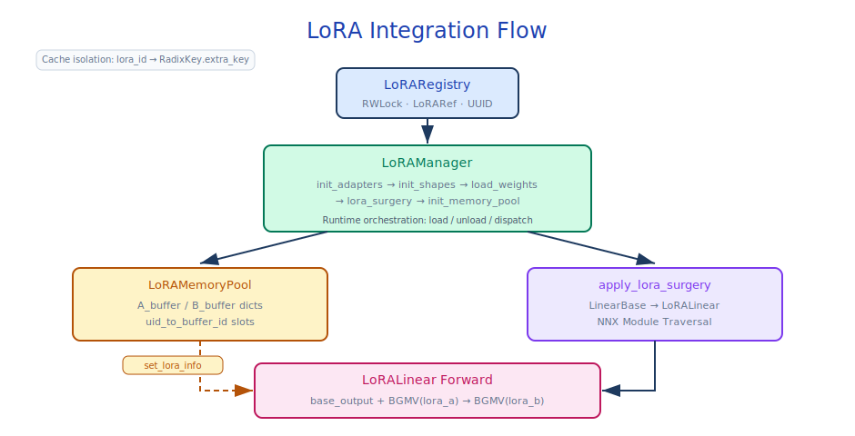

# LoRA Dynamic Adapters

## Module Overview

sglang-jax supports LoRA (Low-Rank Adaptation) dynamic adapters, allowing different LoRA weights to be loaded per-request at inference time. LoRA adds adaptation capability without modifying the original weights via low-rank matrix factorization: for the original weight `W`, the LoRA output is `W·x + (B·A)·x * scaling`, where `A` is the down-projection (`hidden → rank`), `B` is the up-projection (`rank → hidden`), and `scaling = alpha / rank`.

The system is implemented through a three-tier management architecture: `LoRARegistry` (adapter registry in the TokenizerManager process) → `LoRAManager` (weight management and model surgery in the Scheduler process) → `LoRAMemoryPool` (device-side weight buffer). LoRA weights are injected into the forward computation via the BGMV backend.

The V1 design of sglang-jax loads all configured adapters at startup. The `lora_eviction_policy` and `max_loaded_loras` parameters are reserved for future dynamic eviction support, but in the current version all configured adapters are loaded into memory in one pass at startup, and no eviction is triggered at runtime.



Core files involved:

- `lora/lora_registry.py` — `LoRARegistry`, adapter registration and reference counting
- `lora/lora_manager.py` — `LoRAManager`, weight loading and model surgery
- `lora/lora_memory_pool.py` — `LoRAMemoryPool`, device-side weight buffers
- `lora/layers.py` — `LoRALinear`, the LoRA weight injection layer
- `lora/context_manager.py` — `LoraBatchContext`, thread-local context
- `lora/lora_config.py` — LoRA configuration
- `lora/backend/` — BGMV backend implementation

## Prerequisite Reading

- [04-model-executor](04-model-executor.md) — ModelRunner and weight loading
- [06-layers-and-attention](06-layers-and-attention.md) — `LinearBase` layer
- [07-kv-cache](07-kv-cache.md) — Cache isolation mechanisms

---

## 10.1 Configuration

### Related ServerArgs Parameters

| Parameter | Default | Description |
|------|--------|------|
| `enable_lora` | `None` | Enable LoRA (auto-enabled when `lora_paths` is set) |
| `lora_paths` | `None` | Adapter paths (`name=path` / `path` / dict format) |
| `max_loras_per_batch` | `8` | Maximum LoRAs per batch |
| `max_lora_rank` | `None` | Maximum LoRA rank (auto-inferred from adapters) |
| `lora_target_modules` | `None` | Target module names (`"all"` for all supported modules) |
| `max_loaded_loras` | `None` | Maximum adapters in memory |
| `lora_eviction_policy` | `"lru"` | Eviction policy (reserved; eviction is not actually triggered in the current version) |
| `enable_static_lora` | `None` | Static LoRA mode (RL scenarios; mutually exclusive with `enable_lora`) |
| `lora_scaling` | `None` | Scaling factor for static LoRA (`alpha / rank`) |

### LoRA Configuration (`lora_config.py`)

Loads `adapter_config.json` from a HuggingFace LoRA adapter directory and extracts `r` (rank), `target_modules`, `lora_alpha`, etc.

---

## 10.2 Three-Tier Management Architecture

### 10.2.1 LoRARegistry (TokenizerManager process)

`LoRARegistry` (`lora/lora_registry.py`) manages adapter registration and lifecycle.

**Thread-safety**: Uses `RWLock` (read-write lock) to protect the registry; `ConcurrentCounter` tracks usage.

**Core methods**:

| Method | Description |
|------|------|
| `register(lora_ref: LoRARef)` | Register an adapter (async, writer lock) |
| `unregister(lora_name: str) -> str` | Unregister an adapter, returning the removed `lora_id` |
| `acquire(lora_name: str \| list[str])` | Acquire adapter reference (refcount +1, supports batch) |
| `release(lora_id: str \| list[str])` | Release adapter reference (refcount -1; note the parameter is `lora_id`, not name) |
| `wait_for_unload(lora_id: str)` | Wait until the given adapter's refcount reaches zero |

**LoRARef** (frozen dataclass): The reference object for each adapter; contains `lora_id` (UUID hex, auto-generated), `lora_name`, `lora_path`, `pinned`. The reference count is independently managed by `LoRARegistry`'s internal `ConcurrentCounter` and is not stored on `LoRARef`.

`lora_id` uses a UUID rather than a monotonically increasing integer because LoRA adapters can be registered and unregistered dynamically — integer IDs would leave holes after unregistration, and reusing IDs could cause new adapters to be incorrectly matched against old KV caches (RadixCache uses `lora_id` as a namespace key). UUID's global uniqueness ensures that even when an adapter with the same name is re-registered, it does not collide with the old cache.

### 10.2.2 LoRAManager (Scheduler process)

`LoRAManager` (`lora/lora_manager.py`) is the core of adapter weight loading and model surgery.

**Initialization flow** (`__init__` + `init_lora()`):

```text
1. init_lora_adapters()
   → Load adapter configs (adapter_config.json)
   → Create LoRAAdapter objects

2. init_lora_shapes()
   → Infer max_lora_rank (max rank across adapters)
   → Determine target_modules (union of all adapter modules)

3. Load weights
   → Read A/B weights from safetensors
   → Index weights by module name into LoRAAdapter.weights

4. apply_lora_surgery(model)
   → NNX model surgery (key step)

5. init_memory_pool()
   → Create device-side A/B buffers
```

**`apply_lora_surgery(model)`** — NNX model surgery:

Iterates over all `LinearBase` modules in the model. For modules matching `target_modules`:

1. Get the module's `kernel_axes` (TP sharding configuration)
2. Create a `LoRALinear` wrapping the `LinearBase`
3. Replace the module reference with `nnx.update`
4. After the swap, the model structure becomes: `model.layer.module` → `LoRALinear(original_linear=LinearBase(...))`

### 10.2.3 LoRAMemoryPool

`LoRAMemoryPool` (`lora/lora_memory_pool.py`) is registered as `@register_pytree_node_class`.

**Buffer layout**:

| Buffer | Shape | Description |
|--------|-------|------|
| `A_buffer[module_name]` | `list[jax.Array]`, per-layer shape `(max_loras_per_batch, max_lora_rank, in_dim)` | Down-projection weights (per-layer list) |
| `B_buffer[module_name]` | `list[jax.Array]`, per-layer shape `(max_loras_per_batch, out_dim, max_lora_rank)` | Up-projection weights (per-layer list) |

**Slot management**:

| Field | Description |
|------|------|
| `uid_to_buffer_id` | `dict[str \| None, int]` — LoRA UID → buffer slot ID |
| `buffer_id_to_uid` | `list[str \| None \| EmptySlot]` — buffer slot ID → LoRA UID (length `max_loras_per_batch`; idle slots marked `EMPTY_SLOT`) |

**Special handling**:

- **Composite modules (QKV / Gate-Up concat)**: `q_proj`, `k_proj`, `v_proj` are merged into a single `qkv_proj` buffer; A and B matrices are concatenated along the output dimension. Similarly, `gate_proj` + `up_proj` → `gate_up_proj`
- **GQA KV head replication**: When TP requires KV head replication, LoRA K/V weights are replicated along the head dimension to match
- **Rank padding**: Different adapters may have different ranks; all are padded to `max_lora_rank`. Adapters with smaller ranks have their A/B matrices padded with zeros in the extra dimensions

**`prepare_lora_batch(cur_uids, lora_adapters) -> bool`** — Called before each forward:

1. Collect all LoRA UIDs across requests in the batch
2. Look up or allocate buffer slots (slot 0 is reserved for non-LoRA requests; slots 1..max are usable)
3. If a LoRA's weights are not yet loaded into a slot, call `load_lora_weight_to_buffer()` to ferry the A/B weights to device
4. Returns `True` if new weights were loaded

---

## 10.3 Inference Integration

### 10.3.1 LoRALinear

`LoRALinear` (`lora/layers.py`) wraps `LinearBase` and injects the LoRA computation during forward.

**`__call__(x)`**:

```text
1. base_output, bias = self.base_layer(x)              # Original Linear computation
2. forward_batch = LoraBatchContext.get_batch()         # Get thread-local context
3. output = self.apply_lora(base_output, x,             # LoRA injection
                            forward_batch.lora_scalings,
                            forward_batch.lora_token_indices)
4. return (output, bias)
```

**`apply_lora(base_output, x, scalings, token_indices)`**:

```text
1. lora_a_output = self.lora_backend.run_lora_a_gemm(   # x → rank space
       x, weights=self.A_buffer, scalings=scalings,
       token_indices=token_indices)

2. lora_output = self.lora_backend.run_lora_b_gemm(     # rank → output space, added to base_output
       x=lora_a_output, weights=self.B_buffer,
       base_output=base_output,
       token_indices=token_indices)

3. return lora_output                                    # scaling is applied inside run_lora_a_gemm
```

### 10.3.2 LoraBatchContext

`LoraBatchContext` (`lora/context_manager.py`) implements thread-local context management using Python's `threading.local()`. The reason for using thread-local rather than passing through function parameters is that `LoRALinear` is nested deep inside the model structure (`Model → Layer → Attention → LoRALinear`); passing LoRA information by function arguments would require modifying every layer's signature from the forward entrypoint down to `LinearBase.__call__`, breaking the model's general interface. Thread-local lets `LoRALinear` directly fetch batch-specific LoRA information from context, while keeping the model interface unchanged.

- `set_batch(forward_batch)` — context manager that sets the current batch (only takes `ForwardBatch`, not `lora_memory_pool`)
- `get_batch() -> ForwardBatch | None` — returns the current batch

Before each forward, `ModelWorker` sets the context via `with LoraBatchContext.set_batch(batch):`, and the context is automatically cleared when the `with` block exits. This allows `LoRALinear` to access batch-specific LoRA information without modifying interfaces.

### 10.3.3 BGMV Backend

Source: `srt/lora/backend/bgmv_backend.py`

When LoRA binds different adapter weights to different requests within a batch, standard batched matmul cannot be used directly — traditional batched matmul assumes all tokens in the batch share a single weight matrix `W`, but in LoRA scenarios each token's `B·A` differs based on the adapter bound to its request, which is essentially a ragged computation. Slicing the batch by adapter and looping with separate matmuls breaks JIT compilation and forfeits vectorization gains — an unacceptable performance regression.

BGMV (Batched Gather Matrix-Vector Multiply) gathers, per token, the LoRA weights of that token's adapter, then performs a matvec — compressing "different adapter per token" into a JIT-friendly einsum: `one_hot(token_indices)` encodes adapter selection as a sparse matrix, which is then combined with the LoRA weights via `einsum("td,tX,Xld->tl")`. This pattern is recognized by the XLA compiler as a standard matrix multiplication and mapped to the TPU MXU — rather than directly using `weights[indices]` advanced indexing (which would compile to a Gather operation).

`BgmvLoRABackend` (`lora/backend/bgmv_backend.py`) implements Batched Gather Matrix-Vector Multiply.

**Core computation**:

```python
def bgmv_jax(inputs, loras, idxs, sharding):
    return jnp.einsum(
        "td,tX,Xld->tl",
        inputs,                                           # (num_tokens, input_dim)
        jax.nn.one_hot(idxs, loras.shape[0], dtype=inputs.dtype),  # (num_tokens, num_lora)
        loras,                                            # (num_lora, output_dim, input_dim)
        out_sharding=sharding,
    )
```

A single three-way `einsum("td,tX,Xld->tl")` realizes per-request weight selection and matrix multiplication. `shrink` (run_lora_a_gemm) multiplies by `scaling` after calling `bgmv_jax`; `expand` (run_lora_b_gemm) adds the result to `base_output`.

---

## 10.4 Cache Isolation

Each `LoRARef` owns a unique `lora_id` (UUID), serving as a namespace key throughout the system:

| Component | Isolation mechanism |
|------|---------|
| `LoRARegistry` | Registers and tracks reference counts by `lora_id` |
| `LoRAMemoryPool` | Manages buffer slots by `lora_id` (`uid_to_buffer_id`) |
| `RadixCache` | `Req.extra_key` concatenates `lora_id`, fully isolating KV caches across LoRA adapters |

Different LoRA adapters do not share prefix cache even with identical input tokens, because `RadixKey.extra_key` includes `lora_id`, making the paths through the radix tree fully independent.

---

## 10.5 Static LoRA

The `enable_static_lora` mode is intended for RL (reinforcement learning) scenarios and is mutually exclusive with the standard `enable_lora`:

- Supports only one LoRA adapter
- Weights are merged directly into the base model (`W' = W + scaling * B·A`); BGMV is not used
- Requires explicit `lora_scaling` (`alpha / rank`)
- More efficient but does not support per-request switching

---

## Key Interfaces At a Glance

| Interface | Location | Description |
|------|------|------|
| `LoRARegistry` | `lora/lora_registry.py` | Adapter registration and reference counting (RWLock thread-safe) |
| `LoRARef` | `lora/lora_registry.py` | Adapter reference object (UUID `lora_id`) |
| `LoRAConfig` | `lora/lora_config.py` | Adapter config loader (`adapter_config.json` → `r`, `target_modules`, `lora_alpha`) |
| `LoRAAdapter` | `lora/lora.py` | Adapter core object (holds per-layer LoRA weights and scaling) |
| `LoRAManager` | `lora/lora_manager.py` | Core of weight loading and model surgery |
| `LoRAManager.apply_lora_surgery()` | `lora/lora_manager.py` | NNX model surgery (`LinearBase` → `LoRALinear`) |
| `LoRAManager.init_memory_pool()` | `lora/lora_manager.py` | Create device-side A/B buffers |
| `LoRAMemoryPool` | `lora/lora_memory_pool.py` | Device-side A/B buffer management (pytree-registered) |
| `LoRAMemoryPool.prepare_lora_batch()` | `lora/lora_memory_pool.py` | Per-forward LoRA slot allocation and weight loading |
| `BaseLayerWithLoRA` | `lora/layers.py` | Base class for LoRA layers (parent of `LoRALinear`, `LoRAEmbedding`) |
| `LoRALinear` | `lora/layers.py` | LoRA weight injection layer (wraps `LinearBase`) |
| `apply_lora()` | `lora/layers.py` | Two-step BGMV computation (A → B → scaling) |
| `LoraBatchContext` | `lora/context_manager.py` | Thread-local context manager |
| `BaseLoRABackend` | `lora/backend/base_backend.py` | Abstract LoRA compute backend (`run_lora_a_gemm`, `run_lora_b_gemm`) |
| `BgmvLoRABackend` | `lora/backend/bgmv_backend.py` | Batched Gather Matrix-Vector Multiply |
| `bgmv_jax()` | `lora/backend/bgmv_backend.py` | Core BGMV computation (`einsum("td,tX,Xld->tl")`) |
