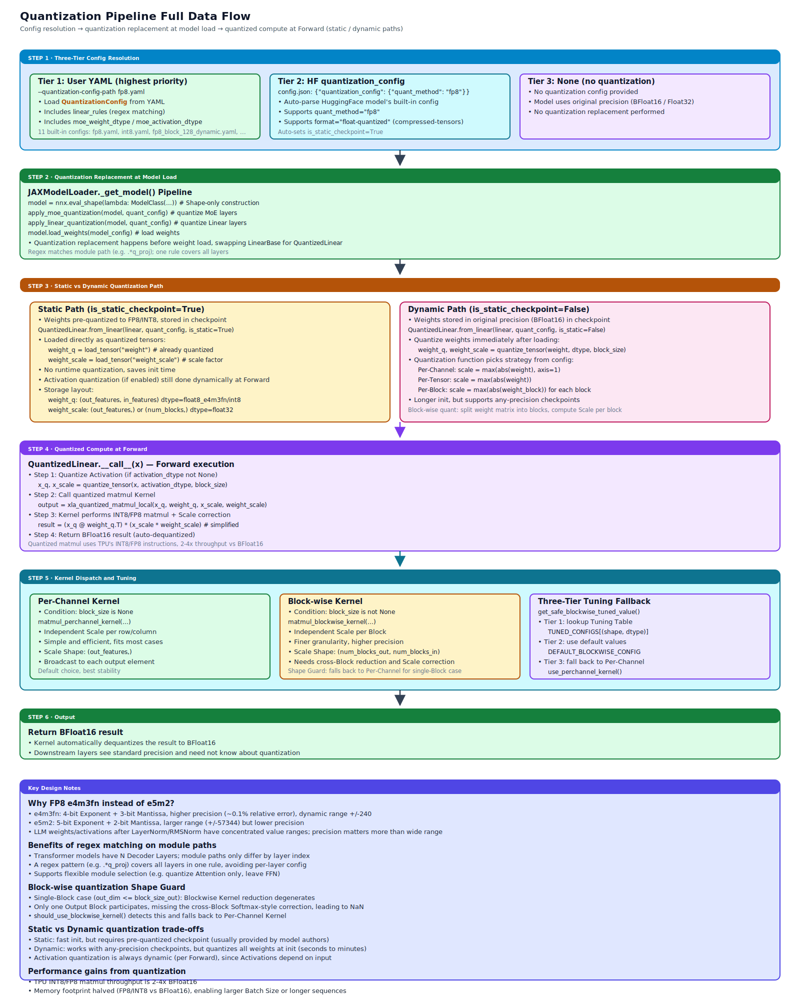

# Quantization

## Module Overview

sglang-jax supports multiple quantization schemes (FP8 / INT8 / Block-wise Dynamic) through a configuration-driven pipeline: YAML configs define quantization rules → `LinearBase` is replaced by `QuantizedLinear` at model load time → quantization Pallas kernels are invoked during forward. Both static checkpoints (pre-quantized weights) and dynamic quantization (runtime activation quantization) are supported.



Core files involved:

- `configs/quantization_config.py` — `QuantizationConfig`, quantization config definition
- `utils/quantization/configs/` — Built-in YAML configs (11 built-ins)
- `utils/quantization/quantization_utils.py` — Quantization application utilities (`apply_linear_quantization()`, `apply_moe_quantization()`)
- `utils/quantization/debug_utils.py` — MoE quantization debug stats
- `layers/linear.py` — `QuantizedLinear` layer
- `kernels/quantized_matmul/` — Quantized matmul Pallas kernels

## Prerequisite Reading

- [04-model-executor](04-model-executor.md) — Model loading pipeline
- [06-layers-and-attention](06-layers-and-attention.md) — `LinearBase` and `QuantizedLinear`
- [08-pallas-kernels](08-pallas-kernels.md) — Quantization kernel implementation

---

## 11.1 Supported Quantization Schemes

| Scheme | Built-in config | Description |
|------|----------|------|
| FP8 Per-Channel | `fp8.yaml`, `fp8_w8a8.yaml` | Both weights and activations are FP8 |
| FP8 Block-wise Dynamic | `fp8_block_128_dynamic.yaml` | Block-granular dynamic quantization |
| FP8 Model-specific | `fp8_deepseek_v3.yaml`, `fp8_grok.yaml`, `fp8_qwen3_30b_a3b.yaml`, `fp8_bailing.yaml` | Tuned for specific models |
| Compressed-tensors W8A16 FP8 | Auto-detected from HF `quantization_config` (e.g. Ling-2.6-1T) | per-channel weight FP8, weight-only, `ignore` list skips specified layers (e.g. NextN/MTP layer 80 keeps BF16) |
| INT8 Per-Channel | `int8.yaml`, `int8_w8a8.yaml` | Both weights and activations are INT8 |
| INT8 Block-wise Dynamic | `int8_block_128_dynamic.yaml` | Block-granular dynamic quantization |
| INT8 Hybrid | `int8_moe_block_128_linear_channel_dynamic.yaml` | MoE block + Linear channel |

**FP8 dtype**: `jnp.float8_e4m3fn` (4-bit exponent, 3-bit mantissa). The choice of e4m3fn over e5m2 is because: e4m3fn's 3-bit mantissa offers higher precision (~0.1% relative error), at the cost of a smaller dynamic range (±240 vs ±57344) from its 4-bit exponent. After LayerNorm/RMSNorm, LLM weight and activation values cluster in a narrow range and don't need a large dynamic range, but they are precision-sensitive — accuracy loss directly degrades generation quality.
**INT8 dtype**: `jnp.int8`.

---

## 11.2 QuantizationConfig

`QuantizationConfig` (`configs/quantization_config.py`):

### Core Fields

| Field | Type | Description |
|------|------|------|
| `linear_rules` | `list[dict] \| None` | Per-module quantization rule list (each rule is a dict containing keys like `module_path`, `weight_dtype`) |
| `moe_weight_dtype` | `jnp.dtype \| None` | MoE-layer weight quantization dtype |
| `moe_activation_dtype` | `jnp.dtype \| None` | MoE-layer activation quantization dtype |
| `is_static_checkpoint` | `bool` | Whether this is a pre-quantized checkpoint |
| `ignored_layers` | `list[str] \| None` | List of layer-name patterns to ignore |
| `weight_block_size` | `tuple[int, int] \| None` | Block-wise quantization sizes `(block_n, block_k)` |

### Quantization Rules (dict format)

Each rule is a dict (parsed directly from YAML, no typed class), containing the following keys:

| Key | Description |
|-----|------|
| `module_path` | Regex pattern matching the module path |
| `weight_dtype` (or `weight_qtype`) | Weight quantization dtype |
| `activation_dtype` (or `act_qtype`) | Activation quantization dtype (optional) |
| `weight_block_size` | Block quantization size (optional, overrides global setting) |

`module_path` uses a regex rather than an exact name because Transformer models have N decoder layers, with module paths differing only in layer index (e.g. `model.layers.0.self_attn.q_proj` vs `model.layers.31.self_attn.q_proj`). A regex pattern (e.g. `.*q_proj`) covers all layers in a single rule, avoiding per-layer configuration.

### Loading

`from_yaml(path)` — Load configuration from a YAML file. Path resolution priority:

1. Absolute path
2. Relative path
3. Built-in config name (e.g. `int8.yaml` → `utils/quantization/configs/int8.yaml`)

---

## 11.3 Quantization Config Resolution

`ModelConfig._resolve_quantization_config()` implements three-tier priority:

| Priority | Source | Description |
|--------|------|------|
| Tier 1 (highest) | `--quantization-config-path` | User-provided YAML config path |
| Tier 2 | HuggingFace `quantization_config` | Model-shipped quantization config (`config.json`) |
| Tier 3 (lowest) | `None` | No quantization |

**Tier 2 auto-resolution**:

- `quant_method == "fp8"` → automatically build an FP8 config, `is_static_checkpoint=True`, supporting optional `ignored_layers` and `weight_block_size`
- `quant_method == "compressed-tensors"` + `format == "float-quantized"` → FP8 config, detects `input_activations` to decide whether to dynamically quantize activations
- `quant_method == "compressed-tensors"` + per-channel FP8 W8A16 (e.g. Ling-2.6-1T) → after reading `weights.strategy="channel"`, **does not** set `block_size`, falling back to the weight-only per-channel FP8 path; also reads the `ignore` list and drops dynamic-activation hints; model layers (e.g. `bailing_hybrid`) need to pass `num_nextn_predict_layers` / `mtp_loss_scaling_factor` / `quantization_config` through to `PretrainedConfig` to avoid HF `from_dict` raising
- Other `quant_method` → warn and return `None`

**`allow_narrow_n_blockwise` field**: `QuantizationConfig` adds `allow_narrow_n_blockwise: bool = False`; on the blockwise FP8 path, when GEMM has a narrow N dimension and this flag is True, the narrow-N kernel is taken; otherwise the general path continues. DeepSeek V3's `fp8_deepseek_v3.yaml` defaults this to True to remain compatible with its absorbed-MLA KV projection weight layout.

---

## 11.4 Built-in YAML Configs

### Example Config Structure

```yaml
quantization:
  linear:
    rules:
      - module_path: ".*"
        weight_dtype: "float8_e4m3fn"

  moe:
    weight_dtype: "float8_e4m3fn"
    activation_dtype: null
```

The YAML structure requires a top-level `quantization` key, beneath which `linear` (containing a `rules` list) and `moe` (containing `weight_dtype`, `activation_dtype`) sub-nodes are required. `from_yaml()` parsing requires both sub-nodes to be present.

### Config Comparison

| Config | Weight dtype | Activation dtype | Scale | Block size |
|------|-------------|------------------|-------|------------|
| `fp8.yaml` | float8_e4m3fn | float8_e4m3fn | per_channel | — |
| `fp8_block_128_dynamic.yaml` | float8_e4m3fn | float8_e4m3fn | per_block | (128, 128) |
| `int8.yaml` | int8 | int8 | per_channel | — |
| `int8_block_128_dynamic.yaml` | int8 | int8 | per_block | (128, 128) |
| `fp8_deepseek_v3.yaml` | float8_e4m3fn | float8_e4m3fn | per_channel | — |
| Compressed-tensors W8A16 per-channel FP8 (Ling-2.6-1T etc.) | float8_e4m3fn | — | per-channel weight only | — |
| `int8_moe_block_128_...` | int8 (MoE: block) | int8 | hybrid | (128, 128) |

Model-specific configs (`fp8_grok.yaml`, `fp8_bailing.yaml`, etc.) use finer regex patterns in `linear_rules` to match specific layer names.

---

## 11.5 Quantization Application Pipeline

### 11.5.1 Overall Flow

```text
JAXModelLoader._get_model()
  ├── nnx.eval_shape() — Shape-only model creation
  ├── apply_moe_quantization()  ← Static-quantization checkpoint
  ├── apply_linear_quantization()  ← Static-quantization checkpoint
  └── model.load_weights() — Load actual weights
```

### 11.5.2 apply_linear_quantization

`apply_linear_quantization(model_config: ModelConfig, model: nnx.Module, is_static_input: bool = False)` iterates over all `LinearBase` modules in the model:

1. Get the module's full path (e.g. `model.layers.0.self_attn.q_proj`)
2. Match `linear_rules` regex patterns in order
3. Replace matched modules with `QuantizedLinear.from_linear(linear, rule)`
4. Leave unmatched modules unchanged
5. Modules in `ignored_layers` are always skipped

### 11.5.3 apply_moe_quantization

`apply_moe_quantization(model_config: ModelConfig, model: nnx.Module, is_static_input: bool = False)` finds `EPMoE` / `FusedEPMoE` modules:

1. Locate the MoE module
2. Call `moe_module.quantize_weights(is_static=is_static_input)`
3. Set the MoE's internal quantization dtype and scale

---

## 11.6 QuantizedLinear

`QuantizedLinear` (`layers/linear.py`) stores pre-quantized weights and scales.

### 11.6.1 from_linear

`QuantizedLinear.from_linear(linear, rule)` is a classmethod that converts a `LinearBase` to `QuantizedLinear`:

**Static checkpoint path**:

- Stores `weight_q` (shape `[output_size, input_size]`, transposed storage) and `weight_scale`. `weight_q` keeps the HuggingFace `[out, in]` layout rather than being transposed to `[in, out]` because the quantization kernel `xla_quantized_matmul_local` accepts the original `[out, in]` format and handles transposition internally — this allows pre-quantized checkpoint weights to be loaded directly without transposition at load time (transposing after quantization would scramble the per-channel scale correspondence)
- Scale format depends on quantization mode: per-channel → `[n_out]`; block-wise → `[in_blocks, 1, n_out]`
- Block-wise scales are pre-expanded into kernel-ready format at initialization

**Dynamic quantization path**:

- Performs `quantize_tensor()` on float32/bfloat16 weights at runtime
- Supports three modes: per-channel / per-tensor / per-block

### 11.6.2 Forward Computation

`__call__(x)` invokes the `xla_quantized_matmul_local()` kernel via `shard_map`:

```text
Per-channel path:
  quantize(x) → dot_general(x_q, w_q) → rescale(x_scale * w_scale)

Block-wise path:
  → blockwise Pallas kernel
```

In Row Parallel mode, the kernel internally performs `lax.psum` reduction (via the `reduce_axis` parameter).

**Cooperation between Absorbed MLA and quantized KV projection** (DeepSeek V3): On the absorbed-MLA path, `DeepseekV3Attention` needs to reshape the `kv_b_proj` weight to `(kv_lora_rank, num_heads, qk_nope_head_dim + v_head_dim)` to form the equivalent absorbed matrix. When `kv_b_proj` has been replaced by `QuantizedLinear` (i.e., for a quantized checkpoint), the model first dequantizes `weight_q × weight_scale` to BF16 according to the block-wise or per-channel config before reshaping for the absorb computation, avoiding semantic corruption from reshaping quantized weights directly.

---

## 11.7 quantize_tensor

Source: `srt/utils/quantization/quantization_utils.py`

Quantization maps fp16/bf16 weights into int8/int4 integer space to reduce memory footprint and bandwidth, but integer types cannot express the true numeric range of floats — a scale float coefficient must be stored alongside, and dequantization recovers the original values via `dequant = q * scale`. The scale's "scope" defines the quantization granularity: coarser granularity means more elements share the same scale, lowering storage cost but letting a single outlier blow up the dynamic range of the entire group and degrade precision; finer granularity lets the scale fit local distributions more tightly, preserving precision but increasing both the scale tensor size and the dequant compute cost.

The three modes of `quantize_tensor` are exactly three sample points along this trade-off axis: per-tensor uses one scale for the whole tensor (cheapest storage, outlier-sensitive), per-channel uses one scale per output channel (preferred by Llama and similar models, balancing precision and overhead), and per-block splits the weight into `(block_n, block_k)` blocks each with its own scale (robust against outliers, but requires the kernel to reshape data layout per block). The three modes in the table below correspond to these three trade-off points:

`quantize_tensor(tensor, dtype, ...)` — Core quantization function, supporting three modes:

| Mode | Description |
|------|------|
| Per-Channel | Independent scale per output channel (`axis=-1`) |
| Per-Tensor | Single scale across the entire tensor |
| Per-Block | Block-level scale (reshape → per-block max → scale) |

**Sharding handling for block quantization**:

`_get_block_reshape_sharding()` and `_get_safe_block_quant_input_sharding()` ensure block reshape operations are consistent with JAX `NamedSharding`. When the block size doesn't match sharding, the sharding strategy is adjusted automatically.

---

## 11.8 Block-wise Kernel Tuning

Source: `srt/kernels/quantized_matmul/blockwise_utils.py`

The Pallas kernel for block-wise quantized matmul must pick its compute tile sizes `(block_m, block_n, block_k)` at compile time — when M is small, increasing `block_m` wastes compute; when K is large, increasing `block_k` overflows VMEM; performing online search for the optimal tile per shape requires recompiling the kernel, with overhead far exceeding any runtime gain. `blockwise_utils.py` precomputes a "input shape → optimal block size" table, with three runtime fallback tiers: (1) look up the precomputed `TUNED_BLOCK_SIZES` table, (2) call the runtime tuning API, (3) fall back to the `TunedValue(128, 128, 128, 1)` default — all wrapped by `get_safe_blockwise_tuned_value`.

### Tier 1 — Precomputed Lookup Table

`TUNED_BLOCK_SIZES` dict, keyed by `(TPU version, dtype, shape)`. `_iter_blockwise_tuned_candidates()` ranks candidate configs lexicographically:

1. Exact activation-dtype match preferred
2. Nearest `n_in` match
3. Nearest `n_batch` match
4. Nearest `n_out` match

### Tier 2 — Runtime Tuning API

`get_tuned_block_sizes()` queries the runtime tuning API.

### Tier 3 — Conservative Default

`TunedValue(128, 128, 128, 1)` — fallback config.

### Post-resolution Correction

After the initial tuned value is obtained, tile-size correction is applied:

- `out_block_size` aligned to the nearest power-of-two multiple of `compute_tile_n = 256 * n_lane_multiplier`
- `in_block_size` aligned to `block_size_in`

### Shape Guard

`should_use_blockwise_kernel(out_dim, block_size_out)` — uses the blockwise kernel when `out_dim > block_size_out`. When a tensor-parallel column shard collapses to a single output block (typical case: local N=128 with `block_size_out=128`), the TPU blockwise kernel produces NaN on Qwen3-MoE k/v projections, so this narrow-N path falls back to the per-channel kernel.

---

## 11.9 Debug Tooling

`debug_utils.py` — Enabled via the `SGLANG_MOE_QUANT_STATS=1` environment variable:

- Collects tensor stats before and after MoE-layer quantization
- Outputs quantization error analysis (max abs error, relative error)
- Used to verify that quantization precision meets requirements

---

## Key Interfaces At a Glance

| Interface | Location | Description |
|------|------|------|
| `QuantizationConfig` | `configs/quantization_config.py` | Quantization config definition (`linear_rules` is `list[dict]`) |
| `QuantizationConfig.from_yaml()` | `configs/quantization_config.py` | Load config from YAML (requires `quantization.linear.rules` + `quantization.moe` structure) |
| `apply_linear_quantization()` | `utils/quantization/quantization_utils.py` | Linear-layer quantization replacement (regex matching) |
| `apply_moe_quantization()` | `utils/quantization/quantization_utils.py` | MoE-layer quantization |
| `quantize_tensor()` | `utils/quantization/quantization_utils.py` | Core quantization function (per-channel / per-tensor / per-block) |
| `QuantizedLinear` | `layers/linear.py` | Quantized Linear layer (stores `weight_q` + `weight_scale`) |
| `QuantizedLinear.from_linear()` | `layers/linear.py` | Convert from `LinearBase` (static/dynamic paths) |
| `xla_quantized_matmul_local()` | `kernels/quantized_matmul/kernel.py` | Quantized matmul (per-channel / block-wise dispatch) |
| `get_safe_blockwise_tuned_value()` | `kernels/quantized_matmul/blockwise_utils.py` | Three-tier tuning fallback |
| `should_use_blockwise_kernel()` | `kernels/quantized_matmul/blockwise_utils.py` | Shape guard (avoid NaN) |
| `ModelConfig._resolve_quantization_config()` | `configs/model_config.py` | Three-tier config resolution |
