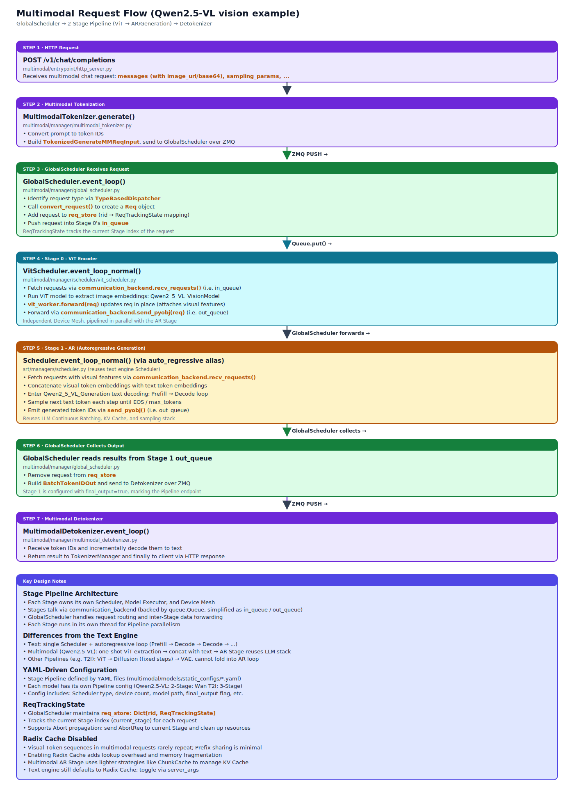

# Multimodal Subsystem

## Module Overview

sglang-jax's multimodal subsystem is an independent parallel architecture supporting text-to-image / video (Wan), vision-language understanding (Qwen2.5-VL), omni-modal (Qwen3-Omni), and audio (MiMo Audio) modalities. Unlike the single-Scheduler architecture used for text inference, multimodal uses a `GlobalScheduler` to orchestrate a multi-stage pipeline, with each stage owning its own Scheduler, Model Executor, and device mesh. The reason for adopting an independent multi-stage architecture rather than reusing the text engine is that multimodal tasks have computational patterns fundamentally different from autoregressive text generation: Diffusion requires fixed-step iterative denoising, ViT processes the full image patch grid in one pass, VAE needs large memory blocks for latent decoding — these stages have different scheduling strategies, memory management, and parallelism patterns, and cannot be unified into the text engine's prefill-decode loop.

Multimodal mode automatically disables the radix cache because the prefix-sharing rate of multimodal requests is extremely low — each image/video's visual token sequence is highly unlikely to overlap with another request's, so the maintenance overhead of the radix tree (LRU tracking, refcounts, eviction logic) yields no payoff in prefix reuse.

**`Modality` enum** (`multimodal/common/modality_enum.py`): `IMAGE`, `MULTI_IMAGES`, `VIDEO`, `AUDIO`



Core files involved:

- `multimodal/entrypoint/http_server.py` — Multimodal HTTP server
- `multimodal/manager/global_scheduler.py` — `GlobalScheduler`, global scheduling
- `multimodal/manager/stage.py` — `Stage`, pipeline stage definition
- `multimodal/manager/device_manager.py` — Device mesh allocation
- `multimodal/manager/scheduler/` — Per-modality Schedulers
- `multimodal/model_executor/` — Per-modality Model Executors
- `multimodal/models/` — Per-modality model implementations
- `multimodal/configs/` — Multimodal configuration
- `multimodal/common/` — Shared utilities (`Modality` enum, `ServerArgs`, etc.)

## Prerequisite Reading

- [01-architecture-overview](01-architecture-overview.md) — System overview
- [03-scheduler](03-scheduler.md) — Scheduling mechanism of the text Scheduler

---

## 12.1 Entrypoint

### HTTP Server

`multimodal/entrypoint/http_server.py` — A standalone FastAPI app that exposes 6 endpoints:

| Endpoint | Description |
|----------|------|
| Image Generation | Text-to-image |
| Video Generation | Text-to-video |
| Audio Generation | Text-to-speech (TTS) |
| Audio Understanding | Speech recognition (ASR) |
| VLM Chat | Vision-language understanding |
| Health Check | Health check |

### MultimodalTokenizer

`multimodal/manager/multimodal_tokenizer.py` — Multimodal-specific tokenizer that handles image/video/audio placeholder token replacement and position computation.

### Detokenizer

`multimodal/manager/multimodal_detokenizer.py` — `MultimodalDetokenizer` (inherits from `DetokenizerManager`); handles post-processing of generation outputs (e.g., image decoding, audio waveform reconstruction).

---

## 12.2 GlobalScheduler

Source: `srt/multimodal/manager/global_scheduler.py`

`GlobalScheduler` (`multimodal/manager/global_scheduler.py`) is the core scheduler for multimodal.

Multimodal requests branch into different entry message types by sub-modality — `TokenizedGenerateMMReqInput` for image/video generation, `TokenizedGenerateOmniReqInput` for omni-modal, `TokenizedGenerateAudioReqInput` for audio — each with its own preprocessing pipeline (images need resize+patchify, videos need frame sampling, audio needs mel feature extraction). Hand-dispatching all of these in one giant if/elif would force the GlobalScheduler event loop to carry knowledge of every modality, requiring main-loop changes whenever a new modality is added — a violation of the open/closed principle.

`TypeBasedDispatcher` (`sgl_jax.utils`) registers handler lists keyed by message protobuf type, so the event loop only invokes the dispatcher and need not know specific types — `GlobalScheduler.__init__` injects mappings like `(TokenizedGenerateMMReqInput, self.convert_request)`, `(TokenizedGenerateOmniReqInput, self.convert_omni_request)` into `_request_dispatcher`. Adding a new modality only requires appending a `(type, handler)` pair, leaving the event loop untouched. Control messages such as `AbortReq` and `ProfileReq` also flow through the same dispatcher, unifying dispatch across all ZMQ entrypoints.

### Event Loop

```text
ZMQ receives tokenized request
  → TypeBasedDispatcher dispatches by request type
    ├── TokenizedGenerateMMReqInput → image/video generation
    ├── TokenizedGenerateOmniReqInput → omni-modal
    └── TokenizedGenerateAudioReqInput → audio
  → Request enters Stage 0's input queue
  → Stages process in series
  → Final result is sent to Detokenizer
```

### ReqTrackingState

Per-request lifecycle tracking (`@dataclass`):

| Field | Type | Description |
|------|------|------|
| `req` | `Req` | Request object |
| `current_stage` | `int` | Current stage index (0-indexed; `-1` means not yet in the pipeline) |

### Abort Propagation

When a request is canceled, `GlobalScheduler` sends an abort signal to the stage currently processing the request, and the stage's internal Scheduler cleans up the relevant resources.

### YAML Stage Config Loading

The GlobalScheduler loads stage pipeline definitions from YAML files. Each model has its own pipeline configuration file (under the `multimodal/models/static_configs/` directory).

---

## 12.3 Stage Pipeline

`Stage` (`multimodal/manager/stage.py`) is the basic execution unit of the pipeline.

### Stage Structure

Each stage contains:

| Component | Description |
|------|------|
| Device Mesh | An independent JAX mesh allocated by `DeviceManager` |
| Input Queue | Receives requests from upstream stages or the GlobalScheduler |
| Output Queue | Outputs to downstream stages or the Detokenizer |
| Scheduler | Modality-specific Scheduler |
| Model Executor | Modality-specific Model Runner |

### Scheduler Types

| Scheduler | Applicable modality | Description |
|-----------|----------|------|
| `DiffusionScheduler` | Text-to-image / video | Manages diffusion-step iteration |
| `VaeScheduler` | VAE decoding | Latent → pixel decoding scheduling |
| `VitScheduler` | Vision Transformer | Image patch encoding |
| `EmbedScheduler` | Text embedding | Text encoder feature extraction |
| `AudioScheduler` | Audio | Audio feature extraction/generation |
| `AudioBackboneScheduler` | Audio backbone | Audio model backbone network |

The `auto_regressive` Scheduler type in the YAML config reuses the text engine's Scheduler and does not have a dedicated implementation under `multimodal/manager/scheduler/`.

### DeviceManager

`DeviceManager` (`multimodal/manager/device_manager.py`) manages device mesh allocation:

- **Greedy in-order allocation**: In stage definition order, allocate the required number of devices from the available pool. The greedy strategy is used rather than an optimal allocation because the stage pipeline runs serially (the next stage starts only after the previous finishes), so there is no inter-stage device contention; in-order allocation already guarantees no conflicts. More elaborate algorithms (e.g., considering device-topology affinity) yield limited benefit under the current serial model
- Each stage receives an independent JAX mesh, with no device overlap
- Supports TP (tensor parallel) configuration

---

## 12.4 Model Implementations and Pipeline Configs

### Model Families

| Directory | Model | Pipeline stages |
|------|------|--------------|
| `wan/` | Wan 2.1/2.2 | Embed → Diffusion → VAE |
| `qwen2_5VL/` | Qwen2.5-VL | ViT → AutoRegressive |
| `qwen3_omni_moe/` | Qwen3-Omni-MoE | ViT → AutoRegressive → Audio |
| `mimo_audio/` | MiMo Audio | Audio → AutoRegressive |
| `diffusion_solvers/` | Diffusion Solvers | Used inside diffusion steps |

### Stage Pipeline YAML Configs

Each model has a corresponding YAML config under `multimodal/models/static_configs/`:

**Wan 2.1 example** (3-stage pipeline, `wan2_1_stage_config.yaml`):

```text
Stage 0: scheduler=auto_regressive, model_class=UMT5EncoderModel
  → Text encoding (reuses the text engine's Scheduler)

Stage 1: scheduler=diffusion, model_class=WanTransformer3DModel
  → N-step diffusion denoising

Stage 2: scheduler=vae, model_class=AutoencoderKLWan, final_output=true
  → Latent → pixel decoding
```

**Qwen2.5-VL example** (2-stage pipeline):

```text
Stage 0: scheduler=vit, VitModelExecutor
  → Image patches → visual tokens

Stage 1: scheduler=auto_regressive (reuses the text-engine Scheduler), LLM ModelExecutor
  → Visual tokens + text tokens → autoregressive generation
```

**Qwen3-Omni example** (3-stage pipeline):

```text
Stage 0: scheduler=vit, VitModelExecutor
  → Image/video → visual tokens

Stage 1: scheduler=auto_regressive (reuses the text-engine Scheduler), LLM ModelExecutor
  → Multimodal tokens → autoregressive generation

Stage 2: scheduler=audio, AudioModelExecutor
  → Text tokens → audio waveform
```

### YAML Config Fields

Each stage's YAML definition contains:

| Field | Description |
|------|------|
| `stage_id` | Stage index (0-indexed) |
| `stage_sub_dir` | Model weights sub-directory (e.g., `"text_encoder"`, `"transformer"`, `"vae"`) |
| `scheduler` | Scheduler type name (`"auto_regressive"`, `"diffusion"`, `"vae"`, etc.) |
| `scheduler_params` | Extra Scheduler parameters (dict) |
| `model_class` | Model class name (e.g., `"UMT5EncoderModel"`, `"WanTransformer3DModel"`) |
| `runtime` | Runtime config, including `num_tpus` (number of devices) and `max_batch_size` |
| `precompile_params` | Pre-compile parameters (optional) |
| `final_output` | Whether this is the pipeline's final-output stage (`bool`) |

---

## 12.5 Model Executor

`multimodal/model_executor/` organizes per-modality Model Executors:

| Directory | Description | Core class |
|------|------|--------|
| `audio/` | Audio processing | Audio encoding/decoding execution |
| `diffusion/` | Diffusion model execution | Manages denoising steps, invokes UNet/DiT |
| `embed/` | Embedding extraction | Text encoder forward |
| `vae/` | VAE encode/decode | Latent ↔ pixel conversion |
| `vit/` | Vision Transformer | Image patch encoding |

Each Model Executor encapsulates its modality's:

- Model loading (HuggingFace weights)
- JIT compilation
- Forward inference execution
- Input/output data format conversion

---

## 12.6 Multimodal Request Data Flow

End-to-end data flow for Wan text-to-video as an example:

```text
HTTP Request (text prompt + params)
  → MultimodalTokenizer
    → Tokenize + build TokenizedGenerateMMReqInput
  → GlobalScheduler
    → TypeBasedDispatcher → Wan Pipeline

  → Stage 0 (Embed)
    → EmbedScheduler → EmbedModelExecutor
    → Text → CLIP/T5 embedding

  → Stage 1 (Diffusion)
    → DiffusionScheduler → DiffusionModelExecutor
    → N-step denoising (DiT forward × N)
    → Output latent tensor

  → Stage 2 (VAE)
    → VaeScheduler → VaeModelExecutor
    → Latent → pixel decode

  → Detokenizer
    → Pixel → image/video file
  → HTTP Response
```

### Req Dataclass

Multimodal uses an independent `Req` dataclass (`multimodal/manager/schedule_batch.py`), distinct from the text engine's `Req`. This dataclass contains many fields to cover all modalities:

| Field category | Representative fields | Description |
|---------|---------|------|
| Request identity | `rid`, `data_type` | Request ID and data type |
| Text input | `prompt`, `input_ids`, `negative_prompt` | Raw text and tokens |
| Image input | `image_path`, `pixel_values`, `pil_image` | Image data (multiple formats) |
| Audio input | `audio_input`, `mel_input`, `audio_codes` | Audio data |
| VLM input | `vision_embeds`, `image_grid_thw`, `video_grid_thw` | Vision-language model inputs |
| Latent state | `latents`, `noise_pred`, `timesteps`, `step_index` | Diffusion intermediate state |
| Generation params | `num_inference_steps`, `guidance_scale`, `height`, `width` | Generation control parameters |
| Processing state | `is_prefill`, `is_finished`, `is_prompt_processed` | Runtime state |
| Result | `output`, `trajectory_latents` | Output data |

Requests across modalities share the same `Req` class, populating the relevant fields as needed. The `to_stage_reqs(scheduler)` method converts the request into the format required by each stage's Scheduler.

---

## 12.7 Multimodal-specific Components

The following are supporting components used inside each stage's executor, grouped by type.

### Multimodal Kernels

`multimodal/kernels/` — Modality-specific Pallas kernels, such as:

- Diffusion-related noise scheduling kernels
- VAE convolution kernels

### Multimodal Layers

`multimodal/layers/` — Modality-specific compute layers:

- Multimodal attention backends
- Cross-attention layers
- Modality-specific normalization

### Multi-dimensional RoPE

Source: `srt/multimodal/manager/mrope_utils.py`

Standard RoPE applies a rotation matrix along the head_dim dimension to encode a token's 1D sequence position into queries/keys — this is sufficient for plain text because the position information of a text token is its sequence index. But image/video tokens have positions in three dimensions simultaneously: time, height, and width (the `(h, w)` patch in frame `t` of a video). If those three dimensions are linearized into a single 1D index and fed to standard RoPE, the model cannot distinguish "different spatial positions in the same frame" from "the same spatial position in different frames" — the two might be mapped to very close 1D positions, and attention has trouble disentangling spatiotemporal relationships.

MRoPE (Multi-dimensional RoPE) splits `head_dim` into three segments and uses three independent position sequences (T, H, W) to apply RoPE rotation, then concatenates them back along the head dimension. `compute_mrope_positions` outputs `positions` with shape `[3, num_tokens]`, providing three-dimensional coordinates per token. During attention computation, each of the three sub-spaces perceives one position dimension, naturally letting the model distinguish spatiotemporal positions within the same attention head. Vision-language models like Qwen2.5-VL and Qwen3-Omni rely on this mechanism for spatiotemporal alignment of image patches and video frames.

### Prompt Builder

`multimodal/manager/prompt_builder.py` — Builds multimodal prompts:

- Inserts image/video placeholder tokens
- Computes the number of visual tokens
- Handles multi-image scenarios

---

## 12.8 ServerArgs Multimodal Parameters

| Parameter | Default | Description |
|------|--------|------|
| `multimodal` | `False` | Enable the multimodal HTTP server |

Auto-behaviors when `multimodal` is enabled:

- Radix cache is automatically disabled (`disable_radix_cache = True`)
- The multimodal HTTP server replaces the standard HTTP server
- `GlobalScheduler` is initialized in place of the standard `Scheduler`

**Environment variables**:

| Variable | Default | Description |
|------|--------|------|
| `VIDEO_MAX_PIXELS` | `128000 * 28 * 28 * 0.9` | Qwen video total-pixel cap |
| `SGLANG_WAIT_TIMEOUT` | `600` (multimodal) | Async operation timeout (seconds) |
| `SGLANG_HEALTH_CHECK_TIMEOUT` | `20` | Health check timeout (seconds) |

---

## Key Interfaces At a Glance

| Interface | Location | Description |
|------|------|------|
| `launch()` | `multimodal/entrypoint/http_server.py` | Multimodal Server launch entrypoint |
| `GlobalScheduler` | `multimodal/manager/global_scheduler.py` | Multimodal global scheduler |
| `TypeBasedDispatcher` | `sgl_jax/utils.py` | Request type dispatcher (`GlobalScheduler` injects via `from sgl_jax.utils import TypeBasedDispatcher`) |
| `ReqTrackingState` | `multimodal/manager/global_scheduler.py` | Request lifecycle tracking |
| `Stage` | `multimodal/manager/stage.py` | Pipeline stage definition |
| `DeviceManager` | `multimodal/manager/device_manager.py` | Device mesh allocation (greedy in-order) |
| `StageConfigRegistry` | `multimodal/models/static_configs/` | Mapping from model name → stage config YAML |
| `Modality` | `multimodal/common/modality_enum.py` | Modality enum (IMAGE/MULTI_IMAGES/VIDEO/AUDIO) |
| `DataType` | `multimodal/manager/io_struct.py` | Request data-type enum (IMAGE/VIDEO/AUDIO) |
| `GenerateMMReqInput` | `multimodal/manager/io_struct.py` | Image/video generation request |
| `TokenizedGenerateMMReqInput` | `multimodal/manager/io_struct.py` | Tokenized image/video generation request (ZMQ transport) |
| `TokenizedGenerateOmniReqInput` | `multimodal/manager/io_struct.py` | Tokenized VLM request |
| `Req` | `multimodal/manager/schedule_batch.py` | Multimodal request data structure |
| `MultimodalTokenizer` | `multimodal/manager/multimodal_tokenizer.py` | Multimodal tokenizer |
| `MultimodalDetokenizer` | `multimodal/manager/multimodal_detokenizer.py` | Multimodal detokenizer |
| `DiffusionScheduler` | `multimodal/manager/scheduler/` | Diffusion scheduler |
| `VaeScheduler` | `multimodal/manager/scheduler/` | VAE decode scheduler |
| `VitScheduler` | `multimodal/manager/scheduler/` | ViT scheduler |
| `EmbedScheduler` | `multimodal/manager/scheduler/` | Embedding scheduler |
| `AudioScheduler` | `multimodal/manager/scheduler/` | Audio scheduler |
| `AudioBackboneScheduler` | `multimodal/manager/scheduler/` | Audio backbone scheduler |
