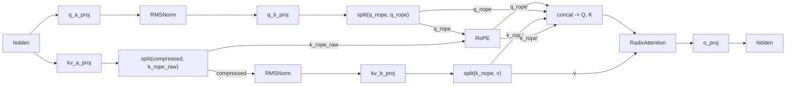
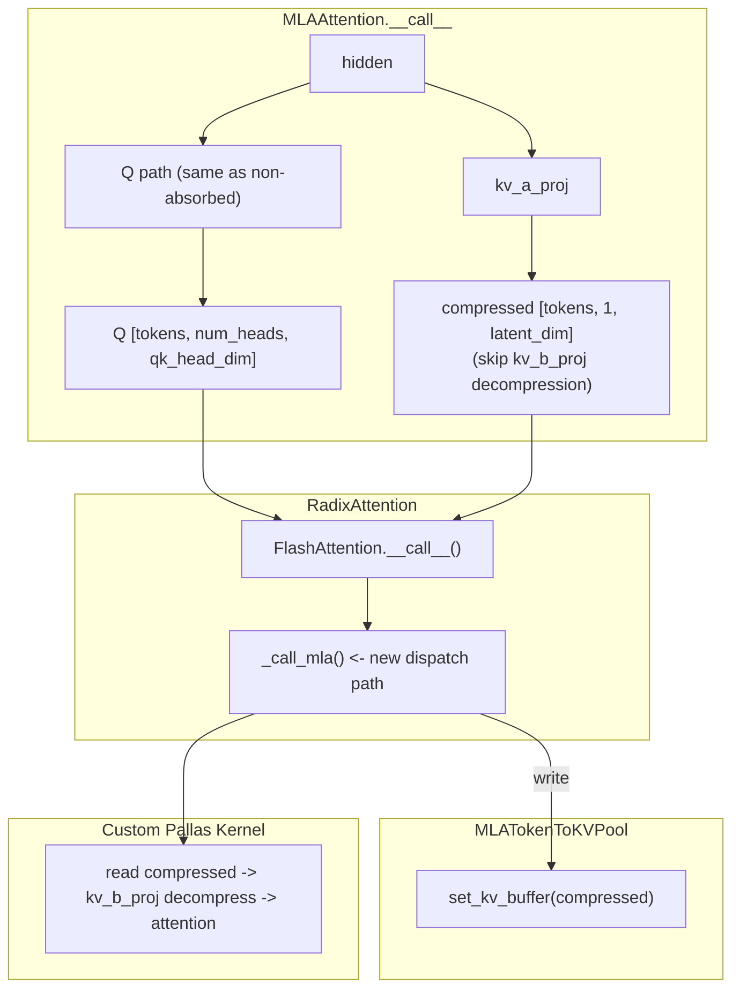

# Multi-head Latent Attention (MLA) Design

## Summary

This document describes the design and testing plan for the `MLAAttention` layer in sglang-jax, targeting models that use the MLA architecture (DeepSeek-V2/V3, etc.).

The current implementation uses **non-absorbed (purely native) mode**: `MLAAttention` fully decompresses the latent state into standard Q/K/V tensors during forward, then reuses the existing `RadixAttention` + `SplitMHATokenToKVPool` infrastructure without relying on any MLA-specific attention kernel or compressed KV cache. The goal is to correctly integrate the MLA data flow with minimal system changes.

`MLAAttention` is a reusable layer module located at `srt/layers/mla.py`, alongside other layers (`linear.py`, `layernorm.py`, etc.). It does not introduce a new attention backend — attention computation is dispatched through `RadixAttention` to the existing native backend (`srt/layers/attention/native_backend.py`). A future absorbed mode implementation would require adding a dedicated backend under `srt/layers/attention/` along with `MLATokenToKVPool`.

## Background and Goals

### Goals

- Provide a reusable MLA layer that correctly implements the MLA Q/K/V projection pipeline.
- Integrate with existing attention infrastructure (`RadixAttention`, `SplitMHATokenToKVPool`) without modifying these components.
- Support K_dim != V_dim (192 vs 128) through `SplitMHATokenToKVPool` separate buffers.

### Non-Goals

- Absorbed mode (caching compressed state instead of decompressed K/V). Requires a custom attention kernel and is a separate effort.
- Model-level integration (weight loading, model config parsing). This layer provides the building block; model files compose it.

## Design Overview

`MLAAttention` is implemented as a Flax NNX module. It performs the full MLA data flow internally and outputs standard attention results, making it a drop-in replacement for standard multi-head attention in model definitions.

**Data flow:**

**Key design decisions:**

1. **Non-absorbed mode**: All decompression is completed in `MLAAttention.__call__`, then standard Q/K/V are handed to `RadixAttention`. The attention layer is unaware of the low-rank origin.
2. **Split KV cache**: After MLA decompression, K has head_dim=192 and V has head_dim=128. Since K_dim != V_dim, they cannot share a single fused buffer (`MHATokenToKVPool` requires uniform dimensions). `SplitMHATokenToKVPool` maintains two independent buffers (K: `[size, heads, 192]`, V: `[size, heads, 128]`). This is existing sglang-jax infrastructure, not MLA-specific.

### Constraints and Boundaries

**The current implementation uses non-absorbed mode.** MLA has two implementation strategies:

| | Non-absorbed (current) | Absorbed (not implemented) |
|---|---|---|
| Data flow | Compress -> **decompress to standard Q/K/V** -> standard attention | Compress -> **cache compressed state** -> decompress inside attention |
| KV cache content | Decompressed full K/V | Compressed state (kv_lora_rank + qk_rope_head_dim) |
| Per-token KV cache | heads x (qk_head_dim + v_head_dim) = 64x(192+128) = 20480 | kv_lora_rank + qk_rope_head_dim = 576 |
| Attention kernel | Standard `RadixAttention` + `SplitMHATokenToKVPool` | Custom kernel needed (`MLATokenToKVPool` defined but not wired in) |
| Memory efficiency | Low (20480/576 ~ 35x vs absorbed) | High |

The current implementation completes all decompression in `MLAAttention.__call__`, outputting standard Q/K/V tensors before handing off to `RadixAttention`. The attention layer does not need to know the data originates from a low-rank decomposition. K_dim(192) != V_dim(128) is handled by `SplitMHATokenToKVPool` with separate buffers. See [Appendix: Absorbed Mode Roadmap](#appendix-absorbed-mode-roadmap) for the absorbed mode roadmap.

### Risks and Mitigations

| Risk | Mitigation |
|------|-----------|
| Non-absorbed mode uses ~35x more KV cache than absorbed mode | Acceptable for initial implementation; absorbed mode is a future optimization |
| bf16 precision loss in chained matmuls | Validated via cosine similarity (>= 0.99) against fp32 reference; allclose is not viable at production dimensions |

## Design Details

**Module:** `MLAAttention` (Flax NNX)

**Projections:**

| Layer | Shape | Sharding |
|-------|-------|----------|
| `q_a_proj` | (hidden_size, q_lora_rank) | kernel: (None, None) |
| `q_b_proj` | (q_lora_rank, num_heads x qk_head_dim) | kernel: (None, "tensor") |
| `kv_a_proj` | (hidden_size, kv_lora_rank + qk_rope_head_dim) | kernel: (None, None) |
| `kv_b_proj` | (kv_lora_rank, num_heads x (qk_nope_head_dim + v_head_dim)) | kernel: (None, "tensor") |
| `o_proj` | (num_heads x v_head_dim, hidden_size) | kernel: ("tensor", None) |

**Constructor Parameters:** `hidden_size`, `num_heads`, `q_lora_rank`, `kv_lora_rank`, `qk_nope_head_dim`, `qk_rope_head_dim`, `v_head_dim`, `rope_theta`, `rope_interleave`, etc., provided by model configuration.

**Output Shapes:** Q = [tokens, num_heads, qk_head_dim], K = [tokens, num_heads, qk_head_dim], V = [tokens, num_heads, v_head_dim], where qk_head_dim = qk_nope_head_dim + qk_rope_head_dim.

**Attention Scaling:** `scaling = qk_head_dim^(-0.5)`. The scaling is applied to the full Q.K^T after concatenation, not to the nope or rope portions individually.

## Testing

### Unit Tests

Tests validate the Q/K/V projection pipeline by stepping through `MLAAttention` submodules individually and comparing against an fp32 numpy reference implementation. The reference follows the standard MLA computation flow, adapted for the sglang-jax weight layout (`weight=(in_features, out_features)`, forward = `x @ weight`).

**Test cases:**

| Test | What it verifies |
|------|-----------------|
| `test_output_shapes` | Q, K, V output tensor shapes match expected dimensions |
| `test_q_path` | Q projection chain: `q_a_proj -> RMSNorm -> q_b_proj -> reshape` |
| `test_kv_path` | KV projection chain: `kv_a_proj -> split -> RMSNorm -> kv_b_proj -> reshape -> split` |
| `test_full_qkv` | Full Q/K/V projection with RoPE applied and tensors assembled |
| `test_k_rope_broadcast` | `k_rope` broadcast from 1 head to all heads (all heads must be identical) |

Tests use production-scale dimensions sourced from the target model configuration.

#### Correctness Metric

For production-scale dimensions with bf16 matmuls, element-wise `allclose` is highly sensitive to tolerance settings, leading to two problems:

- Tolerances too strict cause persistent false positives
- Relaxed tolerances make the assertion itself lose discriminating power

Based on empirical calibration results, we use cosine similarity (threshold >= 0.99) as the primary correctness metric, measuring directional agreement between outputs and the fp32 reference.

> FlashInfer uses the same approach in their absorbed-MLA decode kernel tests ([flashinfer-ai/flashinfer#551](https://github.com/flashinfer-ai/flashinfer/pull/551#discussion_r1826453290)). Maintainer confirmed: `"cosine similarity is okay in this case."`

#### Reference Implementation

Tests use a numpy fp32 reference implementation as the ground-truth oracle, consisting of the following functions:

| Function | Purpose |
|----------|---------|
| `numpy_linear_fp32(x, weight)` | `x @ weight` in fp32 |
| `numpy_rmsnorm_fp32(x, scale, eps)` | RMSNorm |
| `numpy_rotary_emb_fp32(x, cos, sin)` | Interleaved RoPE |
| `numpy_mla_qkv_fp32(hidden, positions, weights, config)` | Complete Q/K/V projection pipeline |

### Integration Test

`test_radix_attention_integration`: Simulates one decode step to verify that MLA output can be correctly accepted and processed by `RadixAttention` + `SplitMHATokenToKVPool`.

**Scenario:** 2 sequences, KV lengths of 4 and 6 (cached history tokens), each sequence currently processing 1 new token (2 query tokens total).

**Flow:**

1. Create `SplitMHATokenToKVPool` (separate K/V buffers), write random prefix KV into the pool to simulate cached historical K/V
2. Build `cache_loc` and `ForwardBatch`, specifying the physical position of each token's KV in the pool
3. 2 new tokens' hidden states enter `MLAAttention.__call__`, completing Q/K/V projection and RoPE
4. Hand off to `RadixAttention`: write new tokens' K/V into the pool, perform attention over all historical K/V

**Assertions:** Output shape is `[2, hidden_size]`, no NaN/Inf.

> The test uses random weights and random prefix KV without verifying numerical correctness — the focus is validating that MLA's output shapes and dtypes are correctly accepted by the downstream attention + KV cache infrastructure. Numerical correctness is covered by unit tests.

### Tests Not Covered in This Document

This document does not define model-level e2e accuracy baselines. Model-level end-to-end accuracy is covered separately by the accuracy test suite; this document focuses on layer-level numerical correctness and MLA's integration with existing attention / KV cache infrastructure.

## Alternatives

**Absorbed mode**: Cache the compressed latent state instead of decompressed K/V. Requires a custom attention kernel that decompresses on-the-fly during attention computation. ~35x memory reduction but significantly more implementation complexity. Deferred to a future iteration.

## Appendix: Absorbed Mode Roadmap

> Not in scope for this iteration. This appendix documents future optimization directions for reference.

`MLATokenToKVPool` is already defined in `memory_pool.py` with compressed buffer layout `[size, 1, kv_lora_rank + qk_rope_head_dim]`, but is not wired into the attention pipeline. The full chain for absorbed mode requires changes across multiple components:

Required changes:

| Component | Change | Complexity |
|-----------|--------|-----------|
| `MLAAttention.__call__` | Skip `kv_b_proj` decompression, output compressed state directly | Low |
| `RadixAttention` | Interface adaptation for compressed KV (or keep compatible via `KVCache` base class) | Low |
| `FlashAttention.__call__` | Add `isinstance(pool, MLATokenToKVPool)` dispatch to `_call_mla` | Medium |
| Pallas attention kernel | Fuse `compressed @ kv_b_proj.weight` decompression into block-wise attention loop | High |
