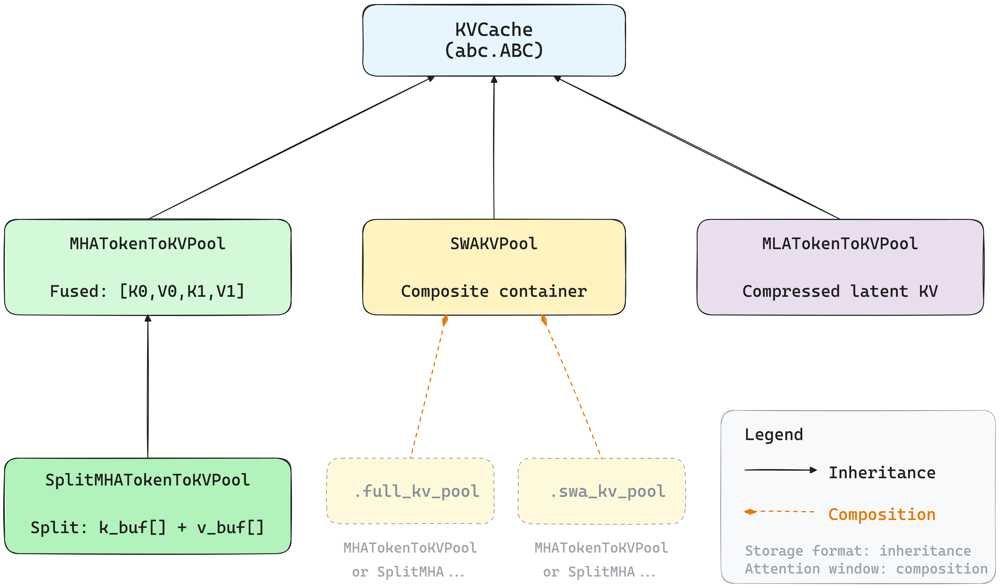

# KV Cache Pool Design

## Overview

The KV cache pool system manages key-value cache storage for different attention architectures during LLM inference. Each pool type addresses a specific storage requirement, and they can be composed to handle complex model configurations.

**Source code**: `python/sgl_jax/srt/mem_cache/memory_pool.py`

## Class Diagram



The pool system uses two orthogonal design patterns:

- **Inheritance** (solid arrows) determines **how** data is stored — fused (`MHATokenToKVPool`) or split (`SplitMHATokenToKVPool`).
- **Composition** (dashed arrows) determines **how much** data is cached — `SWAKVPool` wraps two sub-pools with different cache sizes for full-attention and sliding-window layers. Each sub-pool can independently be `MHATokenToKVPool` or `SplitMHATokenToKVPool`.

## Pool Types

### MHATokenToKVPool

**Purpose**: Standard Multi-Head Attention KV cache with fused storage.

K and V heads are interleaved in a single buffer as `[K0, V0, K1, V1, ...]`. This is memory-efficient and works well when K and V have the same `head_dim`.

**Constraint**: Requires `head_dim_k == head_dim_v` since they share the same buffer dimension.

### SplitMHATokenToKVPool

**Purpose**: MHA KV cache with separate K/V buffers for different head dimensions.

Stores K and V in independent `k_buffer` and `v_buffer` lists, allowing different `head_dim` for K and V. This is needed by models like DeepSeek-V2 (K head_dim=192, V head_dim=128).

**Inherits from**: `MHATokenToKVPool`

### SWAKVPool

**Purpose**: Composite pool for hybrid attention models that mix full attention and sliding window attention (SWA) layers.

SWA layers need much smaller cache sizes than full attention layers. `SWAKVPool` wraps two independent sub-pools:
- `full_kv_pool`: for full-attention layers (large cache)
- `swa_kv_pool`: for sliding-window layers (small cache)

Each sub-pool can be any `KVCache` subclass (`MHATokenToKVPool` or `SplitMHATokenToKVPool`), so the two dimensions (fused/split storage and full/SWA attention) are **orthogonal and composable**.

**Not a storage class**: `SWAKVPool` itself holds no cache data. It delegates all storage operations to its sub-pools via `layers_mapping`.

### MLATokenToKVPool (not yet integrated)

**Purpose**: KV cache for Multi-head Latent Attention (MLA) architecture.

MLA compresses KV into a low-rank latent representation (`kv_lora_rank + qk_rope_head_dim`), storing a single compressed buffer per layer instead of separate K/V heads.

**Status**: The pool class is implemented in `memory_pool.py`, but no model in this repository uses it yet. The interface may change when MLA models (e.g. DeepSeek-V3) are integrated.

## Design Dimensions

The pool types address two orthogonal concerns:

| Dimension | Problem | Solution |
|-----------|---------|----------|
| **Storage format** | K/V may have different head_dim | `MHATokenToKVPool` (fused) vs `SplitMHATokenToKVPool` (split) |
| **Attention window** | Different layers may need different cache sizes | `SWAKVPool` (composite of two sub-pools) |

These compose freely:

| Model Type | Pool Configuration | Example |
|------------|-------------------|---------|
| Standard MHA | `MHATokenToKVPool` | Llama, Qwen |
| Different K/V dim | `SplitMHATokenToKVPool` | DeepSeek-V2 |
| Hybrid attention | `SWAKVPool { full: MHATokenToKVPool, swa: MHATokenToKVPool }` | Gemma 3 |
| Hybrid + different dim | `SWAKVPool { full: SplitMHATokenToKVPool, swa: SplitMHATokenToKVPool }` | MiMo-V2-Flash |
| MLA (not yet integrated) | `MLATokenToKVPool` | DeepSeek-V3 |

## Key Design Decisions

### Alignment to 128

All `head_dim` values are aligned to multiples of 128 before being passed to pool constructors. This alignment is done at the `model_runner` level because the underlying Pallas attention kernel requires `head_dim % 128 == 0`. For example, a model with `head_dim=192` will have its KV cache allocated with `head_dim=256`, and the kernel zero-pads the data accordingly.

### Fused vs Split Dispatch

The `FlashAttention` backend dispatches between fused and split code paths based on the pool type:

```python
if isinstance(pool, SplitMHATokenToKVPool) or getattr(pool, "is_split", False):
    return self._call_split(...)    # separate K/V cache tensors
else:
    return self._call_fused(...)    # single interleaved KV tensor
```

The `getattr(pool, "is_split", False)` check handles `SWAKVPool` that wraps split sub-pools.

### JAX JIT Compatibility

All pool classes are registered as JAX pytrees (`tree_flatten` / `tree_unflatten`). After each JIT-compiled forward pass, the returned KV cache arrays must be written back to the pool via `replace_kv_buffer`, because JAX's functional model produces new arrays rather than modifying in place.
