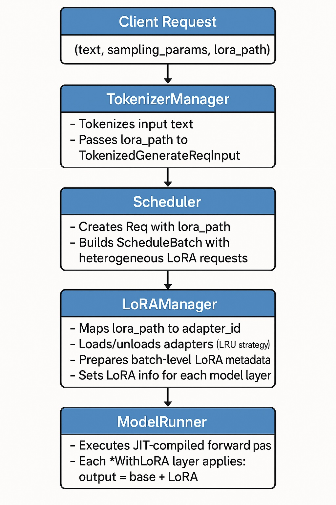

# LoRA Design Document for sgl-jax

## 1. Overview

### 1.1 What is LoRA?

LoRA (Low-Rank Adaptation) is a parameter-efficient fine-tuning (PEFT) technique that enables efficient model adaptation without modifying the original model weights. The core principle is to approximate weight updates using low-rank decomposition:

```
W' = W + γBA
```

where:
- `W` is the original pretrained weight matrix
- `B ∈ ℝ^(d×r)` and `A ∈ ℝ^(r×k)` are low-rank adaptation matrices
- `r << min(d, k)` is the LoRA rank
- `γ = α/r` is the scaling factor (α is the LoRA alpha hyperparameter)

The key advantage is that `r` (typically 8-64) is much smaller than the hidden dimensions, resulting in far fewer trainable parameters compared to full fine-tuning.

### 1.2 Multi-LoRA Serving

Multi-LoRA serving enables a single model server to simultaneously serve multiple LoRA adapters in the same batch. This is critical for:
- **Multi-tenancy**: Different users/applications can use different adapters concurrently
- **Cost efficiency**: Share base model TPU memory across multiple adapters
- **Flexibility**: Mix base model and adapted model requests in the same batch

Research foundations:
- **S-LoRA**: Introduces unified paging for KV cache and LoRA weights, heterogeneous batching for different ranks
- **Punica**: Proposes efficient SGMV (Segmented Gather Matrix-Vector) and BGMV (Batched Gather Matrix-Vector) kernels

### 1.3 Design Goals

**Primary Goals:**
1. Support heterogeneous batching with multiple LoRA adapters in a single batch
2. Enable dynamic adapter loading/unloading without server restart
3. Support LoRA on attention layers (Q/K/V/O projections) and MLP layers (gate/up/down projections)
4. Maintain compatibility with JAX's static compilation and functional programming model
5. Efficient memory management through pre-allocated adapter pools

**Non-Goals:**
1. Unified memory management (S-LoRA style) - use separate pre-allocated pools initially
2. Training or online LoRA weight updates - inference only
3. Automatic adapter selection based on prompt content

### 1.4 Key Features

- **Heterogeneous batching**: Different requests in the same batch can use different LoRA adapters or the base model
- **Pre-allocated memory pools**: Reserve GPU memory for adapter weights upfront to avoid runtime allocation
- **Request-level adapter specification**: Users specify `lora_path` per request
- **JAX-native implementation**: Leverage JAX's JIT compilation and automatic sharding
- **Tensor parallelism support**: Adapter weights follow the same sharding strategy as base model weights

---

## 2. Architecture Design

### 2.1 System Architecture




### 2.2 Module Organization

```
python/sgl_jax/srt/lora/
├── __init__.py
├── lora_config.py       # LoRAConfig: Load adapter configuration
├── lora_adapter.py      # LoRAAdapter: Single adapter lifecycle
├── lora_layers.py       # *WithLoRA layers: Wrap base layers
├── lora_manager.py      # LoRAManager: Orchestrate all adapters
└── lora_kernel.py       # Batched GEMM kernels (BGMV/SGMV)
```

### 2.3 Data Flow

**Request Initialization:**
```
GenerateReqInput (with lora_path)
    → TokenizedGenerateReqInput (lora_path preserved)
    → Req (lora_path stored)
    → ScheduleBatch (collection of Reqs)
```

**Batch Processing:**
```
ScheduleBatch
    → LoRAManager.prepare_lora_batch()
        - Identify unique adapters in batch
        - Load adapters if not in memory pool
        - Build lora_indices: [batch_size] mapping req → adapter_id
        - For each layer: call layer.set_lora_info(A_buffer, B_buffer, lora_indices, ...)
    → ModelRunner.forward()
        - Each layer computes: output = base_layer(x) + lora_layer(x, lora_indices)
```

### 2.4 Memory Management

**Pre-allocated Pools:**
```
For each target module (qkv_proj, o_proj, gate_up_proj, down_proj):
    A_buffer: [num_layers, max_loras_per_batch, lora_rank * multiplier, hidden_size]
    B_buffer: [num_layers, max_loras_per_batch, output_size * multiplier, lora_rank]
```

- `multiplier`: 1 for single projection (o_proj, down_proj), 2 for merged (gate_up), 3 for QKV
- Buffers are sharded across devices following tensor parallelism strategy
- Adapter ID 0 reserved for "no LoRA" (all-zero weights)

**Adapter Loading Strategy:**
1. **Cold start**: Load adapters from disk to CPU memory
2. **On-demand**: Copy to TPU when first requested
3. **LRU eviction**: Evict least-recently-used adapters when pool is full

---

## 3. Core Component Design

### 3.1 LoRAConfig (`lora_config.py`)

**Responsibility:** Load and validate adapter configuration from disk.

**Key Fields:**
```python
@dataclass
class LoRAConfig:
    path: str                          # Filesystem path to adapter
    r: int                             # LoRA rank
    lora_alpha: float                  # Scaling parameter
    target_modules: list[str]          # e.g., ["q_proj", "v_proj", "gate_proj"]
    scaling: float                     # Computed: lora_alpha / r
```

**Methods:**
- `from_path(path: str) -> LoRAConfig`: Load from `adapter_config.json`

### 3.2 LoRAAdapter (`lora_adapter.py`)

**Responsibility:** Manage single adapter's lifecycle and weights.

**Key Fields:**
```python
class LoRAAdapter:
    uid: str                           # Unique identifier (path hash)
    config: LoRAConfig
    weights_cpu: dict                  # CPU-resident weights
    weights_device: dict | None        # TPU-resident weights (lazy load)
```

**Methods:**
- `load_weights_from_disk()`: Load safetensors to CPU
- `load_to_device()`: Transfer to TPU
- `offload_from_device()`: Free device memory
- `stack_qkv_weights()`: Merge separate Q/K/V LoRA weights into unified format
- `stack_gate_up_weights()`: Merge gate/up LoRA weights

**Weight Organization:**
For attention:
- Separate adapters: `q_proj.lora_A`, `k_proj.lora_A`, `v_proj.lora_A`
- Stacked format: `qkv_proj.lora_A` (rank×3, hidden_size)

For MLP:
- Separate: `gate_proj.lora_A`, `up_proj.lora_A`
- Stacked: `gate_up_proj.lora_A` (rank×2, hidden_size)

### 3.3 LoRALayers (`lora_layers.py`)

**Responsibility:** Wrap base model layers to support LoRA computation.

**Base Class:**
```python
class BaseLayerWithLoRA(nnx.Module):
    base_layer: nnx.Module
    lora_rank: int
    scaling: float
    lora_enabled: bool = False

    def set_lora_info(self, ...):
        """Set batch-level LoRA metadata"""
        pass

    def __call__(self, x: jax.Array) -> jax.Array:
        output, bias = self.base_layer(x)
        if self.lora_enabled:
            output = output + self.apply_lora(x)
        return output, bias
```

**Specialized Layers:**

1. **LinearWithLoRA** (for `LinearBase`):
```python
def apply_lora(self, x: jax.Array) -> jax.Array:
    # x: [total_tokens, in_features]
    # Step 1: x @ A^T → [total_tokens, lora_rank]
    lora_a_out = batched_gemm(x, self.A_buffer, self.lora_indices, self.seq_lens)
    # Step 2: lora_a_out @ B^T → [total_tokens, out_features]
    lora_out = batched_gemm(lora_a_out, self.B_buffer, self.lora_indices, self.seq_lens)
    return lora_out * self.scaling
```

### 3.4 LoRAKernel (`lora_kernel.py`)

**Responsibility:** Efficient batched GEMM operations for heterogeneous LoRA.

**Key Operations:**

**BGMV (Batched Gather Matrix-Vector Multiplication):**
```python
def bgmv_shrink(
    x: jax.Array,                      # [batch, in_dim]
    stacked_weights: jax.Array,        # [num_loras * out_dim, in_dim]
    adapter_ids: jax.Array,            # [batch]
    scaling: float,
) -> jax.Array:                        # [batch, out_dim]
    """
    Gather weights for each batch element based on adapter_ids,
    then perform batched GEMV.
    """
```

**SGMV (Segmented Gather Matrix-Vector Multiplication):**
- More efficient when multiple tokens share the same adapter
- **Shrink phase**: `x @ A^T` with segmented computation
- **Expand phase**: `(x @ A^T) @ B^T` with output accumulation

```python
@dataclass
class LoRABatchInfo:
    seg_indptr: jax.Array              # Segment boundaries
    weight_indices: jax.Array          # Adapter ID per segment
    lora_ranks: jax.Array              # Rank per adapter
    permutation: jax.Array             # Logical → physical row mapping
    scalings: jax.Array                # Scaling factor per adapter
    num_segments: int
```

**Implementation Strategy:**
- **MVP**: Pure JAX implementation using `jax.lax.dynamic_slice` and indexing
- **Optimized**: Custom Pallas kernels for better performance (similar to Megablox GMM)

### 3.5 LoRAManager (`lora_manager.py`)

**Responsibility:** Central orchestrator for adapter lifecycle and batch preparation.

**Key Methods:**

```python
class LoRAManager:
    def __init__(
        self,
        base_model: nnx.Module,
        lora_paths: list[str],
        max_loras_per_batch: int,
        ...
    ):
        # Load all adapter configs
        # Initialize LoRAAdapter instances
        # Wrap model layers with *WithLoRA
        # Pre-allocate memory pools
        pass

    def wrap_model_layers(self):
        """
        Traverse model, replace target modules:
        - layer.self_attn.qkv_proj → QKVLinearWithLoRA
        - layer.mlp.gate_up_proj → MergedLinearWithLoRA
        - layer.mlp.down_proj → LinearWithLoRA
        """
        pass

    def prepare_lora_batch(self, batch: ScheduleBatch):
        """
        1. Identify unique lora_paths in batch
        2. Load/evict adapters (LRU)
        3. Build lora_indices: [batch_size] array mapping req → adapter_id
        4. For each layer, call set_lora_info(A_buffer, B_buffer, lora_indices, ...)
        """
        pass

    def load_lora_to_buffer(self, lora_path: str, buffer_id: int):
        """Copy adapter weights to pre-allocated buffers"""
        pass
```

**Adapter ID Assignment:**
- ID 0: Reserved for "no LoRA" (base model only)
- ID 1 to N: Active adapters
- `lora_indices[i]` = 0 if `batch.reqs[i].lora_path is None`

### 3.6 File Modifications

**New Files:**
- All files in `python/sgl_jax/srt/lora/`

**Modified Files:**

1. **`python/sgl_jax/srt/managers/io_struct.py`**
   - Add `lora_path: str | list[str] | None` to `GenerateReqInput`
   - Add `lora_path: str | None` to `TokenizedGenerateReqInput`

2. **`python/sgl_jax/srt/managers/schedule_batch.py`**
   - Add `lora_path: str | None` field to `Req.__init__`

3. **`python/sgl_jax/srt/managers/tokenizer_manager.py`**
   - Pass `lora_path` from `GenerateReqInput` to `TokenizedGenerateReqInput`

4. **`python/sgl_jax/srt/managers/scheduler.py`**
   - Pass `lora_path` when creating `Req` from `TokenizedGenerateReqInput`

5. **`python/sgl_jax/srt/managers/tp_worker.py`**
   - Initialize `LoRAManager` if `server_args.lora_paths` is provided
   - Call `lora_manager.prepare_lora_batch(batch)` before `model_runner.forward()`

6. **`python/sgl_jax/srt/server_args.py`**
   - Add `lora_paths: list[str] | None = None`
   - Add `max_loras_per_batch: int = 4`

7. **`python/sgl_jax/srt/model_executor/forward_batch_info.py`**
   - Add `lora_indices: jax.Array | None` to `ForwardBatch`
   - Update `tree_flatten` and `tree_unflatten` to include `lora_indices`

---

## 4. Request Workflow and Dependencies

### 4.1 End-to-End Request Flow

**Step 1: Client Request**
```python
POST /generate
{
    "text": ["Translate to French: Hello", "Summarize: ..."],
    "sampling_params": {"max_new_tokens": 32},
    "lora_path": ["/path/to/translation_lora", "/path/to/summary_lora"]
}
```

**Step 2: TokenizerManager**
- Tokenizes each text
- Creates `TokenizedGenerateReqInput` with `lora_path[i]` for each request
- Sends to Scheduler

**Step 3: Scheduler**
- Creates `Req` objects with `lora_path` field
- Adds to request queue
- When building `ScheduleBatch`:
  - Can mix requests with different `lora_path` values
  - Can include `lora_path=None` (base model) in same batch

**Step 4: ModelWorker.forward_batch()**
- Receives `ScheduleBatch`
- Calls `lora_manager.prepare_lora_batch(batch)`:
  1. Extract unique `lora_path` values from `batch.reqs`
  2. Map each path to `adapter_id` (load if needed, evict if full)
  3. Build `lora_indices = [adapter_id for req in batch.reqs]`
  4. For each layer in model:
     - Call `layer.*.set_lora_info(A_buffer, B_buffer, lora_indices, seq_lens)`

**Step 5: ModelRunner.forward()**
- JIT-compiled forward pass
- Each `*WithLoRA` layer:
  1. Compute base output: `base_out = base_layer(x)`
  2. If `lora_enabled`:
     - Gather adapter weights using `lora_indices`
     - Compute LoRA delta: `delta = (x @ A^T) @ B^T * scaling`
     - Add: `output = base_out + delta`

**Step 6: Output**
- Sampled tokens returned to Scheduler
- DetokenizerManager converts to text
- Response sent to client

### 4.2 Component Dependency Graph


**Critical Dependencies:**
1. `LoRAConfig` must be loaded before `LoRAAdapter` initialization
2. `LoRAManager.wrap_model_layers()` must run after model initialization but before first forward pass
3. `prepare_lora_batch()` must complete before `ModelRunner.forward()`
4. `lora_indices` must be included in `ForwardBatch` PyTree for JIT compilation

### 4.3 Tensor Parallelism Integration

**Column Parallel Layers** (`qkv_proj`, `gate_up_proj`):
- Base weight sharding: `(None, "tensor")` - split along output dimension
- LoRA A sharding: `("tensor", None)` - replicated
- LoRA B sharding: `(None, "tensor")` - split along output dimension (same as base)
- No all-reduce needed (output naturally distributed)

**Row Parallel Layers** (`o_proj`, `down_proj`):
- Base weight sharding: `("tensor", None)` - split along input dimension
- LoRA A sharding: `("tensor", None)` - split along input dimension (same as base)
- LoRA B sharding: `(None, None)` - replicated
- All-reduce required on final output

---

## 5. Development Work Breakdown

### Phase 1: Foundation (Parallel Tracks)

**Goal:** Set up basic infrastructure without LoRA computation.

**Track 1.1: Configuration and Data Structures**
- [ ] Implement `LoRAConfig` class in `lora_config.py`
  - Load `adapter_config.json`
  - Validate rank, alpha, target_modules
- [ ] Add `lora_path` field to `GenerateReqInput` in `io_struct.py`
- [ ] Add `lora_path` field to `TokenizedGenerateReqInput` in `io_struct.py`
- [ ] Add `lora_path` field to `Req` in `schedule_batch.py`

**Track 1.2: Server Configuration**
- [ ] Add `lora_paths` and `max_loras_per_batch` to `ServerArgs` in `server_args.py`
- [ ] Add CLI argument parsing for `--lora-paths` and `--max-loras-per-batch`
- [ ] Add configuration validation (e.g., check paths exist)

**Track 1.3: Request Pipeline**
- [ ] Modify `TokenizerManager._handle_single_request()` to pass `lora_path`
- [ ] Modify `Scheduler.handle_generate_request()` to create `Req` with `lora_path`
- [ ] Add unit tests for request flow with `lora_path`

**Deliverable:** Request with `lora_path` flows from client to `ScheduleBatch`, no LoRA computation yet.

---

### Phase 2: Core Infrastructure (Parallel Tracks)

**Goal:** Implement adapter loading and layer infrastructure.

**Track 2.1: Adapter Management**
- [ ] Implement `LoRAAdapter` class in `lora_adapter.py`
  - `load_weights_from_disk()`: Load safetensors to CPU
  - `stack_qkv_weights()`: Merge Q/K/V adapter weights
  - `stack_gate_up_weights()`: Merge gate/up adapter weights
- [ ] Write unit tests for weight loading and stacking
- [ ] Handle edge cases: missing target modules, incompatible ranks

**Track 2.2: LoRA Layers**
- [ ] Implement `BaseLayerWithLoRA` in `lora_layers.py`
- [ ] Implement `LinearWithLoRA` (for single projections)
- [ ] Write unit tests for each layer (with dummy adapters)

**Track 2.3: Basic BGMV Kernel**
- [ ] Implement pure JAX `bgmv_shrink()` in `lora_kernel.py`
  - Gather weights based on `adapter_ids`
  - Batched matrix-vector multiplication
- [ ] Implement pure JAX `bgmv_expand()`
- [ ] Write unit tests comparing to naive loop implementation
- [ ] Benchmark on single TPU with synthetic data

**Deliverable:** All core components implemented and unit tested individually.

---

### Phase 3: Integration (Sequential)

**Goal:** Integrate components into end-to-end system.

**Task 3.1: LoRAManager Implementation**
- [ ] Implement `LoRAManager.__init__()` in `lora_manager.py`
  - Load all adapter configs
  - Initialize `LoRAAdapter` instances
  - Call `wrap_model_layers()`
- [ ] Implement `wrap_model_layers()`
  - Traverse model layers
  - Replace target modules with `*WithLoRA` versions
- [ ] Implement `init_memory_pool()`
  - Pre-allocate `A_buffers` and `B_buffers` for each target module
  - Apply sharding specs
- [ ] Implement `load_lora_to_buffer()`
  - Copy adapter weights from `LoRAAdapter` to buffers

**Task 3.2: Batch Preparation**
- [ ] Implement `prepare_lora_batch()`
  - Extract unique `lora_paths` from `ScheduleBatch`
  - Map paths to adapter IDs (with LRU eviction)
  - Build `lora_indices` array
  - Call `set_lora_info()` for each layer
- [ ] Add `lora_indices` field to `ForwardBatch` in `forward_batch_info.py`
- [ ] Update `tree_flatten()` and `tree_unflatten()` for `ForwardBatch`

**Task 3.3: ModelWorker Integration**
- [ ] Modify `ModelWorker.__init__()` to initialize `LoRAManager`
- [ ] Modify `forward_batch()` to call `prepare_lora_batch()` before forward pass
- [ ] Add error handling for adapter loading failures

**Task 3.4: JIT Precompilation**
- [ ] Add LoRA-specific precompilation to `ModelRunner.initialize_jit()`
- [ ] Precompile for common (batch_size, seq_len, num_active_loras) combinations
- [ ] Measure and document compilation time overhead
- [ ] Add `--skip-lora-precompile` flag for faster startup in development

**Task 3.5: End-to-End Testing**
- [ ] Test single LoRA adapter with single request
- [ ] Test base model (no LoRA) with single request
- [ ] Test heterogeneous batch (2 adapters + base model)
- [ ] Verify correctness: compare outputs to reference implementation
- [ ] Test on multi-device setup (TP=2, TP=4)

**Deliverable:** Working single-LoRA and multi-LoRA serving.

---

### Phase 4: Optimization and Polish (Parallel Tracks)

**Goal:** Improve performance, scalability, and production-readiness.

**Track 4.1: Advanced Kernels**
- [ ] Implement SGMV (Segmented Gather MV) in `lora_kernel.py`
  - `sgmv_shrink()`: Segment requests by adapter, batch within segment
  - `sgmv_expand()`: Expand with accumulation
- [ ] Implement `LoRABatchInfo` structure for segmentation metadata
- [ ] Benchmark SGMV vs BGMV on different batch compositions
- [ ] (Optional) Implement Pallas custom kernel for further optimization

**Track 4.2: Multi-Rank Support**
- [ ] Modify `LoRAManager` to support adapters with different ranks
- [ ] Pad smaller-rank adapters to `max_rank` (set extra values to zero)
- [ ] Store per-adapter rank in `lora_ranks` array
- [ ] Mask computation in kernels based on actual rank
- [ ] Test with adapters of different ranks (r=8, r=16, r=64)

**Track 4.3: Memory Optimization**
- [ ] Implement LRU eviction policy in `LoRAManager`
- [ ] Add adapter usage tracking
- [ ] Support lazy loading: load adapter only when first requested
- [ ] Add memory profiling to measure LoRA overhead
- [ ] Document memory requirements in user guide

**Track 4.4: Testing**
- [ ] Write integration tests for API endpoints
- [ ] Test error handling: invalid adapter paths, OOM scenarios
- [ ] Stress test: 100+ adapters with LRU eviction
- [ ] Performance regression tests
- [ ] Multi-device tests (TP=2, TP=4, TP=8)

**Track 4.5: API and Examples**
- [ ] Document API usage in `docs/features/lora.md`
- [ ] Add example: single LoRA inference
- [ ] Add example: multi-LoRA batch inference
- [ ] Add example: OpenAI-compatible API with LoRA
- [ ] Add troubleshooting guide

**Track 4.6: Monitoring and Logging**
- [ ] Add metrics: LoRA cache hit rate, adapter load time
- [ ] Add logging: adapter loading/eviction events
- [ ] Add profiling hooks for LoRA computation time

**Deliverable:** Production-ready LoRA implementation with full documentation and optimization.

---

## Appendix: API Usage Examples

### Example 1: Launch Server with LoRA

```bash
python -m sgl_jax.launch_server \
    --model-path meta-llama/Llama-3-8B \
    --lora-paths /models/lora/translation /models/lora/summarization \
    --max-loras-per-batch 8 \
    --tp-size 2
```

### Example 2: Single Request with LoRA

```python
import requests

response = requests.post("http://127.0.0.1:30000/generate", json={
    "text": "Translate to French: Hello, how are you?",
    "sampling_params": {"max_new_tokens": 32, "temperature": 0.7},
    "lora_path": "/models/lora/translation"
})
print(response.json()["text"])
```

### Example 3: Heterogeneous Batch

```python
response = requests.post("http://127.0.0.1:30000/generate", json={
    "text": [
        "Translate to French: Hello",
        "Summarize: Long article text...",
        "General question: What is AI?"
    ],
    "sampling_params": {"max_new_tokens": 32},
    "lora_path": [
        "/models/lora/translation",
        "/models/lora/summarization",
        None  # Use base model for third request
    ]
})
```

### Example 4: OpenAI-Compatible API (Future)

```python
from openai import OpenAI

client = OpenAI(base_url="http://127.0.0.1:30000/v1", api_key="EMPTY")

response = client.chat.completions.create(
    model="meta-llama/Llama-3-8B",
    messages=[{"role": "user", "content": "Translate to Spanish: Hello"}],
    extra_body={"lora_path": "/models/lora/translation"}
)
print(response.choices[0].message.content)
```

---

## References

1. **LoRA: Low-Rank Adaptation of Large Language Models** (Hu et al., 2021)
   - Original LoRA paper introducing the technique

2. **S-LoRA: Serving Thousands of Concurrent LoRA Adapters** (Sheng et al., 2023)
   - Unified paging for KV cache and LoRA weights
   - Heterogeneous batching with variable ranks
   - Tensor parallelism strategies for LoRA

3. **Punica: Multi-Tenant LoRA Serving** (Chen et al., 2023)
   - SGMV (Segmented Gather Matrix-Vector) kernel
   - BGMV (Batched Gather Matrix-Vector) kernel
   - Performance analysis: decode stage optimization

4. **Community Resources**
   - [LoRA Explained (Thinking Machines Blog)](https://thinkingmachines.ai/blog/lora/)
   - [Multi-LoRA Potentials (le.qun.ch)](https://le.qun.ch/en/blog/2023/09/11/multi-lora-potentials/)
