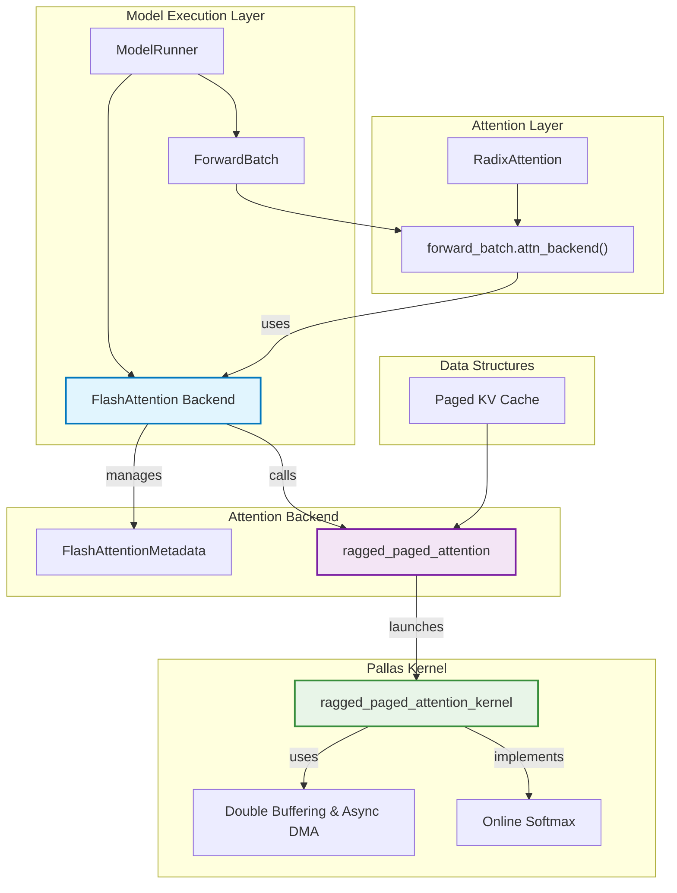

# Flash Attention Kernel

<details>
<summary>Source Files Used</summary>

- [python/sgl_jax/srt/layers/attention/flash_attn_kernel/flash_attention.py](../../python/sgl_jax/srt/layers/attention/flash_attn_kernel/flash_attention.py)
- [python/sgl_jax/srt/layers/attention/flashattention_backend.py](../../python/sgl_jax/srt/layers/attention/flashattention_backend.py)
- [python/sgl_jax/srt/layers/attention/base_attn_backend.py](../../python/sgl_jax/srt/layers/attention/base_attn_backend.py)
- [python/sgl_jax/srt/layers/radix_attention.py](../../python/sgl_jax/srt/layers/radix_attention.py)
- [python/sgl_jax/srt/model_executor/forward_batch_info.py](../../python/sgl_jax/srt/model_executor/forward_batch_info.py)
- [python/sgl_jax/srt/model_executor/model_runner.py](../../python/sgl_jax/srt/model_executor/model_runner.py)
- [benchmark/kernels/flash_attention/bench_flashattention.py](../../benchmark/kernels/flash_attention/bench_flashattention.py)
- [python/sgl_jax/test/test_flashattention.py](../../python/sgl_jax/test/test_flashattention.py)

</details>

## Goals

The Flash Attention Kernel offers a highly optimized implementation of ragged paged attention, specifically designed for TPU and compatible with a wide range of model specifications. The core objectives are:

- **Memory-Efficient Attention Algorithm**: Implement Flash Attention's online softmax computation to avoid storing large intermediate attention matrices, enabling processing of longer sequences within memory constraints
- **TPU Hardware Optimization**: "Specifically designed for TPU" with Pallas kernel implementation leveraging TPU's memory hierarchy, VMEM buffers, and async operations for maximum hardware efficiency

## Design

### Core Concept

The Flash Attention kernel implements the Flash Attention algorithm optimized specifically for TPU hardware using JAX and Pallas. It employs a ragged paged attention mechanism that handles variable-length sequences efficiently through memory paging and careful block-wise computation scheduling.

Sources: [python/sgl_jax/srt/layers/attention/flash_attn_kernel/flash_attention.py:14-30](../../python/sgl_jax/srt/layers/attention/flash_attn_kernel/flash_attention.py)

### Architecture

Flash Attention Kernel architecture with TPU optimizations:



**Core Architecture Principles**:

1. **Memory-Efficient Computation**: Block-wise processing avoids storing full attention matrices, enabling longer sequence processing within memory constraints
2. **TPU Hardware Optimization**: Leverages VMEM buffers and async copy operations specifically designed for TPU memory hierarchy
3. **Ragged Paged Attention**: Efficiently handles variable-length sequences in batches without padding overhead through intelligent paging
4. **Double Buffering System**: Overlaps memory transfers with computation using dual buffer mechanism to hide memory latency

Sources: [python/sgl_jax/srt/layers/attention/flashattention_backend.py:55-76](../../python/sgl_jax/srt/layers/attention/flashattention_backend.py), [python/sgl_jax/srt/layers/attention/flash_attn_kernel/flash_attention.py:732-750](../../python/sgl_jax/srt/layers/attention/flash_attn_kernel/flash_attention.py)

### Key Components

| Component | Description | Source File |
| :--- | :--- | :--- |
| `FlashAttention` | The high-level backend class that inherits from `AttentionBackend` and orchestrates the attention computation. | `flashattention_backend.py` |
| `FlashAttentionMetadata` | A dataclass holding metadata for the forward pass, such as sequence lengths and page indices. | `flashattention_backend.py` |
| `ragged_paged_attention` | The main entry point function that validates inputs, determines block sizes, and launches the Pallas kernel. | `flash_attention.py` |
| `ragged_paged_attention_kernel` | The core Pallas kernel that implements the memory-efficient attention algorithm on the TPU. | `flash_attention.py` |
| `MultiPageAsyncCopyDescriptor` | A helper class to manage asynchronous DMA transfers of KV pages from HBM to VMEM. | `flash_attention.py` |

## Implementation

<details>
<summary><strong>Source Files</strong></summary>

- [python/sgl_jax/srt/layers/attention/flash_attn_kernel/flash_attention.py](../../python/sgl_jax/srt/layers/attention/flash_attn_kernel/flash_attention.py)
- [python/sgl_jax/srt/layers/attention/flashattention_backend.py](../../python/sgl_jax/srt/layers/attention/flashattention_backend.py)
- [python/sgl_jax/srt/layers/attention/base_attn_backend.py](../../python/sgl_jax/srt/layers/attention/base_attn_backend.py)
- [python/sgl_jax/srt/layers/radix_attention.py](../../python/sgl_jax/srt/layers/radix_attention.py)
- [python/sgl_jax/srt/model_executor/forward_batch_info.py](../../python/sgl_jax/srt/model_executor/forward_batch_info.py)
- [python/sgl_jax/srt/mem_cache/memory_pool.py](../../python/sgl_jax/srt/mem_cache/memory_pool.py)

</details>

The Flash Attention Kernel implementation is structured around three main execution phases: metadata initialization, memory management, and kernel execution.

### Backend Architecture

The `FlashAttention` class serves as the primary interface, inheriting from `AttentionBackend`:

```python
class FlashAttention(AttentionBackend):
    def __init__(
        self,
        num_attn_heads,
        num_kv_heads, 
        head_dim,
        vmem_limit_bytes: int = 32 * (1 << 20),  # 32MB
        page_size: int = 1,
        kv_partition_axis: str = "tensor",
    ):
```

Sources: [python/sgl_jax/srt/layers/attention/flashattention_backend.py:55-76](../../python/sgl_jax/srt/layers/attention/flashattention_backend.py)

### Metadata Management

The FlashAttention backend manages this metadata through the `forward_metadata` attribute and provides methods for initialization and KV cache management.

The metadata initialization handles different forward modes (code snippet matches actual implementation):

```python
def init_forward_metadata(self, forward_batch: ForwardBatch):
    metadata = FlashAttentionMetadata()
    
    # Calculate page indices for KV cache
    indices = jnp.arange(0, len(forward_batch.cache_loc), self.page_size)
    selected_cache_locs = forward_batch.cache_loc[indices]
    metadata.page_indices = (selected_cache_locs // self.page_size).astype(jnp.int32)
    
    if forward_batch.forward_mode == ForwardMode.EXTEND:
        metadata.cu_q_lens = jnp.concatenate([
            jnp.array([0], dtype=jnp.int32),
            jnp.cumsum(forward_batch.extend_seq_lens),
        ])
    elif forward_batch.forward_mode == ForwardMode.DECODE:
        metadata.cu_q_lens = jnp.concatenate([
            jnp.array([0], dtype=jnp.int32), 
            jnp.cumsum(jnp.ones(forward_batch.batch_size, dtype=jnp.int32)),
        ])
    
    # Calculate cumulative KV lengths
    metadata.cu_kv_lens = jnp.concatenate([
        jnp.array([0], dtype=jnp.int32),
        jnp.cumsum(forward_batch.seq_lens),
    ])
```

Sources: [python/sgl_jax/srt/layers/attention/flashattention_backend.py:77-116](../../python/sgl_jax/srt/layers/attention/flashattention_backend.py)

### Pallas TPU Kernel Implementation

#### Kernel Entry Point

The `ragged_paged_attention` function serves as the main entry point for the Pallas kernel:

```python
def ragged_paged_attention(
    q: jax.Array,  # [max_num_batched_tokens, num_q_heads, head_dim]
    k_cache: jax.Array,  # [total_num_pages, page_size, num_k_heads, head_dim]
    v_cache: jax.Array,  # [total_num_pages, page_size, num_v_heads, head_dim]
    page_indices: jax.Array,  # i32[num_pages]
    cu_q_lens: jax.Array,  # i32[max_num_seqs + 1]
    cu_kv_lens: jax.Array,  # i32[max_num_seqs + 1]
    num_seqs: jax.Array,  # i32[1]
    *,
    sm_scale: float = 1.0,
    sliding_window: int | None = None,
    soft_cap: float | None = None,
    mask_value: float | None = DEFAULT_MASK_VALUE,
    k_scale: float | None = None,
    v_scale: float | None = None,
    num_kv_pages_per_block: int | None = None,
    num_queries_per_block: int | None = None,
    vmem_limit_bytes: int | None = None,
):
```

Sources: [python/sgl_jax/srt/layers/attention/flash_attn_kernel/flash_attention.py:732-776](../../python/sgl_jax/srt/layers/attention/flash_attn_kernel/flash_attention.py)

#### Block Size Optimization

The system uses auto-tuned block sizes optimized for different TPU generations and model configurations:

```python
TUNED_BLOCK_SIZES = {
    "TPU v6": {
        # (q_dtype, kv_dtype, num_kv_heads_per_blk, head_dim, page_size)
        ("bfloat16", "bfloat16", 2, 128, 128): (16, 32),
        ("bfloat16", "bfloat16", 4, 128, 128): (8, 32),
        ("bfloat16", "bfloat16", 8, 128, 128): (16, 32),
        ("bfloat16", "bfloat16", 16, 128, 128): (8, 32),
        ("bfloat16", "bfloat16", 32, 128, 128): (8, 32),
    },
}

def get_tuned_block_sizes(q_dtype, kv_dtype, num_kv_heads_per_blk, head_dim, page_size):
    tpu_version = tbs.get_tpu_version()
    key = simplify_key((q_dtype, kv_dtype, num_kv_heads_per_blk, head_dim, page_size))
    device_name = tbs.get_device_name()
    
    # Default block sizes
    bkv, bq = (8, 32)  # (num_kv_pages_per_block, num_queries_per_block)
    if device_name in TUNED_BLOCK_SIZES:
        if key in TUNED_BLOCK_SIZES[device_name]:
            bkv, bq = TUNED_BLOCK_SIZES[device_name][key]
    return (bkv, bq)
```

Sources: [python/sgl_jax/srt/layers/attention/flash_attn_kernel/flash_attention.py:35-107](../../python/sgl_jax/srt/layers/attention/flash_attn_kernel/flash_attention.py)

#### Memory Management and Async Copies

The `MultiPageAsyncCopyDescriptor` class manages efficient memory transfers between HBM and VMEM:

```python
class MultiPageAsyncCopyDescriptor:
    def __init__(
        self,
        pages_hbm_ref,  # [total_num_pages, page_size, num_kv_heads_per_blk, head_dim]
        vmem_buf,  # [num_kv_pages_per_blk, page_size, num_kv_heads_per_blk, head_dim]
        sem,  # Semaphore for synchronization
        page_indices_ref,  # i32[num_pages]
        metadata,  # [start_page_idx, end_page_idx]
    ):
        # Setup async copy operations for each page
        for i in range(vmem_buf.shape[0]):
            page_idx = start_page_idx + i
            page_idx = jax.lax.select(page_idx < end_page_idx, page_idx, 0)
            self._async_copies.append(
                pltpu.make_async_copy(
                    pages_hbm_ref.at[page_indices_ref[page_idx]],
                    vmem_buf.at[i],
                    sem,
                )
            )
```

Sources: [python/sgl_jax/srt/layers/attention/flash_attn_kernel/flash_attention.py:110-159](../../python/sgl_jax/srt/layers/attention/flash_attn_kernel/flash_attention.py)

### Flash Attention Algorithm Implementation

The core attention computation follows the Flash Attention algorithm with several optimizations:

#### Attention Score Computation

The actual implementation computes attention scores with proper shape validation and masking:

```python
def flash_attention(
    q,  # [num_q_per_blk * num_q_heads_per_kv_head, head_dim]
    k,  # [num_kv_per_blk, head_dim]
    v,  # [num_kv_per_blk, head_dim]
    head_l_ref,  # [num_q_per_blk * num_q_heads_per_kv_head, 128]
    head_m_ref,  # [num_q_per_blk * num_q_heads_per_kv_head, 128]
    head_acc_ref,  # [num_q_per_blk, num_q_heads_per_kv_head, head_dim]
    *,
    kv_blk_idx,
):
    # Compute attention scores with scaling
    qk = (
        jnp.einsum("nd,md->nm", q, k, preferred_element_type=jnp.float32)
        * sm_scale
    )
    store_start = jnp.maximum(q_start - q_len_start, 0)
    store_end = jnp.minimum(q_end - q_len_start, num_q_per_blk)

    # Apply causal masking with precise indexing
    row_ids = (
        (kv_len - q_len)
        + q_len_start
        - q_start
        + jax.lax.broadcasted_iota(
            jnp.int32,
            (num_q_per_blk * num_q_heads_per_kv_head, num_kv_per_blk),
            0,
        )
        // num_q_heads_per_kv_head
    )
    col_ids = kv_len_start + jax.lax.broadcasted_iota(
        jnp.int32,
        (num_q_per_blk * num_q_heads_per_kv_head, num_kv_per_blk),
        1,
    )
    causal_mask = row_ids < col_ids
    
    # Optional sliding window attention
    if sliding_window is not None:
        causal_mask = jnp.logical_or(
            causal_mask, row_ids - sliding_window >= col_ids
        )
    
    # Optional soft capping
    if soft_cap is not None:
        qk = soft_cap * jnp.tanh(qk / soft_cap)
    
    # Apply mask and compute softmax statistics
    qk += jnp.where(causal_mask, mask_value, 0.0)
    m_curr = jnp.max(qk, axis=1, keepdims=True)
    s_curr = jnp.exp(qk - m_curr)
    qkv = jnp.dot(s_curr, v, preferred_element_type=jnp.float32)
```

Sources: [python/sgl_jax/srt/layers/attention/flash_attn_kernel/flash_attention.py:526-558](../../python/sgl_jax/srt/layers/attention/flash_attn_kernel/flash_attention.py)

#### Online Softmax and Accumulation

The implementation uses the online softmax algorithm with numerical stability safeguards:

```python
    # Load previous statistics
    m_prev = load_with_init(head_m_ref, -jnp.inf)
    l_prev = load_with_init(head_l_ref, 0.0)
    m_next = jnp.maximum(m_prev, m_curr)
    masked_store(
        head_m_ref, m_next, store_start, store_end, num_q_heads_per_kv_head
    )
    alpha = jnp.exp(m_prev - m_next)
    beta = jnp.exp(m_curr - m_next)
    l_alpha = alpha * l_prev
    l_next = l_alpha + beta * l_curr
    l_next_safe = jnp.where(l_next == 0.0, 1.0, l_next)
    masked_store(
        head_l_ref,
        l_next_safe,
        store_start,
        store_end,
        num_q_heads_per_kv_head,
    )

    def broadcast_to_shape(arr, shape):
        if arr.shape == shape:
            return arr
        assert len(arr.shape) == len(shape)
        assert arr.shape[0] == shape[0]
        assert shape[1] % arr.shape[1] == 0
        # no-op concatenation.
        return jnp.concatenate(
            [arr for _ in range(shape[1] // arr.shape[1])], axis=1
        )

    o_curr = load_with_init(head_acc_ref, 0.0).reshape(-1, head_dim)
    l_alpha = broadcast_to_shape(l_alpha, qkv.shape)
    beta = broadcast_to_shape(beta, qkv.shape)
    l_next_safe = broadcast_to_shape(l_next_safe, qkv.shape)
    out = lax.div(
        l_alpha * o_curr + beta * qkv,
        l_next_safe,
    )
    masked_store(
        head_acc_ref,
        out.reshape(head_acc_ref.shape),
        store_start,
        store_end,
    )
```

Sources: [python/sgl_jax/srt/layers/attention/flash_attn_kernel/flash_attention.py:563-606](../../python/sgl_jax/srt/layers/attention/flash_attn_kernel/flash_attention.py)

### Advanced Features

The kernel supports several advanced attention features:

**Sliding Window Attention**: Restricts attention to a local window for long sequences:
```python
if sliding_window is not None:
    causal_mask = jnp.logical_or(causal_mask, row_ids - sliding_window >= col_ids)
```

**Soft Capping**: Applies logit soft capping for numerical stability:
```python
if soft_cap is not None:
    qk = soft_cap * jnp.tanh(qk / soft_cap)
```

**Mixed Precision Support**: Handles K/V scaling for quantized caches:
```python
if k_scale is not None:
    k = k.astype(jnp.float32) * k_scale
    k = k.astype(q_ref.dtype)
```

Sources: [python/sgl_jax/srt/layers/attention/flash_attn_kernel/flash_attention.py:540-570](../../python/sgl_jax/srt/layers/attention/flash_attn_kernel/flash_attention.py)

## Usage

### Basic Configuration

The Flash Attention kernel is automatically selected when using the `fa` attention backend:

```bash
python3 -u -m sgl_jax.launch_server \
    --model-path Qwen/Qwen-7B-Chat \
    --trust-remote-code \
    --device=tpu \
    --attention-backend=fa
```

### Advanced Parameters

#### FlashAttention Backend Parameters

| Parameter | Type | Default | Description |
|-----------|------|---------|-------------|
| `vmem_limit_bytes` | int | 32MB | VMEM memory limit for kernel execution |
| `page_size` | int | 1 | Page size for KV cache management |
| `kv_partition_axis` | str | "tensor" | Partitioning axis for KV tensors |

Sources: [python/sgl_jax/srt/layers/attention/flashattention_backend.py:58-66](../../python/sgl_jax/srt/layers/attention/flashattention_backend.py)

#### Kernel Runtime Parameters

| Parameter | Type | Default | Description |
|-----------|------|---------|-------------|
| `sm_scale` | float | auto | Softmax scaling factor |
| `sliding_window` | int | None | Sliding window attention size |
| `soft_cap` | float | None | Logit soft capping value |
| `num_kv_pages_per_block` | int | auto | KV pages processed per block |
| `num_queries_per_block` | int | auto | Query tokens processed per block |

Sources: [python/sgl_jax/srt/layers/attention/flash_attn_kernel/flash_attention.py:732-750](../../python/sgl_jax/srt/layers/attention/flash_attn_kernel/flash_attention.py)

### Performance Tuning

#### Block Size Tuning

The kernel automatically selects optimal block sizes based on hardware configuration using the `get_tuned_block_sizes()` function, which considers factors like TPU version, data types, number of heads, head dimension, and page size.

##### Extending Tuned Block Sizes

Advanced users can extend the `TUNED_BLOCK_SIZES` dictionary with custom configurations for their specific hardware or model configurations:

```python
# Add custom tuned block sizes to the existing dictionary
TUNED_BLOCK_SIZES["TPU v5"] = {
    # (q_dtype, kv_dtype, num_kv_heads_per_blk, head_dim, page_size): (bkv, bq)
    ("bfloat16", "bfloat16", 4, 128, 64): (16, 64),
    ("float16", "float16", 8, 128, 128): (8, 32),
}
```

The auto-tuning process typically involves:
1. **Hardware Detection**: Identifying TPU version and memory configuration
2. **Parameter Analysis**: Considering dtype, head dimensions, and sequence characteristics  
3. **Memory Optimization**: Balancing block sizes with VMEM constraints
4. **Performance Validation**: Empirical testing to validate optimal configurations

Sources: [python/sgl_jax/srt/layers/attention/flash_attn_kernel/flash_attention.py:81-107](../../python/sgl_jax/srt/layers/attention/flash_attn_kernel/flash_attention.py)

```python
# Example benchmark configuration (using specific tuned values)
def benchmark_backend(mode, backend_type, batch_size, seq_len, num_heads, page_size=128):
    attn = functools.partial(
        ragged_paged_attention,
        num_kv_pages_per_block=8,  # Benchmark-specific value
        num_queries_per_block=32,  # Benchmark-specific value
    )
```

**Note**: The above values are from benchmark testing. The kernel automatically selects optimal block sizes using auto-tuning logic in `get_tuned_block_sizes()` function based on hardware configuration and model parameters.

Sources: [benchmark/kernels/flash_attention/bench_flashattention.py:13-68](../../benchmark/kernels/flash_attention/bench_flashattention.py)

#### Memory Configuration

Configure VMEM limits based on available TPU memory:

```python
attention_backend = FlashAttention(
    num_heads, num_kv_heads, head_dim,
    vmem_limit_bytes=64 * (1 << 20),  # 64MB for larger models
    page_size=128  # Larger pages for longer sequences
)
```

Sources: [python/sgl_jax/srt/layers/attention/flashattention_backend.py:58-75](../../python/sgl_jax/srt/layers/attention/flashattention_backend.py)

### Integration Example

```python
# Initialize attention backend in model runner
def _get_attention_backend(self):
    if self.server_args.attention_backend == "fa":
        # Ensure padded KV heads are even for TPU optimization
        assert padded_kv_heads % 2 == 0, (
            f"Padded kv_heads={padded_kv_heads} should be even. "
            "This indicates a configuration issue with kv heads padding."
        )
        return FlashAttention(
            self.num_attn_heads,
            padded_kv_heads,
            self.model_config.head_dim,
            page_size=self.page_size,
            kv_partition_axis=kv_partition_axis,
        )
```

Sources: [python/sgl_jax/srt/model_executor/model_runner.py:326-341](../../python/sgl_jax/srt/model_executor/model_runner.py)

The Flash Attention kernel provides significant memory efficiency improvements and throughput gains for TPU-based large language model inference, particularly for applications with variable sequence lengths and mixed prefill/decode workloads.

Sources: [python/sgl_jax/test/test_flashattention.py:175-314](../../python/sgl_jax/test/test_flashattention.py), [benchmark/kernels/flash_attention/bench_flashattention.py:100-148](../../benchmark/kernels/flash_attention/bench_flashattention.py)