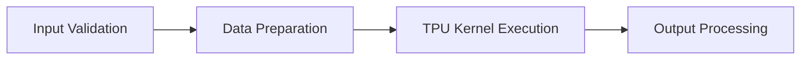
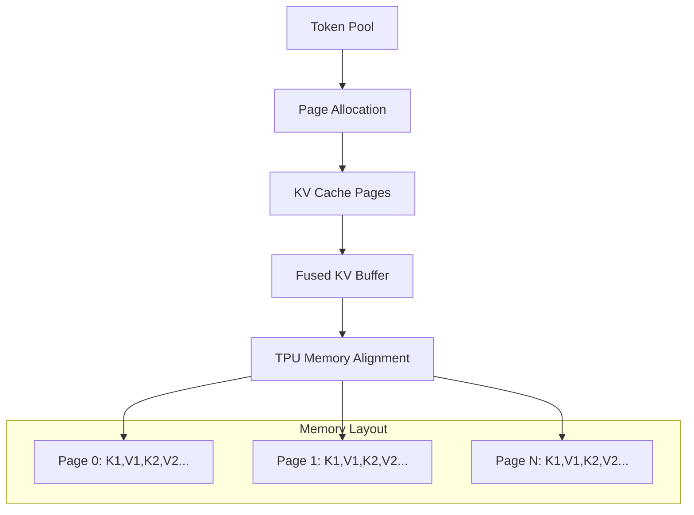

# Flash Attention Kernel

## Goals

The Flash Attention Kernel in SGLang-JAX provides a highly optimized, TPU-friendly implementation of ragged paged attention specifically designed for large language model inference. The core objectives are:

- **TPU Optimization**: Leverage TPU architecture with Pallas kernels for maximum performance on Google Cloud TPU infrastructure
- **Memory Efficiency**: Implement paged attention with intelligent KV cache management to handle long sequences efficiently  
- **Mixed Workload Support**: Enable simultaneous processing of prefill and decode requests in a single batch for optimal throughput
- **Production Scalability**: Support high-throughput inference scenarios with automatic performance tuning and robust memory management

## Design

The Flash Attention Kernel implements a sophisticated multi-layer architecture that combines algorithmic optimizations with hardware-specific tuning for TPU environments.

### Core Concept

SGLang-JAX's Flash Attention implementation is based on the IO-aware attention algorithm from Dao et al. that fundamentally reduces memory complexity from O(N²) to O(N) through tiled computation and incremental softmax calculation. The implementation extends this concept with paged memory management and TPU-specific optimizations.

### Architecture

The kernel follows a layered design with distinct functional domains:



#### Key Components

1. **Ragged Paged Attention Algorithm**: Handles variable-length sequences efficiently through paged memory management
2. **Auto-Tuned Block Sizes**: Dynamic performance optimization based on model configuration and hardware capabilities
3. **Fused KV Cache Management**: Interleaved key-value storage format optimized for TPU memory patterns
4. **Double Buffering System**: Overlaps computation and memory transfer for optimal TPU utilization
5. **Flash Attention**: Implementation based on the IO-aware attention algorithm that uses tiling to reduce memory reads/writes

### Memory Management Design

#### Paged Memory System

The kernel implements a sophisticated paged memory system:

- **Page-Based Allocation**: Configurable page sizes (64, 128, 256 tokens) for flexible memory management
- **Fused KV Format**: Interleaved K1,V1,K2,V2... layout reduces memory bandwidth requirements  
- **Automatic Alignment**: Hardware-optimized data alignment (128-byte boundaries) for maximum throughput

#### Memory Pool Integration



### TPU-Specific Optimizations

#### Pallas Kernel Integration

The kernel leverages JAX Pallas for low-level TPU optimization:

- **Custom Memory Management**: Direct VMEM (Vector Memory) control for optimal data placement
- **Asynchronous Operations**: Overlapped computation and data transfer using TPU semaphores
- **Vectorized Operations**: Hardware-accelerated attention computation with optimal data types

## Implementation

### Flash Attention Core Algorithm

The core flash attention computation implements the tiled algorithm with incremental statistics based on the FlashAttention paper [1]. The key is the **incremental softmax computation** that enables O(N) memory complexity through careful numerical stability management.

#### Core Update Equations

For each block j, the algorithm maintains three statistics:

| Variable | Formula | Purpose |
|----------|---------|---------|
| **Running Maximum** | `m^(j) = max(m^(j-1), rowmax(S_ij))` | Numerical stability |
| **Softmax Denominator** | `l^(j) = e^(m^(j-1) - m^(j)) × l^(j-1) + rowsum(e^(S_ij - m^(j)))` | Incremental normalization |
| **Output Accumulator** | `O^(j) = (e^(m^(j-1) - m^(j)) × l^(j-1) × O^(j-1) + e^(S_ij - m^(j)) @ V_j) / l^(j)` | Weighted sum computation |

**Notation:**
- `S_ij = Q_i @ K_j^T × scale` - attention scores for block (i,j)
- `P_ij = e^(S_ij - m^(j))` - stable probabilities  
- `j` - current block index
- `rowmax()` / `rowsum()` - row-wise maximum/sum operations

#### Implementation

The following code is a simplified extract from the actual implementation, showing the key algorithmic concepts:

```python
def flash_attention(q_batch, k_batch, v_batch):
    q_batch_f32 = q_batch.astype(jnp.float32)
    k_batch_f32 = k_batch.astype(jnp.float32)
    v_batch_f32 = v_batch.astype(jnp.float32)
    
    # Apply scaling factors for quantized caches
    if k_scale is not None:
        k_batch_f32 = k_batch_f32 * k_scale
    if v_scale is not None:
        v_batch_f32 = v_batch_f32 * v_scale
    
    # Compute attention scores: S_ij = Q_i @ K_j^T * scale
    s = jnp.einsum("hqd,hkd->hqk", q_batch_f32, k_batch_f32, 
                   preferred_element_type=jnp.float32) * sm_scale
    
    # Apply causal masking and optional enhancements
    if soft_cap is not None:
        s = soft_cap * jnp.tanh(s / soft_cap)
    s += jnp.where(mask, mask_value, 0.0)
    
    # Incremental softmax computation implementing FlashAttention Algorithm 1
    for head_idx in range(actual_num_kv_heads):
        s_head = s[head_idx]  # Current block attention scores S_ij
        
        # ═══ Running Maximum Update ═══
        # Formula: m^(j) = max(m^(j-1), rowmax(S_ij))
        s_head_rowmax = jnp.max(s_head, axis=1, keepdims=True)  # rowmax(S_ij)
        m_prev = load_with_init(head_m_ref, -jnp.inf)           # m^(j-1)
        m_curr = jnp.maximum(m_prev, s_head_rowmax)             # m^(j)
        head_m_ref[...] = m_curr
        
        # ═══ Stable Probability Computation ═══
        # P_ij = e^(S_ij - m^(j)) for numerical stability
        p = jnp.exp(s_head - broadcast_minor(m_curr, s_head.shape))
        
        # Weighted values: P_ij @ V_j
        pv = jnp.einsum("qk,kd->qd", p, v_batch_f32[head_idx], 
                       preferred_element_type=jnp.float32)
        
        # ═══ Softmax Denominator Update ═══
        # Formula: l^(j) = e^(m^(j-1) - m^(j)) × l^(j-1) + rowsum(e^(S_ij - m^(j)))
        p_rowsum = jnp.sum(p, axis=1, keepdims=True)            # rowsum(P_ij)
        exp_m_diff = jnp.exp(m_prev - m_curr)                   # e^(m^(j-1) - m^(j))
        l_prev = load_with_init(head_l_ref, 0.0)                # l^(j-1)
        l_curr = exp_m_diff * l_prev + p_rowsum                 # l^(j)
        head_l_ref[...] = l_curr
        
        # ═══ Output Accumulator Update ═══
        # Formula: O^(j) = (e^(m^(j-1) - m^(j)) × l^(j-1) × O^(j-1) + P_ij @ V_j) / l^(j)
        o_prev = load_with_init(head_acc_ref, 0.0)              # O^(j-1)
        # Numerator: e^(m^(j-1) - m^(j)) × l^(j-1) × O^(j-1) + P_ij @ V_j
        o_curr = broadcast_minor(exp_m_diff, o_prev.shape) * o_prev + pv
        head_acc_ref[...] = o_curr
        # Note: Final division by l^(j) is performed at the end of all blocks
```

Sources: [flash_attention.py:671-748](../../python/sgl_jax/srt/layers/attention/flash_attn_kernel/flash_attention.py#L671-L748)


## Usage

### Basic Configuration

The Flash Attention Kernel integrates seamlessly with SGLang-JAX's attention backend system:

```bash
# Launch server with Flash Attention backend
python -m sgl_jax.launch_server \
    --model-path Qwen/Qwen-7B-Chat \
    --attention-backend=fa \
    --device=tpu \
    --trust-remote-code
```

### API Parameters

The following parameters configure the ragged paged attention with fused KV cache:

| Parameter | Type | Description |
|-----------|------|-------------|
| `queries` | `jax.Array` | Concatenated all sequences' queries |
| `keys` | `jax.Array` | Concatenated all sequences' keys (quantized) |
| `values` | `jax.Array` | Concatenated all sequences' values (quantized) |
| `kv_cache_fused` | `jax.Array` | Paged KV cache with head interleaving format [K1,V1,K2,V2,...] |
| `kv_lens` | `jax.Array` | Padded kv lengths. Only the first num_seqs values are valid |
| `page_indices` | `jax.Array` | Flattened page indices look-up table |
| `cu_q_lens` | `jax.Array` | The cumulative sum of the effective query lengths. Similar to kv_lens, only the first num_seqs+1 values are valid |
| `distribution` | `jax.Array` | (i, j, k) represents that sequences[0:i] are decode-only, sequences[i:j] are chunked-prefill-only, and sequences[j:k] are mixed. The k is also the total number of sequences |
| `actual_head_dim` | `int` | The actual head size of the attention. Here we assume k and v have the same actual head size |
| `sm_scale` | `float` | The softmax scale which will be applied to the Q@K^T |
| `sliding_window` | `int` | The sliding window size for the attention |
| `soft_cap` | `float` | The logit soft cap for the attention |
| `mask_value` | `float` | Mask value for causal mask |
| `k_scale` | `float` | The scale for the key cache |
| `v_scale` | `float` | The scale for the value cache |
| `num_kv_pages_per_block` | `int` | Number of kv pages to be processed in one flash attention block in the pallas kernel |
| `num_queries_per_block` | `int` | Number of queries to be processed in one flash attention block in the pallas kernel |
| `vmem_limit_bytes` | `int` | The vmem limit for the pallas kernel |

## References

[1] Dao, T., Fu, D. Y., Ermon, S., Rudra, A., & Ré, C. (2022). FlashAttention: Fast and Memory-Efficient Exact Attention with IO-Awareness. *Advances in Neural Information Processing Systems (NeurIPS)*. [arXiv:2205.14135](https://arxiv.org/abs/2205.14135)