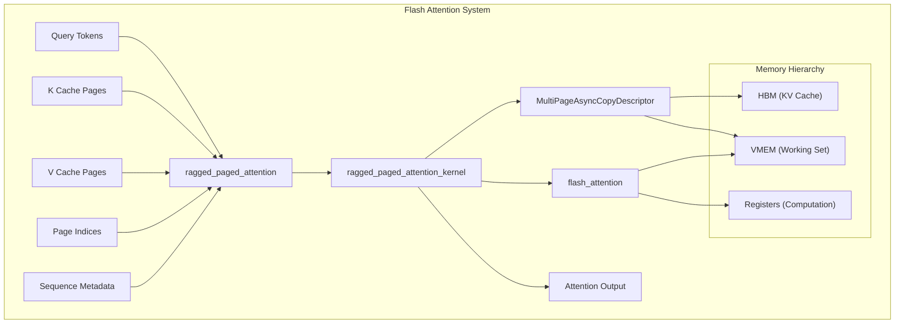

# Flash Attention Kernel

## Goals

The Flash Attention Kernel provides a highly optimized TPU implementation of ragged paged attention for efficient LLM inference. Core objectives:

- **TPU Optimization**: Leverages Pallas kernels, async DMA copies, and vectorized operations for maximum TPU utilization
- **Ragged Paged Attention**: Efficiently processes variable-length sequences with paged KV cache management
- **Mixed Workload Support**: Handles both prefill and decode operations in a unified kernel to enhance throughput

## Design

<details>
<summary>Source Files</summary>

*   [`python/sgl_jax/srt/layers/attention/flashattention_backend.py`](../../python/sgl_jax/srt/layers/attention/flashattention_backend.py#L64-L283)
*   [`python/sgl_jax/srt/layers/attention/flash_attn_kernel/flash_attention.py`](../../python/sgl_jax/srt/layers/attention/flash_attn_kernel/flash_attention.py#L314-L895)
*   [`docs/features/attention_backend.md`](attention_backend.md)
*   [`python/sgl_jax/test/test_flashattention.py`](../../python/sgl_jax/test/test_flashattention.py)
</details>

### Core Concept

The Flash Attention Kernel implements a ragged paged attention mechanism that combines the memory efficiency of paged attention with the computational efficiency of flash attention. The design centers around three key innovations:

**Ragged Processing**: Unlike traditional batched attention that pads sequences to uniform lengths, ragged attention processes sequences of variable lengths directly, eliminating wasted computation on padding tokens.

**Paged Memory Management**: KV caches are organized into fixed-size pages, enabling efficient memory allocation and reducing fragmentation. Each sequence's KV data is stored across multiple pages, with page indices tracking the mapping.

**Tiled Computation**: The kernel processes attention in blocks (tiles), enabling overlapped computation and memory access patterns that maximize TPU utilization while staying within memory constraints.

### Architecture



The architecture demonstrates the hierarchical memory management where the kernel efficiently moves data from High Bandwidth Memory (HBM) through Vector Memory (VMEM) to processing registers, maximizing data reuse and minimizing memory bandwidth requirements.

## Implementation

<details>
<summary>Source Files</summary>

*   `python/sgl_jax/srt/layers/attention/flash_attn_kernel/flash_attention.py`
*   `python/sgl_jax/srt/layers/attention/flashattention_backend.py`
*   `benchmark/kernels/flash_attention/bench_flashattention.py`
*   `python/sgl_jax/test/test_flashattention.py`
</details>

### Pallas Kernel: `ragged_paged_attention_kernel`

The core of the implementation is the Pallas kernel, which is designed for efficient execution on TPUs. It operates on blocks of queries and keys/values.

**Execution Flow:**

1.  **Initialization**: The kernel identifies its position in the computation grid (`heads_blk_idx`, `q_blk_idx`) to determine which slice of queries and heads it is responsible for.
2.  **Initial Prefetching**: Only the first program (when `heads_blk_idx + q_blk_idx == 0`) performs the initial prefetch operation to bootstrap the double-buffering strategy. This critical optimization ensures that subsequent blocks have data ready without redundant prefetch operations.
3.  **Asynchronous Prefetching**: It initiates an asynchronous copy of the first block of K and V pages from HBM into the faster VMEM (scratchpad memory). This is handled by the `MultiPageAsyncCopyDescriptor`.
4.  **Main Loop over Query Blocks**: The kernel iterates through sequences that fall within its assigned query block.
5.  **Inner Loop over KV Blocks**: For each sequence, it loops over the necessary KV cache pages in blocks.
    *   **Wait for Data**: It waits for the asynchronous copy of the current KV block to complete.
    *   **Prefetch Next**: It immediately starts prefetching the *next* KV block to hide memory latency.
    *   **Attention Calculation**: It performs the standard Flash Attention algorithm (Q*K^T, softmax, *V) on the current query and KV blocks. Causal masking and sliding window attention are applied within this step.
    *   **Update Accumulator**: The results are accumulated in VMEM, keeping track of the running max (`m`) and sum of exponents (`l`) for the softmax calculation.
6.  **Write Output**: Once all KV blocks for a query block are processed, the final attention output is written back to HBM.

```python
def ragged_paged_attention_kernel(
    # ... (references to HBM data and scratchpads)
    *, 
    sm_scale: float,
    # ... (other parameters)
):
    # ...
    # Identify block indices from program_id
    heads_blk_idx, q_blk_idx = (
        pl.program_id(0),
        pl.program_id(1),
    )

    @pl.when(heads_blk_idx + q_blk_idx == 0)
    def prefetch_first_kv_blk():
        # Start async copy for the very first KV block
        async_copy_k, async_copy_v = create_kv_async_copy_descriptors(...)
        async_copy_k.start()
        async_copy_v.start()

    def compute_with_cur_q_blk(q_states):
        # ...
        def compute_with_kv_blk_in_cur_seq(kv_states):
            # ...
            @pl.when(next_heads_blk_idx < num_heads_blks)
            def prefetch_next_kv_blk():
                # Start fetching the next KV block while computing on the current one
                next_async_copy_k, next_async_copy_v = create_kv_async_copy_descriptors(...)
                next_async_copy_k.start()
                next_async_copy_v.start()

            # Wait for the current KV block to be available in VMEM
            cur_async_copy_k, cur_async_copy_v = create_kv_async_copy_descriptors(...)
            k_ref = cur_async_copy_k.wait()
            v_ref = cur_async_copy_v.wait()
            
            # Perform attention computation
            flash_attention(q, k, v, ...)
            
            return kv_blk_idx + 1, next_buf_idx

        # Loop over KV blocks for the current sequence
        lax.while_loop(
            is_valid_kv_blk_in_cur_seq,
            compute_with_kv_blk_in_cur_seq,
            (0, cur_buf_idx),
        )
        # ...
        return done, next_seq_idx, next_buf_idx

    # Loop over sequences within the current query block
    lax.while_loop(
        is_cur_q_blk_needed,
        compute_with_cur_q_blk,
        (0, init_seq_idx, init_buf_idx),
    )
    
    # Write final output from accumulator
    o_ref[...] = acc_ref[...].astype(q_ref.dtype)
```
*Code Snippet: Simplified conceptual logic flow of the Pallas kernel (not exact implementation).*
Sources: [python/sgl_jax/srt/layers/attention/flash_attn_kernel/flash_attention.py:314-868](../../python/sgl_jax/srt/layers/attention/flash_attn_kernel/flash_attention.py#L314-L868)

### Backend Integration: `FlashAttention` Class

The `FlashAttention` class integrates the kernel into the model's forward pass.

**Metadata Preparation (`get_forward_metadata`)**

This method is called once per batch. It transforms the `ModelWorkerBatch` information into a `FlashAttentionMetadata` object. This involves:
*   Calculating cumulative query lengths (`cu_q_lens`) based on whether the batch is for prefill (`EXTEND`) or decode (`DECODE`).
*   Calculating cumulative KV lengths (`cu_kv_lens`), which are aligned to the page size.
*   Extracting the page indices from the `cache_loc` array.

```python
def get_forward_metadata(self, batch: ModelWorkerBatch):
    """Return the metadata for a forward pass."""
    metadata = FlashAttentionMetadata()

    indices = np.arange(0, len(batch.cache_loc), self.page_size)
    selected_cache_locs = batch.cache_loc[indices]
    page_indices = (selected_cache_locs // self.page_size).astype(np.int32)

    if batch.forward_mode == ForwardMode.EXTEND:
        cu_q_lens = np.concatenate(
            [
                np.array([0], dtype=np.int32),
                np.cumsum(batch.extend_seq_lens),
            ]
        )
    elif batch.forward_mode == ForwardMode.DECODE:
        cu_q_lens = jnp.concatenate(
            [
                np.array([0], dtype=jnp.int32),
                np.cumsum(jnp.ones(len(batch.seq_lens), dtype=np.int32)),
            ]
        )

    seq_lens = np.copy(batch.seq_lens)

    # Calculate page-aligned sequence lengths for KV cache
    aligned_seq_lens = (
        (batch.seq_lens + self.page_size - 1) // self.page_size
    ) * self.page_size
    cu_kv_lens = np.concatenate(
        [
            np.array([0], dtype=np.int32),
            np.cumsum(aligned_seq_lens),
        ]
    )

    num_seqs = np.sum(batch.seq_lens > 0, dtype=np.int32).reshape(1,)
    
    metadata.num_seqs = jnp.array(num_seqs)
    metadata.cu_q_lens = jnp.array(cu_q_lens)
    metadata.cu_kv_lens = jnp.array(cu_kv_lens)
    metadata.page_indices = jnp.array(page_indices)
    metadata.seq_lens = jnp.array(seq_lens)

    return metadata
```
*Code Snippet: Simplified metadata creation logic in the `FlashAttention` backend.*
Sources: [python/sgl_jax/srt/layers/attention/flashattention_backend.py:87-132](../../python/sgl_jax/srt/layers/attention/flashattention_backend.py#L87-L132)

**Invoking the Kernel (`__call__`)**

The `__call__` method first updates the KV cache with the new key and value tensors for the current tokens. Then, it invokes the `ragged_paged_attention` function using `jax.shard_map` to distribute the computation across the TPU devices according to the specified sharding configuration.

```python
def __call__(
    self,
    q: jax.Array,
    k: jax.Array,
    v: jax.Array,
    layer: RadixAttention,
    forward_batch: ForwardBatch,
    # ...
):
    k_buffer, v_buffer = self._get_and_set_kv_cache(
        k, v, forward_batch, layer.layer_id
    )

    if layer.scaling is None:
        scale = 1.0 / jnp.sqrt(layer.head_dim)
    else:
        scale = layer.scaling

    # Define sharding specifications
    in_specs = (
        P(None, self.kv_partition_axis),  # q
        P(None, None, self.kv_partition_axis, None),  # k_buffer
        P(None, None, self.kv_partition_axis, None),  # v_buffer
        P(),  # page_indices
        P(),  # cu_q_lens
        P(),  # cu_kv_lens
        P(),  # num_seqs
        P(),  # seq_lens
    )
    out_specs = P(None, self.kv_partition_axis)

    def _ragged_paged_attention(*args):
        q, k_buffer, v_buffer = args[:3]
        other_args = args[3:]

        return ragged_paged_attention(
            q,
            k_buffer,
            v_buffer,
            *other_args,
            sm_scale=scale,
            sliding_window=None,
            soft_cap=None,
            mask_value=None,
            vmem_limit_bytes=self.vmem_limit_bytes,
        )

    attn_output = jax.shard_map(
        _ragged_paged_attention,
        mesh=jax.sharding.get_abstract_mesh(),
        in_specs=in_specs,
        out_specs=out_specs,
        check_vma=False,
    )(
        q.reshape(q.shape[0], -1, self.head_dim),
        k_buffer.reshape(
            k_buffer.shape[0] // self.page_size, self.page_size, -1, self.head_dim
        ),
        v_buffer.reshape(
            v_buffer.shape[0] // self.page_size, self.page_size, -1, self.head_dim
        ),
        self.forward_metadata.page_indices,
        self.forward_metadata.cu_q_lens,
        self.forward_metadata.cu_kv_lens,
        self.forward_metadata.num_seqs,
        self.forward_metadata.seq_lens,
    )

    return (
        attn_output.reshape(q.shape[0], -1),
        k_buffer,
        v_buffer,
    )
```
*Code Snippet: Simplified kernel invocation logic with `shard_map`.*
Sources: [python/sgl_jax/srt/layers/attention/flashattention_backend.py:159-252](../../python/sgl_jax/srt/layers/attention/flashattention_backend.py#L159-L252)

## Usage

<details>
<summary>Source Files</summary>

*   `docs/features/attention_backend.md`
*   `benchmark/kernels/flash_attention/bench_flashattention.py`
</details>

### Enabling Flash Attention

To use the Flash Attention kernel, specify it as the attention backend when launching the server using the `--attention-backend` flag.

**Command:**
```bash
python3 -u -m sgl_jax.launch_server \
    --model-path Qwen/Qwen-7B-Chat \
    --trust-remote-code \
    --device=tpu \
    --attention-backend=fa
```
This is the recommended backend for production environments due to its high performance and memory efficiency.

Sources: [docs/features/attention_backend.md](attention_backend.md)

### Benchmarking

The performance of the kernel can be measured using the provided benchmark script. It allows testing different configurations for prefill and decode modes.

**Command:**
```bash
python benchmark/kernels/flash_attention/bench_flashattention.py
```
The script will iterate through various batch sizes, sequence lengths, and head numbers, reporting the execution time for each configuration. This is useful for performance tuning and regression testing.

Sources: [benchmark/kernels/flash_attention/bench_flashattention.py](../../benchmark/kernels/flash_attention/bench_flashattention.py)
