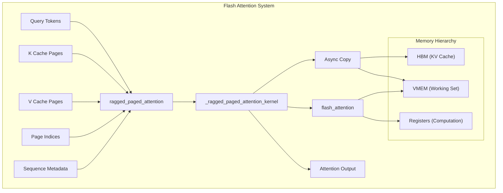

# Flash Attention Kernel

## Goals

The primary objectives of the Flash Attention Kernel are:

- **TPU-Optimized Attention Computation**: Provide efficient attention implementation specifically designed for TPU hardware using JAX Pallas
- **Memory Efficiency**: Implement paged KV caching with double buffering to minimize memory usage and enable processing of long sequences
- **Unified Workload Processing**: Handle both prefill and decode operations in a single kernel to maximize throughput and resource utilization

## Design

<details>
<summary>Source Files</summary>

*   [`python/sgl_jax/srt/layers/attention/flashattention_backend.py`](../../python/sgl_jax/srt/layers/attention/flashattention_backend.py#L64-L283)
*   [`python/sgl_jax/srt/layers/attention/flash_attn_kernel/flash_attention.py`](../../python/sgl_jax/srt/layers/attention/flash_attn_kernel/flash_attention.py#L314-L895)
*   [`docs/features/attention_backend.md`](attention_backend.md)
*   [`python/sgl_jax/test/test_flashattention.py`](../../python/sgl_jax/test/test_flashattention.py)
</details>

### Core Concept

The Flash Attention Kernel implements a ragged paged attention mechanism that combines the memory efficiency of paged attention with the computational efficiency of flash attention. The design centers around three key innovations:

**Ragged Processing**: Unlike traditional batched attention that pads sequences to uniform lengths, ragged attention processes sequences of variable lengths directly, eliminating wasted computation on padding tokens.

**Paged Memory Management**: KV caches are organized into fixed-size pages, enabling efficient memory allocation and reducing fragmentation. Each sequence's KV data is stored across multiple pages, with page indices tracking the mapping.

**Tiled Computation**: The kernel processes attention in blocks (tiles), enabling overlapped computation and memory access patterns that maximize TPU utilization while staying within memory constraints.

### Architecture



## Implementation

<details>
<summary>Source Files</summary>

*   [`python/sgl_jax/srt/layers/attention/flash_attn_kernel/flash_attention.py`](../../python/sgl_jax/srt/layers/attention/flash_attn_kernel/flash_attention.py#L624-L858)
*   [`python/sgl_jax/srt/layers/attention/flashattention_backend.py`](../../python/sgl_jax/srt/layers/attention/flashattention_backend.py#L182-L287)
*   [`python/sgl_jax/srt/layers/attention/flash_attn_kernel/flash_attention.py`](../../python/sgl_jax/srt/layers/attention/flash_attn_kernel/flash_attention.py#L751-L830)
*   [`python/sgl_jax/srt/layers/attention/flash_attn_kernel/flash_attention.py`](../../python/sgl_jax/srt/layers/attention/flash_attn_kernel/flash_attention.py#L1354-L1510)
*   [`python/sgl_jax/srt/layers/attention/flash_attn_kernel/tuned_block_sizes.py`](../../python/sgl_jax/srt/layers/attention/flash_attn_kernel/tuned_block_sizes.py#L21-L100)
</details>

### Execution Flow Logic

The Flash Attention Kernel implementation follows a sophisticated execution flow designed to maximize TPU utilization while managing complex memory hierarchies and synchronization requirements.

#### Phase 1: Initialization and Prefetching

The kernel execution begins with a prologue that is triggered only for the first sequence (seq_idx == 0). It issues asynchronous requests to fetch the initial query (bq) and key/value (bkv) blocks, ensuring they are available in VMEM by the time the first computation begins.

```python
@pl.when(seq_idx == 0)
def prologue():
    start_fetch_bq(0, 0, 0)  # Start fetching first query block
    start_fetch_bkv(0, 0, 0)  # Start fetching first KV block
```

This prologue phase pipelines the very first memory operation with kernel launch, hiding latency specifically for the initial sequence processing.

Sources: [flash_attention.py:862-866](../../python/sgl_jax/srt/layers/attention/flash_attn_kernel/flash_attention.py#L862-L866)

#### Phase 2: Main Processing Loop

Before entering the main loop, the kernel routes each sequence to a specialized processing function based on its workload type (decode, prefill, or mixed), determined by the distribution array. This allows for tailored execution paths, such as using static_q_len for decode and chunked-prefill workloads to improve computational efficiency.

The core processing logic operates through nested loops that process each sequence's query blocks against all relevant KV blocks. The outer loop iterates through query blocks while the inner loop processes KV blocks, implementing the flash attention algorithm with sophisticated memory management.

```python
def process(static_q_len=None):
    num_bkv = cdiv(kv_len, bkv_sz)
    if static_q_len is None:
        actual_bq_sz = bq_sz
        num_bq = cdiv(q_len, actual_bq_sz)
    else:
        actual_bq_sz = min(bq_sz, static_q_len)
        num_bq = cdiv(static_q_len, actual_bq_sz)

    def compute_with_bq(bq_idx, _):
        # Process each query block against all KV blocks
        def compute_with_bkv(bkv_idx, _):
            # Core flash attention computation
            flash_attention(q_batch, k_batch, v_batch)
        
        lax.fori_loop(0, num_bkv, compute_with_bkv, None, unroll=False)
```

The processing logic includes sophisticated prefetching where the next query and KV blocks are loaded asynchronously while the current blocks are being processed, ensuring continuous utilization of compute resources.

Sources: [flash_attention.py:624-858](../../python/sgl_jax/srt/layers/attention/flash_attn_kernel/flash_attention.py#L624-L858)

#### Phase 3: Flash Attention Core Algorithm

The flash attention algorithm implementation maintains numerical stability through careful management of attention statistics while processing blocks incrementally.

**Note: The following code snippet is a simplified representation for clarity.**

```python
def flash_attention(q_batch, k_batch, v_batch):
    # Convert to float32 for computation stability
    q_batch_f32 = q_batch.astype(jnp.float32)
    k_batch_f32 = k_batch.astype(jnp.float32)
    v_batch_f32 = v_batch.astype(jnp.float32)
    
    # Apply scaling factors
    if k_scale is not None:
        k_batch_f32 = k_batch_f32 * k_scale
    if v_scale is not None:
        v_batch_f32 = v_batch_f32 * v_scale
    
    # Compute attention scores
    s = (jnp.einsum("hqd,hkd->hqk", q_batch_f32, k_batch_f32, 
                    preferred_element_type=jnp.float32) * sm_scale)
    
    # Apply causal masking and optional features
    q_span = (kv_len - q_len + bq_idx * bq_sz + 
              lax.broadcasted_iota(jnp.int32, s.shape, 1) // num_q_heads_per_kv_head)
    k_span = bkv_idx * bkv_sz + lax.broadcasted_iota(jnp.int32, s.shape, 2)
    mask = q_span < k_span
    
    if sliding_window is not None:
        mask = jnp.logical_or(mask, q_span - sliding_window >= k_span)
    if soft_cap is not None:
        s = soft_cap * jnp.tanh(s / soft_cap)
    
    s += jnp.where(mask, mask_value, 0.0)
    
    # Incremental softmax with statistics tracking
    for head_idx in range(actual_num_kv_heads):
        s_head = s[head_idx]
        s_head_rowmax = jnp.max(s_head, axis=1, keepdims=True)
        
        # Update running statistics
        m_prev = load_with_init(head_m_ref, -jnp.inf)
        m_curr = jnp.maximum(m_prev, s_head_rowmax)
        head_m_ref[...] = m_curr
        
        # Compute attention weights and update accumulator
        p = jnp.exp(s_head - broadcast_minor(m_curr, s_head.shape))
        pv = jnp.einsum("qk,kd->qd", p, v_batch_f32[head_idx], 
                        preferred_element_type=jnp.float32)
        
        # Update running normalization and output accumulation
        p_rowsum = jnp.sum(p, axis=1, keepdims=True)
        exp_m_diff = jnp.exp(m_prev - m_curr)
        l_prev = load_with_init(head_l_ref, 0.0)
        l_curr = exp_m_diff * l_prev + p_rowsum
        head_l_ref[...] = l_curr
        
        # Update output accumulator
        o_prev = load_with_init(head_acc_ref, 0.0)
        o_curr = broadcast_minor(exp_m_diff, o_prev.shape) * o_prev + pv
        head_acc_ref[...] = o_curr
```

This implementation ensures numerical stability through incremental computation while maintaining high performance through optimized tensor operations.

Sources: [flash_attention.py:751-830](../../python/sgl_jax/srt/layers/attention/flash_attn_kernel/flash_attention.py#L751-L830)

### Memory Management Strategy

The kernel implements a comprehensive memory management strategy that efficiently utilizes the TPU memory hierarchy through sophisticated buffering and prefetching mechanisms.

#### Double Buffering Architecture

The double buffering system enables fully overlapped computation and memory transfers by maintaining two copies of each critical data structure. While one buffer is being used for computation, the other buffer is being loaded with the next data block.

```python
# In ragged_paged_attention function
bk_double_buf = pltpu.VMEM((2, bkv_sz, *k_cache.shape[2:]), k_cache.dtype)
bv_double_buf = pltpu.VMEM((2, bkv_sz, *v_cache.shape[2:]), k_cache.dtype)
bq_double_buf = pltpu.VMEM((2, actual_num_kv_heads, bq_sz, *q.shape[2:]), q.dtype)
bo_double_buf = bq_double_buf

scratch_shapes = [
    bk_double_buf,
    bv_double_buf,
    bq_double_buf,
    bo_double_buf,
    ...
]

pl.pallas_call(
    ...,
    scratch_shapes=scratch_shapes,
)

# In _ragged_paged_attention_kernel function signature
def _ragged_paged_attention_kernel(
    ...,
    bk_x2_ref, # Passed by pallas_call
    bv_x2_ref, # Passed by pallas_call
    bq_x2_ref, # Passed by pallas_call
    bo_x2_ref, # Passed by pallas_call
    ...
):
```

The system uses semaphore-based coordination to ensure proper synchronization between producer and consumer operations, preventing race conditions while maximizing parallelism.

Sources: [flash_attention.py:1403-1418](../../python/sgl_jax/srt/layers/attention/flash_attn_kernel/flash_attention.py#L1403-L1418)

#### Asynchronous Memory Operations

All memory transfers utilize asynchronous DMA operations to maximize memory bandwidth utilization and enable overlapped execution. The implementation carefully manages the timing of async operations to ensure data availability when needed.

```python
def start_fetch_bkv(seq_idx, bkv_idx, bkv_sem_idx):
    return _fetch_bkv(seq_idx, bkv_idx, bkv_sem_idx)

def wait_fetch_bkv(seq_idx, bkv_idx, bkv_sem_idx):
    return _fetch_bkv(seq_idx, bkv_idx, bkv_sem_idx, wait=True)
```

The fetch operations handle complex logic for loading data from both KV cache pages and new token data, seamlessly combining cached and fresh data into unified processing blocks.

Sources: [flash_attention.py:507-511](../../python/sgl_jax/srt/layers/attention/flash_attn_kernel/flash_attention.py#L507-L511), [flash_attention.py:273-376](../../python/sgl_jax/srt/layers/attention/flash_attn_kernel/flash_attention.py#L273-L376)

### Integration Architecture

The Flash Attention implementation integrates seamlessly with the broader SGLang-JAX architecture through the AttentionBackend interface, providing a clean abstraction that enables easy switching between different attention implementations.

#### Backend Interface Implementation

```python
class FlashAttention(AttentionBackend):
    def __init__(self, num_attn_heads, num_kv_heads, head_dim, 
                 vmem_limit_bytes=64*(1<<20), page_size=1, kv_partition_axis="tensor"):
        self.vmem_limit_bytes = vmem_limit_bytes
        self.num_heads = num_attn_heads
        self.num_kv_heads = num_kv_heads if num_kv_heads is not None else num_attn_heads
        self.head_dim = head_dim
        self.page_size = page_size
        self.kv_partition_axis = kv_partition_axis
        self.forward_metadata = FlashAttentionMetadata()
    
    def get_forward_metadata(self, batch: ModelWorkerBatch, mesh: Mesh):
        """Generate metadata for attention computation including sequence processing,
        page index mapping, and workload distribution setup."""
        
    def __call__(self, q, k, v, layer, forward_batch, attention_mask=None, 
                 kv_partition_axis="tensor"):
        """Execute optimized attention computation with KV cache management."""
```

The backend implementation handles complex metadata generation including processing sequence lengths and computing cumulative arrays, creating page index mappings for efficient memory access, and setting up distribution parameters for mixed prefill/decode workloads.

Sources: [flashattention_backend.py:70-287](../../python/sgl_jax/srt/layers/attention/flashattention_backend.py#L70-L287)

## Usage

<details>
<summary>Source Files</summary>

*   `docs/features/attention_backend.md`
*   `benchmark/kernels/flash_attention/bench_flashattention.py`
</details>

### Enabling Flash Attention

To use the Flash Attention kernel, specify it as the attention backend when launching the server using the `--attention-backend` flag.

**Command:**
```bash
python3 -u -m sgl_jax.launch_server \
    --model-path Qwen/Qwen-7B-Chat \
    --trust-remote-code \
    --device=tpu \
    --attention-backend=fa
```
This is the recommended backend for production environments due to its high performance and memory efficiency.

Sources: [docs/features/attention_backend.md](attention_backend.md)
