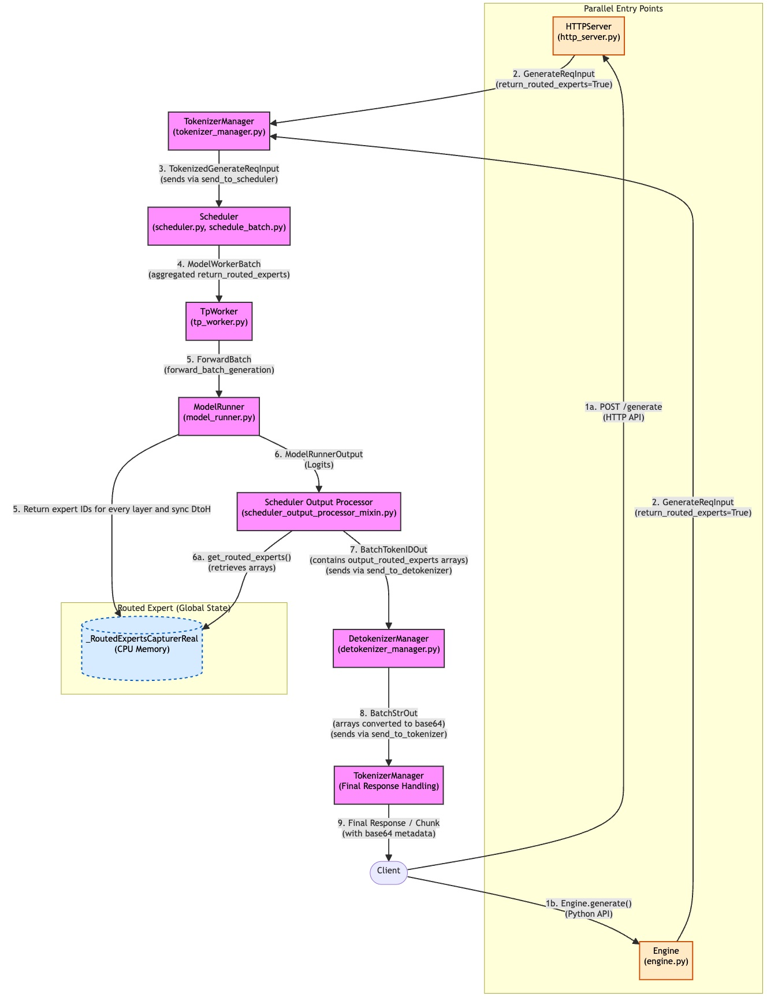

# Return Routed Experts Feature

## Overview

This document describes the design and implementation of the `enable_return_routed_experts` feature in SGLang. This feature allows users to capture and return the expert routing information from Mixture-of-Experts (MoE) models during inference. The routed experts information shows which experts were selected by the routing mechanism for each token at each layer, which is valuable for:

- Reinforcement Learning (RL) training workflows
- Model behavior analysis and debugging
- Expert utilization monitoring
- Research on MoE routing patterns

Note: This design document refers to https://github.com/sgl-project/sglang/pull/12162/files#diff-8e61cb3c05ca6a5e195f011e21ea7544f9f7e08163e3ce4ffa0bacb4b5735259.

---

## 1. Architecture



### 1.1 Key Modifications Overview

The `enable_return_routed_experts` feature introduces a data capture and return pipeline alongside the main inference pipeline. The key modifications include:

1. **Request Parameter Propagation**: A new boolean field `return_routed_experts` is added to request structures, flowing from client input through all intermediate components to the model runner.

2. **Expert Capture Mechanism**: During model forward passes, expert routing decisions (topk expert IDs) are captured in device buffers and synchronously transferred to CPU memory for later retrieval.

3. **Result Aggregation**: After inference completes, the captured expert routing information is retrieved from the capturer, attached to the request state, and returned to the client alongside standard outputs.

4. **Encoding Optimization**: To minimize performance impact, expert IDs are returned as base64-encoded byte arrays rather than JSON arrays, significantly reducing serialization overhead.

The feature is controlled by two flags:
- **Server-level**: `--enable-return-routed-experts` flag initializes the capture infrastructure
- **Request-level**: `return_routed_experts` parameter in each request determines whether to capture and return expert data for that specific request


**Response Format**:
- The routed experts are included in response `meta_info` field:
  ```python
  {
    "meta_info": {
      "routed_experts": "<base64-encoded-string>"
    }
  }
  ```

**Client-side Decoding** (Optional):
- Users can decode using `extract_routed_experts_from_meta_info(data)` at `routed_experts_capturer.py:281-289`:
  ```python
  routed_experts_base64 = data["meta_info"].get("routed_experts", None)
  routed_experts = np.frombuffer(
      pybase64.b64decode(routed_experts_base64.encode("utf-8")),
      dtype=np.int32
  )
  # Reshape to [seq_len, num_layers, num_experts_per_tok]
  ```

---

## 2. User Story

### A. Engine Example

```python
from sgl_jax import Engine
from sgl_jax.srt.layers.moe.routed_experts_capturer import extract_routed_experts_from_meta_info
import numpy as np

# Initialize engine with routed experts feature enabled
engine = Engine(
    model_path="Qwen/Qwen3-30B-A3B",
    enable_return_routed_experts=True,  # Server-level flag
)

# Generate with expert capture
response = engine.generate(
    prompt="Explain how mixture of experts models work",
    return_routed_experts=True,  # Request-level flag
    max_new_tokens=100,
)

# Extract and decode expert IDs
expert_ids = extract_routed_experts_from_meta_info(response)
print(f"Expert IDs shape (flattened): {expert_ids.shape}")  # [seq_len * num_layers * topk]

# Reshape to [seq_len, num_layers, num_experts_per_tok]
num_layers = 48  # For Qwen3-30B
num_experts_per_tok = 8  # Topk experts
seq_len = len(expert_ids) // (num_layers * num_experts_per_tok)

expert_ids = expert_ids.reshape(seq_len, num_layers, num_experts_per_tok)
print(f"Expert IDs shape (reshaped): {expert_ids.shape}")

# Analyze expert utilization
print(f"\nToken 0, Layer 0 experts: {expert_ids[0, 0, :]}")
print(f"Token 0, Layer 47 experts: {expert_ids[0, 47, :]}")
```

### B. OpenAI-Compatible API Example

```python
import requests
import numpy as np
import pybase64

# HTTP request
response = requests.post(
    "http://localhost:30000/v1/chat/completions",
    json={
        "model": "Qwen/Qwen3-30B-A3B",
        "messages": [
            {"role": "user", "content": "Explain MoE models"}
        ],
        "return_routed_experts": True,  # Enable expert capture
        "max_tokens": 50,
    },
).json()

# Extract expert IDs from response
routed_experts_b64 = response["choices"][0]["meta_info"]["routed_experts"]

# Decode
expert_ids = np.frombuffer(
    pybase64.b64decode(routed_experts_b64.encode("utf-8")),
    dtype=np.int32
)

num_layers = 48  # For Qwen3-30B
num_experts_per_tok = 8  # Topk experts

# Reshape
expert_ids = expert_ids.reshape(-1, num_layers, num_experts_per_tok)  # [seq_len, layers, topk]
print(f"Captured expert IDs for {expert_ids.shape[0]} tokens")
```


## 3. Detailed Design

### 3.1 API Modifications

#### 3.1.1 Server Arguments (`server_args.py`)

```python
@dataclass
class ServerArgs:
    # ... existing fields ...

    # Enable infrastructure for capturing and returning routed expert information
    enable_return_routed_experts: bool = False
```

---

#### 3.1.2 Engine API (`engine.py`)

**Class**: `Engine`

```python
def generate(
    self,
    # ... existing fields ...
    return_routed_experts: bool = False,  # NEW FIELD
) -> dict | Iterator[dict]:
```

---

**Method**: `async_generate()`

```python
async def async_generate(
    self,
    # ... existing fields ...
    return_routed_experts: bool = False,  # NEW FIELD
) -> dict | AsyncIterator[dict]:
```

---

#### 3.1.3 Request Input Structures (`io_struct.py`)

##### A. `GenerateReqInput`

```python
@dataclass
class GenerateReqInput(BaseReq, APIServingTimingMixin):
    # ... existing fields ...
    # Whether to return captured routed experts
    return_routed_experts: bool = False  # NEW FIELD
    # ... remaining fields ...
```

---

##### B. `TokenizedGenerateReqInput`

```python
@dataclass
class TokenizedGenerateReqInput(BaseReq):
    # ... existing fields ...
    return_routed_experts: bool = False  # NEW FIELD (implicitly carried)
    # ... remaining fields ...
```

---

#### 3.1.4 Request State Structures (`schedule_batch.py`)

##### A. `Req` Class

```python
@dataclass
class Req:
    """Represents a single request in the scheduler."""
    # ... existing fields ...
    return_routed_experts: bool = False  # NEW FIELD
    # Captured data
    routed_experts: Optional[np.ndarray] = None  # NEW FIELD - stores captured expert IDs, shape = [seq_len-1, num_layers, num_experts_per_tok]
    # ... remaining fields ...
```

---

##### B. `ModelWorkerBatch` Class

```python
@dataclass
class ModelWorkerBatch:
    """Batch sent to model worker."""
    # ... existing fields ...
    return_routed_experts: bool = False  # NEW FIELD
    # ... remaining fields ...
```

**Description**: Batch-level aggregation. Set to `True` if ANY request in the batch has `return_routed_experts=True`. Computed as:
```python
return_routed_experts=any(req.return_routed_experts for req in reqs)
```

---

#### 3.1.5 Output Structures (`io_struct.py`)


##### A. `BatchTokenIDOut`

```python
@dataclass
class BatchTokenIDOut:
    # ... existing fields ...
    # The routed experts for each output token
    output_routed_experts: List[np.ndarray]  # NEW FIELD, shape = [seq_len-1, num_layers, num_experts_per_tok]
    # ... remaining fields ...
```

---

##### B. `BatchStrOut`

```python
@dataclass
class BatchStrOut:
    # ... existing fields ...
    # The routed experts for each output token
    output_routed_experts: List[List[str]]  # NEW FIELD (base64 encoded strings)
    # ... remaining fields ...
```

**Description**: List of base64-encoded strings, one per request. Each string encodes the expert IDs array as bytes for efficient serialization. Created by `DetokenizerManager._extract_routed_experts()`.

**Encoding Process**:
```python
pybase64.b64encode(tensor.numpy().tobytes()).decode("utf-8")
```

---

### 3.2 RoutedExpertsCapturer: Comprehensive Introduction

#### 3.2.1 Architecture Overview

The `RoutedExpertsCapturer` is the core component responsible for capturing, storing, and retrieving expert routing information from MoE models. It implements a two-tier caching strategy with:

1. **Device Cache**: Fast, volatile buffer for capturing expert IDs during forward passes
2. **Host Cache**: Persistent, pinned memory buffer for long-term storage and retrieval

The component uses a **factory pattern** with two implementations:
- `_RoutedExpertsCapturerReal`: Active implementation when feature is enabled
- `_RoutedExpertsCapturerNoop`: No-op implementation when feature is disabled (zero overhead)

#### 3.2.2 Class Hierarchy

```
RoutedExpertsCapturer (ABC)
├── _RoutedExpertsCapturerReal
│   ├── _RoutedExpertsDeviceCache (Device buffer)
│   └── _RoutedExpertsHostCache (CPU buffer)
└── _RoutedExpertsCapturerNoop (no-op)
```

**Global Singleton**:
```python
_global_expert_capturer: Optional[RoutedExpertsCapturer] = _RoutedExpertsCapturerNoop()

def get_global_experts_capturer() -> RoutedExpertsCapturer:
    return _global_expert_capturer

def set_global_experts_capturer(capturer: RoutedExpertsCapturer):
    global _global_expert_capturer
    _global_expert_capturer = capturer
```

---

#### 3.2.3 Factory Method: `RoutedExpertsCapturer.create()`

**Signature**:
```python
@staticmethod
def create(
    enable: bool,
    model_config: ModelConfig,
    num_fused_shared_experts: int,
    num_tokens: int,
    max_running_requests: int,
) -> RoutedExpertsCapturer
```

**Parameters**:
- `enable`: Whether to create real or no-op capturer (from `server_args.enable_return_routed_experts`)
- `model_config`: Model configuration containing layer count and expert topology
- `num_fused_shared_experts`: Number of fused shared experts (used for buffer sizing)
- `num_tokens`: Total size of token pool (determines host cache size)
- `max_running_requests`: Maximum concurrent requests (determines device cache size with other factors in prefill, like chunked_prefill_size)

---

#### 3.2.4 Device Cache: `_RoutedExpertsDeviceCache`

**Purpose**: Device-side buffer for capturing expert IDs during forward passes.

##### A. Initialization

```python
@register_pytree_node_class
class _RoutedExpertsDeviceCache:
    def __init__(
        self,
        max_running_requests: int,
        num_hidden_layers: int,
        num_experts_per_tok: int,
        num_fused_shared_experts: int,
    ) -> None:
        self.buffer = jnp.zeros(
            (
                max(
                    get_global_server_args().chunked_prefill_size,
                    max_running_requests,
                ),
                num_hidden_layers,
                num_experts_per_tok + num_fused_shared_experts,
            ),
            dtype=jnp.int32,
        )
```

**Buffer Shape**:
- Dimension 0: `max(chunked_prefill_size, max_running_requests)`
  - Accommodates both prefill and decode batches
- Dimension 1: `num_hidden_layers` - One slice per model layer
- Dimension 2: `num_experts_per_tok + num_fused_shared_experts`
  - Stores topk expert IDs plus fused shared experts

**Memory Footprint Example** (Qwen3-30B-A3B MoE):
- Shape: `[max(2048, 1024), 48, 8+0]` = `[2048, 48, 8]`
- Size: `2048 × 48 × 8 × 4 bytes` = **3.0 MB**

##### B. Capture Method

```python
def capture_fwd_routed_experts(self, layer_id: int, topk_ids: jax.Array):
    assert layer_id is not None, "capturing routing experts but get layer_id None"
    batch, _ = topk_ids.shape
    new_buffer = self.buffer.at[:batch, layer_id, :].set(topk_ids) # Note: This method may be changed in the real codes
    
    self.buffer = new_buffer
    return new_buffer
```

---

#### 3.2.5 Host Cache: `_RoutedExpertsHostCache`

**Purpose**: CPU-side pinned memory buffer for persistent storage of expert IDs.

##### A. Initialization

```python
class _RoutedExpertsHostCache:
    def __init__(
        self,
        num_tokens: int,
        num_hidden_layers: int,
        num_experts_per_tok: int,
    ) -> None:
        self.num_tokens = num_tokens
        self.buffer = np.zeros(
            (
                num_tokens,
                num_hidden_layers,
                num_experts_per_tok,
            ),
            dtype=np.int32,
        )
```

**Buffer Shape**:
- Dimension 0: `num_tokens` - One slot per token in the token pool
- Dimension 1: `num_hidden_layers` - One slice per layer
- Dimension 2: `num_experts_per_tok` - Stores topk expert IDs only (no shared experts)

**Memory Footprint Example** (Large deployment):
- Shape: `[131072, 48, 8]` (128K tokens)
- Size: `131072 × 48 × 8 × 4 bytes` = **192MB**

##### B. Set Method

```python
def set_experts_buffer(self, layer_id: int, loc: np.ndarray, top_k: np.ndarray):
    self.buffer[layer_id, loc, :] = top_k
```

---

#### 3.2.6 Real Capturer: `_RoutedExpertsCapturerReal`

##### A. Initialization

```python
class _RoutedExpertsCapturerReal(RoutedExpertsCapturer):
    def __init__(
        self,
        model_config: ModelConfig,
        num_tokens: int,
        max_running_requests: int,
        num_fused_shared_experts: int,
    ):
        self.num_fused_shared_experts = num_fused_shared_experts
        self.num_hidden_layers = model_config.hf_text_config.num_hidden_layers
        self.num_experts_per_tok = model_config.hf_text_config.num_experts_per_tok

        self.host_cache = _RoutedExpertsHostCache(
            num_tokens=num_tokens,
            num_hidden_layers=self.num_hidden_layers,
            num_experts_per_tok=self.num_experts_per_tok,
        )

        self.device_cache = _RoutedExpertsDeviceCache(
            max_running_requests=max_running_requests,
            num_hidden_layers=self.num_hidden_layers,
            num_experts_per_tok=self.num_experts_per_tok,
            num_fused_shared_experts=self.num_fused_shared_experts,
        )
```

##### B. Capture Method

```python
def capture(self, layer_id: int, topk_ids: jax.Array):
    self.device_cache.capture_fwd_routed_experts(layer_id, topk_ids)
```

##### C. Device-to-Host Synchronization

```python
def _sync_fwd_experts_buffer_DtoH(
    self,
    forward_batch: ForwardBatch,
    can_run_graph: bool,
    cuda_graph_batch: int,
):
    pass
```

**Operation**:
1. Retrieves `out_cache_loc` tensor mapping batch positions to token pool indices
2. Performs indexed copy from device buffer to host buffer
3. Synchronizes CPU and Device (blocking operation)

##### D. Retrieval Method

```python
def get_routed_experts(
    self,
    req_pool_idx: int,
    seqlen: int,
    req_to_token_pool: ReqToTokenPool,
):
    pass
```

**Operation**:
1. Looks up token pool indices for the request: `req_to_token_pool.req_to_token[req_pool_idx]`
2. Slices to `[:seqlen-1]` to exclude the last token (which hasn't been processed yet)
3. Copies indices to CPU and clones to avoid memory aliasing
4. Indexes into host cache buffer using these indices
5. Returns array of shape `[seqlen-1, num_hidden_layers, num_experts_per_tok]`

**Why `seqlen-1`?**: The last token in the sequence hasn't been routed yet during prefill, or represents the position where we want to generate the next token during decode.

##### E. Forward End Hook

```python
def on_forward_end(self, forward_batch):
    self._sync_fwd_experts_buffer_DtoH(
        forward_batch=forward_batch,
    )
```

---

#### 3.2.7 No-Op Capturer: `_RoutedExpertsCapturerNoop`

**Purpose**: Zero-overhead placeholder when feature is disabled.


```python
class _RoutedExpertsCapturerNoop(RoutedExpertsCapturer):
    def __init__(self):
        pass

    def capture(self, layer_id: int, topk_ids: jax.Array):
        pass

    def get_routed_experts(
        self,
        req_pool_idx: int,
        seqlen: int,
        req_to_token_pool: ReqToTokenPool,
    ):
        pass

    def on_forward_end(self, forward_batch):
        pass

    # ... other no-op methods ...
```

---

### 3.3 Precompile & Padding

For precompile, no extra logic is required.
For padding, no extra padding is required because the topk is fixed after server starts.

---

## 4. Test Plans

Note: 
1. Get the selected experts from log firstly, and these will be used as baseline in tests.
2. Add the test file into `run_suite.py`

test_01_single_request_bs_padding_one: `precompile_bs_paddings = [1]` 
test_02_single_request_bs_padding_four: `precompile_bs_paddings = [4]` 
test_03_three_requests_bs_padding_four: `precompile_bs_paddings = [1]` 
test_04_four_requests_bs_padding_four: `precompile_bs_paddings = [4]`

---

## 5. Performance Test

Ensure the current moe performance tests to pass, like `test_bailing_moe_performance_tp_2_ep_2`. Besides, ensure the performance with `enable_return_routed_experts` is similar to disable.

---
