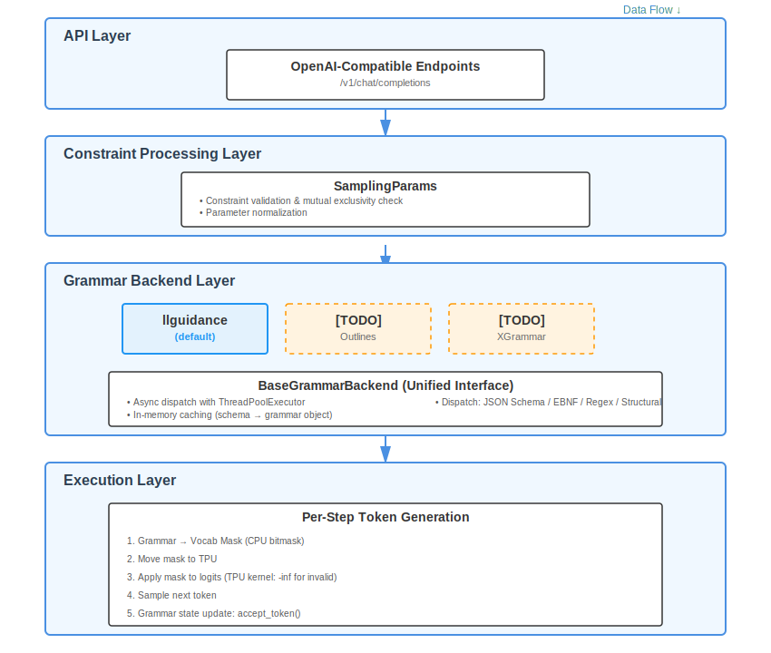

# Structured Output

## Motivation

- Provide reliable, machine-parseable outputs for downstream systems (APIs, automations, UI forms) without brittle post-processing.
- Reduce hallucinations by constraining generation to valid shapes (JSON Schema), formats (EBNF), or patterns (regex).
- Unify a single feature across OpenAI-compatible endpoints and the SRT engine.
- Support modern tool/function-calling by validating and constraining arguments, while preserving streaming and performance.

## Goals

- Guarantee adherence to exactly one structured constraint per request: JSON Schema, EBNF, or regex.
- Expose consistent knobs in OpenAI-compatible API; validate conflicts early.
- Integrate cleanly with tool/function calling (structural tags, inline constraints) and streaming.
- Make grammar engines pluggable: llguidance backend as default, with a clear interface for future backends (XGrammar, Outlines).
- Remain efficient: cached compilation, TPU bitmask application, minimal overhead.
- Preserve observability and debuggability (schema names, dispatch type, stats, logs).

## Design

### Architecture

The structured output system follows a **pluggable backend architecture** with four main layers:




**Key Design Principles:**
1. **Pluggability**: Backends implement a common interface; future backends can be added easily
2. **Asynchrony**: Grammar dispatch runs in ThreadPoolExecutor to avoid blocking
   - **Note**: llguidance doesn't require compilation, but we use async design for forward compatibility with backends that do (e.g., XGrammar, which needs to compile schemas into state machines)
3. **Caching**: Grammar objects cached by (schema_string, backend_type) for reuse
4. **Mutual Exclusivity**: Only one constraint type per request (enforced at multiple layers)
5. **Streaming Compatible**: Constraints applied per-token, works with SSE streaming

### Key Components

#### 1. Base Grammar Backend System

**Core Classes:**
- `BaseGrammarBackend`: Factory and caching layer for grammar compilation
  - Manages compilation thread pool
  - Maintains in-memory cache: `Dict[(schema_str, backend_type), GrammarObject]`
  - Provides unified dispatch methods for different constraint types
  - Handles async compilation with Future-based pattern

- `BaseGrammarObject`: Per-request grammar state machine
  - Tracks current parse state
  - Methods: `fill_vocab_mask(mask, idx)`, `accept_token(token)`, `reset()`
  - Immutable after compilation (thread-safe)

- `GrammarStats`: Performance metrics
  - Compilation time, cache hit/miss rates
  - Dispatch type (json/regex/ebnf/structural)
  - Jump forward statistics

**Async Compilation Pattern:**
```python
# On first request with schema X:
future = executor.submit(compile_grammar, schema_x)
cache[schema_x] = future

# Subsequent requests wait on the same future:
grammar = cache[schema_x].result()  # Blocks until ready

# After compilation completes:
cache[schema_x] = compiled_grammar  # Replace future with result
```

#### 2. Grammar Object Lifecycle

1. **Compilation** (async, once per unique schema):
   ```
   schema_string → dispatch_{json|regex|ebnf|structural_tag}()
   → Backend-specific compiler (e.g., xgrammar.compile_json_schema())
   → GrammarMatcher object
   ```

2. **Per-Request State** (one per generation request):
   ```
   GrammarMatcher.clone() → Per-request GrammarObject
   → Tracks current parse position, nested structures, etc.
   ```

3. **Per-Token Application** (in generation loop):
   ```
   for token in generation:
       grammar.fill_vocab_mask(mask, idx)  # Set valid tokens to 1
       logits = model(...)
       logits = apply_mask(logits, mask)   # -inf for invalid
       token = sample(logits)
       grammar.accept_token(token)         # Update state
   ```

4. **Termination:**
   - Grammar reaches accept state (e.g., closing `}` for JSON)
   - Max tokens reached
   - EOS token generated (if allowed by grammar)

### Constraint Types

#### JSON Schema
**Use Cases:** Structured data extraction, API responses, form fields

**API Syntax:**
```python
# OpenAI-compatible API
{
    "response_format": {
        "type": "json_schema",
        "json_schema": {
            "name": "UserInfo",
            "schema": {
                "type": "object",
                "properties": {
                    "name": {"type": "string"},
                    "age": {"type": "integer", "minimum": 0}
                },
                "required": ["name", "age"]
            },
            "strict": true  # Optional: enforce strict mode
        }
    }
}
```

**Special Features:**
- **Arbitrary JSON:** `json_schema="$$ANY$$"` allows any valid JSON
- **Pydantic Support:** Auto-convert Pydantic models via `model.model_json_schema()`
- **Whitespace Control:** Configure via server args:
  - `--constrained-json-whitespace-pattern "[\n\t ]*"` (flexible, default)
  - `--constrained-json-disable-any-whitespace` (compact)

**Implementation:**
```
JSON Schema (dict) → json.dumps(schema) → Backend.dispatch_json(schema_str)
→ llguidance: JsonSchemaConverter().to_grammar()
```

#### EBNF (Extended Backus-Naur Form)
**Use Cases:** Custom formats, domain-specific languages, complex patterns

**API Syntax:**
```python
sampling_params = {
    "ebnf": """
        root ::= expr
        expr ::= term (("+" | "-") term)*
        term ::= factor (("*" | "/") factor)*
        factor ::= number | "(" expr ")"
        number ::= [0-9]+
    """
}
```

**Backend Handling:**
- llguidance: `llguidance.compile_grammar(ebnf_str)`

#### Regex
**Use Cases:** Patterns (phone numbers, emails, IDs), simple formats

**API Syntax:**
```python
# OpenAI API
{
    "response_format": {
        "type": "regex",
        "regex": r'\d{3}-\d{3}-\d{4}'  # Phone number pattern
    }
}

# Alternative: inline in sampling params
{"regex": r'[A-Z][a-z]+ [A-Z][a-z]+'}  # Match "First Last"
```

**Implementation:**
```
Regex pattern (str) → Backend.dispatch_regex(pattern)
→ llguidance: RegexCompiler().compile(pattern)
```

**Limitations:**
- Must be compatible with tokenizer boundaries
- Complex lookahead/lookbehind may not work correctly

#### Structural Tags (Advanced)
**Use Cases:** Tool calling, mixed structured/unstructured content

**Concept:** Embed JSON schemas within markers in free-form text
```
User query...
<tool_call>{"name": "get_weather", "args": {"city": "SF"}}</tool_call>
Model reasoning...
<tool_call>{"name": "book_flight", "args": {...}}</tool_call>
```

**Configuration:**
```python
structural_tag = {
    "structures": [
        {
            "begin": "<tool_call>",
            "schema": {/* JSON schema for tool arguments */},
            "end": "</tool_call>"
        }
    ],
    "triggers": ["<tool_call>"]  # Start grammar on these tokens
}
```

**Behavior:**
- Outside tags: Free-form generation
- Between `begin` and `end`: Constrained by schema
- Multiple structures allowed (e.g., `<tool_call>`, `<result>`)

**Backend Support:**
- llguidance: Full support

### Mutual Exclusivity Enforcement

**Rule:** Exactly one constraint type per request

**Validation Points:**
1. **API Layer:** Python/OpenAI API checks on request parsing
2. **SamplingParams:** `_check_constraints()` validates:
   ```python
   constraints = [json_schema, regex, ebnf, structural_tag]
   active = [c for c in constraints if c is not None]
   assert len(active) <= 1, "Only one constraint allowed"
   ```
3. **Tool Calling:** Conflicts with explicit constraints:
   ```python
   if tool_choice == "required" and response_format is not None:
       raise ValueError("Cannot use both tool calling and response_format")
   ```

**Error Messages:**
```
"Cannot specify both 'json_schema' and 'regex' in the same request"
"Tool calling conflicts with explicit response_format"
```

### API Design

#### OpenAI-Compatible API

**Endpoints:**
- `/v1/chat/completions` - Chat completion with structured output
- `/v1/completions` - Legacy completion endpoint

**Response Format (JSON Schema)**
```python
import openai

response = openai.chat.completions.create(
    model="meta-llama/Llama-3.1-8B-Instruct",
    messages=[{"role": "user", "content": "Extract user info: John is 30"}],
    response_format={
        "type": "json_schema",
        "json_schema": {
            "name": "UserInfo",
            "schema": {
                "type": "object",
                "properties": {
                    "name": {"type": "string"},
                    "age": {"type": "integer"}
                },
                "required": ["name", "age"]
            },
            "strict": True
        }
    }
)
```

### Execution Flow

#### Grammar Dispatch (Async Pattern)

**Why Async Despite No Compilation?**

llguidance doesn't require compilation (unlike XGrammar which compiles schemas into finite state machines). However, we still use an async dispatch pattern for two reasons:

1. **Forward Compatibility**: Future backends (XGrammar, custom compilers) may need expensive compilation (100-500ms). The async architecture allows adding these backends without changing the API.

2. **Non-Blocking Design**: Even lightweight operations benefit from async dispatch to avoid blocking the request processing pipeline.

**Design Trade-off**: For llguidance, this adds minimal overhead (~1ms for thread pool submission) but ensures the architecture can scale to more complex backends.

**Step-by-Step:**

1. **Request Arrives:** Contains constraint (e.g., `json_schema={...}`)

2. **Cache Lookup:**
   ```python
   cache_key = (json.dumps(schema), "llguidance")
   cached = grammar_cache.get(cache_key)
   ```

3. **Cache Hit:** Return cached `GrammarObject` immediately

4. **Cache Miss:**
   ```python
   # Submit to thread pool
   future = executor.submit(
       backend.dispatch_json,
       json.dumps(schema)
   )
   grammar_cache[cache_key] = future

   # Other requests with same schema wait on this future
   # Prevents duplicate compilation
   ```

5. **Grammar Creation:**
   ```python
   # In background thread (async for forward compatibility)
   grammar = llguidance.create_grammar(schema_str, tokenizer_info)
   # Returns: Grammar object (no compilation needed for llguidance)

   # Note: XGrammar would do: xgrammar.compile_json_schema(...)
   # which takes 100-500ms, hence the async pattern
   ```

6. **Cache Update:**
   ```python
   # After compilation completes
   grammar_cache[cache_key] = grammar  # Replace future
   ```

7. **Per-Request Clone:**
   ```python
   # Each request gets its own state machine
   request_grammar = grammar.clone()
   ```

**Timing (llguidance):**
- Grammar creation: ~1-5ms (no compilation needed)
- Cache hit: <0.1ms
- Future backends (e.g., XGrammar) would have: 50-500ms compilation time

#### Token Generation Loop (Per-Token)

**Integrated into Model Inference:**

```python
# Simplified pseudocode
def generate_with_constraint(prompt, grammar, max_tokens):
    tokens = tokenize(prompt)

    for step in range(max_tokens):
        # 1. Create vocabulary mask
        vocab_mask = jnp.zeros(vocab_size, dtype=bool)
        grammar.fill_vocab_mask(vocab_mask, batch_idx=0)
        # vocab_mask[i] = True if token i is valid

        # 2. Model forward pass
        logits = model(tokens)  # Shape: [batch, vocab_size]

        # 3. Apply constraint (TPU kernel)
        logits = jnp.where(
            vocab_mask,
            logits,
            jnp.full_like(logits, -jnp.inf)
        )
        # Equivalent to: logits[~vocab_mask] = -inf

        # 4. Sample next token
        token = sample(logits, temperature=0.7)
        tokens = jnp.concatenate([tokens, token])

        # 5. Update grammar state
        grammar.accept_token(token)

        # 6. Check termination
        if grammar.is_accepted() or token == eos_token:
            break

    return tokens
```

### Performance Optimizations

#### 1. Grammar Caching

**Strategy:** Compile once, reuse many times

**Cache Key:** `(schema_string, backend_type)`
- Schema normalized: `json.dumps(schema, sort_keys=True)`
- Backend type: `"llguidance"` (only option in v0.1)

**Cache Invalidation:**
- In-memory only (no persistence)
- Cleared on server restart

#### 2. Async Dispatch

**Design Rationale:**

For **llguidance** (current implementation):
- Grammar creation is fast (~1-5ms)
- Async pattern adds minimal overhead
- Maintains architectural consistency for future backends

For **future backends** (e.g., XGrammar):
- Compilation can take 100-500ms, would block request processing
- Async is essential for responsiveness

**Solution:** ThreadPoolExecutor with Future-based caching
```python
# First request: submit to thread pool
future = executor.submit(create_grammar, schema)
cache[schema] = future

# Request waits only when it needs the grammar
grammar = cache[schema].result()  # Blocks if not ready (1-5ms for llguidance)

# Later requests: same future, shared wait
```
