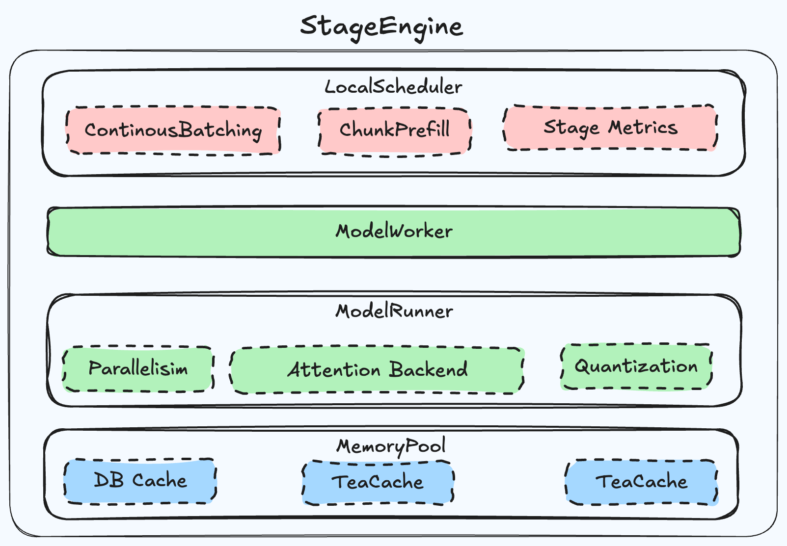

# 1. Abstract

This proposal outlines the design for a unified, high-performance inference framework tailored for next-generation multimodal models (e.g., Wan2.1, Qwen2.5VL, MiMo-Audio, Qwen-Omni, Ling-Omni).

The framework adopts an "Operating System" design philosophy, decoupling the control plane (Global Scheduler) from the computation plane (Device Stages). It supports heterogeneous compute patterns—integrating Auto-Regressive (AR) decoding with Diffusion denoising—within a single pipeline using a specialized threading model to minimize inter-process communication (IPC) overhead while maximizing parallel throughput.

Our main program will run in a main process, improving the framework's performance through asynchronous scheduling logic and providing the foundation for pathway adaptation

# 2. Motivation

As models evolve towards complex pipelines (e.g., `Text -> ViT -> Diffusion -> VAE`), a rigid "text-only" or "image-only" framework is insufficient. We need a system that:

1. **Handles massive token counts:** Video generation (e.g., Wan2.1 720p) requires processing ~76k tokens over 50 denoising steps, making the process heavily compute-bound.
2. **Supports Heterogeneity:** AR stages are memory-bound (memory bandwidth limited), while Diffusion stages are compute-bound. They require different optimization strategies.
3. **Modular & Pluggable:** Features like Quantization (PTQ), TeaCache, and Parallelism strategies (Ulysses vs. Ring) must be configurable per stage without strictly coupling dependencies.

We will provide a multimodal inference framework with native JAX implementation in SGL-JAX, capable of adapting to various multimodal model architectures such as VL, Audio, Video Generation, and Omni classes, and achieving SOTA performance on Google TPU.

# 3.Architecture Design


This is our original architecture, which was designed for autoregressive LLM models. In this feature, we will refactor this architecture as shown below. Specifically, we will extend the tokenizer/detokenizer to support multimodal input/output, handling most input preprocessing and output postprocessing tasks on the CPU. From the user's perspective, we will add offline and online entry points for invoking multimodal generation.

Importantly, we will build this architecture on top of JAX, ensuring that `sgl-jax` can still launch and operate in its current manner. When a server is launched for multimodal models, our code will route to the new architecture's launch path.

On the engine side, `sgl-jax` will be constructed with an interface to serve as a threaded engine, and we will support Diffusion, Conv, and CLIP engines for multimodal-style models. All threads will run within a single main process to ensure compatibility with SPMD and to allow easy access by RL frameworks.


## 3.1 Concurrency Model: Thread-Based SPMD

We propose a **Single Process, Multiple Data (SPMD)** logic implemented via multi-threading within a single process (Host), orchestration over multiple devices.

- **Rationale:** Compared to Multi-Process (MPMD), a threaded approach eliminates the overhead of TCP/Shared Memory IPC between stages.
- **GIL Consideration:** While Python's Global Interpreter Lock (GIL) is a constraint, the heavy lifting is offloaded to TPU/GPU runtimes (releasing GIL). The Python layer acts solely as a lightweight dispatcher, which will not make heavy CPU compute workloads.

## 3.2 Main Components

- **Handles HTTP requests**:  Raw Req will be tokenized as Request schema, which should make sure it can support different multimodal input/output types

- **Multimodal Tokenizer/Detokenizer:** Decoupled from the engine, communicating via ZMQ. Handles complex schema definitions (text, image, video inputs).

- **Offline/Online Interface:** differ in input/output, reuse core runtime code

  - ```python
    # for batch/offline call up
    # directly call MultiModalLLM().generate
    # non-compatible for OpenAI sdk
    class PromptData:
         prompt: str
         image: str
         video: str
         audio: str

    def generate(
            self,
            prompt: Optional[Union[List[PromptData], PromptData]] = None,
            sampling_params: Optional[Union[List[Dict], Dict]] = None,
    ) -> Union[Dict, Iterator[Dict]]:
    ```

  - ```python
    # for Online interface
    # OpenAI-compatible schema
    # request normalize within the tokenizer, it will be List[Request] within engine

    ChatCompletionMessageContentPart messages = Union[
        ChatCompletionMessageContentTextPart,
        ChatCompletionMessageContentImagePart,
        ChatCompletionMessageContentVideoPart,
        ChatCompletionMessageContentAudioPart,
    ]
    ```


**B. Host Layer (Control Plane)**

- **GlobalScheduler:** The kernel of the "OS." It manages the lifecycle of requests and the pipelining of data across different stages (Stage Overlap).

  - ```python
    class GlobalScheduler:
        def __init__():
            ## stage config
            ## init zmq
            pass
        def _init_stages():
            pass
        def _start_stages():
            pass
        def receive_request():
            pass
        def event_loop():
            while True:
                req = self.receive_request()
                self.stags[0].scheduler.submit(reqs)
                for i in len(stages):
                   if stags[i].collect():
                      # maybe no need to run all stages, it will according to request
                      if i == len(stages):
                          send_to_detokenizer(stage[i].result())
                      else:
                       		self.stags[i + 1].scheduler.submit(stags[i].result())
    ```

- **Communication:**

  - Control signals passed via high-performance In-Memory Queues.
  - Tensor data passed via device reference (e.g., `device_put` to Mesh) to avoid host-device transfers.

**C. Device Layer (Compute Plane)** The workload is partitioned into "Stages." Each stage operates its own `LocalScheduler` and `ModelWorker`:



- **DeviceManager**

  - according to stage config to get devices and build mesh for stage

  - ```python
    from jax.sharding import Mesh
    class DeviceManager:
        def __init__():
            self.devices = jax.devices()
            self.allocatable = np.arange(len(jax.devices()))

        def allocate(num_tpus:int):
            if (self.allocatable) < num_tpus:
               raise Exception('device is not enough')
            current_devices = self.allocatable[:num_tpus]
            self.allocatable = self.allocatable[num_tpus:]
            return current_devices
    ```

- **Stage**: Abstract Class for different stage thread

  - ```python
    # describe stage's needed resources, parallelism, attention backend, memory pool...
    stage_args:
     - stage_id: 0
    	 run_time:
          num_tpus:2
    			sharding_spec:["tensor"]
       launch_args:
        	attention_backend:fa
          tp_size:2
          ...
       input_type:image
    	 output_type:tensor
       ...
    ```

  - ```python
    class Stage:
        def __init__(sc StageConfig):
            # get device from device manager
            # set tokenizer
            # input preprocessor
            # set stage scheduler
        def preprocess(req:Request):
            pass
        def process(req:Request):
            pass
        def postprocess(req:Request):
            pass
        def init_stage_worker():
            # run worker in thread
            pass
        def stop_stage_worker():
            pass
        def worker_thread():
            self.scheduler.event_loop()

    ```

- **Scheduler:** Determines the batching strategy specific to the stage (e.g., continuous batching for LLM, static batching for VAE).

  - ```python
    class Scheduler:
        def __init__(server_args):
            # batch_size
            # timeout
            # cancel
            # init stage
            ## set waiting_queue
            ## set output_queue
      def get_next_batch_to_run():
           # get batch to return
      def submit(req:Request):
           self.in_queue.add(req)
      def event_loop():
          while True:
             batch = self.get_next_batch_to_run():
             result = self.run_batch()
             self.out_queue.add(result)
    ```

- **ModelWorker/Runner:** Executes the compute graph, we will follow current sgl-jax definition to build these different stages

  - *Diffusion Stage:* Handles DiT backbones.
  - *ViT Stage:* Handles Vision Encoders.
  - *AR Stage:* Abstracted as a managed thread for text generation.
  - ...

- **Memory Pool**: Cache for each stage.

  - refactor the abstraction of the current memory pool to adapt to different types of stage memory pools

- **Weight Loader** Refactor weight load to support flexible model weights files location

# 4. RoadMap(Work Breakdown)

**Basic MultiModal Features  RodaMap**

- [ ] User Interface Refactore,
  - [ ] HTTP Requests/Tokenizer/Detokenizer (Contract common abstract class for multi schema request)
- [ ] Launch Server
  - [ ] AutoRegressive Engine launch refactor, contract launch interface which will call by stage_worker thread
  - [ ] WeightLoader Util refactor, make it compatible for various multimodal models
- [ ] Control Plane Develop
  - [ ] GlobalScheduler and communication within stages
- [ ] Diffusion Engine Develop
  - [ ] Support Naive Diffusion Engine without any optimized features
- [ ] ViT Stage Develop
- [ ] make one multimodal model runnable (maybe Qwen3-VL/Wan2.1)
- [ ] Unit test / e2e test / add to CI
- [ ] model evaluation


**Long Term Goals**

- Diffusion Engine advanced feature access, various caches, various parallels, and other training free performance optimization methods
- Support more models
